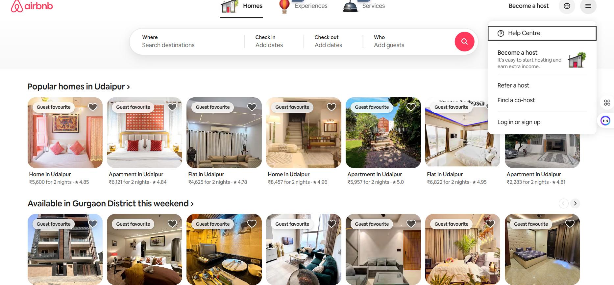
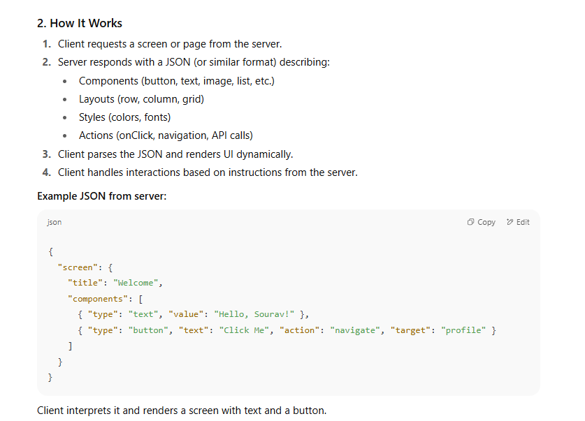

### 1️⃣ Frontend changes

- You want **two extra dropdown items** for the business page.
    
- On the frontend, you need to consider:
    
    - Which **component renders** the dropdown.
        
    - How to **conditionally render** the new items (e.g., only for business users, not normal users).
        
    - How translations/localization will be handled.
        

---

### 2️⃣ Backend/API considerations

- Your frontend may call an **API** to get the dropdown items.
    
- This could involve:
    
    - **Mapping the response** into the proper JS object for the dropdown.
        
    - Possibly fetching data from **MongoDB** or **S3** if the items are dynamic or stored externally.
        
    - Handling different **user types** (normal users, Airbnb owners, small businesses, large companies).
        

---

### 3️⃣ Data storage & mapping

- The dropdown items might exist in **multiple places**:
    
    1. **MongoDB** (primary source)
        
    2. **S3** (for JSON/config storage)
        
    3. **API mapping** (to transform DB format → frontend format)
        
- Each layer adds complexity:
    
    - Keeping them in sync
        
    - Handling cache or offline scenarios
        
    - Dealing with rollout or feature toggles
        

---

### 4️⃣ Other real-world considerations

- **Releases:** Mobile apps have slow deployment cycles (App Store/Play Store). Even small frontend changes may take **weeks** to release.
    
- **Translations:** New dropdown items need to be localized for multiple languages.
    
- **Business logic complexity:** What seems like “add two items” can affect permissions, analytics, reporting, and A/B testing.

Even for a “small feature”:

- You need **frontend, backend, and storage changes**.
    
- You must consider **user segmentation, translations, releases, and data mapping**.
    
- This is why software design starts **with thinking about the system end-to-end**, not just coding the UI.

“Server-Driven UI” (SDUI) is a design architecture in which the **server controls the structure, layout, and sometimes behavior of the user interface**, rather than hardcoding it into the client app (like a mobile app or web frontend). It’s commonly used in mobile apps and dynamic platforms where frequent UI updates are needed without releasing a new version of the app.

Here’s a detailed breakdown:

---

### 1. **Traditional UI vs Server-Driven UI**

**Traditional UI:**

- UI is built in the client app (React, Flutter, Swift, Android XML, etc.).
    
- Server only sends **data**.
    
- To change UI, you need to update the client app.
    

**Server-Driven UI:**

- Server sends both **data and UI instructions**.
    
- Client app interprets these instructions and renders UI dynamically.
    
- UI can be changed on the server side without updating the app.

### **Advantages**

- **Dynamic updates:** Change UI without updating the app.
    
- **Faster iterations:** Marketing, onboarding flows, or A/B testing can be updated server-side.
    
- **Consistent UI across platforms:** Same JSON drives web, iOS, and Android.
    

---

### 4. **Challenges**

- **Client complexity:** Client must handle rendering dynamically.
    
- **Performance:** Dynamic rendering might be slower than native prebuilt UI.
    
- **Testing:** Harder to test dynamic layouts.
    
- **Limited offline support:** Some content might need internet to render.
    

---

### 5. **Use Cases**

- Mobile apps needing frequent updates (e.g., e-commerce, news, or content platforms).
    
- Feature flags or A/B testing.
    
- Apps with multiple platforms and shared UI logic.
    
- Push notifications with dynamic content.

