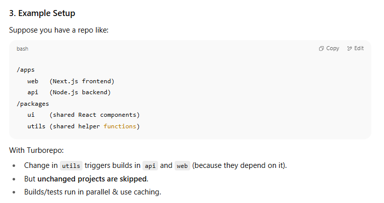
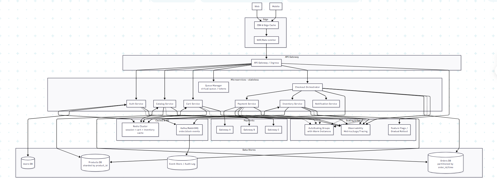

# 🧱 Monolith Architecture

### 1. What is a Monolith?

A **monolith** is a software architecture style where the **entire application is built as a single unit**.

- All the features (user login, payments, search, reviews, etc.) are part of **one codebase**.
    
- It usually runs as **one executable / one binary / one service**.
    
- If you deploy, you deploy **everything together** (even if you changed only one small feature).
    

Think of it as a **big building made of one block** → everything is tightly connected.

---

### 2. Example of Monolith

- Imagine an **e-commerce app**.
    
    - Login
        
    - Product catalog
        
    - Cart
        
    - Orders
        
    - Payments
        

In a monolith, **all of these live inside one codebase**, one big server.  
If the payments code crashes, it might affect the whole app.

---

### 3. Characteristics of a Monolith

- **One codebase, one repo** (not always, but usually).
    
- **One binary/executable** → you build & deploy the whole thing at once.
    
- **Shared database** → usually one DB serves everything.
    
- **Tight coupling** → modules are dependent on each other.
    

👉 Example: If your monolith is built with **Ruby on Rails**, the whole app (catalog, payments, orders, etc.) lives in one Rails app.

---

### 4. Pros of Monolith

✅ **Simple to start** – easy for small teams, fast to build.  
✅ **Easier debugging** – everything in one place.  
✅ **Performance** – calls between modules are function calls, not network calls.  
✅ **Less DevOps overhead** – just deploy one service.

---

### 5. Cons of Monolith

❌ **Scaling issues** – you can’t scale just payments or catalog; you must scale the whole app.  
❌ **Slower deployments** – even small changes require full redeploy.  
❌ **Hard to understand** – over time, codebase becomes huge.  
❌ **Team bottlenecks** – large teams stepping on each other’s code.  
❌ **Tech lock-in** – you can’t use different languages for different modules (all must be in same tech stack).

---

### 6. Real-world Examples

- **Stack Overflow** → still a monolith (built in ASP.NET MVC + SQL Server).
    
    - They keep it super optimized with caching, strong DB design, and careful scaling.
        
    - Works fine because their workload is mostly **reads (Q&A viewing)** which can be cached.
        
- **E-commerce apps** → often **start as monoliths**, but face problems:
    
    - Flash sales → payments slow down → whole site crashes.
        
    - Catalog update → deploy takes too long.
        
    - Different teams (payments vs catalog vs orders) interfere with each other’s code.
        
    - That’s why companies like Amazon, Flipkart, etc. **moved to microservices**.
        

---

### 7. What makes a monolith a "monolith"?

It’s not just “all code in one repo.”  
A true monolith has:

- **Single deployable unit (binary/executable/service)**
    
- **Single runtime** → everything runs in one process (not split by network).
    
- **Shared database** (usually one schema for everything).
    

So yes → repo is part of it, but the main thing is **one deployable + one runtime**.

---

✅ **Use case / Connectivity:**  
Monoliths are great when:

- You’re building an MVP or small app.
    
- Team size is small.
    
- You want **speed** over scalability.
    

But as user base grows (like 100K concurrent users in contests), monoliths start to **break under scale**, which leads to microservices.

# 🧩 Microservices Architecture

### 1. What are Microservices?

Microservices is an architectural style where the application is broken down into **smaller, independent services**.

Each service:

- Has **its own codebase**.
    
- Runs as a **separate process** (usually in its own container like Docker).
    
- Communicates with other services through **network calls (HTTP/REST, gRPC, message queues, etc.)**.
    
- Can be built, deployed, and scaled **independently**.
    

👉 Think of it like a **city**:

- Monolith = one giant building.
    
- Microservices = many smaller buildings (banks, stores, hospitals) working together.
    

---

### 2. Example (E-commerce App)

- **Users Service** → handles login, signup, authentication.
    
- **Catalog Service** → manages product listing.
    
- **Orders Service** → manages orders.
    
- **Payments Service** → handles payments.
    
- **Reviews Service** → handles customer reviews.
    

Each of these runs separately and communicates via APIs.

If you want to scale payments during a **Black Friday sale**, you scale only the **Payments Service** (not the entire app).

---

### 3. Characteristics of Microservices

- **Decoupled services** → each does one job well.
    
- **Own database (sometimes)** → services don’t always share the same DB. (ex: Payments might use PostgreSQL, Catalog might use MongoDB).
    
- **Independent deployment** → teams deploy without waiting on others.
    
- **Polyglot** → different services can use different languages (Node.js, Go, Python, etc.).
    

---

### 4. Pros of Microservices

✅ **Scalability** – scale only what’s needed.  
✅ **Faster deployments** – teams work independently.  
✅ **Resilience** – if reviews service crashes, orders still work.  
✅ **Flexibility** – use best tech for each service.  
✅ **Team autonomy** – different teams own different services.

---

### 5. Cons of Microservices

❌ **Complexity** – more services → more networking, monitoring, logging needed.  
❌ **Latency** – network calls are slower than function calls.  
❌ **Data consistency** – harder because data is spread across services.  
❌ **DevOps overhead** – need CI/CD pipelines, container orchestration (Kubernetes), service discovery, etc.

---

### 6. Real-world Examples

- **Amazon** → originally a monolith, now microservices. Each service has its own API.
    
- **Netflix** → thousands of microservices (streaming, recommendations, billing, etc.).
    
- **Uber** → started as a monolith, migrated to microservices to handle surge pricing, trips, maps, payments separately.
    

---

### 7. Monolith vs Microservices

|Feature|Monolith|Microservices|
|---|---|---|
|**Codebase**|One big codebase|Many small codebases|
|**Deployment**|One binary / one service|Each service deployed independently|
|**Scaling**|Scale whole app|Scale only needed service|
|**Database**|Usually one DB|Each service may have own DB|
|**Communication**|Function calls (fast)|API/Network calls (slower)|
|**Team Structure**|Hard to split|Teams own independent services|
|**Best for**|Small apps, MVPs|Large-scale apps, complex domains|

---

✅ **Use case / Connectivity**:

- **InterviewBit CodeAgon** → stayed monolith but had to optimize DB + caching for 100K concurrent users. If they had microservices, they could scale specific services like _submissions_ or _leaderboard_.
    
- **E-commerce apps** → often move to microservices because payments, orders, catalog need to scale independently.
    
- **Stack Overflow** → still monolith but heavily optimized because their domain is simpler (Q&A + voting).

# 📂 Monorepo

### 1. What is a Monorepo?

A **monorepo (monolithic repository)** is a version control strategy where **multiple projects/services live inside a single repository**.

- It does **not** mean monolith architecture.
    
- You can have **microservices** but still put all of them in one repo.
    
- Monorepo is about **code organization**, not runtime architecture.
    

👉 Think of it like having **all departments of a company in one building** (HR, Sales, Tech, Finance) → still separate, but managed together.

---

### 2. Example

- Suppose you build an e-commerce system:
    
    - `users-service/`
        
    - `catalog-service/`
        
    - `orders-service/`
        
    - `payments-service/`
        
    - `reviews-service/`
        

All of these live inside **one Git repo**.  
Each service has its own folder, maybe its own package.json (if Node.js) or build config.

---

### 3. Why use a Monorepo?

- **Single source of truth** → all code in one place.
    
- **Easy dependency sharing** → common libraries (like logging, auth utils) shared easily.
    
- **Consistent tooling** → same linting, CI/CD, code quality rules.
    
- **Atomic commits** → if you change API in one service, you can also update the client service in the same commit.
    

---

### 4. Problems with Monorepo

❌ **Scalability** → repo can become huge (Google’s monorepo has billions of lines of code).  
❌ **Build times** → need advanced tooling (Bazel, Nx, Turborepo) to avoid rebuilding everything.  
❌ **Permissions** → harder to give teams access to only their code.

---

### 5. Real-world Examples

- **Google** → uses a massive monorepo with special tooling (Bazel).
    
- **Facebook** → also uses monorepo for consistency.
    
- **Uber** → started with monorepo but moved parts away because repo got too big.
    

---

### 6. Tooling for Monorepo

- **Nx** (JS/TS world, good for microservices + frontend apps).
    
- **Turborepo** (modern JS/TS monorepo tool by Vercel).
    
- **Bazel** (used by Google, very scalable).
    
- **Lerna** (older, for managing npm packages in monorepo).
    

---

✅ **Use Case / Connectivity**

- If you’re a startup → monorepo helps because all code is together, easier to coordinate.
    
- If you’re big like Google → monorepo can still work, but you need very advanced tooling.
    
- If you’re Amazon → you might prefer **polyrepo** (each team owns its repo) because services are too large and independent.
    

---

⚡ So: **Monorepo ≠ Monolith**.  
You can have **microservices inside a monorepo**. The repo structure is just about **how you organize code**, not how you run the system.

# ⚡ Turborepo

### 1. What is Turborepo?

- **Turborepo** is a **monorepo build system** for JavaScript/TypeScript projects.
    
- It was created by **Vercel** (the company behind Next.js).
    
- Its goal is to make **monorepos fast, efficient, and developer-friendly**.
    

👉 In simple terms: Turborepo is a **tool that helps manage multiple apps/packages inside one repo** without slowing down builds & deployments.

---

### 2. Why do we need Turborepo?

Monorepos can get **slow and messy** because:

- When you change one file, the whole repo might rebuild.
    
- Running tests/lint across all projects is slow.
    
- Deploying independent apps from the same repo is tricky.
    

Turborepo solves these by:

- **Caching** → remembers past builds/tests, reuses results.
    
- **Task pipelines** → only runs affected tasks (not everything).
    
- **Remote cache** → multiple devs share cache (CI/CD builds get faster).
    
- **Output sharing** → services can depend on each other and still build efficiently.

### 4. Features of Turborepo

- **Incremental builds** → only rebuilds changed parts.
    
- **Shared cache** → across devs and CI.
    
- **Parallel execution** → tasks run fast.
    
- **Remote caching** → Vercel offers cloud cache.
    
- **Works with multiple package managers** (npm, yarn, pnpm).
    

---

### 5. Turborepo vs Monorepo

- Monorepo is just a **code organization style** (all code in one repo).
    
- Turborepo is a **tool** to make monorepos manageable, especially in **JS/TS ecosystems**.
    

---

### 6. Real-world Usage

- **Vercel** → uses Turborepo internally for Next.js and other products.
    
- **Startups** → use Turborepo to manage frontend (React, Next.js) + backend (Node.js) + shared libraries.
    
- **Big companies** → might prefer **Bazel** or custom tooling, but Turborepo is great for web-focused teams.
    

---

✅ **Use case / Connectivity**

- If you’re building an **e-commerce app with microservices** (frontend + backend + shared UI + utilities), Turborepo helps keep everything in **one repo with efficient builds**.
    
- This avoids duplication (don’t rebuild everything every time) and speeds up development.
    
- It’s like giving your **monorepo a turbo engine** 🚗💨

# ⚖️ Scaling (Servers & Databases)

This is a huge one, so I’ll carefully break it down into **vertical scaling, horizontal scaling, autoscaling, warm instances**, and finally connect it to **servers vs databases**.

Scaling = handling **more load (users, requests, data)** by **adding more resources**.

Example: If your app runs fine for 1,000 users but struggles at 100,000, you need to **scale up**.

---

## 2. Two Types of Scaling

### 🏗️ (a) Vertical Scaling (Scale Up)

- Add **more power to one machine** (bigger CPU, more RAM, faster SSD).
    
- Like upgrading from a 2BHK apartment → 4BHK.
    
- Easy to do (change machine type in AWS/GCP).
    

✅ Pros:

- Simple, no code changes.
    
- Works well up to a limit.
    

❌ Cons:

- There’s a maximum size a single machine can go.
    
- Expensive at high end.
    
- Single point of failure.
    

---

### 🌐 (b) Horizontal Scaling (Scale Out)

- Add **more machines/instances** and distribute load.
    
- Example: Instead of 1 huge server, run 10 smaller ones behind a **load balancer**.
    
- Like opening multiple branches of a restaurant.
    

✅ Pros:

- Can scale infinitely (add more servers).
    
- No single point of failure (if done right).
    
- Cost-effective compared to one giant server.
    

❌ Cons:

- Harder to manage (need load balancer, session handling, DB distribution).
    
- Services must be stateless (e.g., can’t store user sessions in memory).

## 3. Autoscaling

- Cloud providers (AWS, GCP, Azure) let you **automatically add/remove machines** based on load.
    
- Example: During CodeAgon contest → traffic spikes → autoscaling group adds 20 more servers. After contest → traffic drops → servers shut down to save money.
    

---

## 4. Warm Instances 🔥

- **Problem**: When autoscaling spins up new servers, they take time to start (cold start).
    
- **Solution**: Keep a few “warm instances” running → not serving traffic, but ready to join immediately.
    
- Like keeping extra delivery bikes idle outside a restaurant during lunch rush.

## 5. Scaling Databases vs Servers

Servers are easy to scale horizontally (just add more stateless app servers).

Databases are harder:

- **Vertical scaling** → add CPU/RAM to DB server (easy but limited).
    
- **Horizontal scaling** →
    
    - Replication (read replicas → scale reads).
        
    - Sharding (split data across multiple DBs → scale writes).
        
    - Caching layer (Redis, Memcached) to reduce DB pressure.

## 6. Real-world Examples

- **Facebook** → scales horizontally with thousands of servers + caching (Memcached).
    
- **Uber** → autoscaling microservices with warm instances (because rides demand fluctuates).
    
- **LinkedIn** → heavy DB sharding + caching to handle profiles & connections.
    
- **InterviewBit (CodeAgon)** → contest traffic spikes → needed autoscaling + DB optimization to handle 100K concurrent users.
    

---

✅ **Use case / Connectivity**

- Scaling is about **cost vs performance tradeoff**.
    
- For a monolith → scaling is harder because everything is tied together.
    
- For microservices → easier, since you can scale only what’s needed (payments, submissions, etc.).
    
- Warm instances + autoscaling help survive sudden peaks (like contests or flash sales).

### Why scaling is harder?

Imagine your app has three parts:

1. **Authentication** (users logging in)
    
2. **Search** (users searching for products)
    
3. **Payments** (users buying products)
    

In a **monolith**, these three are tied together in one big process. If suddenly the **search** feature is getting heavy load (say millions of searches), but payments and auth are not, you cannot just “scale search.”

➡️ You have to run **more copies of the entire monolith** (auth + search + payments together).

- This wastes resources (you’re also scaling payments & auth even though they don’t need it).
    
- Makes deployments heavier (because every new version touches the entire app).
    
- Debugging becomes harder (logs of everything are mixed).
    
- Database might become a single bottleneck since all features are hitting the same DB.
    

---

### Example

Suppose Amazon was a monolith:

- **Black Friday sale** → search & product catalog need huge scaling.
    
- But payments & user profile don’t need that much load.
    

Still, you would have to **scale the whole Amazon monolith** just to handle search traffic → inefficient.

---

### In contrast, with **microservices**:

- Each feature is separated.
    
- You can scale only the “search service” while leaving payments/auth as they are.
    
- More efficient, but comes with complexity of managing many services.
    

---

👉 So when people say:

> “Scaling a monolith is harder because everything is tied together”

They mean you **can’t scale parts independently** — you can only scale the whole thing

## 🏗 Ways to Scale a Monolith

### 1. **Vertical Scaling (Scale Up)**

- Run the monolith on a **bigger machine**: more CPU, more RAM, faster disks.
    
- Easiest way but has a **limit** (and can get expensive).
    

Example: Your Node.js/Java monolith runs fine on 8 cores → you move it to a 32-core server.

---

### 2. **Horizontal Scaling (Scale Out)**

- Run **multiple copies of the same monolith** behind a **load balancer**.
    
- Each copy handles some part of the incoming traffic.
    
- Requires your app to be **stateless** (e.g., don’t keep user session in memory → use Redis or DB instead).
    

Example:

- 10,000 users hitting your app.
    
- You deploy **10 monolith instances**.
    
- Load balancer distributes requests among them.
    

---

### 3. **Database Scaling**

- Since monoliths usually share **one big database**, that’s often the bottleneck.
    
- Strategies:
    
    - **Indexes & query optimization** (tuning queries).
        
    - **Read replicas** (one master DB for writes, multiple replicas for reads).
        
    - **Sharding** (split data across multiple DBs by user_id, region, etc.).
        
    - **Caching** (Redis, Memcached) to avoid hitting DB for every request.
        

---

### 4. **Caching**

- Cache heavy requests (product catalog, search results, user profiles) so not every request hits the DB.
    
- Can be **in-memory (Redis/Memcached)** or **edge caches (CDN)**.
    

---

### 5. **Job Queues / Async Processing**

- Offload heavy tasks (sending emails, generating reports, resizing images) to background workers.
    
- Keeps the main monolith fast and responsive.
    

---

### 6. **Code Splitting Inside Monolith** (Modularization)

- Even though still one deployable unit, you can make it **modular internally**.
    
- E.g., separate packages/libraries for auth, payments, orders → reduces coupling.
    
- Makes it easier to eventually migrate parts to microservices if needed.
    

---

✅ So you _can_ scale a monolith to handle **millions of users**. The tradeoff is:

- Scaling is **all-or-nothing** (can’t just scale search separately).
    
- Eventually you’ll hit limits of complexity → that’s when companies move to **microservices**.

# 👥 Load & Concurrent Users

### 1. What does “Concurrent Users” mean?

- **Concurrent users** = number of users actively **using the system at the same time**.
    
- Example:
    
    - 1M people registered for a contest.
        
    - But maybe **100K are solving/submitting simultaneously** → that’s 100K concurrent users.
        

👉 Key: It’s not total users, but those **active in parallel**.

---

### 2. Why does concurrency matter?

- Servers & databases don’t care about total users.
    
- They care about **how many requests per second (RPS)** they must handle at the same time.
    
- If your app is built for 5K concurrent users but contest spikes to 100K, system crashes.
    

---

### 3. Metrics to Track in High Concurrency

- **Latency** → time to respond (e.g., keep <150ms for submissions).
    
- **Throughput (RPS)** → requests per second your system can process.
    
- **Error rate** → % of failed requests when overloaded.
    
- **Peak load** → maximum traffic spike you must survive.

### 4. Example: InterviewBit CodeAgon (Case Study)

- Problem: Monolith system → but needed to support **100K concurrent users** for coding contest.
    
- In 4 weeks, they:
    
    1. **Optimized DB** (indexes, bulk inserts, read replicas).
        
    2. **Added caching layer (Redis)** to avoid DB overload.
        
    3. **Autoscaling app servers (EC2 + load balancer)** to handle traffic.
        
    4. **Load tested** before contest to simulate 100K submissions.
        
    5. **Kept warm instances** so servers could join instantly at contest start.
        

👉 Result: Submissions processed <150ms, even with 100K users online.

---

### 5. How Companies Handle Concurrency

- **Facebook** → billions of concurrent users → massive caching + CDN + DB sharding.
    
- **WhatsApp** → 2B concurrent users, but each server handles millions because of Erlang (lightweight concurrency model).
    
- **Uber** → fluctuating concurrency (rush hours) → autoscaling + warm instances.
    
- **Stack Overflow** → lower concurrency (not real-time), but still uses aggressive caching + optimized SQL queries to serve millions of page views.

### 6. Analogy

Imagine a **restaurant**:

- Total users = 10,000 customers in a day.
    
- Concurrent users = 200 eating lunch **at the same time**.
    
- If you only have 100 chairs (capacity = 100 concurrent), then 100 people must wait (queue = latency).
    

---

✅ **Use case / Connectivity**

- Concurrency decides **infrastructure size**.
    
- Monoliths can handle high concurrency if **optimized** (Stack Overflow is proof).
    
- But contests/e-commerce sales need **autoscaling + caching + DB tuning** to handle sudden concurrency peaks.

# 🗄️ Database Optimization

When 100K concurrent users hit your system, the **database becomes the bottleneck**. Optimizing it is critical.

---

## 1. Why DB is a Bottleneck?

- Servers can scale horizontally (add more instances).
    
- But DBs are harder to scale, because:
    
    - They store **stateful data**.
        
    - Writes must be **consistent**.
        
    - Scaling writes = complex (sharding, replication).
        

So we **optimize DB first before scaling**.

---

## 2. Core Optimization Techniques

### 🔍 (a) Indexes

- An **index** is like the index of a book → speeds up search.
    
- Without index → DB scans entire table.
    
- With index → DB jumps directly to relevant rows.
    

👉 Example:

- Table `Submissions(userId, problemId, status)`
    
- If you frequently query `WHERE userId = ?`, create an index on `userId`.
    

✅ Faster reads.  
❌ Slower writes (because index must also be updated).

### 📊 (b) Query Optimization

- Write **efficient SQL queries**.
    
- Avoid `SELECT *` (fetch only needed columns).
    
- Use **joins carefully** (denormalize if joins are too costly).
    
- Use **LIMIT, pagination** instead of fetching all.
    

👉 Example: Contest leaderboard → use `LIMIT 100` instead of fetching 100K results.

---

### 📦 (c) Bulk Writes / Batch Processing

- Instead of inserting one row per request → batch multiple inserts in one query.
    
- Example:
    
    - Bad → insert 100 submissions → 100 DB calls.
        
    - Good → insert 100 submissions in one bulk insert → 1 DB call.
        

✅ Reduces DB load significantly.

### ⚡ (d) Connection Pooling

- Databases can’t handle unlimited connections.
    
- Use a **connection pool** → reuses existing connections instead of opening new ones each time.
    

---

### 🧰 (e) Caching Layer

- Use **Redis/Memcached** for frequently accessed data.
    
- Example: Contest leaderboard cached → don’t query DB every second.
    

---

### 🗂️ (f) Read Replicas & Scaling

- **Read replicas** → copy of DB used only for read queries.
    
    - Master handles writes.
        
    - Replicas handle reads (leaderboards, profiles, etc.).
        
- **Sharding** → split data across multiple DBs (e.g., by userId range).
    
    - Users 1–1M in DB1, users 1M–2M in DB2.
        
    - Helps scale writes.
        

---

## 3. Tools for DB Optimization

- **Explain query plan** → see how DB executes your query.
    
- **Indexes monitoring** → drop unused indexes.
    
- **Partitioning** large tables (by date, by range).
    

---

## 4. Real-world Examples

- **Stack Overflow** → still monolith but super optimized DB with:
    
    - Heavy indexing.
        
    - Caching (Redis + in-memory caching).
        
    - Denormalized tables for fast queries.
        
- **Facebook** → MySQL sharded into thousands of DBs.
    
- **Uber** → Mix of MySQL + Cassandra (distributed DB).
    
- **CodeAgon** → optimized submissions DB with indexes, bulk inserts, caching, and read replicas to survive 100K concurrency.
    

---

✅ **Use case / Connectivity**

- DB optimization is the **first step before scaling infra**.
    
- If you don’t optimize queries/indexes, scaling servers won’t help (they’ll still overwhelm the DB).
    
- Contest/e-commerce scenarios rely heavily on **caching + bulk writes + read replicas** to survive spikes.

.

---

# 🧪 Load Testing

### 1. What is Load Testing?

Load Testing = **simulating real-world traffic** on your system before actual users arrive.

- Goal: Check **how your app behaves under expected or peak load**.
    
- It’s like a **mock exam** before the real contest.
    

👉 Example: CodeAgon expects **100K concurrent users** → simulate 100K fake users submitting code and see if servers & DB hold up.

---

### 2. Why Load Testing is Important?

- Prevents **surprises in production**.
    
- Finds **bottlenecks** (DB, CPU, network, cache).
    
- Helps decide **infra capacity** (how many servers needed?).
    
- Ensures **SLAs** (e.g., submissions must be <150ms).
    

---

### 3. Key Types of Load Testing

- **Load Testing** → normal expected traffic (e.g., 50K users).
    
- **Stress Testing** → push beyond limits (e.g., 200K users) → see where system breaks.
    
- **Spike Testing** → sudden jump in traffic (e.g., from 1K → 100K in 1 min).
    
- **Soak Testing** → run high load for long time (e.g., 24 hours) → check memory leaks, stability.
    

---

### 4. Metrics Collected

- **Response time (latency)** → how fast requests return.
    
- **Throughput (RPS/QPS)** → how many requests handled per sec.
    
- **Error rate** → failed requests under load.
    
- **Resource usage** → CPU, RAM, DB connections.
    

---

### 5. Tools for Load Testing

- **JMeter** (Apache, Java-based, widely used).
    
- **Locust** (Python-based, easy to write user flows).
    
- **k6** (modern, JS-based, great for CI/CD).
    
- **Gatling** (Scala-based, high performance).
    

👉 Example: Locust can simulate 100K fake users logging in, browsing catalog, submitting answers, etc.

---

### 6. Real-world Examples

- **InterviewBit CodeAgon** → ran load tests before contest to ensure DB + servers survive 100K concurrency.
    
- **Facebook** → stress tests new features at 2–3x expected load before rollout.
    
- **Uber** → spike testing during New Year’s Eve (crazy surge).
    
- **LinkedIn** → soak tests messaging to ensure no memory leaks when billions of messages are exchanged daily.
    
- **Microsoft** → load tests Office 365 with simulated corporate traffic before major releases.
    

---

### 7. Analogy

Imagine you’re opening a new **stadium**:

- You don’t wait for real match day.
    
- You first invite 100K fake volunteers to enter, use toilets, buy food → check if stadium survives.
    

That’s **load testing**.

---

✅ **Use case / Connectivity**

- Load testing ensures you’re **ready for peak traffic**.
    
- It guides **how many servers, what DB optimizations, how much caching** you need.
    
- Without it, contests/e-commerce flash sales crash under real users

# 🏢 Real-world Examples & Anecdotes

### 1. **Stack Overflow (Monolith at Scale)**

- Still runs on a **monolithic .NET architecture**.
    
- Why? Their workload is **read-heavy** (mostly Q&A pages being read).
    
- They scale by:
    
    - **Aggressive caching** (Redis + CDN, so same questions don’t hit DB repeatedly).
        
    - **Optimized SQL queries** (lots of DB tuning).
        
    - **Vertical scaling**: very powerful DB servers.
        
- Proves: A monolith **can work** if carefully optimized and workload is predictable.
    

---

### 2. **Uber (Microservices + Load Testing)**

- Uber started as a **monolith**, but as it grew → moved to **thousands of microservices**.
    
- Why? Ride-matching, payments, notifications, surge pricing all need to scale independently.
    
- They use:
    
    - **Load testing** before New Year’s Eve (crazy peak).
        
    - **Warm instances + autoscaling** to handle sudden surge.
        
    - **Monorepo → Polyrepo** transition: each microservice has its own repo.
        
- Lesson: When complexity grows, **microservices help teams move faster**.
    

---

### 3. **Facebook (Monolith + Feature Flags)**

- Facebook originally a **monolith written in PHP**.
    
- They scale it by:
    
    - Using **HHVM (custom PHP runtime)** for faster execution.
        
    - **Feature flags** → new features are rolled out gradually (load tested at 2x–3x expected).
        
    - **Horizontal scaling**: thousands of web servers, each handling a small fraction of requests.
        
- Lesson: You can keep monolith codebase but scale infra + developer tools.
    

---

### 4. **LinkedIn (Microservices + Messaging)**

- LinkedIn runs on **microservices** because:
    
    - Messaging, job search, feed, ads = very different workloads.
        
- They do **soak testing** (run systems for days under load) to ensure:
    
    - No memory leaks.
        
    - Kafka message queues don’t get stuck.
        
- Lesson: For long-running, high-volume features like messaging, **soak testing** is essential.
    

---

### 5. **Microsoft (Office 365, Teams)**

- Office 365 & Teams handle **millions of concurrent users**.
    
- They use:
    
    - **Load testing labs** (simulate corporate traffic).
        
    - **Geo-distributed scaling** (servers across regions).
        
    - **Warm instances** → Teams meetings spin up instantly because servers are pre-warmed.
        
- Lesson: Warm instances = essential for user-facing “instant” experiences.
    

---

### 6. **E-commerce (Amazon, Flipkart)**

- Flash sales = classic **monolith scaling issue**.
    
- Problems:
    
    - Checkout system crashes.
        
    - Payment gateway bottlenecks.
        
    - Inventory DB deadlocks.
        
- Fixes:
    
    - Move to **microservices** (separate inventory, payment, checkout).
        
    - Use **caching (Redis, CDN)**.
        
    - **Spike testing** before sales.
        
- Lesson: Monolith often fails under **spiky traffic** → microservices + caching help.
    

---

### 🔑 Connectivity / Final Takeaway

- **Monoliths** work if workload is predictable + infra is optimized (Stack Overflow, Facebook early).
    
- **Microservices** help when complexity grows (Uber, LinkedIn, E-commerce).
    
- **Monorepo/Turborepo** help teams coordinate in both monolith + microservices worlds.
    
- **Scaling (vertical + horizontal, warm instances)** keeps systems alive under sudden surges.
    
- **DB optimization** is always key (indexes, queries, caching).
    
- **Load testing** is the glue → ensures you know your limits before real users arrive.

# 🧑‍💻 Case Study 1: **CodeAgon (Coding Contest with 100K concurrent users)**

### 📍 Problem

- Single-day coding contest → **sudden spike of 100K+ concurrent users**.
    
- Monolith app (users → contest problems → submissions → evaluation).
    
- Needs **<150ms submission response time**.
    

---

### ⚡ Challenges

1. **Traffic spikes** → everyone logs in at the same time.
    
2. **Submissions** = heavy DB writes (100K users submitting every few seconds).
    
3. **Evaluation service** = CPU-heavy (running code).
    
4. **Leaderboard** = real-time updates.
    

---

### 🛠️ Fixes

- **App Layer (Monolith Optimization)**
    
    - Keep monolith, but **scale horizontally** with **load balancer** (multiple app servers).
        
    - Use **warm instances** → pre-boot app servers before contest starts.
        
- **Database Layer**
    
    - Add **indexes** on `user_id`, `problem_id`, `submission_time`.
        
    - Use **write-ahead log tuning** (faster inserts).
        
    - Store raw code submissions in **object storage (S3, GCS)** instead of DB.
        
    - Leaderboard queries served via **Redis cache**, not DB.
        
- **Evaluation Layer**
    
    - Move out of monolith → microservice (isolated).
        
    - Use **Docker containers / sandboxes** to execute code safely.
        
    - Auto-scale compute nodes (warm pool ready).
        
- **Load Testing**
    
    - Simulate 200K users → test DB write load & submission latency.
        
    - Stress test leaderboard under peak traffic.
        

---

### ✅ Result

- Users get **sub-150ms submission latency**.
    
- System handles 100K+ concurrent users with **no downtime**.
    
- Monolith still used, but **with microservices for evaluation**.

# 🛒 Case Study 2: **Flipkart Sale Day (E-commerce Flash Sale)**

### 📍 Problem

- Millions of users logging in **at the same second** for flash deals.
    
- Monolith architecture struggles → checkout & payments crash.
    

---

### ⚡ Challenges

1. **Login surge** → authentication service bottleneck.
    
2. **Checkout race conditions** → multiple users trying same item.
    
3. **Payment gateway overload**.
    
4. **Inventory DB** deadlocks (stock count updates).
    

---

### 🛠️ Fixes

- **App Layer**
    
    - Move to **microservices**:
        
        - Auth service
            
        - Cart service
            
        - Payment service
            
        - Inventory service
            
    - **Queue-based checkout**: put users in a virtual queue.
        
- **Database Layer**
    
    - **Sharding** inventory DB by product ID.
        
    - **Indexes** on hot fields (`product_id`, `user_id`).
        
    - Use **event sourcing** (writes to log → DB updated asynchronously).
        
- **Caching**
    
    - **Redis for cart & inventory** (read hits served from cache).
        
    - **CDN for product pages** (no DB hits for static data).
        
- **Scaling**
    
    - **Warm instances** spun up hours before sale.
        
    - **Horizontal scaling** across multiple regions (closer to users).
        
- **Load Testing**
    
    - Simulate sale-day traffic (10x expected).
        
    - **Spike testing**: 1M users hitting checkout at once.
        

---

### ✅ Result

- Smooth checkout with **no crashes**.
    
- Payments distributed across multiple gateways.
    
- Inventory consistency maintained (no overselling).
    

---

# 🔗 Connectivity Between the Two

- **Both cases face “traffic spikes”** → warm instances, horizontal scaling.
    
- **Both need DB optimization** → indexes, caching, separating hot paths.
    
- **Both benefit from microservices** for heavy workloads (evaluation for CodeAgon, checkout for Flipkart).
    
- **Both require load testing** before event → simulate peak traffic.
    
- **Difference**:
    
    - CodeAgon → CPU-heavy (evaluation).
        
    - Flipkart → IO-heavy (payments, DB writes).
        

---

👉 In short:

- **CodeAgon** teaches you how to scale a **read/write-heavy contest monolith** for short peak load.
    
- **Flipkart** teaches you how to scale a **transaction-heavy app** where money & inventory consistency matter.

## 🚀 Shopify’s Monolith Scaling Story

### 1. **Big Hardware First (Vertical Scaling)**

- Early days: they just ran the Ruby on Rails monolith on bigger and bigger servers.
    
- More RAM, more CPU → worked fine until traffic exploded.
    

---

### 2. **Horizontal Scaling with Load Balancers**

- Instead of **one huge monolith**, they ran **many copies** of the monolith.
    
- A load balancer (NGINX/HAProxy) distributed incoming web requests.
    
- To make this work, they made the app **stateless** (sessions moved to Redis/Memcached).
    

---

### 3. **Database Scaling**

- The **database was the biggest bottleneck**.
    
- They used:
    
    - **Connection pooling** (so thousands of app requests don’t overwhelm DB).
        
    - **Read replicas** → writes go to primary DB, reads spread to replicas.
        
    - **Sharding by shop_id** → each merchant’s data lives in its own shard so DB load is split.
        
    - **Caching with Memcached/Redis** to reduce DB load.
        

---

### 4. **Async Queues for Heavy Work**

- Sending email, generating invoices, image processing → all pushed to **job queues (Sidekiq/Resque)**.
    
- Keeps the main monolith fast.
    

---

### 5. **CDN & Edge Caching**

- Static assets (images, CSS, JS) moved to **CDNs** (Cloudflare/Fastly).
    
- Pages and API responses cached at the edge.
    

---

### 6. **Feature Flags + Modularization**

- Even though one big monolith, Shopify made it **modular inside**.
    
- Different teams own different parts (auth, checkout, orders).
    
- Feature flags let them turn things on/off without redeploying the whole monolith.
    

---

### 7. **Specialized Services, but Still Monolith Core**

- Over time, they added **special services** (e.g., search, billing engine).
    
- But the **core logic (checkout, products, orders)** is still inside the Rails monolith.
    
- They call this approach **“modular monolith”** instead of microservices.
    

---

## ⚖️ The Tradeoff

- ✅ Easier to develop (one repo, one codebase, no crazy distributed systems).
    
- ✅ Easier for product teams to work fast.
    
- ✅ Scaling solved with **infra + database + caching**.
    
- ❌ Still, you can’t scale **checkout** separately from **orders** — the whole monolith scales together.
    
- ❌ As teams grow, coordination becomes harder.

## 🏗 Amazon’s Monolith (early 2000s)

- Everything (product catalog, search, payments, reviews, checkout) was in **one huge monolithic application**.
    
- It ran on a **single codebase + single database**.
    
- Worked fine when Amazon was small, but then 👇
    

---

## 🚨 Scaling Problems

1. **Scaling the team was impossible**
    
    - Thousands of developers working in the same repo.
        
    - Changing checkout might break search.
        
    - Deployments were rare and risky → “big bang” deploys.
        
2. **Scaling the system**
    
    - On peak days (like Christmas), search traffic would spike.
        
    - But they had to scale the **whole monolith**, not just search.
        
    - Wasted infra and made deployments slower.
        
3. **Database bottlenecks**
    
    - All features hit the **same giant Oracle database**.
        
    - Locks and contention killed performance.
        

---

## 💡 How They Scaled the Monolith (before microservices)

- **Vertical scaling** → bigger machines, faster DB servers.
    
- **Horizontal scaling** → multiple monolith instances behind load balancers.
    
- **Database replication** → read replicas for scaling reads.
    
- **Caching layers** (Akamai CDN, in-memory caches).
    

This worked for a while, but Amazon was **growing too fast**.

---

## 🔄 The Shift to Microservices (early 2000s)

Jeff Bezos famously gave the **“API Mandate”**:

- Every team must expose their data and functionality **only through service interfaces (APIs)**.
    
- No direct DB calls across teams.
    
- Teams own their service end-to-end (code + DB + scaling).
    

So:

- **Catalog became a service**.
    
- **Search became a service**.
    
- **Payments became a service**.
    
- **Recommendations became a service**.
    

Now, each team could:

- Scale **only their part** independently.
    
- Deploy faster without waiting for the whole company.
    
- Experiment without breaking others.
    

---

## ⚖️ Lessons from Amazon

- The **monolith scaled technically** (caching, DB scaling, replication).
    
- But the **organization didn’t scale** (too many devs stepping on each other’s toes).
    
- Moving to microservices solved **team autonomy + scaling bottlenecks**.
    
- The side effect? Amazon accidentally invented what became **AWS** (they built infra for microservices, then sold it).