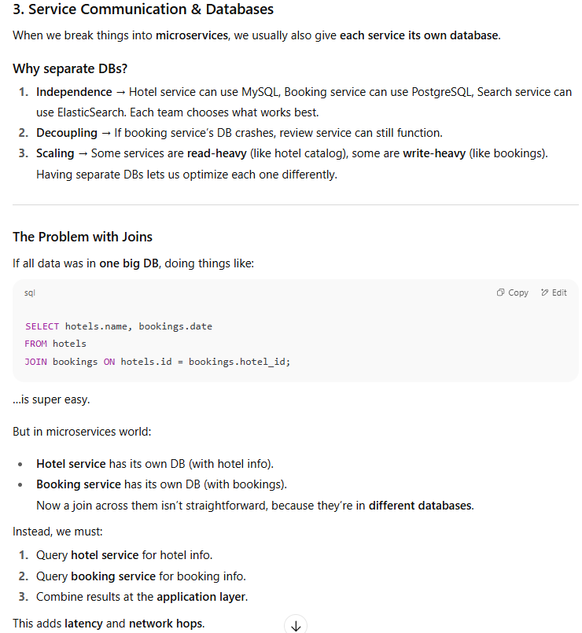
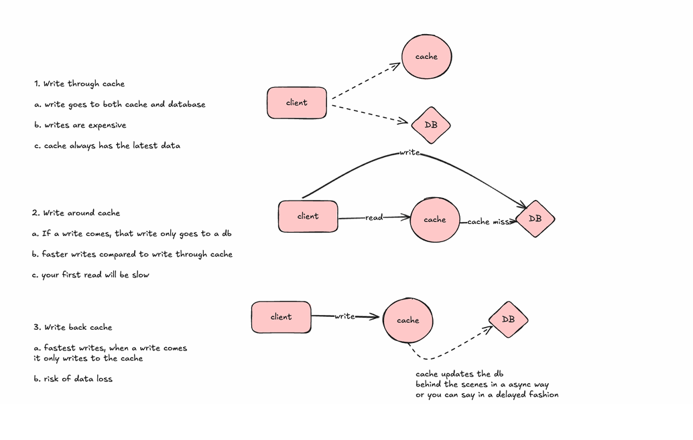
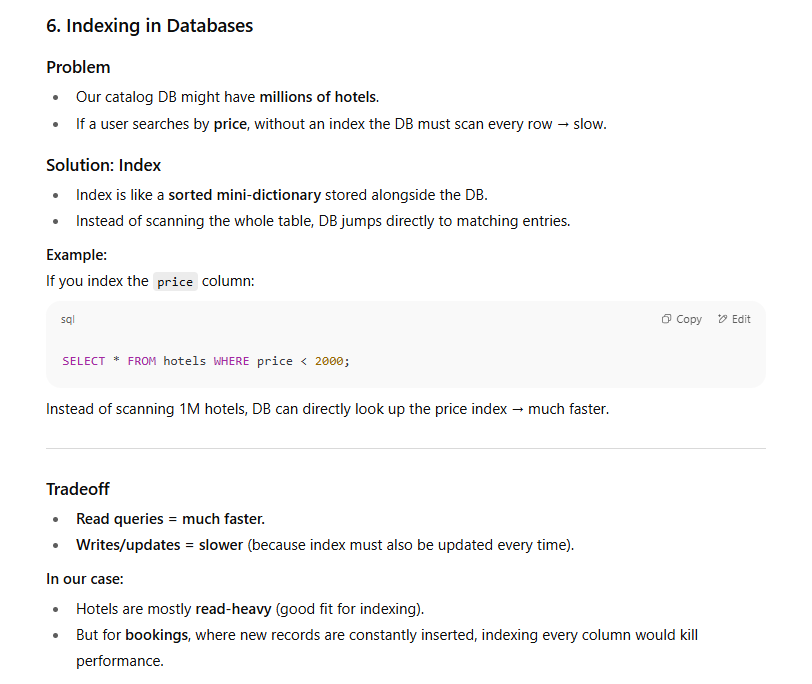
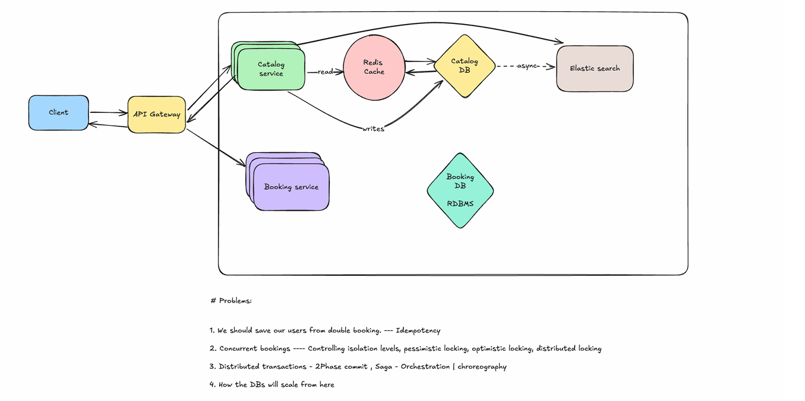

When discussing horizontal scaling, "adding more instances" primarily refers to distributing the workload across multiple machines. While it's technically possible to run multiple instances of the same code in containers on a single powerful machine, true horizontal scaling involves adding more machines to a resource pool to handle increased traffic and load. This approach is also known as scaling out.

## **2. API Gateway**

**Why do we need it?**  
When you move from a single server (monolith) to **multiple microservices**, clients (like React app, Android app, iOS app) would otherwise need to know:

- which service to call,
    
- what authentication to use,
    
- how to handle failures,
    
- how to rate-limit requests.
    

That’s messy. So, instead of exposing all microservices directly to the outside world, we introduce an **API Gateway**.

**What does an API Gateway do?**

1. **Single entry point** → all client requests hit the API Gateway first.
    
2. **Security** → it handles authentication, authorization, and SSL termination.
    
3. **Rate limiting / DDoS protection** → prevents spam or flooding (e.g., allow max 100 requests/sec from one IP).
    
4. **Routing** → decides which internal microservice should handle a request.
    
    - `/hotels → hotel service`
        
    - `/bookings → booking service`
        
    - `/reviews → review service`
        
5. **Hiding the private network** →
    
    - Clients **can’t directly hit microservices** (they are on a private VPC/subnet).
        
    - Microservices can call _outward_ (like calling payment gateways), but outside world can’t call _inward_.
        

**Analogy** 🏦  
Think of an API Gateway as a **reception desk at a big company**:

- Visitors (clients) don’t directly enter departments (microservices).
    
- They go to the reception (gateway).
    
- Reception verifies identity (auth), decides who they can meet (authorization), and directs them to the right department (routing).
    
- If too many visitors show up, the reception controls the crowd (rate limiting).
    

**Big Tech Anecdote**  
Netflix built their **Zuul API Gateway** for handling billions of requests per day. Later, they moved to **Spring Cloud Gateway** for better scalability. Without an API Gateway, each Netflix app (TV, iOS, Android, web) would need to talk to dozens of microservices directly, which would be chaos.

### **Big Tech Anecdote**

- **Amazon** moved to microservices in the early 2000s. Each service owns its data. That’s why if you order something, your “orders” page is technically calling **Order Service DB**, **Product Service DB**, and **User Service DB**, then stitching results together at the application layer.
    
- This makes development scalable across teams, but makes reporting (which needs lots of joins) harder → they often rely on **data warehouses** for analytics.

👉 Next natural step: **Caching Basics** — since DB calls are expensive (and even worse when spread across services), we need **caches** (like Redis) to speed things up.

## **4. Caching Basics**

### **Why do we need caching?**

- Some data is **read very frequently** but doesn’t change much (like hotel details, reviews, user profile info).
    
- If every request hits the database, the DB will choke under high load.
    
- **Cache = faster + cheaper** → memory lookups (Redis, Memcached) are much faster than querying a DB on disk.
    

---

### **Where do we place caches?**

1. **Between client & server (CDN)**
    
    - e.g., Cloudflare, Akamai → caches images, hotel thumbnails, static pages.
        
    - Example: Netflix caches movie posters at CDN edge servers worldwide.
        
2. **Between service & DB (application cache)**
    
    - e.g., Redis, Memcached → cache hotel details, popular searches.
        
    - Example: Hotel catalog service caches “top 100 most searched hotels” in Redis.
        
3. **In-memory cache inside service**
    
    - For super-fast, small lookups. But limited by service memory.
        

---

### **How does cache help in our system?**

- Hotel catalog service is **read-heavy** (users browsing hotel listings).
    
- Most hotels rarely change details (name, location, amenities).
    
- So we can store this data in Redis → **99% of reads come from cache** instead of DB.
    
- Only things like **room availability** should hit DB (since they change quickly).
    

---

### **Analogy** 🏪

Imagine a shop:

- If every customer asks the shopkeeper to fetch items from the warehouse (DB), it’s slow.
    
- Instead, the shopkeeper keeps popular items on the **counter (cache)** for instant delivery.
    
- Only rare items require going back to the warehouse.
    

---

### **Big Tech Anecdote**

- **Twitter**: Every tweet is stored in databases, but popular tweets and timelines are cached in **Redis** clusters to handle billions of reads.
    
- Without caching, Twitter’s DBs would collapse under load.
    

---

👉 Next, we’ll go deeper into **Cache Write Policies (write-through, write-around, write-back)** – which your diagram covers. These are about **how we keep cache & DB in sync**.

## **5. Cache Write Policies (How cache & DB stay in sync)**

When clients write data, the big question is:  
👉 _Do we write to cache first, DB first, or both?_

There are 3 main strategies:

---

### **1. Write-Through Cache**

- **How it works:**
    
    - Every write goes to **both cache and DB**.
        
- **Pros:**
    
    - Cache always has fresh data.
        
- **Cons:**
    
    - Slower writes (because you hit 2 systems).
        

**Use case:**

- Hotel **details update** (e.g., new description). Doesn’t happen often, but when it does, we want cache to be instantly correct.
    

---

### **2. Write-Around Cache**

- **How it works:**
    
    - Writes go **only to DB**. Cache gets updated _later_ when data is read (cache miss).
        
- **Pros:**
    
    - Faster writes than write-through.
        
- **Cons:**
    
    - First read after a write might be **stale/slow**.
        

**Use case:**

- Rarely-read data. Example: If a hotel adds a new policy, most users won’t immediately check it. First read will update cache.
    

---

### **3. Write-Back (Write-Behind) Cache**

- **How it works:**
    
    - Writes go **only to cache**, then cache asynchronously writes to DB in the background.
        
- **Pros:**
    
    - Fastest writes.
        
- **Cons:**
    
    - Risk of data loss (if cache crashes before syncing to DB).
        

**Use case:**

- High write volume but eventual consistency is fine. Example: **click tracking**, **analytics logs**.
    

---

### **Real-world Example**

- **Facebook** uses **write-back** for logging “likes” (temporary counters) → super fast.
    
- **Airbnb** uses **write-through** for hotel details → because showing stale info would hurt trust.
    

---

### **Analogy** ✍️

Think of DB as your **notebook**, cache as a **sticky note on your desk**:

- Write-through → You write on both sticky note & notebook at once (safe but slower).
    
- Write-around → You write only in the notebook; sticky note gets updated next time you read (fast writes, first read slow).
    
- Write-back → You only write on sticky note; later you copy to notebook (fastest, but risk losing sticky note).
    

---

👉 Now that cache helps reduce DB load, we still need **faster searches** (like searching hotels by text: "wifi + pool + under ₹2000"). Normal DBs struggle here.  
Next logical step → **Indexing & Full Text Search (ElasticSearch)**.

## **8. ElasticSearch**

### **What is it?**

- ElasticSearch is a **search engine**, not a normal DB.
    
- Built on **Lucene (inverted index)** → optimized for text search.
    

### **How does it work?**

- Instead of storing rows, it stores **documents** (JSON).
    
- For text, it builds an **inverted index**:
    
    - Like the index of a book → word → list of pages.
        
    - Example:
        
        - “wifi” → [hotel 1, hotel 3, hotel 7]
            
        - “pool” → [hotel 2, hotel 3, hotel 5]
            
        - Search “wifi + pool” → intersection = hotel 3.
            

### **Why async updates?**

- Updating ElasticSearch for every DB write synchronously would slow things down.
    
- Instead:
    
    - Write to DB first.
        
    - Then **async push** updates to ElasticSearch (near real-time, e.g., within seconds).
        
- This is where **CDC (Change Data Capture)** comes in (we’ll cover next).
    

---

### **Analogy** 📖

- DB = notebook where you write all hotel details.
    
- ElasticSearch = **special dictionary** that helps you instantly find hotels by any keyword, even approximate ones.
    

---

### **Big Tech Anecdote**

- **Airbnb**: uses ElasticSearch for property search with filters (location, price, amenities).
    
- **Uber**: uses ElasticSearch for real-time driver & trip searches.
    
- **E-commerce (Amazon/Flipkart)**: product search is powered by ElasticSearch, not DB queries

👉 Next, we’ll talk about **Change Data Capture (CDC)** → how to keep DB & ElasticSearch in sync.

## **9. Change Data Capture (CDC)**

### **Problem**

- Our system has 2 sources of truth:
    
    - **DB** (primary storage, reliable).
        
    - **ElasticSearch** (for text search).
        
- If someone updates hotel data (e.g., price, description), how do we ensure ElasticSearch also gets updated?
    
- Doing it **synchronously** (update DB → immediately update ElasticSearch) slows things down and risks failures if ES is down.
    

---

### **Solution → CDC**

**Change Data Capture (CDC)** tracks changes in the DB (inserts, updates, deletes) and pushes them to other systems (like ElasticSearch, Kafka, analytics).

---

### **How does it work?**

1. **DB writes happen first** (source of truth).  
    Example: `UPDATE hotels SET price = 1800 WHERE id = 101;`
    
2. **CDC tool monitors DB logs** (e.g., binlog in MySQL, WAL in Postgres).
    
    - It detects: “Hotel 101 → price changed from 2000 → 1800.”
        
3. **Event gets published** (to Kafka, Debezium, or directly).
    
4. **Consumers (ElasticSearch)** read the event and update their index.
    
    - ES updates document for hotel 101.
        

Result → DB & ES stay in sync **asynchronously** (few ms to seconds delay).

---

### **Popular CDC tools**

- **Debezium** (works with Kafka, MySQL, Postgres, MongoDB).
    
- **AWS DMS** (Database Migration Service).
    
- **Kafka Connect**.
    

---

### **Analogy** 📰

Think of DB as the **official government record**, and ElasticSearch as a **newspaper database**.

- Every time govt makes a change (DB update), newspapers (ES) get notified via a reporter (CDC).
    
- Newspaper might publish with a short delay, but stays in sync.
    

---

### **Big Tech Anecdote**

- **LinkedIn** pioneered this with **Kafka** → every DB change is written to a Kafka topic, then consumed by search indexes, analytics, and caches.
    
- **Netflix**: uses CDC to sync data into ElasticSearch clusters for movie search and recommendations.

# Big Picture: Request Journeys

## A) Browse catalog (read-heavy, hot paths)

1. **Client → API Gateway**
    
    - Auth, rate limiting, routing to `Catalog Service`.
        
2. **Catalog Service → Redis (cache-aside)**
    
    - Try `GET hotel:{id}` or `GET list:{city}:{page}`.
        
    - **Hit?** return immediately (fast).
        
    - **Miss?** query Catalog DB → hydrate Redis (set TTL + version) → return.
        
3. **Catalog DB**
    
    - Optimized for reads: proper **indexes** (e.g., `price`, `city_id`, `rating`), read replicas if needed.
        

Why this works: 80/20 rule — a small set of hotels & lists get most traffic; caching absorbs it.

## B) Search by text/filters (“wifi + pool + under ₹2000 in Goa”)

1. **Client → API Gateway → Search Service**
    
2. **Search Service → ElasticSearch**
    
    - Full-text query + structured filters: amenities, price, rating.
        
    - ES returns hotel IDs ranked by relevance.
        
3. **Search Service → Catalog Service (optional fan-out)**
    
    - Fetch hotel detail cards (often from Redis) for the IDs; assemble response.
        

Why ES: **inverted index** (Lucene) gives relevance, fuzzy match, fast faceting. SQL can’t do this well.

## C) Hotel detail & room availability (mixed: static + dynamic)

1. **Gateway → Catalog Service** for hotel static details
    
    - Served from **Redis** (details change rarely; good TTL).
        
2. **Gateway → Availability/Booking Service** for live inventory
    
    - **Bypass cache** or use very short TTL (seconds) since stock changes fast.
        
    - Availability DB is write-heavy, often has append-only or event-sourced model + careful locking.
        

Reason: split static from dynamic; cache static hard, query dynamic fresh.

## D) Booking (write path, correctness > speed)

1. **Gateway → Booking Service** (idempotency-key header to prevent double charges).
    
2. **Reserve stock** (in Booking DB) with transactional guarantees.
    
3. **Call Payment Gateway** (outbound allowed; retries with idempotency).
    
4. **Confirm booking** → emit domain events (`BOOKING_CONFIRMED`).
    
5. **Invalidate/adjust caches** (e.g., purge availability shards for that hotel/date).
    
6. **Async fan-out** (Kafka): email, receipts, analytics, recommendation updates.
    

Policy: prioritize **consistency** over caching tricks on the write path.

---

## E) Host/admin updates hotel info (eventually consistent search)

1. **Gateway → Catalog Service** → **Catalog DB** (source of truth).
    
2. **Cache policy**:
    
    - **Write-through** for hotel details (keeps Redis hot & correct).
        
    - Or **write-around + explicit invalidation** of keys (`hotel:{id}`, `list:*goa*`).
        
3. **CDC pipeline** (Debezium/Kafka):
    
    - Reads DB binlog/WAL → emits `HOTEL_UPDATED`.
        
    - **Indexer** consumes and updates **ElasticSearch** document.
        
    - ES is **near-real-time** (seconds), acceptable for search.
        

Why async to ES: keeps writes fast; search catches up quickly.

---

# How pieces fit (network & boundaries)

- **Internet** → **API Gateway (public)**
    
    - TLS, auth (JWT/OAuth), rate limiting, WAF/DDoS shields, routing, request shaping.
        
- **Private VPC/Subnets** (no inbound from internet)
    
    - Catalog, Search, Booking, Payments, Reviews, etc.
        
    - Redis clusters, relational DBs (with replicas), ElasticSearch cluster.
        
- **Outbound allowed** from services to third parties (payments, email).
    
- **Messaging backbone** (Kafka/PubSub) for events and **CDC**.
    

---

# Caching: quick decisions

- **What to cache**: static hotel details, list pages, amenity lookups, price buckets.
    
- **What not to cache much**: room availability, cart/checkout state (use short TTL or none).
    
- **Patterns**:
    
    - **Cache-aside (lazy)** for reads: on miss → DB → set cache.
        
    - **Write-through** for correctness on infrequent updates (hotel details).
        
    - **Write-around** when writes are frequent but reads are infrequent.
        
    - **Write-back** only for non-critical counters/analytics (risk of loss).
        
- **Invalidation**: on update, delete precise keys (and related list keys) or use **versioned keys** (`hotel:{id}:v{n}`) to avoid stale reads.
    

---

# Data modeling & indexing

- **Catalog DB** (read-optimized):
    
    - Composite indexes: `(city_id, price)`, `(city_id, rating)`, `(hotel_id, amenity)`.
        
    - Covering indexes for top queries; keep write cost acceptable.
        
- **Availability DB** (write-optimized):
    
    - Append-only reservations, calendar shards by `(hotel_id, date)`, careful concurrency.
        
- **ElasticSearch**:
    
    - Mappings: analyze `name`, `description`; keyword fields for `city`, `amenities`.
        
    - Use filters for `price`, `rating`, `availability_flag`.
        
    - Refresh interval tuned (e.g., 1–5s) for throughput vs freshness.
        

---

# Failure & resilience story

- **ES down**: Search Service degrades to basic fallback (city + price from DB) with a “limited search” banner.
    
- **Redis miss storm**: enable **request coalescing** (single flight) to avoid DB thundering herd.
    
- **DB hot partition**: add read replicas, cache hot keys, or shard by city/region.
    
- **Payment timeout**: retry with idempotency; never double-charge.
    
- **Cache/DB divergence**: prefer **invalidate-then-write** or write-through; monitor cache hit rates & stale reads.
    

---

# Operational guardrails (what you alert on)

- Cache hit rate (overall and by keyspace).
    
- P99 latency per endpoint (catalog, search, availability, booking).
    
- ES indexing lag (CDC end-to-end delay).
    
- DB slow query log & replica lag.
    
- Booking success rate, payment error rate.
    
- Rate-limit blocks at the gateway (possible attack or client bug).
    

---

# Tiny code snippets for your notes

**Cache-aside read (Node/TS-ish pseudocode):**

``const key = `hotel:${id}:v${version}`; let doc = await redis.get(key); if (!doc) {   const row = await catalogDb.getHotel(id);   doc = serialize(row);   await redis.setex(key, TTL_HOTEL, doc); } return JSON.parse(doc);``

**Write-through on update:**

``await catalogDb.updateHotel(id, patch);        // truth const version = await catalogDb.bumpVersion(id); await redis.setex(`hotel:${id}:v${version}`, TTL_HOTEL, serialize(patchMerged)); await redis.del(`list:${city}:*`);             // bust list pages``

**CDC → ES (consumer sketch):**

`for await (const ev of kafka.consume('catalog.cdc')) {   if (ev.table === 'hotels') {     await es.index({       index: 'hotels',       id: ev.after.id,       document: transform(ev.after)     });   } }`

---

# “Why this order” — the narrative arc

API Gateway (security, routing) → private services with **own DBs** (independence) → **caching** to absorb reads → **write policies** to keep cache correct → **DB indexes** for structured filters → **ElasticSearch** for text/fuzzy search → **CDC** to keep ES in sync → **operations/resilience** to keep it all healthy.

### **Why Booking Service needs an RDBMS (ACID DB like Postgres/MySQL)**

The **Booking Service** is _write-heavy_ and deals with **money + inventory**. That means we **cannot afford inconsistency**. Let’s break it down:

---

### **1. ACID Properties Needed**

- **Atomicity** → Either the booking + payment succeeds fully, or it fails fully.
    
    - Example: If room is reserved but payment fails, rollback the booking.
        
- **Consistency** → System state remains valid.
    
    - No “overbooking” beyond available rooms.
        
- **Isolation** → Concurrent bookings don’t corrupt inventory.
    
    - If 2 users try to book the last room at the same time, only one succeeds.
        
- **Durability** → Once a booking is confirmed, it survives crashes.
    
    - Even if server restarts, booking record persists in DB.
        

👉 That’s why we go for **RDBMS** (like Postgres/MySQL), not NoSQL.

---

### **2. Why not NoSQL?**

- NoSQL DBs (like MongoDB, Cassandra) are **eventually consistent**.
    
- For hotel availability & payments, **eventual consistency = disaster**.
    
    - Imagine 2 people booking the “last room” because system lagged.
        
    - Or losing a booking record after a crash.
        

So NoSQL works fine for **catalog/search**, but not for **bookings**.

### **Big Tech Anecdote**

- **Airbnb**: Bookings are strongly consistent → uses RDBMS (Postgres + MySQL historically).
    
- **Uber**: Ride matching (like booking a driver) also uses strongly consistent RDBMS for reservations.
    
- **Amazon**: Shopping cart & orders are backed by ACID-compliant stores (Aurora, DynamoDB with strict consistency options).
    

---

So yes → **Booking Service DB must be RDBMS** (ACID guarantees), while **Catalog/Search Service DB can be NoSQL + ElasticSearch + Redis** because they are more read-optimized.

