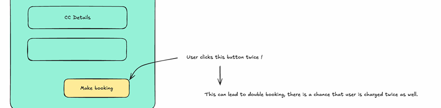
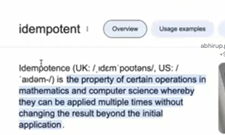
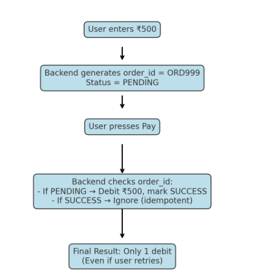
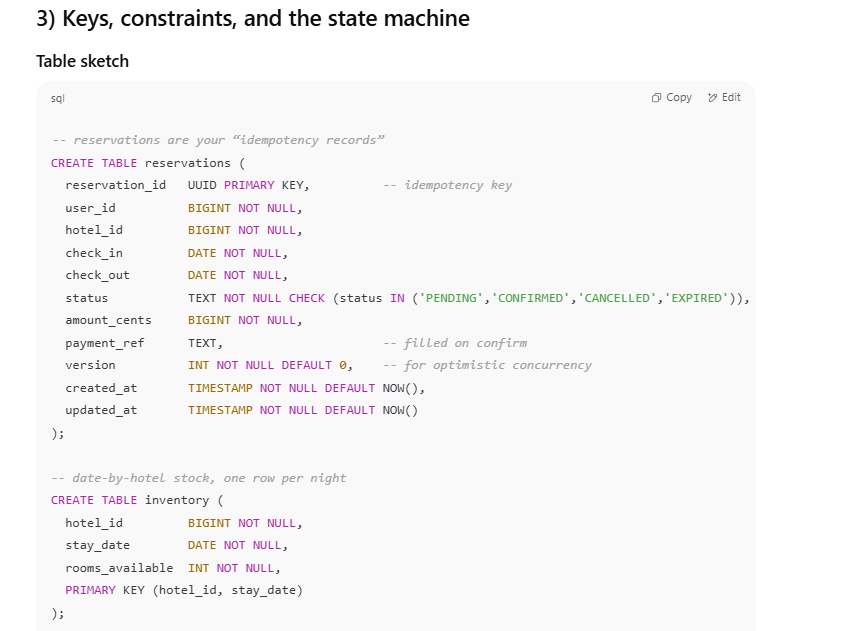
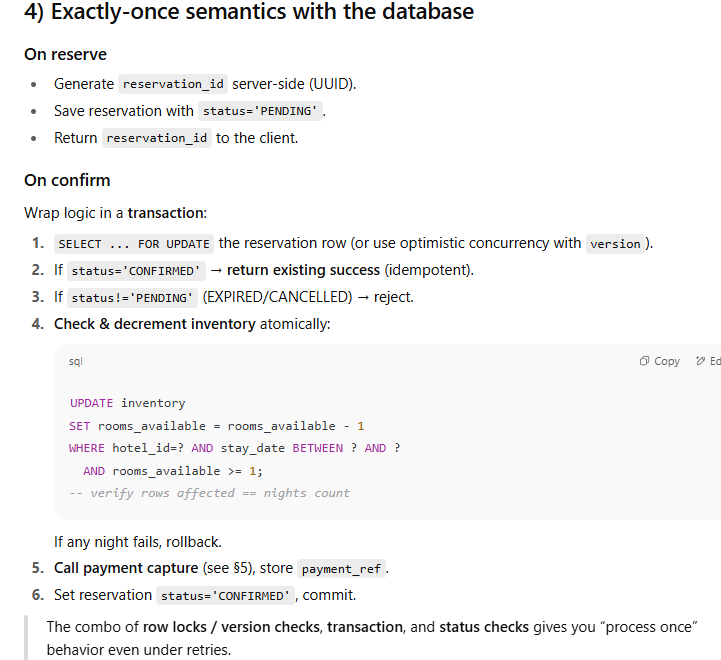

### Problem: **Double Booking / Double Payment**

- User clicks **“Make booking”** twice (maybe due to lag or impatience).
    
- Two requests hit the backend →
    
    - Could **create 2 bookings**.
        
    - Could **charge the card twice** 💳.
        
- This is a **race condition** + **idempotency problem**.

### **Idempotent (general meaning)**

An operation is called **idempotent** if **doing it once, twice, or 100 times gives the same result after the first time** 

- Math example:
    
    - `abs(-5)` → always `5` (calling multiple times doesn’t change).
        
    - `max(10, 20)` → always `20`.
        
- Real-world example:
    
    - Turning **a light switch ON** → pressing it again when it’s already ON doesn’t make it _more ON_.

### **Idempotent in HTTP / APIs**

Some HTTP methods are **idempotent by definition**:

- `GET /user/123` → always returns same user (no side effect).
    
- `PUT /user/123 {name:"Sourav"}` → updating twice still results in the same final state.
    
- `DELETE /user/123` → deleting once or multiple times, user is gone.

👉 Problem: `POST` is **not idempotent** (normally creates new resources every time).

Whenever a user clicks **“Pay”** or **“Reserve”**, there’s a risk that:

- They click the button twice by mistake.
    
- The network is slow, so the same request is retried.
    
- The backend doesn’t respond in time, so the frontend sends the same request again.
    

👉 Without protection, this can lead to **duplicate payments** or **double bookings**.

## . The Concept of Idempotency

- **Idempotent operation**: No matter how many times you repeat the request, the result is **the same as if it was done once**.
    
- Example:
    
    - If you call `DELETE /user/123` multiple times → the user is deleted (same final state).
        
    - If you call `PAY` multiple times → you don’t want multiple debits; you want **only one debit**.
        

So systems need a mechanism to make **critical actions idempotent**.

## 3. How GPay / Hotel Booking Fix This

### Step A: Planning Phase (Pre-Order / Pre-Booking)

- As soon as you say **“I want to pay”** or **“I want to book this hotel”**,  
    the system creates a **unique identifier**:
    
    - In GPay → `order_id`
        
    - In Booking → `reservation_id`
        

📌 This ID is stored in the backend in a **PENDING state**.  
It means: "We know you want to do this, but it’s not finalized yet."

---

### Step B: Confirmation Phase

- Later, when you actually **confirm** the payment or booking:
    
    - The client must send the **same `order_id` / `reservation_id`**.
        
    - Backend checks:
        
        - ✅ If this ID is **pending**, mark it as **completed**.
            
        - ❌ If this ID is already **completed**, ignore → **no double debit / no double booking**.

## 4. Why This Works (Idempotency via Unique IDs)

- The **reservation_id** acts as a **lock** on the action.
    
- The backend enforces: _one unique ID → only one final transaction_.
    
- Even if the client retries 10 times:
    
    - All retries carry the **same ID**.
        
    - Backend says: "Already completed, no need to process again."
        

---

## 5. Example Walkthrough (Hotel Booking)

1. **User selects hotel** → backend creates `reservation_id = 12345`, status = `PENDING`.
    
2. **User fills details & confirms booking** → sends `reservation_id = 12345`.
    
    - Backend changes it to `CONFIRMED`.
        
3. **User clicks confirm twice (retry)** → sends same `reservation_id = 12345`.
    
    - Backend checks → already `CONFIRMED`, ignores.
        
    - ✅ No double booking happens.
        

---

## 6. Example Walkthrough (GPay Lite)

1. You enter ₹500 → backend creates `order_id = ORD999`, status = `PENDING`.
    
2. You press pay → backend sees `ORD999`, debits ₹500, marks it `SUCCESS`.
    
3. You press pay again (duplicate request):
    
    - Backend checks `ORD999` → already `SUCCESS`.
        
    - ❌ No second debit happens.
        

---

💡 **Core Principle**:  
We’re not making the _“Pay”_ button itself safe. We’re making the **backend smart enough** to recognize duplicate requests for the same unique `id` and ensure **idempotency**.

To make an operation idempotent, you need a **unique identifier** (like `reservation_id` in hotels, or `order_id` in GPay) that ties all retries or duplicate requests to the **same operation**.We can apply idempotency by uniquely identifying requests, ensuring that multiple requests for the same booking are treated as one

- Adding money to wallet (non-idempotent): If you retry twice → wallet balance increases twice.
    
- Confirming a booking (idempotent): If you retry twice → booking is confirmed once only, not duplicated.

### 🔹 Step 3: How Do We Implement Idempotency?

There are two approaches (both are in your notes):

#### **Option 1: Separate `idempotency_keys` Table**

- Client sends a **unique idempotency key** (e.g. `reservation_id` or a UUID in headers).
    
- Server checks:
    
    - If key exists in `idempotency_keys` → reject request (duplicate).
        
    - If not → process booking → store key in table.
        

#### **Option 2: Add `idempotency_key` Column in Reservations Table**

- Instead of a separate table, store the idempotency key alongside the reservation record.
    
- Make sure it’s **unique** so duplicates are rejected.
    

👉 Both options work, but option 1 is cleaner when multiple services share the same concept of idempotency.

> while confirming a booking, we insert the idempotency key in the table **and** change booking status from pending → success. Should these be in a single transaction?

✅ Yes, they must be in **one atomic transaction**:

- If we insert key but fail to update booking → inconsistent state.
    
- If we update booking but fail to insert key → retries may create duplicate bookings.
    

So both must happen inside **one DB transaction**.

# The problem we must solve

Networks retry, users double-tap, mobile apps resume and resubmit. If our “Book” (or “Pay”) request is processed twice, we can:

- create **two bookings** for the same stay, or
    
- **charge twice**.
    

So the system must be **safe to retry**. That’s what idempotency gives us.

# What is idempotency (practical definition)

An operation is **idempotent** if running it once or many times **leads to the same final state**.  
We make normally non-idempotent actions (like `POST /bookings`) behave idempotently by **attaching a unique key** and **deduplicating** on the server.

# 2) The shape of a reliable booking flow

We split the user journey into **two steps**:

**A. Create a reservation (planning step)**

- Client calls `POST /reservations` (or `/bookings/reserve`) with traveler & stay details.
    
- Server creates a **PENDING reservation** and returns a **`reservation_id`** (this is also your **idempotency key** for the confirm step).
    
- Inventory isn’t fully consumed yet (or it’s held temporarily).
    

**B. Confirm the booking (commit step)**

- Client calls `POST /bookings/confirm` and **must include** the `reservation_id`.
    
- Server turns that reservation into **CONFIRMED** exactly once, even if the request is retried.
    

This mirrors GPay/Stripe style: _create intent → confirm intent_.

### Status transitions (deterministic)

- `PENDING → CONFIRMED` (on successful payment capture + stock decrement)
    
- `PENDING → EXPIRED` (TTL passed, not confirmed)
    
- `CONFIRMED → CANCELLED` (refund path)
    

Every transition is **idempotent**: if you apply it twice, the state remains the same.

### Problem Without Idempotency

- User clicks **"Reserve Hotel"**.
    
- Their internet lags → they click again.
    
- Backend receives **two booking requests**.
    
- If there’s no protection → system creates **two reservations**, hotel is double booked, or customer is charged twice.
    

---

### ✅ Solution With Idempotency

1. **Generate a Unique ID at Planning Stage**
    
    - As soon as the user starts the booking (before payment), backend creates a `reservation_id`.
        
    - Example: `reservation_id = "RESV12345"`
        
    - State = **pending**.
        
2. **User Completes Booking with `reservation_id`**
    
    - When user submits the final booking, the request must include `reservation_id`.
        
    - Backend checks:
        
        - If `RESV12345` already **confirmed** → return success (no double booking).
            
        - If still **pending** → confirm booking now.
            
        - If expired/cancelled → reject.
            
3. **If User Retries / Double Clicks**
    
    - All retries carry the same `reservation_id`.
        
    - Backend sees:
        
        - “Oh, this is the same reservation attempt.”
            
    - It simply returns the existing status → **idempotent behavior**.

### ⚡ Why This Works

- The **unique reservation_id** acts like a “fingerprint” for that booking attempt.
    
- No matter how many times the user retries, backend **doesn’t create new rows**, it just updates/returns the same one.
    
- This is what GPay does with `order_id` and banks do with `transaction_id`.
    

---

👉 So yes, **idempotency = uniquely identify a logical operation across retries.**  
The unique identifier can be:

- `reservation_id` (hotel booking)
    
- `order_id` (payments)
    
- `request_id` (API calls like Stripe/PayPal)