PROBLEM- TWO PEOPLE SIMULATENOUSLY DOING THE BOOKING 

PROBLEM - CONCURRENCY 
SOLUTION - ISOLATION IN DB

ACID is a set of **properties that guarantee reliable processing of database transactions** in an RDBMS. Each letter stands for one property:

### 💡 First, what is a **transaction** in a database?

Think of a **transaction** like a **small package of work** that the database treats as a **single unit**.  
It’s a set of one or more operations (like insert, update, delete, read) that should either:

- **All happen completely** ✅
    
- Or **not happen at all** ❌
    

No in-between state is allowed.

### 🏦 Real-life example (Bank transfer)

Suppose you want to transfer **₹500 from Account A to Account B**:

1. Subtract 500 from A’s balance
    
2. Add 500 to B’s balance
    

This whole process is **one transaction**.

👉 If step 1 succeeds but step 2 fails (maybe the system crashes), the money would **vanish into thin air** 😱.  
That’s why transactions exist: the database ensures **both steps happen together, or none at all**.
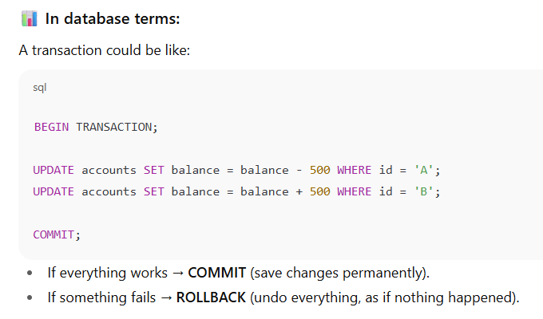

So in short:

- A **transaction** = a set of database operations bundled into **one single, reliable unit**.
    
- Goal = keep data **safe, consistent, and correct**.

### 1. **Atomicity (A)**

- Either **both steps** (subtract from A, add to B) happen ✅
    
- Or **none happen** ❌
    
- If the system crashes after subtracting but before adding, the DB will **ROLLBACK** → balances remain unchanged.  
    👉 So, no half-done work.
    

---

### 2. **Consistency (C)**

- Means: A transaction **brings the database from one valid state to another valid state.**
    
- Database rules, constraints, triggers, etc., must always be preserved.
    
- Example: If an account cannot have a negative balance, a transaction violating this will fail to maintain consistency.
- - Before the transaction:
    
    - A = ₹1000, B = ₹500 → Total = ₹1500
        
- After transaction:
    
    - A = ₹500, B = ₹1000 → Total = ₹1500
        
- The **rules of the system** (like total money must stay the same, no negative balances, valid account IDs) are preserved.  
    👉 Database never allows broken rules.
    

---

### 3. **Isolation (I)**

- Means: Transactions **don’t interfere with each other.**
    
- Even if multiple transactions run concurrently, the outcome should be as if they ran one after another (serially).
    
- Example: Two users updating the same balance at the same time shouldn’t corrupt the data.
- Imagine **two people transferring money at the same time**:

- Transaction 1: A → B ₹500
    
- Transaction 2: A → C ₹300
    

If both run together, without isolation, balances could get messed up.  
Isolation ensures that transactions run **as if they were one after another** (even if internally they overlap).  
👉 Prevents race conditions & dirty reads.
    

---

### 4. **Durability (D)**

- Means: Once a transaction is committed, **it will survive permanently**, even if the system crashes immediately after.
    
- Example: Once money transfer is completed, the changes will persist on disk.
- Once the transaction is **COMMIT**ed, even if the power goes off or system crashes, the change is **saved to disk/logs**.
    
- A won’t magically get back the ₹500 once given away.  
    👉 Your data is safe forever after commit.

---

💡 **Summary Table:**

|Property|Meaning|Example|
|---|---|---|
|Atomicity|All or nothing|Debit A & credit B|
|Consistency|Valid state before & after transaction|No negative balances|
|Isolation|Concurrent transactions don’t interfere|Two users updating balance separately|
|Durability|Committed changes persist|Data remains after crash|

- **Atomicity** → Do everything or nothing.
    
- **Consistency** → Keep the rules correct.
    
- **Isolation** → Don’t let transactions disturb each other.
    
- **Durability** → Once done, it stays done.

**“All Cats In Delhi”** 🐱🏙️

- **A → Atomicity** → All or nothing
    
- **C → Consistency** → Cats follow rules
    
- **I → Isolation** → In peace, no disturbance
    
- **D → Durability** → Delhi remembers forever

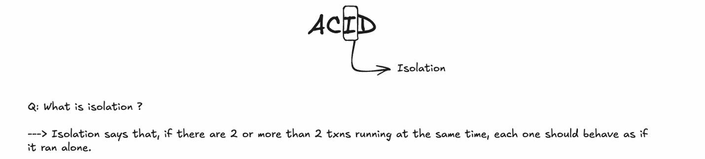

**Isolation** ensures that **concurrent transactions do not interfere with each other**.  
Even if multiple users or applications are performing operations on the database at the same time, each transaction should behave **as if it is running alone**.

- It **prevents one transaction from seeing intermediate or partial results of another transaction**.
    
- Helps **maintain data integrity** when multiple transactions run simultaneously.

## **Why do we need Isolation?**

Imagine two people booking the **last ticket** at the same time:

- Transaction 1 reads “1 ticket left”
    
- Transaction 2 reads “1 ticket left”
    
- Both try to book it
    

Without isolation, both could succeed → **overbooking happens**.  
Isolation ensures that one transaction completes before the other sees the updated state.

## **Common Problems Isolation Prevents**

### 1. **Dirty Read**
    
    - **What happens?**  
    One transaction reads data that another transaction has written but **not yet committed**.
    
- **Example:**
    
    - Transaction 1: deducts ₹500 from A (not committed yet).
        
    - Transaction 2: reads A’s balance (sees it reduced).
        
    - But if Transaction 1 fails and rolls back → Transaction 2 used **wrong/dirty data**.
        
### 2. **Non-Repeatable Read**
    
    - **What happens?**  
    A transaction reads the same row twice and gets **different values** because another transaction modified it in between.
    
- **Example:**
    
    - Transaction 1: reads A’s balance = ₹1000.
        
    - Transaction 2: deducts ₹500 and commits.
        
    - Transaction 1: reads A’s balance again → now ₹500.
        
    - ❌ Same transaction got **two different answers**.
        
## 3. **Phantom Read**
    
    - **What happens?**  
    A transaction re-runs a query and suddenly **new rows appear/disappear**, because another transaction inserted or deleted data.
    
- **Example:**
    
    - Transaction 1: runs `SELECT * FROM accounts WHERE balance > 1000` (finds 2 rows).
        
    - Transaction 2: inserts a new account with balance ₹2000 and commits.
        
    - Transaction 1: runs the same query again → now 3 rows.
        
    - ❌ A “phantom” row appeared out of nowhere.

### 4. **Lost Update**

- **What happens?**  
    Two transactions update the same data, but one update overwrites the other, so one change is lost.
    
- **Example:**
    
    - Transaction 1: reads A’s balance = ₹1000.
        
    - Transaction 2: also reads A’s balance = ₹1000.
        
    - Transaction 1: subtracts ₹500 → balance = ₹500 (saves it).
        
    - Transaction 2: adds ₹200 → balance = ₹1200 (saves it).
        
    - ❌ The ₹500 deduction is **lost**.

## **Isolation Levels in RDBMS**

Isolation levels define **how much a transaction is protected from other concurrent transactions**.  
There are 4 standard levels (SQL standard):

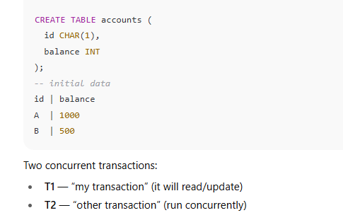

# 1) Read Uncommitted — (lowest)

**Idea:** transactions may read uncommitted (dirty) writes. No effort to prevent anything.

### Example: Dirty Read (step-by-step)

1. T1: `BEGIN;`
    
2. T1: `UPDATE accounts SET balance = balance - 500 WHERE id='A';`  
    — now A = 500 **in T1’s workspace**, but not committed.
    
3. T2: `SELECT balance FROM accounts WHERE id='A';` → **sees 500** (reads uncommitted value).
    
4. T1: `ROLLBACK;` — undo the change.
    
5. T2 used a value that never became permanent → **wrong result**.
    

**What other problems can happen?**  
All of them. Because you can read uncommitted data, you can get dirty reads, non-repeatable reads, phantoms, lost updates.

**How/why it happens (mechanism):**

- No read locks and no snapshot isolation. Writers don’t block readers; readers don’t block writers. Reads just read current buffer values whether committed or not.
    

**When would you ever use it?**  
Almost never in business apps — only in rare analytics/monitoring with acceptable staleness and speed tradeoffs.
# 🔒 Read Locks

A **read lock** is when the database prevents changes to data while it is being read.

- This is **pessimistic**: assume conflicts will happen, so block them.
    
- Usually implemented as **shared locks** (many readers can hold them, but writers must wait).
    

### Example

Imagine two transactions:

- **T1**: `SELECT balance FROM accounts WHERE id=1;`
    
- **T2**: `UPDATE accounts SET balance = balance - 100 WHERE id=1;`
    

If **T1 acquires a read lock** on row `id=1`, then:

- T1 can read the balance.
    
- T2 cannot update until T1 finishes and releases the lock.
    

### Where read locks apply

- **Repeatable Read**: readers hold locks until commit, so the same row always returns the same value (no _non-repeatable reads_).
    
- **Serializable**: even stricter, may lock ranges to prevent _phantom reads_.

# 📸 Snapshot Isolation (SI)

Instead of locking, many modern databases (Postgres, Oracle, SQL Server in RCSI mode, etc.) use **MVCC (Multi-Version Concurrency Control)**.

- Each transaction sees a **snapshot** of the database as it was when the transaction started.
    
- Readers don’t block writers, and writers don’t block readers.
    

### Example

- **T1** (at 10:00): `SELECT balance FROM accounts WHERE id=1;` sees balance = 1000.
    
- **T2** (at 10:01): `UPDATE accounts SET balance = 900 WHERE id=1;` commits.
    
- **T1** (at 10:02): queries again and **still sees 1000**, because it is working on its 10:00 snapshot.
    
- A new transaction after 10:01 would see 900.
    

### Where snapshot isolation applies

- **Read Committed (with MVCC)**: Each statement sees a fresh committed snapshot.
    
- **Repeatable Read (with MVCC, like PostgreSQL)**: The whole transaction uses the same snapshot. Prevents _non-repeatable reads_ and _phantoms_ without locking.
    
- **Serializable (MVCC-based)**: Database detects conflicts at commit time (optimistic) instead of locking upfront.

# 📝 Comparison: Read Locks vs Snapshot Isolation

| Feature                | Read Locks (Pessimistic)                                           | Snapshot Isolation (Optimistic via MVCC)                |
| ---------------------- | ------------------------------------------------------------------ | ------------------------------------------------------- |
| Readers block writers? | ✅ Yes (writers wait)                                               | ❌ No (writers create new versions)                      |
| Writers block readers? | ✅ Yes (readers wait)                                               | ❌ No (readers use snapshot)                             |
| Performance            | Can cause contention & deadlocks                                   | Higher concurrency, but more storage needed             |
| Use cases              | Traditional systems (SQL Server default, older MySQL InnoDB modes) | Modern DBs (Postgres, Oracle, newer SQL Server options) |

# 2) Read Committed — (common default in many DBs)

**Idea:** A transaction only reads **committed** data. That prevents **dirty reads** but allows non-repeatable reads and phantoms.

There are two main ways DBs implement it:

- **Lock-based read-committed**: reads take short shared locks on rows; writers take exclusive locks; read releases shared lock immediately after read. (Example: SQL Server default)
    
- **Snapshot-based read-committed**: reads see the most recently committed version at the time of the read — different reads may see different snapshots. (Example: some databases when configured)
    

### Example: Dirty Read — prevented

1. T1: `BEGIN;`
    
2. T1: `UPDATE accounts SET balance = 500 WHERE id='A';` (not committed)
    
3. T2: `SELECT balance FROM accounts WHERE id='A';`
    
    - Under Read Committed → T2 will **not** see 500; it either blocks until T1 commits or reads the last committed value (1000), depending on implementation.
        
4. If T1 `ROLLBACK`, T2 never saw the uncommitted value.
    

### Example: Non-Repeatable Read — allowed (concrete)

1. T1: `BEGIN;`
    
2. T1: `SELECT balance FROM accounts WHERE id='A';` → sees **1000**
    
3. T2: `BEGIN; UPDATE accounts SET balance = 800 WHERE id='A'; COMMIT;`
    
4. T1: `SELECT balance FROM accounts WHERE id='A';` → now sees **800**  
    — same query in T1 returned **different** results (non-repeatable read).
    

**How it’s implemented (details):**

- Lock-based: read acquires a **shared (S)** lock, but in Read Committed the shared lock is **released immediately** after the row read; so subsequent reads can see later committed updates.
    
- Snapshot-based: each SELECT reads the latest committed version at the moment of that SELECT — so two SELECTs may see different committed versions (same effective result).
    

**When to use:**  
Good default for OLTP: avoids dirty reads while keeping concurrency high. Many apps use it.

# 3) Repeatable Read — (stronger than Read Committed)

**Idea:** If you read a row once in a transaction, later reads of that **same row** return the same value. That prevents **dirty** and **non-repeatable reads** for rows you read, but **phantom rows** (new rows that match a range query) can still appear unless the DB uses gap/predicate locks or snapshot mechanisms that also address phantoms.

Two common implementations:

- **Strict two-phase locking (S2PL)**: read takes and **holds shared lock** until transaction end (commit/rollback). Prevents updates on that row by others.
    
- **MVCC/Snapshot**: transaction reads from a **consistent snapshot** taken at transaction start (so repeated reads see the same snapshot).
    

### Example: Non-Repeatable Read — prevented (S2PL or snapshot)

1. T1: `BEGIN;`
    
2. T1: `SELECT balance FROM accounts WHERE id='A';` → **1000** (reads snapshot or locks and holds row)
    
3. T2: `BEGIN; UPDATE accounts SET balance = 600 WHERE id='A'; COMMIT;`
    
4. T1: `SELECT balance FROM accounts WHERE id='A';` → still **1000** (because T1 either has an earlier snapshot or holds the shared lock preventing T2’s update until T1 finishes — depending on implementation T2 would block until T1 commits or T2 succeeds but T1 continues to see old snapshot)
    
5. T1: `COMMIT;` → afterwards reads will see the new value.
    

**Phantom rows still possible:**

- T1: `SELECT * FROM accounts WHERE balance > 1000;` → finds 2 rows.
    
- T2: `INSERT INTO accounts (id,balance) VALUES ('C',2000); COMMIT;`
    
- T1: run same query → may now see 3 rows (phantom) **if** implementation only guarantees repeatable reads on row versions, not on predicate/range locks.
    

**How DBs implement it (details):**

- **Lock-based Repeatable Read:** reads acquire **S locks** and hold them until commit; updates require **X locks** and will block until S locks are released. To prevent phantoms you'd need **predicate locks** or **key-range locks** (gap locks) so inserts that would satisfy a range are blocked.
    
- **MVCC Repeatable Read (snapshot):** transaction gets a snapshot at start; all reads reflect that snapshot. New rows inserted by others after the snapshot don’t appear. Some MVCC implementations (e.g., InnoDB Repeatable Read) also use next-key/gap locking to prevent phantoms under certain operations.
    

**When to use:**  
When you need deterministic reads of same rows within a transaction (e.g., read–modify–write logic). Good balance for many OLTP apps.

# 4) Serializable — (highest)

**Idea:** Transactions behave as if executed **serially** — one after the other. This prevents **dirty**, **non-repeatable**, **phantom reads**, and **lost updates**.

Two main implementation strategies:

- **Strict two-phase locking (full):** lock rows and ranges (predicate/gap locks) so other transactions cannot insert/update conflicting data until current transaction commits. This often blocks and reduces concurrency.
    
- **Serializable Snapshot Isolation (SSI) / Serializable via MVCC:** use snapshots but detect dangerous patterns (write–read conflicts) and abort/serialize one transaction to preserve serializability. This allows higher concurrency than locking but can cause transactions to be aborted and retried.
    

### Example: Phantom Read — prevented

1. T1: `BEGIN;`
    
2. T1: `SELECT * FROM accounts WHERE balance BETWEEN 1000 AND 2000;` → returns rows R1, R2.
    
3. T2: `BEGIN; INSERT INTO accounts (id,balance) VALUES ('C',1500);`
    
    - Under Serializable:
        
        - **Locking approach:** T2’s insert is blocked because it would create a row matching T1’s range (predicate/gap lock) — T2 must wait until T1 commits/rolls back.
            
        - **SSI approach:** T2 may proceed, but the system will detect the serialization anomaly and force one transaction to abort to preserve serializability.
            
4. T1: runs same query again → still sees R1, R2 (no phantom).
    

**Lost Update — prevented**

- Lost update happens when two transactions read-modify-write the same row and one write overwrites the other. Serializable prevents this by blocking the second updater or by detecting conflict and aborting one transaction.
    

**How implemented (details):**

- **Locking:** use S locks, X locks and **range/predicate/gap locks**. Strict 2PL: acquire locks, hold until commit. Because range locks block inserts into the range, phantoms are prevented.
    
- **Serializable MVCC (SSI):** operate with snapshots for reads, but track dependency graph of read/write operations. If a cycle (possible non-serializable interleaving) is detected, abort one transaction to remove the cycle.
    

**When to use:**  
When absolute correctness is required (accounting, critical financial ops) and you can tolerate reduced throughput or retried transactions

# OST UPDATE — deep concrete example & strategies to avoid it

**Problem timeline (how it happens):**

1. T1: `BEGIN; SELECT balance FROM accounts WHERE id='A';` → sees **1000**
    
2. T2: `BEGIN; SELECT balance FROM accounts WHERE id='A';` → also sees **1000**
    
3. T1: `UPDATE accounts SET balance = 1000 - 500 WHERE id='A'; COMMIT;` → sets **500**
    
4. T2: `UPDATE accounts SET balance = 1000 + 200 WHERE id='A'; COMMIT;` → overwrites and sets **1200**  
    Result: T1’s deduction is **lost** (no net effect of T1).
    

**How each isolation level handles it:**

- **Read Uncommitted / Read Committed:** both can allow lost update because reads are not guaranteed repeatable and updates can succeed overwriting each other.
    
- **Repeatable Read (lock-based):** T1’s initial read acquires an S lock and holds it; when it wants to update, it upgrades to X lock; if T2 tries to update concurrently, it will block or fail — lost update prevented.
    
- **Serializable:** also prevents lost update via locking or by detecting conflict and aborting.

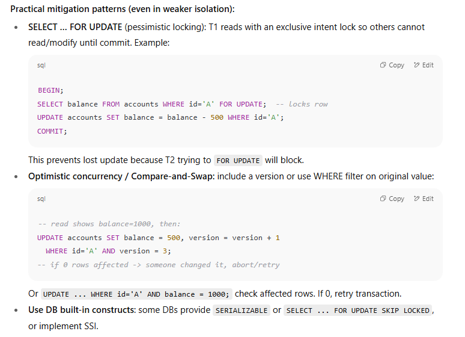

# Implementation mechanisms quick reference

- **Shared lock (S):** prevents writers; many readers can hold S locks.
    
- **Exclusive lock (X):** prevents other readers and writers on that resource.
    
- **Two-phase locking (2PL):** acquire locks, and **hold** them until commit (strict 2PL) → guarantees serializability when used correctly.
    
- **Gap / next-key / predicate locks:** lock range of keys to prevent inserts that would create phantoms.
    
- **MVCC (Multi-Version Concurrency Control):** readers see a consistent snapshot; writers create new versions. Prevents readers blocking writers; different snapshot behaviours determine which anomalies remain. MVCC + snapshot at transaction start typically prevents non-repeatable reads and dirty reads; phantoms may require additional locking or serializable MVCC.
    
- **Optimistic concurrency / version-check:** no locks on read; at write time, DB checks versions and aborts on conflict.

# Summary table (behavior + how problem is solved)

|Phenomenon → Level ↓|Read Uncommitted|Read Committed|Repeatable Read|Serializable|
|---|---|---|---|---|
|Dirty Read|Allowed|Prevented (reads only committed)|Prevented|Prevented|
|Non-repeatable Read|Allowed|Allowed|Prevented (row snapshot or held S locks)|Prevented|
|Phantom Read|Allowed|Allowed|Allowed (unless range locks used)|Prevented (range/predicate locks or SSI)|
|Lost Update|Allowed|May occur|Prevented (locks)|Prevented|

**How prevented:**

- Dirty: by reading only committed values (locks or committed-snapshot).
    
- Non-repeatable: by holding read version constant (snapshot) or by holding S locks until commit.
    
- Phantom: by locking ranges/predicates (gap locks) or using serializable snapshots/SSI.
    
- Lost update: by locking rows on read-for-update or by version checks (optimistic concurrency).

# Practical advice / when to pick which level

- **Read Committed:** Good default for many OLTP apps — avoids dirty reads, good concurrency.
    
- **Repeatable Read:** Useful when you need consistent reads over rows you’ll later update without worrying about those rows’ values changing mid-transaction.
    
- **Serializable:** Use for critical business operations that must be 100% correct (financial transfers, balancing ledgers), accept lower throughput or retries.
    
- **Use specific tools when needed:** `SELECT ... FOR UPDATE`, optimistic versioning, or application-level retries can be combined with the DB isolation level to get the desired safety/performance tradeoff.

---

PROBELM
1. Dirty Read

Reading uncommitted data from another transaction.
If that transaction rolls back, you end up with wrong/invalid data.

2. Non-Repeatable Read

Reading the same row twice gives different results.
Happens when another transaction updates the row in between.

3. Phantom Read

Re-running a query gives different sets of rows.
Happens when another transaction inserts/deletes rows in between.

4. Lost Update

Two transactions overwrite each other’s changes.
Result: one update is completely lost.

---

SQL databases allow you to **choose how strict isolation should be**, balancing **safety vs performance**

|Level|What it prevents|Possible issues|
|---|---|---|
|**Read Uncommitted**|Nothing|Dirty reads allowed|
|**Read Committed**|Dirty reads|Non-repeatable reads may happen|
|**Repeatable Read**|Dirty reads, Non-repeatable reads|Phantom reads may happen|
|**Serializable**|Everything (strictest)|Slower, less concurrency|

### **Example: Bank Account**

Suppose balance = 1000

**Transaction 1:** Withdraw 500  
**Transaction 2:** Check balance

- **Without isolation**: T2 could see balance = 500 while T1 is still in progress → might allow inconsistent operations.
    
- **With isolation**: T2 will either wait until T1 commits or see the old value (depending on isolation level).
    

---

💡 **Key Takeaways:**

- Isolation is about **transaction independence**.
    
- Higher isolation = more **safety**, but **lower concurrency** (slower performance).
    
- RDBMS lets you **choose the level** based on your application needs.

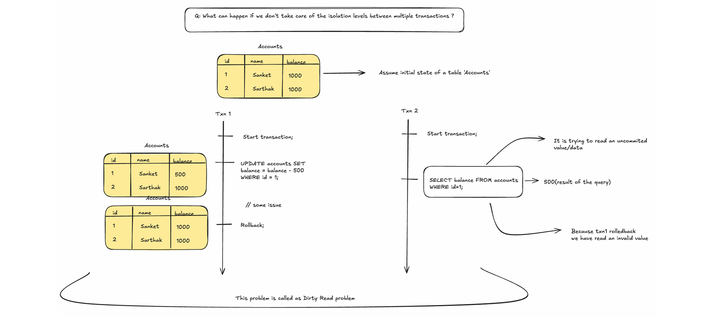

## Reading the uncommitted data leads to the problem of dirty read! 

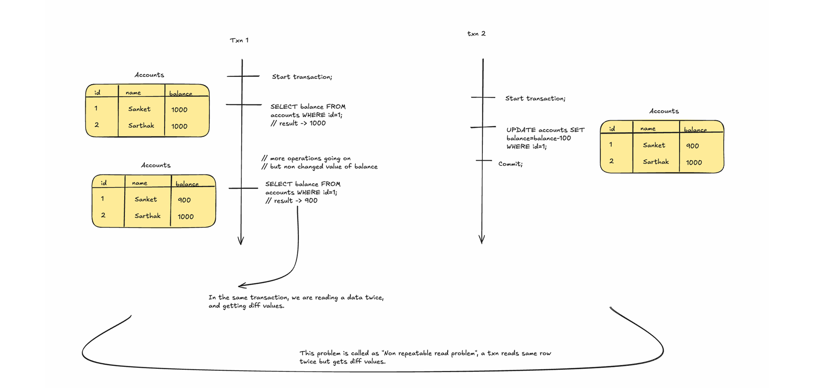

## Here we're reading the same data twice with different values!!

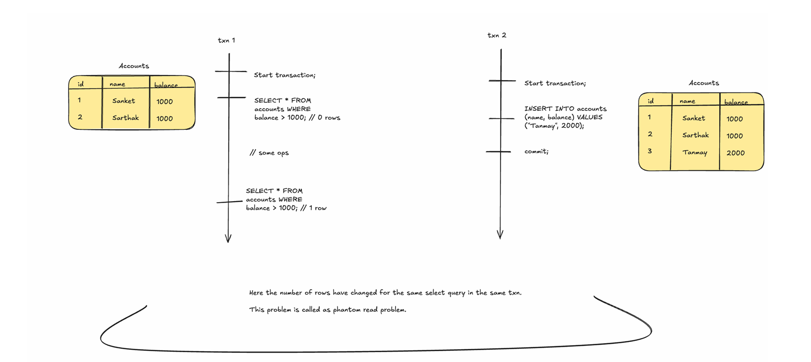

## Here a new row appeared in the same search query!

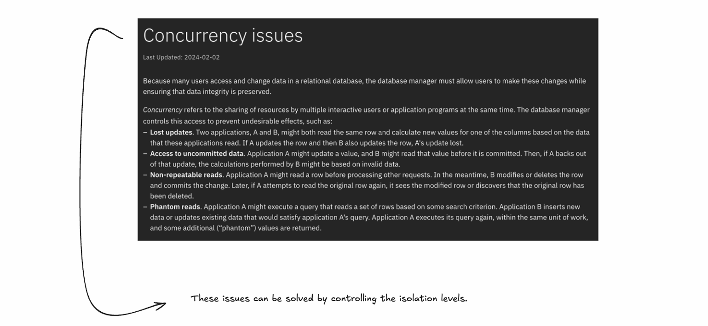

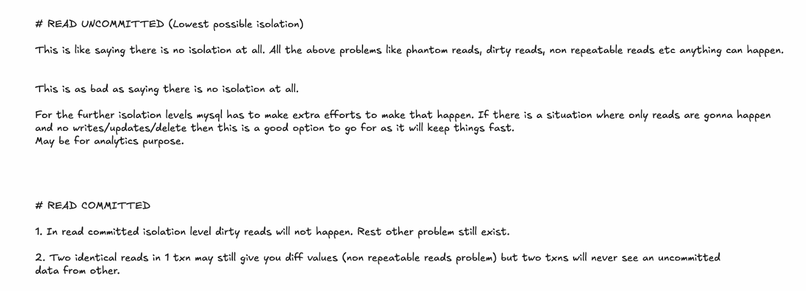

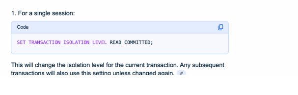

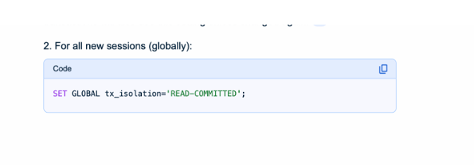

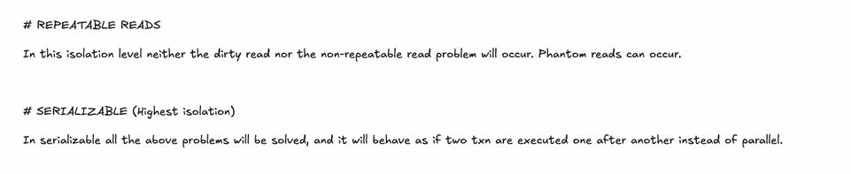

# 1) The problem in plain terms — "many likes at the same time"

Imagine a celebrity’s post. Ten thousand users press **Like** within a second. The system must:

- Record **which users** liked (so a user can’t like twice, and can unlike).
    
- Keep an accurate **likes count** to show on the post.
    
- Handle **concurrency**, network partitions, geo-replication, and occasional offline clients.
    
- Be fast (low latency) and highly available.
    

Two common mistakes new teams make:

- Do a `SELECT likes FROM posts WHERE id=...` → calculate `likes+1` in app → `UPDATE posts SET likes = <new>` (read-modify-write). That _can_ lose updates under concurrency.
    
- Rely only on a cache without ensuring durability/atomicity in the DB.

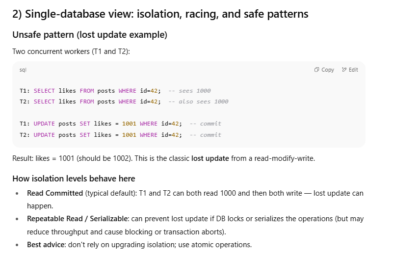

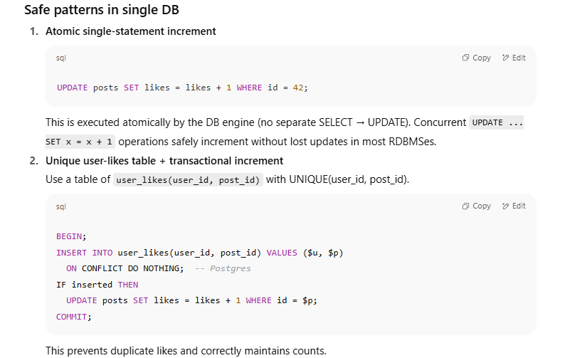

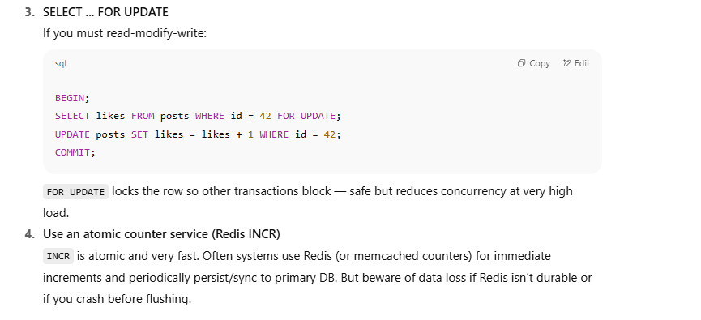

# 3) At global scale — why DB isolation alone isn’t enough

If your service is geo-distributed with multiple replicas and partitions (user requests routed to different regions), you face more problems:

- **Network partitions**: users in Europe and US might hit different replicas that cannot synchronously coordinate.
    
- **High availability requirement**: you may prefer the system to accept likes even when some nodes are unreachable.
    
- **Offline clients**: likes done while offline (mobile app) should sync and merge reliably later.
    

In such environments, strong synchronous locking (Serializable across regions) is often impractical due to latency and unavailability during partitions. This is where **eventual consistency** and specialized conflict-resolution strategies like **CRDTs** come in.

# 4) Enter CRDTs — the big idea (from scratch)

### What is a CRDT?

**CRDT** = _Conflict-free Replicated Data Type_.  
A CRDT is a data structure designed to be replicated across multiple nodes (replicas) that:

- Allows **local updates** on any replica (no global coordination needed).
    
- Lets replicas **exchange states or operations** asynchronously.
    
- Guarantees that when replicas have applied the same set of updates (possibly in different orders), they **converge to the same value** deterministically — _without_ requiring a leader or conflict-resolution policy like LWW.
    

Key properties:

- **Convergence**: all replicas eventually have the same state.
    
- **Intention-preserving**: the semantics of operations are respected when possible.
    
- **Commutative/associative/idempotent** merges or operations (so order doesn’t matter).
    

There are two main flavors:

- **State-based (CvRDT)**: each replica periodically sends its entire state to others. A merge function (a _join_ operation) combines states; merge must be commutative, associative, and idempotent. Typical merge = element-wise max / union.
    
- **Operation-based (CmRDT)**: replicas send operations (like "increment by 1"); operations must be delivered reliably (or at least delivered eventually and applied in causal order or be made commutative).

# 5) CRDT examples applied to “likes”

Which CRDT fits a “likes” use case depends on what you need to represent:

- If you only need a **count** (and duplicates from the same user are acceptable or prevented elsewhere), use a **G-Counter** or **PN-Counter**.
    
- If you need the **set of users who liked** (so you can guarantee one like per user and support unlike), use a **set CRDT**, commonly an **OR-Set (Observed-Removed Set)** or variants.
    

### 5.A G-Counter (Grow-only Counter)

- **What it is**: Each replica keeps a vector of non-negative ints, one slot per replica. To increment, a replica increments its own slot. Merge takes the element-wise max. The total count is the sum of the vector.
    
- **Properties**: increments only (no decrement). Converges by summing. Good when likes are append-only and unlike isn't allowed.
    
- **Example**:
    
    - Replicas A, B:
        
        - A: [5,0] → B: [0,3]
            
        - Merge: [5,3] → total = 8
            

### 5.B PN-Counter (Positive-Negative Counter)

- Uses two G-Counters: `P` for increments, `N` for decrements. Value = sum(P) - sum(N). This allows increments and decrements (good for like/unlike if unlike is allowed and each action is idempotent).
    
- **Issue**: If the same user both increments and decrements from different replicas, you must have some tie-breaking or per-user semantics to avoid double-counting (see sets below).
    

### 5.C OR-Set (Observed-Removed Set) — best for per-user likes

- **Goal**: represent a set of elements (e.g., `user123`) that can be added and removed, and that converges without conflicts.
    
- **How it works (conceptually)**:
    
    - When you **add(user)**, you create a unique tag (like `userID + uniqueTag`) and store it in the `add` set for that user.
        
    - When you **remove(user)**, you record the _set of add-tags you have observed_ for that element into a `remove` set. Removal only removes those observed tags.
        
    - When merging two replicas, you union the add-sets and remove-sets. An element is present if `addTags - removeTags` is non-empty.
        
- **Why it works**: adds create unique ids so independent adds don't conflict; removes are targeted at known adds; merging unions everything so nothing is lost.
    
- **Example timeline**:
    
    - Replica A: `add(user1)` → addSet[user1] = {t1}
        
    - Replica B (offline): `remove(user1)` — but B hadn’t seen t1, so removeSet[user1] = {} (no effect yet)
        
    - Later they sync: union addSet = {t1}, union removeSet = {} → user1 present.
        
    - If B had seen t1 before removing, its removeSet would include t1; after merge, addSet - removeSet = {} → user1 removed. This respects causal intention.
        

**Note**: naive OR-Set can accumulate tombstones (remove info) and unique tags; you need GC and compaction strategies.

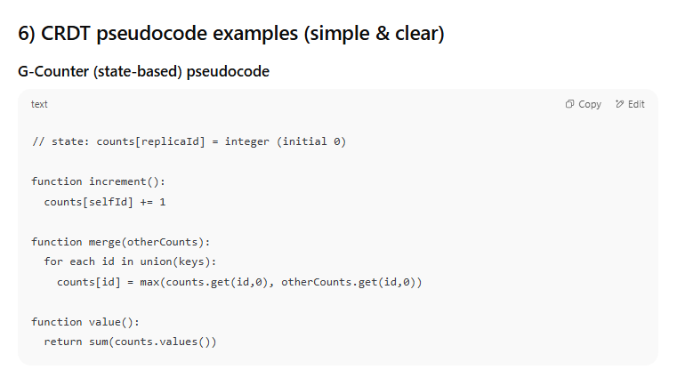

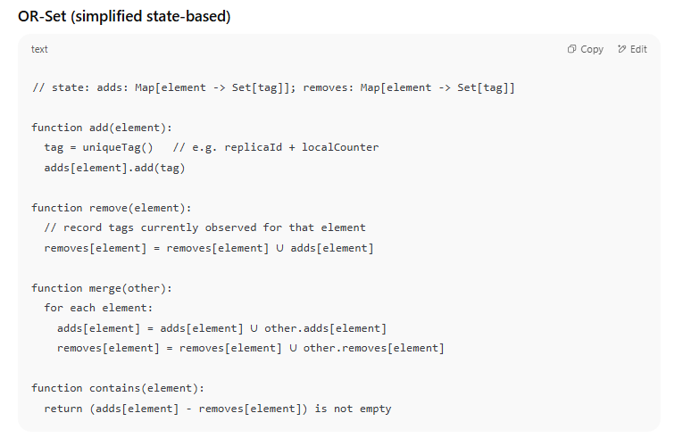

# 7) Practical trade-offs & implementation concerns

**Pros of CRDTs**

- High availability during partitions (local updates succeed).
    
- No coordination / locking across replicas → very low latency.
    
- Convergence is automatic and deterministic.
    

**Cons**

- Increased complexity in reasoning and in code.
    
- Some CRDTs use extra storage: G-Counter requires per-replica slots; OR-Set stores tags & tombstones that grow until GCed.
    
- Not all semantics are easy: e.g., enforcing uniqueness constraints (one like per user) can be easier with a central store or unique index.
    
- Garbage collection / compaction needed for tombstones and vector clocks.
    
- If your app requires strong invariants (e.g., "sum across millions of counters must exactly equal authoritative ledger"), CRDTs might make reconciliation and audits harder.
    

**Practical concerns**

- **GC of tombstones**: you need to know when all replicas have seen a removal to delete tombstones — often done with version vectors or stable checkpoints.
    
- **Replica identifiers**: G-Counter scale issue if each client is a new replica; usually you use region or server nodes as replicas (not every app client).
    
- **Operation delivery**: op-based CRDTs require at-least-once or exactly-once delivery and sometimes causal delivery for correctness.

# 8) Real-world patterns for a “likes” system (recommendations by scale)

1. **Small → medium app**
    
    - Use `user_likes` table with UNIQUE constraint.
        
    - Use a transaction to `INSERT` only-if-not-exists and `UPDATE posts SET likes = likes + 1` (or compute count with aggregate occasionally).
        
    - This gives strong correctness.
        
2. **High throughput single region**
    
    - Use atomic `UPDATE posts SET likes = likes + 1` (or Redis `INCR`) for the counter.
        
    - Record per-user likes in a sharded table or event log for deduplication.
        
    - Periodically reconcile counters with authoritative counts.
        
3. **Geo-replicated / offline / partition tolerant**
    
    - Use **CRDTs (OR-Set or PN-Counter + set of user IDs)** if you need local acceptance and guaranteed convergence.
        
    - Or, use **region-level counters** (per-region increments) merged later (like a PN-Counter per region).
        
    - Keep per-user dedupe (user_likes) as eventual data, or use OR-Set to represent user likes.
        
4. **UI UX trick**
    
    - Optimistically show “liked” immediately on the client, send the event in the background, and reconcile later if the server says otherwise (retry/compensate).

# 9) Concrete examples to drive home the difference

## Scenario A — 10k concurrent like clicks, single DB with `UPDATE ... SET likes = likes+1`

- Each request executes atomic DB increment. DB serializes the increments internally (locks per-row or uses atomic arithmetic). Final count becomes correct (1000 + 10000).
    
- Efficient, simple.
    

## Scenario B — same 10k but you do SELECT→calc→UPDATE (no locks)

- Many clients read the same old value and write back old+1 → huge undercount (lost updates).
    

## Scenario C — geo-distributed with region replication, using OR-Set of userIDs

- Each region records local adds and removes with tags. Even if the regions are partitioned, when they sync the union of adds/removes gives the correct set; count = size of set.
    
- Extra storage per element and need for GC, but robust to partitions and offline.
    

---

# 10) Summary / Practical cheat-sheet

- If you can centralize writes (single DB or region) and want simplicity: **use atomic DB increments or unique user_likes table + transaction**.
    
- If you must be available during partitions or need offline merges: **use CRDTs** (G-Counter for pure increments; OR-Set for per-user likes/unlikes).
    
- For extremely high throughput: combine sharded counters, caches (Redis INCR), and periodic reconciliation.
    
- Always prevent duplicate likes at the _user_ level (UNIQUE constraint or CRDT set semantics).
    
- Be prepared to GC tombstones / vectors in CRDTs — plan compaction early.

# 🏦 The Core Problem

When **multiple users try to read/write the same data at the same time**, we risk:

- **Dirty Reads** (reading uncommitted changes)
    
- **Lost Updates** (two writes overriding each other)
    
- **Inconsistent Reads** (different snapshots)
    

To solve this, databases/systems use **concurrency control**. Two big approaches:

👉 **Pessimistic Locking** → “Assume conflict will happen, so block others immediately.”  
👉 **Optimistic Locking** → “Assume conflicts are rare, so let everyone work and check at the end.”

# 🔹 1. Pessimistic Locking

- **Philosophy:** Be cautious. Lock the data when someone is using it.
    
- **Implementation:** Database places a **lock** (row/table/page-level) so no one else can change it until the transaction finishes.
    

### Example: Bank Transfer 💰

- T1: Reads Account A (₹1000) → locks it.
    
- T2: Wants to read/update Account A → ❌ must wait.
    
- T1: Updates balance to ₹800, commits.
    
- T2: Now can read the updated balance.
    

✅ **Prevents lost updates & dirty reads completely.**  
❌ **But slower** because others are blocked (imagine 1M likes on IG — can’t lock for each).

# 🔹 2. Optimistic Locking

- **Philosophy:** Assume most people won’t collide, so let them proceed. Detect conflicts **only when committing**.
    
- **Implementation:** Usually uses a **version number** or **timestamp** on the row.
    

### Example: Instagram Likes ❤️

- Row: `Post(id=1, likes=100, version=5)`
    
- T1: Reads likes=100, version=5
    
- T2: Reads likes=100, version=5
    

Both increment:

- T1 tries to write → `UPDATE post SET likes=101, version=6 WHERE id=1 AND version=5` ✅ success.
    
- T2 tries to write → `UPDATE post SET likes=101, version=6 WHERE id=1 AND version=5` ❌ fails (version changed).
    

Now T2 must **retry**:

- Re-read likes=101, version=6
    
- Increment → 102
    
- Commit.
    

✅ **High throughput** (good for IG, e-commerce, etc.).  
❌ **More retries** if conflicts are frequent.

# ⚖️ Pessimistic vs Optimistic (Side by Side)

| Feature    | Pessimistic Locking                              | Optimistic Locking                    |
| ---------- | ------------------------------------------------ | ------------------------------------- |
| Philosophy | “Conflicts will happen, block early”             | “Conflicts are rare, check later”     |
| Mechanism  | Locks rows/tables                                | Version/timestamp check               |
| Best for   | High contention (bank accounts, inventory stock) | Low contention (likes, profile edits) |
| Pros       | Strong safety, simple                            | Scales better, less blocking          |
| Cons       | Slows down under load                            | Retries on conflict                   |

# 🔹 Relating Back to Instagram Example

If Instagram used **pessimistic locking**:

- Every like would **lock the post row** until committed.
    
- With millions of likes, the system would **choke** (everyone waiting).
    

If Instagram used **optimistic locking**:

- Everyone can like freely in parallel.
    
- If two likes clash (both read 100), only one succeeds, the other retries.
    
- Efficient at scale.
    

(But at global IG scale, they don’t rely on just DB locks — they often use **CRDTs** and **eventual consistency**,

- **Bank transactions** → Pessimistic locking (safety > speed).
    
- **Instagram likes** → Optimistic locking (speed > blocking).