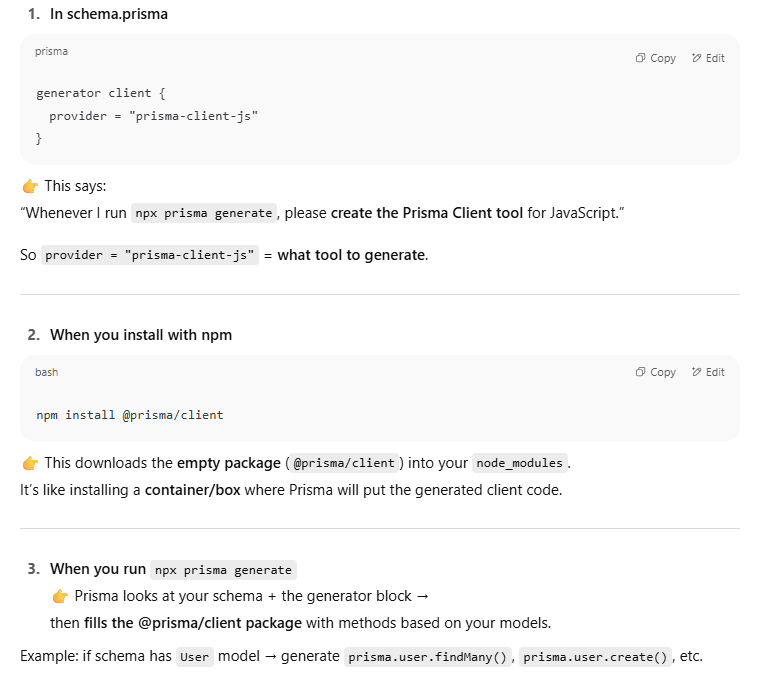
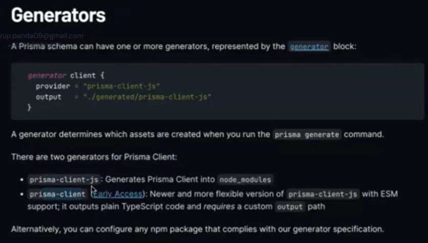
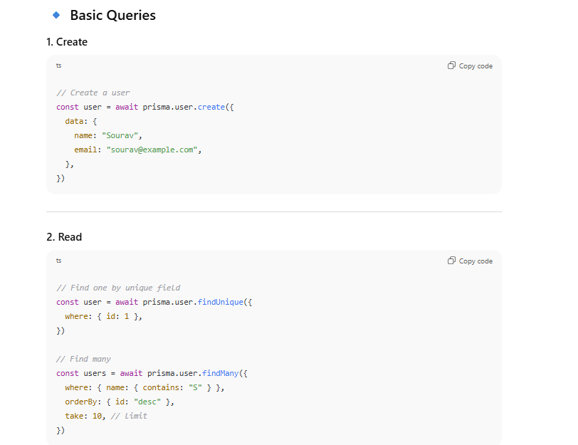
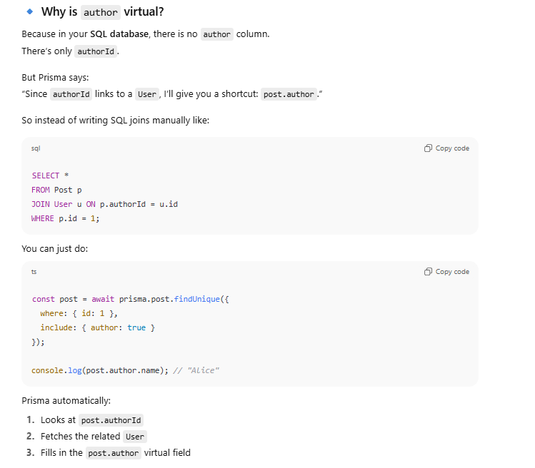
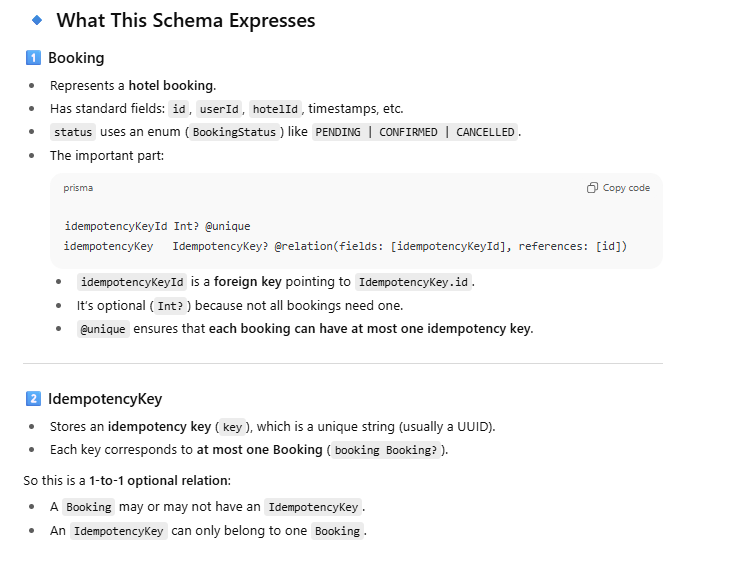

With **Sequelize**, you had to install a separate CLI package (`sequelize-cli`) because the ORM (`sequelize`) itself didn’t bundle a CLI.

But with **Prisma**, it’s different:

- The **`prisma` package** **is the CLI** (it ships with all the commands: `init`, `migrate`, `generate`, `db push`, etc.).
    
- The **`@prisma/client` package** is the runtime client (used in your code to query the DB).


### 🔹 `npm install` vs `npm ci`

Both commands install dependencies, but they serve different purposes:

#### **`npm install`**

- Looks at `package.json`
    
- Tries to satisfy dependencies (may update `package-lock.json` if versions don’t match).
    
- Flexible, good for local development.
    

#### **`npm ci` (Continuous Integration)**

- Stands for **“clean install”**.
    
- Ignores `package.json` version ranges and instead installs **exact versions** from `package-lock.json`.
    
- Deletes `node_modules/` first, then installs everything fresh.
    
- Much faster and more deterministic than `npm install`.
    
- **Fails** if `package-lock.json` and `package.json` are out of sync (so you always get reproducible builds).
    

---

### 🔹 When to use which?

- **`npm install`** → Local development (when adding/removing packages).
    
- **`npm ci`** → CI/CD pipelines, production deployments, Docker builds (when you want _guaranteed consistent installs_).


This is called a connection string and we can give mongo db depending connection string as well here!


1. Every time you run `npx prisma generate`, Prisma updates the code inside `node_modules/@prisma/client` based on your schema.
    
    - That’s why the library looks different for each project.
    
2. At runtime, your app imports from `@prisma/client` and communicates with the database through the Prisma engine.


---

## 🔹 Difference from `prisma` package

- **`prisma`** → CLI tool (for `migrate`, `db push`, `generate`, etc.), usually a **devDependency**.
    
- **`@prisma/client`** → The actual **runtime client library** your app uses to query the DB, must be a **dependency** (needed in prod).
    

---

✅ So to be crystal clear:  
**`@prisma/client` is a generated, project-specific library that lets your app query the database.**


## Why `schema.prisma` exists

The file `schema.prisma` is **the single source of truth** for your database + Prisma setup.  
It tells Prisma 3 things:

1. **Data Model** → Defines your tables/entities (like `User`, `Post`, `Booking`).
    
2. **Datasource** → Defines which database you connect to (MySQL, Postgres, MongoDB, etc.).
    
3. **Generators** → Defines what code Prisma should generate (like the Prisma Client).


```ts
// 1. Datasource
datasource db {
  provider = "mysql"
  url      = env("DATABASE_URL")
}

// 2. Generator
generator client {
  provider = "prisma-client-js"
}

// 3. Data model
model User {
  id    Int    @id @default(autoincrement())
  name  String
  email String @unique
}

```


## 🔹 Why Prisma uses this file (instead of decorators, configs, etc.)

- **Clarity** → One file where you see your entire DB structure.
    
- **Consistency** → From this schema, Prisma can generate:
    
    - SQL migrations (to sync DB structure)
        
    - Prisma Client (runtime library for queries)
        
    - TypeScript types
        
- **Portability** → If you switch DBs (say Postgres → MySQL), you just change `provider = "postgresql"` to `mysql`, instead of rewriting all your app code.
    
- **Less boilerplate** → You don’t manually write migrations, entity classes, or configs. Prisma derives them from the schema.


---
```ts
generator client {
  provider = "prisma-client-js"
}

```
### `client` is just a **name**

- You can call it **anything** you want.
    
- Prisma doesn’t care about the name for functionality — it’s just an identifier for this generator block
### What does `provider` mean here?

👉 It’s just saying:  
**“Which tool should Prisma create when I run `prisma generate`?”**

- If `provider = "prisma-client-js"` → Prisma will create the **Prisma Client for JavaScript/TypeScript**.
That’s the thing you use in code:

```ts
const prisma = new PrismaClient()
prisma.user.findMany()

```




### So does installing `@prisma/client` play a role?

✅ Yes, absolutely.

- It provides the **package space** in `node_modules`.
    
- `prisma generate` then writes the generated code **into that package**.
    

Without installing it → Prisma has nowhere to put the code → error.  
Without generating → the package stays empty → useless.


## 🔹 ✅ So your understanding is right:

- `npx prisma generate` → regenerates `@prisma/client` based on schema.
    
- `@prisma/client` → runtime library that your code imports.
    
- `schema.prisma` → blueprint for your DB + tells Prisma which client to generate.
    
- At runtime → `prisma.user.findMany()` is converted into SQL and executed against your database.





Tailored to the model!


Prisma Client is a generated database client that's tailored to your database schema


Prisma Client is a generated database client that's tailored to your database schema. By default, Prisma Client is generated into the `node_modules/.prisma/client` folder, but we highly recommend [you specify an output location](https://www.prisma.io/docs/orm/prisma-client/setup-and-configuration/generating-prisma-client#using-a-custom-output-path)


### . The `node_modules/prisma` folder

- This is the **Prisma CLI package** (`prisma`).
    
- It contains things like:
    
    - The `prisma` CLI binary → what runs when you do `npx prisma migrate`, `npx prisma generate`, etc.
        
    - Scripts for migrations, code generation, and runtime helpers.
        
    - Its own `package.json`.
        

Think of this as the **toolbox** you use during development.


### The `node_modules/prisma/prisma-client` folder (the one you highlighted)

- This is where the **generator logic** for creating `@prisma/client` lives.
    
- Basically: when you run `npx prisma generate`, Prisma CLI looks at your `schema.prisma` → then uses the code in `node_modules/prisma/prisma-client` to generate the client code → outputs into `node_modules/.prisma/client`.
    
- This part is never imported directly by your app — it’s used internally by the Prisma CLI.


The **`prisma` package** (inside `node_modules/prisma`) is only there so that you can **use the Prisma CLI** (the `npx prisma ...` commands you type in terminal).
This package is **only for development time**. It gives you the tools to:

- format and validate your `schema.prisma`
    
- create and run migrations
    
- generate the `@prisma/client` code


The **`@prisma/client` package** is the one you actually use inside your Node.js/TypeScript app code


### 2. You run `npx prisma generate`

This is where **the magic happens**. Prisma reads your `schema.prisma` and **generates code** inside `node_modules/@prisma/client`.


👉 So **your `schema.prisma` directly affects**:

- What models and methods appear on `prisma.<model>` (e.g. `prisma.user`, `prisma.post`).
    
- The TypeScript types you get in `@prisma/client` (so you get autocomplete, type safety).
    
- The snapshot inside `node_modules/@prisma/client/prisma/`.
    

The **runtime** and **binaries** don’t change with your schema — they’re Prisma’s fixed machinery.

---

In one line:  
Your `schema.prisma` decides **what your generated client can do**; Prisma then injects that knowledge into `@prisma/client` during `prisma generate`.


### 🔹 Prisma Flow (Schema → Generate → Client → DB)
```
You write schema.prisma
   │
   ▼
Run `npx prisma generate`
   │
   ▼
Prisma reads schema
   │
   ├─> Generates TypeScript Client Code
   │       (inside @prisma/client/index.d.ts & index.js)
   │       → prisma.user, prisma.post, etc.
   │
   ├─> Saves a schema snapshot
   │       (inside node_modules/@prisma/client/prisma/schema.prisma)
   │
   └─> Connects to Query Engine binary
           (query-engine-linux, query-engine-windows.exe, etc.)
   │
   ▼
App code: `const prisma = new PrismaClient()`
   │
   ▼
You call: `await prisma.user.findMany()`
   │
   ▼
JS Runtime (in @prisma/client/runtime)
   │
   ▼
Talks to Query Engine binary
   │
   ▼
Query Engine translates request → SQL
   │
   ▼
Database executes SQL
   │
   ▼
Results returned to Query Engine
   │
   ▼
Engine → Prisma Client → Your App

```


So the **runtime** is basically:

- a **translator** (turns Prisma API calls → JSON → Query Engine → JSON → JS objects)
    
- a **manager** (handles batching, middleware, and error handling)


# 🔹 Relation Types in Prisma

There are **3 main kinds** of relations you can define:

1. **One-to-One**
    
2. **One-to-Many**
    
3. **Many-to-Many**
    

Each relation is described with:

- A **relation field** → The property on the model (e.g. `user User`).
    
- The `@relation()` attribute → Defines how models connect.
    
- Optional **foreign key fields** (`userId`, `roomId`) + **reference** columns.

### General Field Syntax in Prisma


First name mostly init hota hai and --name just ek attribute hai bass!!

## **Querying the DB with Prisma Client**.





When you do a **nested write** with `create`, Prisma will actually **insert into the related table as well**.


Instead of creating a new `PrismaClient` everywhere (which can cause problems like too many DB connections in dev with hot-reload), you create a **single shared client instance** and reuse it.


# 🔹 Why This Pattern?

- **Singleton pattern** → Only one `PrismaClient` instance is created.
    
- **Fixes hot reload issues** in Next.js / Express dev mode (where multiple clients could be spawned).
    
- **Cleaner imports** → You import your shared client instead of constructing it again and again.

---


We can import types as well like this! We don't manually create these types!!

# 🔹 What are "generated types" in Prisma?


In short: **generated types = Prisma’s auto-created TypeScript definitions** for models, queries, inputs, enums, and relations, all based on your schema.


```ts
 import { Prisma } from "@prisma/client"; // 40.5k (gzipped: 15.3k)
 export async function createBooking(bookingInput: Prisma.BookingCreateInput) { 
 // Code for creating a booking
  }
```


## RELATIONSHIPS


- The Post table has a foreign key column called `authorId`
- This `authorId` references the primary key `id` in the User table
- This creates a one-to-many relationship (one user can have many posts)

**In Prisma Schema:** The relationship is defined using the `@relation` attribute on the `author` field, which specifies:

- `fields: [authorId]` - the foreign key field in the Post table
- `references: [id]` - the primary key field it references in the User table


- `authorId` → actual column in Post table.
    
- `author` → **virtual field** Prisma gives you, not a real column.  
    It’s basically a way to _navigate_ the relationship.



## 🔹 Key Distinction

- **authorId** → stored in DB as an integer (real column).
    
- **author** → Prisma-generated relation field, resolved dynamically when you query.
    

Think of it as:

- **authorId** = the pointer (foreign key).
    
- **author** = the object that the pointer points to (the actual `User`).


## Types of relations

There are three different types (or [cardinalities](https://en.wikipedia.org/wiki/Cardinality_\(data_modeling\))) of relations in Prisma ORM:

- [One-to-one](https://www.prisma.io/docs/orm/prisma-schema/data-model/relations/one-to-one-relations) (also called 1-1 relations)
- [One-to-many](https://www.prisma.io/docs/orm/prisma-schema/data-model/relations/one-to-many-relations) (also called 1-n relations)
- [Many-to-many](https://www.prisma.io/docs/orm/prisma-schema/data-model/relations/many-to-many-relations) (also called m-n relations)

The following Prisma schema includes every type of relation:

- one-to-one: `User` ↔ `Profile`
- one-to-many: `User` ↔ `Post`
- many-to-many: `Post` ↔ `Category`


# The 3 Relation Types in Prisma

## 1️⃣ One-to-One (1–1)

> One record in table A is linked to **exactly one** record in table B.


# 🔹 Step 5: Summary

|Relation Type|Schema Example|DB Representation|Usage|
|---|---|---|---|
|**1–1**|User ↔ Profile|FK with `UNIQUE`|`user.profile`|
|**1–n**|User ↔ Post|FK in child table|`user.posts`|
|**m–n**|Post ↔ Category|Join table|`post.categories`|

EXAMPLE




# 🔹 The Relation in Action

### Database Structure

- **Booking** table will have a column `idempotencyKeyId`.
    
- **IdempotencyKey** table will have a primary key `id`.
    
- Prisma ensures `Booking.idempotencyKeyId` references `IdempotencyKey.id`.


