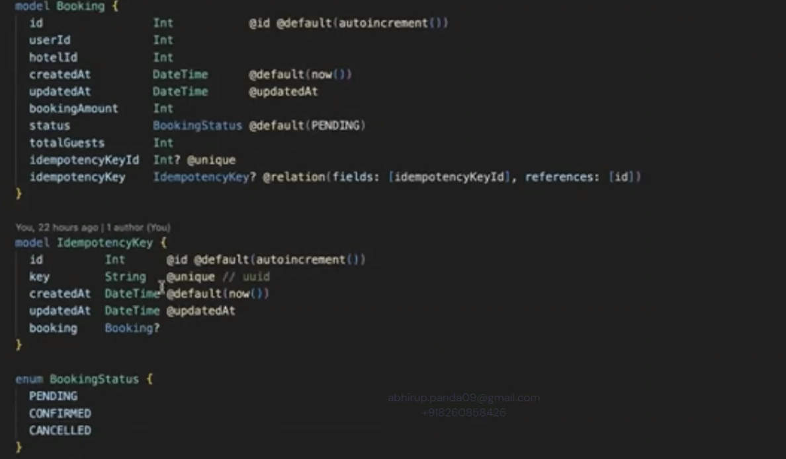
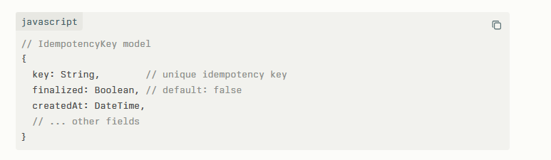

## The Flow

1. **Initial Request**: Client sends booking request with idempotency key
    
    - Check if key exists and is finalized
        
    - If not finalized, proceed with booking creation
        
    - Mark idempotency key as `finalized: false` initially
        
2. **Booking Completion**: When booking is successfully completed
    
    - Update the idempotency key: `finalized: true`
        
    - This prevents any future retries from processing
        
3. **Duplicate/Retry Requests**: If same key comes again
    
    - If `finalized: true` → return the original booking result
        
    - If `finalized: false` → operation might still be in progress