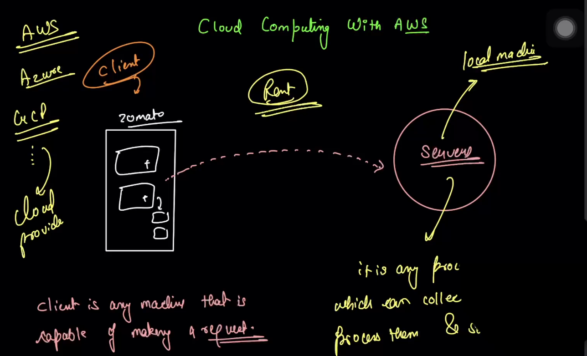
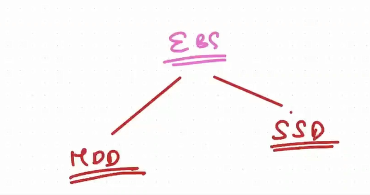
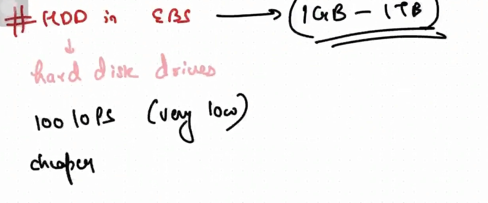

- **Client**: As the note says, a client is any device or application that makes a request for a service. In this diagram, the "Zomato" app on a user's phone is the client. When you browse restaurants or place an order, the app sends a request for information.
    
- **Server**: The server is a powerful computer or program that receives, processes, and responds to requests from a client. The diagram notes that a server's job is to collect and process these requests. For Zomato, servers would handle tasks like fetching restaurant menus, processing payments, and tracking order status. While the diagram mentions a "local machine," in modern applications, these servers are typically hosted in the cloud.

- **Cloud Computing**: The central idea is "renting" computing resources instead of owning and managing them yourself. Companies like Zomato can rent servers, storage, and other services from a cloud provider. This is often more cost-effective and scalable than maintaining their own physical data centers.

- **Cloud Providers**: The diagram lists the three major public cloud providers:
    
    - **AWS**: Amazon Web Services
        
    - **Azure**: Microsoft Azure
        
    - **GCP**: Google Cloud Platform

## How It All Works Together

The diagram illustrates a typical client-server interaction within a cloud environment:

1. A user opens the **Zomato** app (the client) on their phone.
    
2. The app sends a request over the internet. For instance, you might tap to see nearby restaurants.
    
3. This request travels to Zomato's **servers**, which are not on a local machine but are "rented" from a **cloud provider** like AWS.
    
4. The server processes the request, retrieves the necessary data (e.g., a list of restaurants), and sends it back to the Zomato app on your phone, where it is displayed to you.

## What is the "Cloud"?

At its core, "cloud computing" is the practice of using a network of remote servers hosted on the internet to store, manage, and process data, rather than using a local server or a personal computer.

Think of it like electricity. You don't own your own power plant to light your home; you simply plug into a grid and pay for what you use. Similarly, instead of buying and maintaining your own powerful servers and data storage, you can "plug into" the cloud and rent these resources from a provider.

These remote servers are housed in massive, secure buildings called **data centers**, which are owned and operated by companies like Amazon (AWS), Microsoft (Azure), and Google (GCP). These data centers contain immense computing power that can be accessed from anywhere with an internet connection.

## Key Characteristics

- **On-Demand Service**: You can access computing resources like processing power and storage whenever you need them, without needing to go through a lengthy procurement process.
    
- **Pay-As-You-Go**: You typically only pay for the services you actually consume. This shifts the cost from a large upfront investment in hardware (capital expense) to a more manageable operational expense.
    
- **Scalability and Elasticity**: Cloud services allow you to easily scale your resources up or down based on your needs. If your application suddenly becomes popular, you can instantly add more server capacity to handle the traffic, and then scale back down when the traffic subsides.
    
- **Broad Network Access**: Services are accessible over the internet from a wide range of devices, such as laptops, smartphones, and tablets.

## Cloud Computing: The Core Idea

Cloud computing is a model for delivering a wide range of technology services over the internet. Instead of hosting your own software or storing data on a local server or personal computer, you can access these same services from a "cloud" provider. This allows you to access, store, and manage resources like databases, servers, software, and networking on demand.

## Key Characteristics Explained

The image highlights three core characteristics that define how cloud computing works:

- **On-Demand Service**: This principle means users can automatically provision computing resources as needed without requiring human interaction with the service provider. For example, a developer can spin up a new virtual server in minutes through a web portal, rather than waiting days or weeks for a physical server to be ordered and installed. This self-service capability provides immense agility and speed.
    
- **Resource Pooling**: Cloud providers serve multiple customers (or "tenants") using a shared pool of computing resources, such as storage, processing power, memory, and network bandwidth. These resources are dynamically assigned and reassigned according to demand. While you don't know the exact physical location of the server running your application, the provider ensures that resources are available from their vast, collective infrastructure. This model is what allows for massive economies of scale, making cloud services affordable.
    
- **Measured Service**: Cloud systems automatically monitor, control, and optimize resource usage with a metering system. This allows the provider to track what each customer is consuming (e.g., storage used, compute hours, bandwidth transferred) and bill them accordingly, much like a utility company bills for water or electricity. This "pay-as-you-go" model provides transparency for both the provider and the consumer and ensures that you only pay for what you actually use

- **AWS (Amazon Web Services)**: As the drawing correctly shows, AWS stands for Amazon Web Services. It is a subsidiary of Amazon that provides on-demand cloud computing platforms and APIs. Launched in 2006, it is the oldest and largest cloud provider by market share, offering a comprehensive and widely adopted suite of cloud services.
    
- **Azure**: This refers to Microsoft Azure, the cloud computing service created by Microsoft. It is the second-largest cloud provider and offers a wide range of services for building, testing, deploying, and managing applications and services through Microsoft-managed data centers.
    
- **GCP (Google Cloud Platform)**: This is the cloud computing platform offered by Google. It runs on the same internal infrastructure that Google uses for its end-user products, such as Google Search, Gmail, and YouTube. It is the third-largest provider in the cloud market.

- **Region:**  
    In cloud computing, a region is a specific geographic area where a cloud provider has one or more data centers. Each region is physically separated from others to ensure redundancy and disaster recovery. Examples in the diagram include:
    
    - Ireland
        
    - Asia Pacific – with Sydney and Mumbai as distinct region locations within Asia Pacific.

**Availability Zone:**  
Within each region, there are multiple "Availability Zones." Each availability zone is essentially a separate physical location—often a distinct data center or even a group of data centers within a region. These zones are isolated from each other to prevent a single point of failure, but they are close enough to offer low-latency connectivity for high availability

- **Why this matters:**  
    By spreading resources across different regions and availability zones, cloud services can ensure better reliability, performance, and disaster recovery. For example, you could host an application in the Mumbai region and use multiple availability zones to make sure your app stays online even if a single data center faces issues.

## Region: US East (N. Virginia)

- **Region Name**: US East (N. Virginia)
    
- **Region Code**: `us-east-1`
    

This is one of the largest and oldest AWS regions. It's a specific geographic location on the east coast of the United States where AWS has established a major presence.

## Availability Zones within this Region

An Availability Zone (AZ) is a distinct physical data center (or group of data centers) within a region. They are isolated from one another to prevent a single point of failure but are connected through low-latency links.

The **US East (N. Virginia)** region currently has **six** Availability Zones. These are identified by appending a letter to the region code :

- `us-east-1a`
    
- `us-east-1b`
    
- `us-east-1c`
    
- `us-east-1d`
    
- `us-east-1e`
    
- `us-east-1f`
    

## Practical Example

Imagine you are launching a web application for customers primarily in North America. You might choose to host it in the `us-east-1` region for low latency to your user base.

To ensure your application is highly available and can withstand a data center failure, you wouldn't run it in just one AZ. Instead, you would configure your application to run across multiple Availability Zones, such as `us-east-1a`, `us-east-1b`, and `us-east-1c`.

If a power outage or other issue were to take down the entire `us-east-1a` data center, your application would continue to run from the servers in `us-east-1b` and `us-east-1c`, ensuring minimal disruption for your users.

## 1️⃣ What is AWS EC2?

**EC2 = Elastic Compute Cloud**.

- **Elastic** → It can **scale up or down** depending on your needs. For example, if your app suddenly gets more users, EC2 can give you more computing power.
    
- **Compute** → This is the **processing power**. Think of it like the brain of a computer: CPU, RAM, storage — all the things a computer needs to run programs.
    
- **Cloud** → Means it’s **virtual**. You don’t need a physical machine. You can access it from anywhere over the internet.
    

💡 **Analogy:**  
Think of EC2 as renting a computer in the cloud. You don’t buy it, you just use it whenever you need.

## 2️⃣ Features of AWS EC2

Here’s what makes EC2 special:

1. **Virtual Computing Resources**
    
    - You get virtual computers called **instances**.
        
    - You can choose CPU, RAM, storage, and network bandwidth as per your need.
        
2. **Different Configurations**
    
    - EC2 instances come in **various types**: small, medium, large, extra-large, etc., depending on what your app needs.
        
    - Example: A tiny app might need just 1 CPU + 1GB RAM, but a heavy app like a game server might need 16 CPUs + 64GB RAM.
        
3. **Secure Access**
    
    - You can securely connect to your EC2 instance using **SSH** (for Linux) or **RDP** (for Windows).
        
    - You can control who has access using **security groups** (like firewall rules).
        
4. **Pre-configured AMIs (Amazon Machine Images)**
    
    - AMI = Pre-made image of an operating system + software.
        
    - Example: If you want Ubuntu with Python installed, you can just choose an AMI and start your instance immediately

## 3️⃣ EC2 Pricing Options

AWS gives you multiple ways to pay:

1. **On-Demand**
    
    - Pay **per hour or per second** for the instance you use.
        
    - Flexible, no commitment.
        
    - Good for short-term tasks or testing.
        
2. **Reserved Instances**
    
    - You **reserve** an instance for 1–3 years.
        
    - Cheaper than On-Demand if you know you’ll use it for long-term projects.
        
3. **Spot Instances** (extra)
    
    - Very cheap, but AWS can **take it back** if they need the capacity.
        
    - Good for tasks that can be interrupted, like batch processing.
        

---

## 4️⃣ How EC2 Works (Step by Step)

1. **Choose an AMI** → Pick the OS you want (Linux, Windows, Ubuntu, etc.).
    
2. **Choose an Instance Type** → Pick CPU, RAM, storage.
    
3. **Configure Instance** → Network, security groups, key pair (for secure login).
    
4. **Launch Instance** → AWS spins up your virtual computer in the cloud.
    
5. **Connect & Use** → SSH/RDP into it and start running your app.

## 5️⃣ Why EC2 is Useful

- You don’t need to buy physical hardware.
    
- You can scale easily when traffic increases.
    
- Pay only for what you use (flexible billing).
    
- Access it from anywhere in the world.
    

---

💡 **Simple Analogy for EC2:**

- Think of it like **renting a car** instead of buying one:
    
    - You choose the model (instance type).
        
    - You pay only for the time you use it (pricing options).
        
    - You can upgrade or downgrade easily (elastic)

## **EBS = Elastic Block Store**

- **Purpose:** It’s **storage for EC2 instances** in AWS.
    
- Think of it as a **hard drive in the cloud** that you can attach to your virtual computer (EC2).
    

💡 Analogy:

- **EC2** → Your computer (CPU + RAM)
    
- **EBS** → Hard drive where all your files, apps, and data are stored

### Key Points:

1. **Persistent storage**
    
    - Data stays even if your EC2 instance is stopped or restarted.
        
2. **Block storage**
    
    - Works like a real hard drive. You can create volumes, format them, mount them to your instance.
        
3. **Scalable**
    
    - You can increase its size anytime without losing data.
        
4. **Different types** (based on speed & cost)
    
    - **SSD (fast)** → For apps & databases
        
    - **HDD (cheaper)** → For logs, backups, or less-used data
        
5. **Can be encrypted**
    
    - Your sensitive data can be protected.

**Simple analogy:**

- EC2 is your laptop
    
- EBS is the external SSD you plug in
    
- You can detach it, attach it to another laptop, and your data is still there

