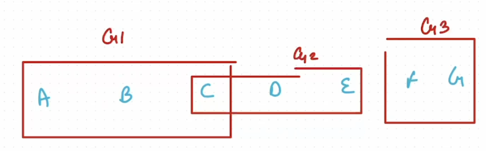
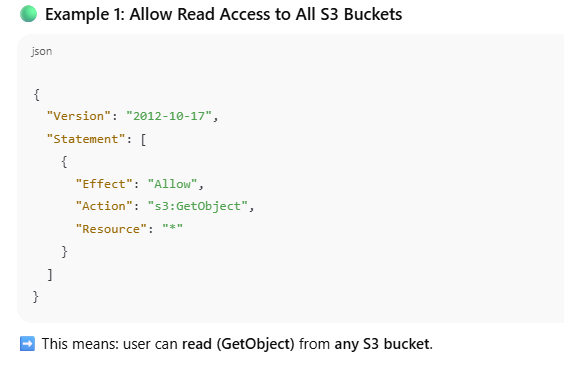
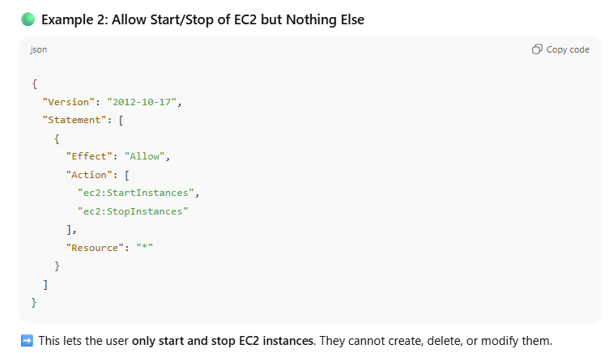
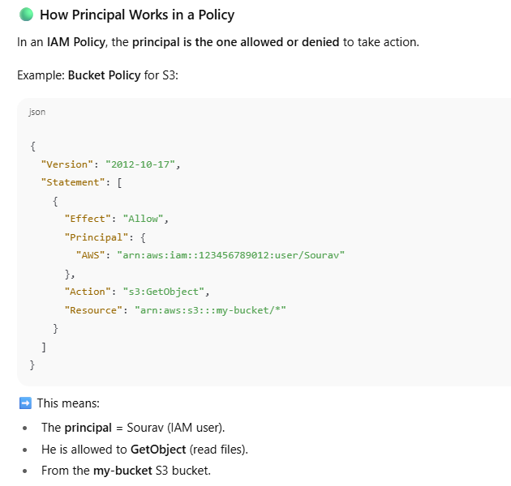

In **AWS**, **IAM** stands for **Identity and Access Management**.

👉 Think of IAM as the **security guard** of AWS:  
It decides **who** can enter (users, apps, services) and **what** they can do (permissions, roles, policies).

### 🔑 Key Concepts in IAM

1. **Users**
    
    - Individual identities (like employees, developers).
        
    - Each user can have login credentials (username/password) and access keys.
        
2. **Groups**
    
    - A collection of users.
        
    - Example: A "Developers" group with certain permissions. Any user added to this group automatically inherits those permissions.

3. **Roles**
    
    - Temporary identities for AWS services or users.
        
    - Example: An EC2 instance can assume a role to access S3 without needing long-term access keys

- **IAM helps you manage users** in your organization. You can create accounts for different team members.
    
- You can **control what each user can or cannot do** by assigning permissions (for example: only view S3 data, or full admin access).
    
- IAM lets you **define roles**, which are special permission sets that users or AWS services can temporarily assume.
    
- Users can access the **AWS Management Console** (graphical interface) or APIs/CLI, but their **level of access** depends on IAM settings.

### 🟢 What is a Policy?

A **policy** in AWS IAM is like a **set of rules written in JSON** that says:

- **Who can do what, on which resources.**
    

Think of it as a **permission slip**.  
Example: _“Sourav can read the S3 bucket called my-bucket.”_

### 🟢 Main Parts of a Policy

A policy is made up of **statements**, and each statement usually has 4 key parts:

1. **Effect** → Allow or Deny
    
    - Do you want to _permit_ or _block_ something?
        
2. **Action** → What actions are allowed/denied
    
    - Example: `"s3:PutObject"` (upload to S3), `"ec2:StartInstances"` (start an EC2).
        
3. **Resource** → Which AWS resource it applies to
    
    - Example: a specific bucket, instance, or `*` (all resources).
        
4. **Condition** (optional) → Add extra rules
    
    - Example: allow access **only if** the user is logging in from a certain IP.

- **Policy = JSON rules**
    
- **Effect = Allow/Deny**
    
- **Action = What you can do**
    
- **Resource = Where you can do it**
    
- **Condition = When/How you can do it (optional)**
    

---

👉 In short:  
Policies are just **permissions written in JSON** that IAM uses to decide if a request should be allowed or denied.

### 🟢 What is a Principal?

A **Principal** is the **“who”** in AWS.  
It’s the **entity making a request** to use AWS resources.

👉 Example:

- A **user** logging into AWS Console.
    
- An **application** running on EC2 that wants to read from S3.
    
- An **AWS service** like Lambda calling DynamoDB.
    

All of these are **principals**.

### 🟢 Types of Principals

1. **IAM User** – e.g., _Sourav logs in to AWS to manage EC2_.
    
2. **IAM Role** – e.g., _an EC2 instance assumes a role to access S3 without storing keys_.
    
3. **AWS Services** – e.g., _Lambda service itself can act as a principal_.
    
4. **Federated Users** – users from outside (Google, Active Directory, etc.) who sign in via **SSO** or **STS**.
    
5. **Root User** – the main account owner (highest privilege principal).

### 🟢 Real-Life Analogy

Imagine a **company office**:

- **Principal** = the person (employee, contractor, or even a cleaning robot).
    
- **Policy** = the office rules (what doors you can open, what files you can see).
    
- **Resource** = rooms, computers, or files in the office.
    

The security guard (IAM) checks: _“Who are you (Principal)? What can you do (Policy)? On what thing (Resource)?”_

---

👉 In short:  
**Principal = The “WHO” that makes a request to AWS.**  
**Policy = The “WHAT” that defines allowed/denied actions.**  
**Resource = The “WHERE” the action applies.**

### ⚙️ How IAM Works (Simple Flow)

1. A **principal (user/app/service)** tries to use AWS.
    
2. IAM checks their **identity** (login, access keys, role assumption).
    
3. IAM checks the **policies attached** to them.
    
4. IAM **allows or denies** the request.
    

---

### 🚀 Why IAM is Important

- **Security**: Control access at a fine-grained level.
    
- **Least Privilege**: Users/services get only the permissions they need, nothing more.
    
- **Centralized Control**: One place to manage all identities and permissions across AWS.
    
- **Scalability**: Works for individuals, teams, or huge organizations.
    

---

👉 In short:  
**IAM = AWS’s way of managing who can do what, where, and how inside your cloud environment.**

### 🔑 Features of IAM

1. **Free Service**
    
    - AWS IAM does **not cost extra**.
        
    - You can create users, groups, roles, and policies without paying.
        
    - You only pay for the AWS resources the users access (like S3, EC2).
        
2. **Eventually Consistent**
    
    - When you make a change in IAM (like updating permissions), it may take a few seconds to reflect everywhere in AWS.
        
    - Example: If you remove someone’s access, it might still work for a short while before fully applying across all regions.
        
3. **Provide Temporary Access**
    
    - Using **IAM Roles** or **STS (Security Token Service)**, you can give short-term access.
        
    - Example: A contractor needs access for 2 hours → you can give them temporary credentials that expire automatically.
        
4. **Multi-Factor Authentication (MFA)**
    
    - Adds an **extra layer of security** beyond just username & password.
        
    - Example: After logging in, AWS may ask for a 6-digit OTP from your phone authenticator app.
        
5. **Granular Permissions**
    
    - IAM allows **fine-grained control**.
        
    - Example: Instead of giving “full S3 access”, you can allow a user to only **read one specific bucket** or even **just one folder inside the bucket**.
        
6. **Network Control**
    
    - You can restrict access based on **network conditions** (like IP address, VPC, or region).
        
    - Example: Allow login to AWS Console **only from your office IP** and deny if someone tries from another country.

