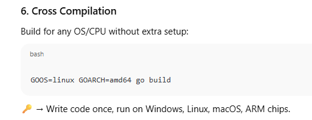
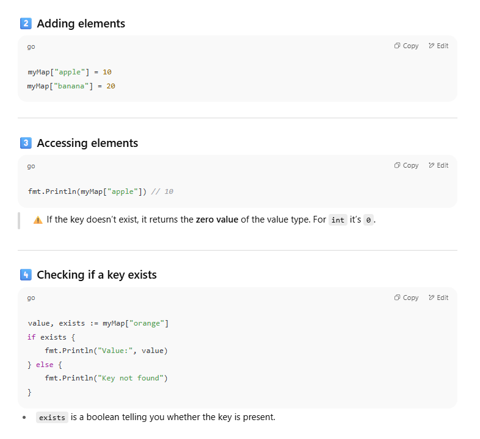

# 1. **Syntactically Simpler**

👉 Go keeps the language very small on purpose.

- Only one loop → `for` (no `while`, no `do-while`).
    
- No classes, no inheritance (uses `struct` + `interfaces` instead).
    
- No `try/catch` → errors are returned like normal values.
    
- Keywords are very few → easier to memorize.


# 2. **Compiled Language**

👉 Go turns your code into a **single binary** (machine code) with `go build`.

- Runs directly on the computer (no interpreter).
    
- Faster than Python/JavaScript.
    
- Compilation is **very fast** → designed for Google-scale projects.

```go
go build main.go   # produces "main" executable
./main             # run it
```
🔑 **Why important**:

- Speed like C, but simplicity like Python.
    
- One file → easy to ship in Docker, servers, cloud

# 3. **Concurrency Support (Go Routines)**

👉 Concurrency = doing many things _at the same time_.

- In Java: a **thread** is heavy (uses MBs of memory each).
    
- In Go: a **goroutine** is lightweight (KBs only).
    
- You create one with just `go` keyword.

```go
func printMsg(msg string) {
    fmt.Println(msg)
}

func main() {
    go printMsg("Hello from goroutine") // runs concurrently
    fmt.Println("Hello from main")
}

```


🔑 **Why important**:

- Go can handle **100,000+ concurrent tasks** easily.
    
- Perfect for servers, chat apps, APIs, real-time systems.

# 4. **Statically Typed**

👉 Types are checked **before running** (at compile time).

- Python/JS → type errors happen when you run the program.
    
- Go → type errors caught early.
    
- Still convenient with type inference (`:=`).


```go
var x int = "hello" // ❌ compile error

y := 10  // compiler knows y is int

```

🔑 **Why important**:

- Fewer runtime bugs.
    
- Safer for large codebases.


# 5. **Garbage Collection Support**

👉 Go automatically frees unused memory.

- In C, you must `free()`.
    
- In C++, you must `delete`.
    
- In Go → no need, the garbage collector cleans for you.

```go
func main() {
    data := make([]int, 1000000) // big slice
    // after function ends, GC cleans it
}

```

🔑 **Why important**:

- Memory safe by default.
    
- Great for long-running servers (no leaks).





### 7. **Standard Library Power**

Go comes with **batteries included**:

- `net/http` → web servers
    
- `encoding/json` → JSON
    
- `os`, `io`, `strings` → utilities
    

✅ Example (tiny web server):

```go
package main
import "net/http"

func main() {
    http.HandleFunc("/", func(w http.ResponseWriter, r *http.Request) {
        w.Write([]byte("Hello World"))
    })
    http.ListenAndServe(":8080", nil)
}

```


### 8. **Built-in Tooling**

Go has official tools:

- `go fmt` → format code
    
- `go vet` → static check
    
- `go test` → testing
    
- `go mod` → dependency management

```go
go fmt ./...   # auto format
go test ./...  # run tests

```


### 9. **Minimalism as Philosophy**

👉 Go avoids “feature overload.”

- No multiple ways of doing the same thing.
    
- Code looks similar across projects.
    
- `gofmt` makes sure **everyone’s code is formatted the same way**.
    

---

⚡ **Summary in simple words**:

- Go = simple, fast, safe, built for concurrency.
    
- Small language, big power.
    
- You don’t fight the language, you build things.


```go
package main

import "fmt"

func fun() {
    fmt.Println("Hello, 世界")
}

func main() {
    fun()
}

```


### The use of `package main`

In Go, **every file starts with a package declaration**.

- `package xyz` → means “this code belongs to package xyz.”
    
- Packages are either:
    
    1. **Libraries** (reusable, to be imported somewhere else)
        
    2. **Executable programs** (can be compiled & run directly)
        

👉 `package main` is **special**.  
It tells Go:

> “This package is an **executable program**. When compiled, produce a binary that can run. And inside it, look for a `func main()` as the starting point.”

```go
// prog.go
package main

import "fmt"

func main() {
    fmt.Println("I am runnable!")
}

```

➡️ When you run `go run prog.go`, Go compiles this into a program and executes `main()`.

### If you don’t use `package main`

```go
// lib.go
package mylib

import "fmt"

func Hello() {
    fmt.Println("Hello from a library")
}

```

➡️ If you try `go run lib.go`, Go will say:  go run: cannot run non-main package

Because `mylib` is a **library**, not an executable.  
You can only use it by **importing it** inside a `package main`


✅ So the **use of `package main`** is:

- Without it → your file is just a library.
    
- With it → your file can be compiled into an executable program that starts at `func main()`.


In Go, the **only way** to tell the compiler _“build me an executable program”_ is by writing-  package main

### Why?

- Any other package name (like `package foo`, `package math`, `package utils`) = Go treats it as a **library package**. It cannot be run directly.
    
- Only `package main` = Go knows _“okay, I should build a binary that can actually run.”_
    

And inside that special `package main`, Go looks for:

```go
func main() { ... }

```
as the **entry point**.

- `package main` = marks the package as an executable program.
    
- `func main()` = marks the function where execution begins.
    
- **This is the only combination that Go will run directly.**

**`import "fmt"`**

- `fmt` is a standard library package for formatted I/O (print, scan, etc).
    
- `import` brings that package into this file so you can call `fmt.Println`, `fmt.Printf`, etc.


**`func fun() { ... }`**

- `func` declares a function. Syntax: `func name(params) (returns) { body }`.
    
- `fun` here has no parameters and no return values.
    
- Inside it calls `fmt.Println("Hello, 世界")`:
    
    - `Println` prints the string and adds a newline.
        
    - `世界` are Unicode characters — Go strings are UTF-8, so they print fine.


**`func main() { fun() }`**

- This `main` function is the **entry point** of the program — executed first when you run the binary.
    
- Signature must be exactly `func main()` (no args, no returns). If it’s missing, Go complains.
    
- It calls `fun()`, so the program prints the message via that call.


# 2) The `func` keyword and functions in detail

- `func` = function. You can have:
    
    - `func add(a int, b int) int { return a + b }`
        
    - Multiple returns: `func div(a, b int) (int, error) { ... }`
        
    - Methods (with receivers): `func (p *Person) Greet() { ... }`
        
- Functions can be declared at package level (like above) or nested (anonymous funcs).


### `go run helloworld.go`

- Compiles the file(s) to a **temporary** binary and runs it immediately.
    
- Convenience: good for quick testing.
    
- Under the hood it compiles (+ links) then executes the produced temp binary, then deletes it afterward.
    
- Output you saw: `Hello, 世界`.


### `go build helloworld.go`

- Compiles and links into a real executable file **in the current directory**.
### `./helloworld`

- Runs the executable file just created by `go build`.


### **Basic integer types**

Go provides multiple integer types to give **control over size, signedness, and memory usage**.

| Type      | Size               | Signed/Unsigned | Notes                                                                    |
| --------- | ------------------ | --------------- | ------------------------------------------------------------------------ |
| `int`     | 32 or 64           | signed          | Default integer type. Use unless you need exact size.                    |
| `int8`    | 8 bits             | signed          | Stores -128 to 127.                                                      |
| `int16`   | 16 bits            | signed          | Stores -32,768 to 32,767.                                                |
| `int32`   | 32 bits            | signed          | Stores -2,147,483,648 to 2,147,483,647. Also used for `rune`.            |
| `int64`   | 64 bits            | signed          | Stores very large integers.                                              |
| `uint`    | 32 or 64           | unsigned        | Only positive numbers (0 and up). Default unsigned integer.              |
| `uint8`   | 8 bits             | unsigned        | Stores 0–255. Alias: `byte`.                                             |
| `uint16`  | 16 bits            | unsigned        | Stores 0–65,535.                                                         |
| `uint32`  | 32 bits            | unsigned        | Stores 0–4,294,967,295.                                                  |
| `uint64`  | 64 bits            | unsigned        | Stores very large positive integers.                                     |
| `uintptr` | platform-dependent | unsigned        | Used to store **memory addresses**. Rarely needed in normal programming. |

### **Why so many integer types?**

1. **Memory efficiency:**
    
    - If you know a value will only ever be small (e.g., 0–255), `int8` or `uint8` uses less memory than `int64`.
        
2. **Data compatibility:**
    
    - Sometimes you interact with **binary data, file formats, or network protocols** that require exact integer sizes. For example, a `uint16` is exactly 2 bytes.
        
3. **Signed vs unsigned:**
    
    - Signed (`int`) can store negative numbers.
        
    - Unsigned (`uint`) only stores positive numbers but has a larger maximum value for the same number of bits.
        
4. **Platform independence:**
    
    - `int` and `uint` change size depending on your system (32-bit vs 64-bit). This makes code simpler unless you need exact sizes.


 In go we don't use ; to end the statements!!

## **Multiple ways** to declare variables depending on your need.


## **1. Using `var` with explicit type**
```go
package main

import "fmt"

func main() {
    var age int
    var name string

    age = 25
    name = "Sourav"

    fmt.Println(age, name)
}

```


- Here, you declare the type explicitly (`int`, `string`, etc.).
    
- You can assign a value later.


## **2. Using `var` with initial value (type inferred)**
```go
package main

import "fmt"

func main() {
    var age = 25       // Go automatically infers this is int
    var name = "Sourav" // Go infers string

    fmt.Println(age, name)
}

```

- Type is **inferred from the value**, so you don’t need to write it explicitly.

## **3. Short variable declaration (`:=`)**
```go
package main

import "fmt"

func main() {
    age := 25
    name := "Sourav"

    fmt.Println(age, name)
}

```


- `:=` is **only inside functions**.
    
- Go automatically infers the type.
    
- Most commonly used because it’s short and clean.


## **4. Declaring multiple variables at once**
```go
package main

import "fmt"

func main() {
    var x, y, z int        // all 3 are int
    var a, b, c = 1, 2, 3  // type inferred
    p, q := "hello", "world"

    fmt.Println(x, y, z, a, b, c, p, q)
}

```

## **5. Declaring a block of variables (like your `int, float` example)**

```go
package main

import "fmt"

func main() {
    var (
        age    int
        name   string
        height float64
    )

    age = 25
    name = "Sourav"
    height = 5.9

    fmt.Println(age, name, height)
}

```

- This is useful when you have **many variables** to declare at once.


1. `var` → can declare outside or inside functions.
    
2. `:=` → only inside functions.
    
3. Type can be **explicit** or **inferred**.
    
4. Multiple variables can be declared **together**.


### **Rule of thumb**

1. If you **give a type but no value**, Go sets the **zero value**.
    
2. If you **don’t give a type and don’t give a value**, Go **throws an error**.
    
3. If you **don’t give a type but give a value**, Go infers the type.


Shorthand is only for var!!

 


## Go has a single loop construct, but it’s **very flexible**.
## **1️⃣ The `for` loop**

In Go, `for` is the **only loop keyword**. You can use it in several ways.

### **a) Traditional for loop**

```go
package main

import "fmt"

func main() {
    for i := 0; i < 5; i++ {
        fmt.Println(i)
    }
}

```


### **b) For loop as a while loop**

```go
package main

import "fmt"

func main() {
    i := 0
    for i < 5 {   // no init, no post
        fmt.Println(i)
        i++
    }
}

```

- This works **like a while loop** in other languages.

### **c) Infinite loop**

```go
package main

import "fmt"

func main() {
    i := 0
    for {  // no condition = infinite loop
        fmt.Println(i)
        i++
        if i == 5 {
            break  // exit loop
        }
    }
}

```


- Use `break` to exit.
    
- Use `continue` to skip the rest of the loop and go to next iteration.


### Key points about loops in Go

1. Go only has `for` → but flexible enough for all loops.
    
2. `break` → exit loop early.
    
3. `continue` → skip current iteration.
    
4. `range` → easy way to loop over slices, arrays, maps, strings.
    
5. Infinite loops are also done with `for { }`.


### ✅ Key points

1. Multiple files can have `package main`.
    
2. Only **one main function per package**.
    
3. Use other files for **helper functions, types, constants, variables**.


## **1️⃣ What is `range`?**

- `range` is a **special keyword in Go** that lets you **loop over a collection** like:
    
    - Arrays
        
    - Slices
        
    - Maps
        
    - Strings
        
    - Channels
        
- When you use `range`, Go **automatically gives you the index and value** at each step of the loop.


## **1️⃣ What is a slice?**

- A **slice** is a **dynamically-sized, flexible view into an array**.
    
- Think of it as a **window on an array**.
    
- Unlike arrays, slices **can grow or shrink**.
    

**Key points:**

|Feature|Slice|Array|
|---|---|---|
|Size|Dynamic|Fixed|
|Declaration|`[]int`|`[3]int`|
|Resizable|Yes|No|
|Built-in functions|Yes (`len`, `append`)|Limited|


**What `range` does in general:**

- When used on a **slice/array**, `range` returns the **index** of each element. You can also get the **value** if you write:
    
    `for i, val := range nums {     fmt.Println(i, val) }`


## **2️⃣ Slices (Go’s “vector”)**

A **slice** is a **dynamic, flexible view over an array**. It can grow and shrink. Internally, it **points to an array**.

### **Creating a slice**


```go
original := []int{1, 2, 3}         // Step 1
copySlice := make([]int, len(original))  // Step 2
copy(copySlice, original)          // Step 3
copySlice[0] = 100                 // Step 4
fmt.Println(original)              // Step 5
fmt.Println(copySlice)             // Step 6

```


In Go, there are a few ways to take input from the terminal. The most common is using the **`fmt` package**, and for more complex input you can use **`bufio` + `os`**


## MAPS





## FUNCTIONS 


## POINTERS


Pointers exist for **specific reasons in programming**, and Go is no exception


Think of pointers like **“the remote control to the actual data”**:

- Without it, you only get a **copy of the data**, like photocopying a book.
    
- With it, you can **change the original book** without making copies.


