### Go **doesn’t have classes** in the traditional OOP sense like Java or C++. Instead, Go uses **structs** and **methods** to achieve similar functionality. Think of structs as “blueprints for objects” and methods as “functions tied to those objects.”


## **1️⃣ Structs — Go’s version of classes**

A `struct` is a composite data type that groups together variables (called **fields**) under a single name.

```go
package main

import "fmt"

// Define a struct
type Person struct {
    Name string
    Age  int
}

func main() {
    // Create an instance of Person
    p1 := Person{Name: "Sourav", Age: 26}
    
    fmt.Println(p1.Name) // Sourav
    fmt.Println(p1.Age)  // 26
}

```


Here:

- `Person` is like a **class**.
    
- `Name` and `Age` are **fields**.
    
- `p1` is like an **object/instance** of the class


In Go, structs are just **data containers**, like plain objects in JS, but the way you attach “methods” is a bit different. You **don’t define methods inside the struct itself** like you would in JS classes. Instead, you define methods **separately** but attach them to the struct using a **receiver**.

```go
type Product struct {
    name    string
    price   int
    company string
}

func main() {
    p := Product{
        name:    "iPhone 15 Pro",
        price:   100,
        company: "Apple Inc.",
    }
fmt.Println("Product Name:", p.name)


```

1. `type Product struct { ... }`
    
    - This defines a **struct** named `Product`.
        
    - A struct is like a **blueprint for an object**.
        
2. Inside the struct:
    
    - `name string` → the product has a `name` field of type `string`.
        
    - `price int` → the product has a `price` field of type `int`.
        
    - `company string` → the product has a `company` field of type `string`.
        

Think of this as a **class with three properties**.


- `func main()` → entry point of a Go program.
    
- `p := Product{...}` → creates an **instance** of the `Product` struct.
    
    - `p` is now a variable holding the product object.
        
    - We assign values to each field using **field names**:
        
        - `name: "iPhone 15 Pro"`
            
        - `price: 100`
            
        - `company: "Apple Inc."`

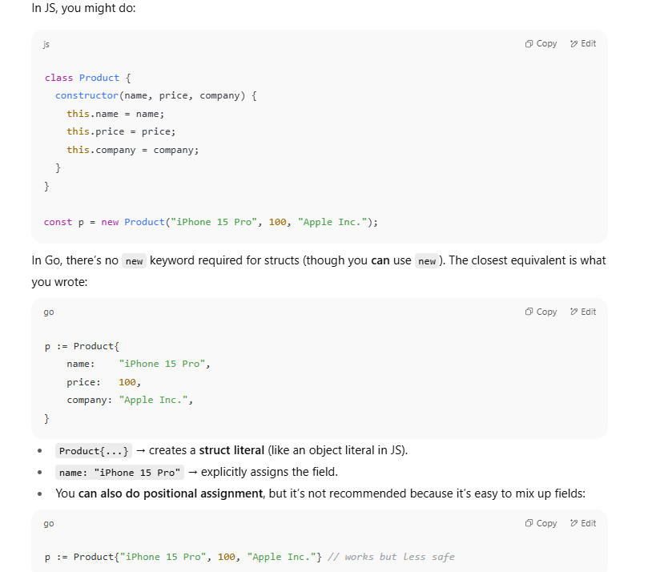


```go
package main

import "fmt"

// Product defines a product with a name, price, and company.
type Product struct {
	name    string
	price   int
	company string
}

// fun attempts to modify the name of a Product.
// Because Go passes by value, this function receives a copy of the Product,
// and any modifications made inside this function will not affect the original.
func fun(p Product) {
	// this p is a copy of the product passed to this function
	p.name = "MacBook Pro"
	fmt.Println("Product Name inside function:", p.name)
}

func main() {
	// Initialize a Product variable
	p := Product{
		name:    "iPhone 15 Pro",
		price:   1000,
		company: "Apple Inc.",
	}

	// Print the product name before calling the function
	fmt.Println("Product Name before function call:", p.name)

	// Call the function with the Product variable.
	// A copy of 'p' is passed to 'fun'.
	fun(p)

	// Print the product name after the function call.
	// The name will remain unchanged because the function modified a copy.
	fmt.Println("Product Name after function call:", p.name)
}

```


# Why nothing changed when you passed your `Product` — from scratch

Short answer: **Go passes arguments by value**. When you call `fun(p)` you give `fun` a _copy_ of `p`. Any changes inside `fun` only modify that copy — the original `p` in `main` stays the same.

Go doesn’t have “objects” like Java/C# classes; it has **structs** (and methods on them). Passing a struct value means copying its fields. To mutate the original, pass a **pointer** to it.


## How to change the original: pass a pointer

Pass the address (`&p`) and accept a `*Product` in the function


```go
func funPtr(p *Product) {
    p.name = "MacBook Pro"         // modifies the original because p points to it
    fmt.Println("Product Name inside funPtr:", p.name)
}

func main() {
    p := Product{name: "iPhone 15 Pro", price: 1000, company: "Apple"}
    fmt.Println("Before:", p.name)
    funPtr(&p)         // pass pointer to p
    fmt.Println("After:", p.name) // now changed
}

```

`funPtr` receives the _same_ memory address, so changes are visible to the caller.

- If you want to **mutate** the original value, pass a pointer (`*T`).
    
- If the struct is **large** and you want to avoid copying overhead, use a pointer.
    
- If the value is **small & immutable** (e.g., 2–3 fields, cheap to copy), value receivers are fine and sometimes clearer.
    
- Be careful with pointers across goroutines — synchronize access (mutexes) to avoid race conditions.


- `fun(p Product)` → function gets a fresh copy: `|p(main)| -> |p(fun: copy)|`
    
- `funPtr(&p)` → function gets a pointer to the same box: `|p(main)| <-pointer- |p(fun) points here|`


Go doesn’t have **constructors** the way Java/C++/Python do (with `__init__` or class constructors).

Instead, in Go we use a **regular function** (by convention called `New<TypeName>`) that returns either:

- a value (`Product`) if you want immutability / copy
    
- or a pointer (`*Product`) if you want to modify the instance later

### Example: Constructor for `Product`

```go
package main

import "fmt"

// Product struct
type Product struct {
	name    string
	price   int
	company string
}

// Constructor function (returns pointer)
func NewProduct(name string, price int, company string) *Product {
	return &Product{
		name:    name,
		price:   price,
		company: company,
	}
}

func main() {
	// Use constructor
	p := NewProduct("iPhone 15 Pro", 1000, "Apple Inc.")

	fmt.Println("Name:", p.name)
	fmt.Println("Price:", p.price)
	fmt.Println("Company:", p.company)
}

```

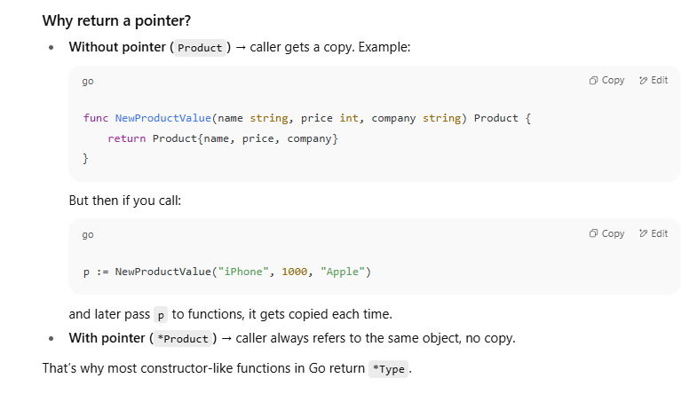


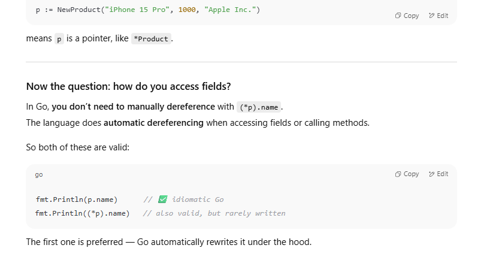

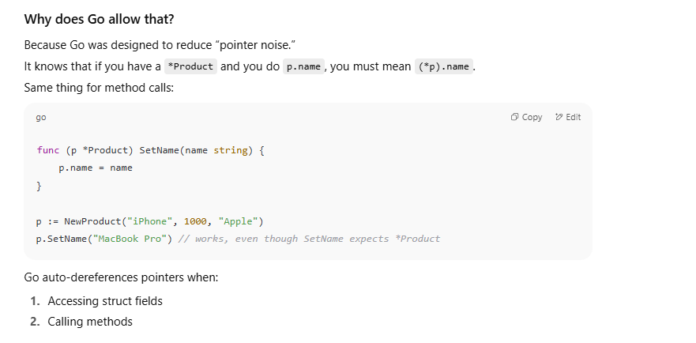

## 1. Functions vs Methods in Go


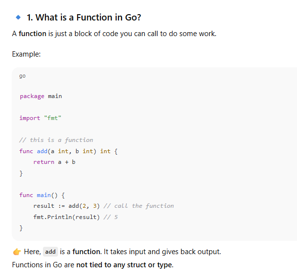


## 🔹 2. What is a Method in Go?

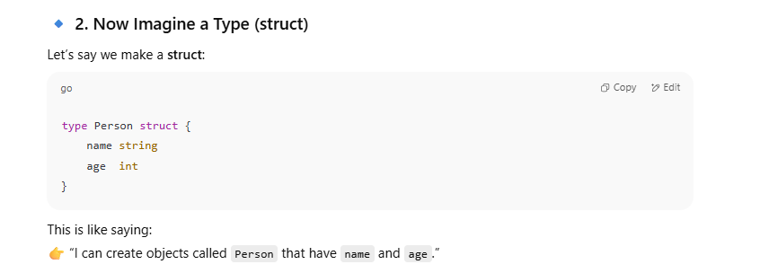


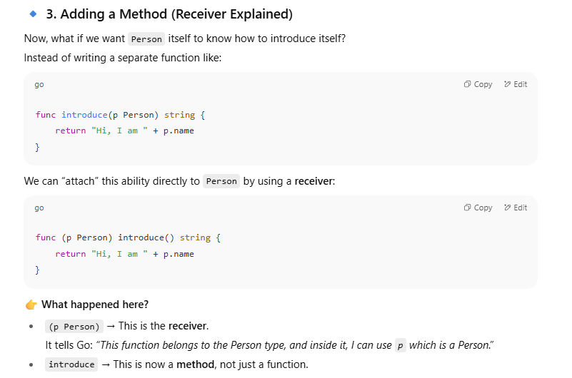

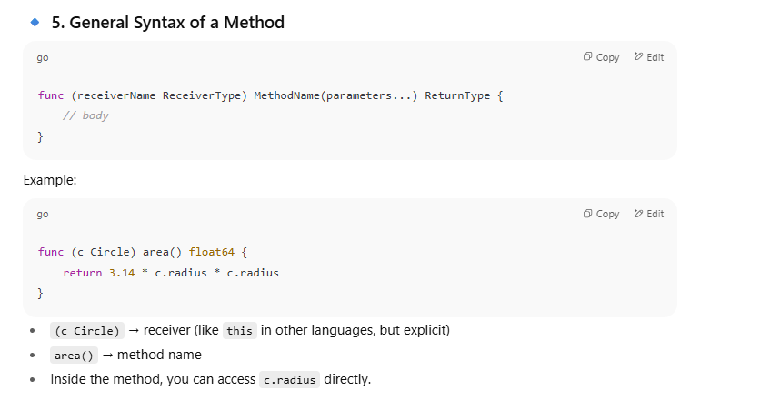

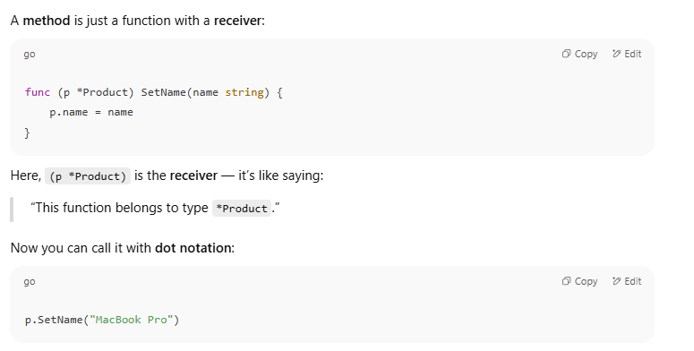


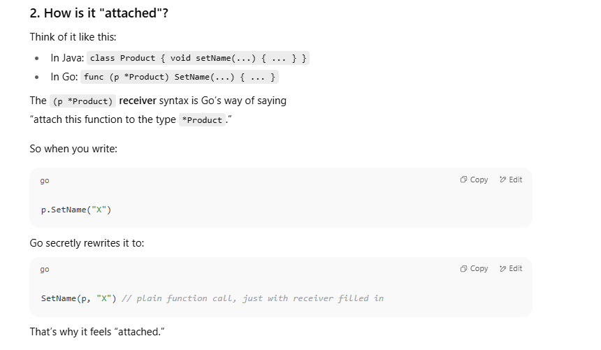

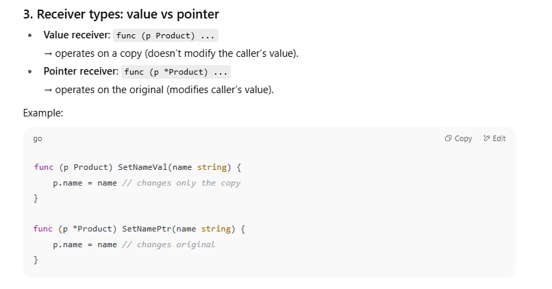


```go
package main

import "fmt"

type Product struct {
    name    string
    price   int
    company string
}

// Constructor
func NewProduct(name string, price int, company string) *Product {
    return &Product{name, price, company}
}

// Method with pointer receiver
func (p *Product) SetName(name string) {
    p.name = name
}

func main() {
    p := NewProduct("iPhone", 1000, "Apple")
    fmt.Println("Before:", p.name)

    // Call method (Go translates this into SetName(p, ...))
    p.SetName("MacBook Pro")

    fmt.Println("After:", p.name)
}

```


Before: iPhone
After: MacBook Pro

BEFORE : 
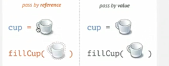
AFTER:
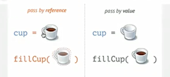

 Even if we define methods it's better if we create em type of pass by reference only since  you don't wanna create copies again and again if there's no particular usecase!!


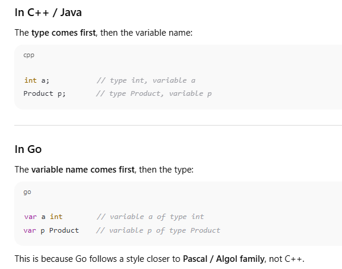

## Why did Go choose this?

Two reasons:

1. **Read left-to-right**  
    In Go, you read declarations as:
    
    > "`a` is an int"  
    > "`p` is a Product"
    
    which is considered more natural in English.
    
2. **Consistency with multiple variables**  

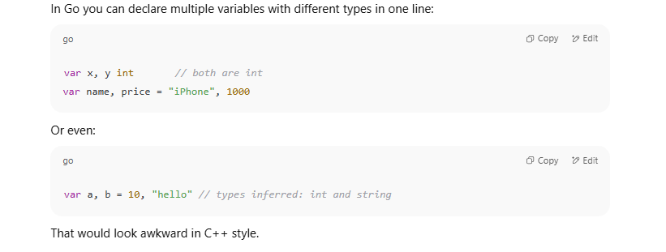


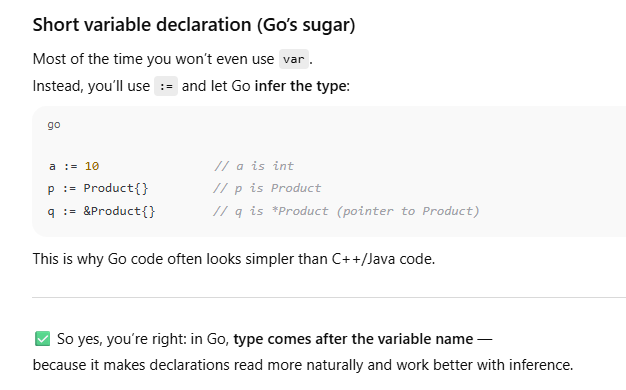

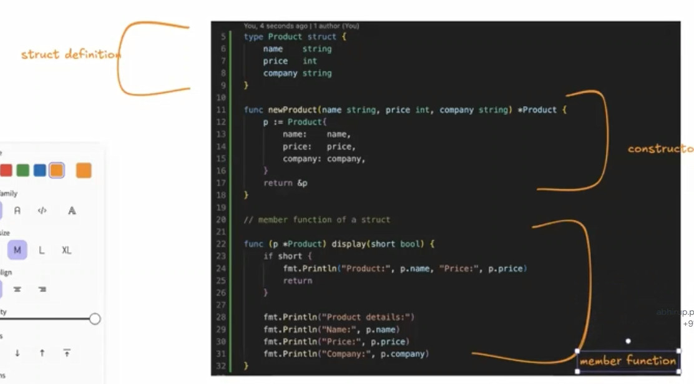


### 1. What is an Interface?

An **interface** in Go is like a **contract**.  
It says:  
👉 "Any type that has these methods automatically satisfies this interface."

It doesn’t care about the type itself — only that the required methods exist.


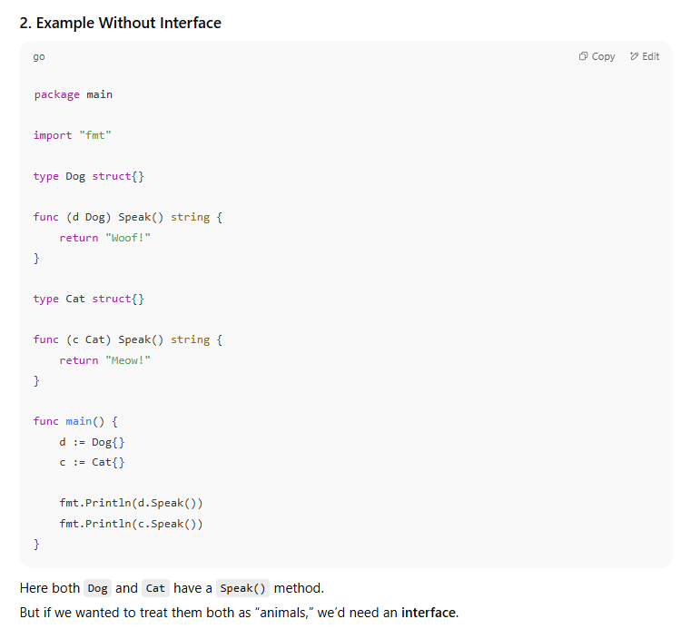


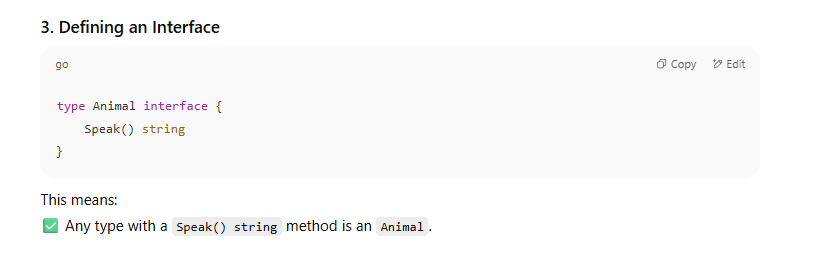


### 4. Using the Interface

```go
package main

import "fmt"

type Animal interface {
    Speak() string
}

type Dog struct{}

func (d Dog) Speak() string {
    return "Woof!"
}

type Cat struct{}

func (c Cat) Speak() string {
    return "Meow!"
}

func main() {
    // We can store different types in the same interface variable
    var a Animal

    a = Dog{}
    fmt.Println(a.Speak()) // Woof!

    a = Cat{}
    fmt.Println(a.Speak()) // Meow!

    // Or use a slice of interfaces
    animals := []Animal{Dog{}, Cat{}}
    for _, animal := range animals {
        fmt.Println(animal.Speak())
    }
}

```


- `method = CreditCard{}` → you’re saying “right now, I’ll pay with credit card.”
    
- `method = Cash{}` → later, you switch and pay with cash.
    

So the `method` variable is of type **PaymentMethod** (interface), and you can plug in **any payment option** (CreditCard, Cash, UPI, PayPal, etc.) as long as they follow the same contract (`Pay()` method).


In Go:  
👉 A **struct implements an interface** if it has **all the methods** that the interface requires, with the **exact same signatures** (name, parameters, and return types).  
👉 You don’t need to write any `implements` keyword like in Java or C#. It’s **implicit**.

```go
package main

import "fmt"

// Step 1: Define interface
type Shape interface {
    Area() float64
    Perimeter() float64
}

// Step 2: Define struct
type Rectangle struct {
    width, height float64
}

// Step 3: Implement *all* methods from Shape
func (r Rectangle) Area() float64 {
    return r.width * r.height
}

func (r Rectangle) Perimeter() float64 {
    return 2*(r.width + r.height)
}

func main() {
    var s Shape

    s = Rectangle{width: 10, height: 5} // ✅ Rectangle has both methods
    fmt.Println("Area:", s.Area())
    fmt.Println("Perimeter:", s.Perimeter())
}

```


- If `Rectangle` had **only `Area()`** but not `Perimeter()`, it would **NOT** implement `Shape`.  
    Go compiler would give an error if you try to assign it.
    
- The method signatures must match **exactly**.  
    For example:
    
    - If `Shape` requires `Area() float64`
        
    - But your struct has `Area() int` → ❌ doesn’t count.


```go
package main

import (
    "fmt"
    "math"
)

// Step 1: Define the interface
type Shape interface {
    Area() float64
}

// Step 2: Define Rectangle struct
type Rectangle struct {
    width, height float64
}

func (r Rectangle) Area() float64 {
    return r.width * r.height
}

// Step 3: Define Circle struct
type Circle struct {
    radius float64
}

func (c Circle) Area() float64 {
    return math.Pi * c.radius * c.radius
}

// Step 4: Define Triangle struct
type Triangle struct {
    a, b, c float64 // sides
}

// use Heron's formula for area
func (t Triangle) Area() float64 {
    s := (t.a + t.b + t.c) / 2
    return math.Sqrt(s * (s - t.a) * (s - t.b) * (s - t.c))
}

// Step 5: Generic function that works with any Shape
func Draw(s Shape) {
    fmt.Println("Drawing shape, area:", s.Area())
}

func main() {
    r := Rectangle{width: 10, height: 5}
    c := Circle{radius: 7}
    t := Triangle{a: 3, b: 4, c: 5}

    Draw(r)
    Draw(c)
    Draw(t)
}

```


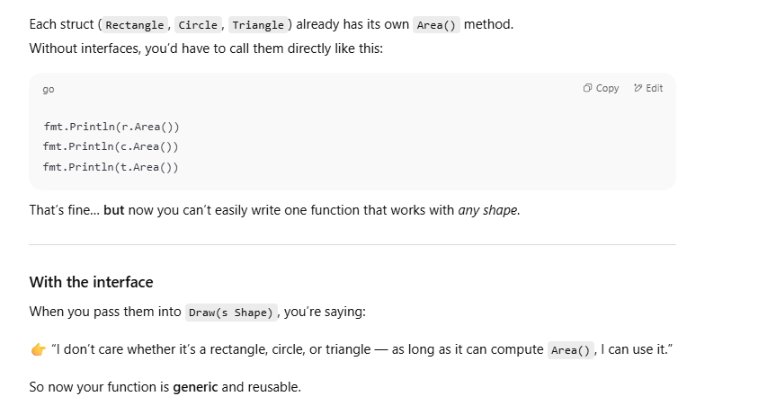


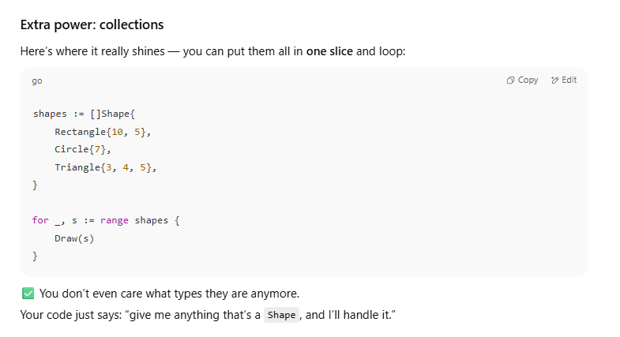

So yes —

- The structs still hold their methods.
    
- The **interface lets you treat them all generically**, instead of writing separate code for each.