### Go **doesn’t have classes** in the traditional OOP sense like Java or C++. Instead, Go uses **structs** and **methods** to achieve similar functionality. Think of structs as “blueprints for objects” and methods as “functions tied to those objects.”


## **1️⃣ Structs — Go’s version of classes**

A `struct` is a composite data type that groups together variables (called **fields**) under a single name.

```go
package main

import "fmt"

// Define a struct
type Person struct {
    Name string
    Age  int
}

func main() {
    // Create an instance of Person
    p1 := Person{Name: "Sourav", Age: 26}
    
    fmt.Println(p1.Name) // Sourav
    fmt.Println(p1.Age)  // 26
}

```


Here:

- `Person` is like a **class**.
    
- `Name` and `Age` are **fields**.
    
- `p1` is like an **object/instance** of the class


In Go, structs are just **data containers**, like plain objects in JS, but the way you attach “methods” is a bit different. You **don’t define methods inside the struct itself** like you would in JS classes. Instead, you define methods **separately** but attach them to the struct using a **receiver**.

```go
type Product struct {
    name    string
    price   int
    company string
}

func main() {
    p := Product{
        name:    "iPhone 15 Pro",
        price:   100,
        company: "Apple Inc.",
    }
fmt.Println("Product Name:", p.name)


```

1. `type Product struct { ... }`
    
    - This defines a **struct** named `Product`.
        
    - A struct is like a **blueprint for an object**.
        
2. Inside the struct:
    
    - `name string` → the product has a `name` field of type `string`.
        
    - `price int` → the product has a `price` field of type `int`.
        
    - `company string` → the product has a `company` field of type `string`.
        

Think of this as a **class with three properties**.


- `func main()` → entry point of a Go program.
    
- `p := Product{...}` → creates an **instance** of the `Product` struct.
    
    - `p` is now a variable holding the product object.
        
    - We assign values to each field using **field names**:
        
        - `name: "iPhone 15 Pro"`
            
        - `price: 100`
            
        - `company: "Apple Inc."`


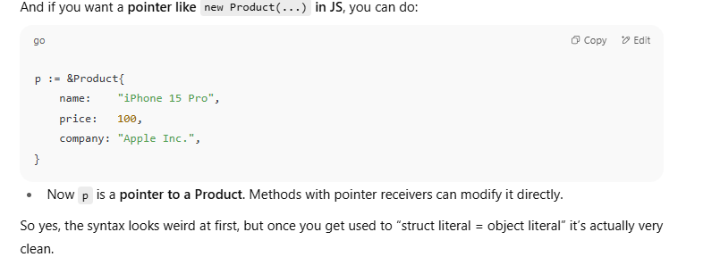

```go
package main

import "fmt"

// Product defines a product with a name, price, and company.
type Product struct {
	name    string
	price   int
	company string
}

// fun attempts to modify the name of a Product.
// Because Go passes by value, this function receives a copy of the Product,
// and any modifications made inside this function will not affect the original.
func fun(p Product) {
	// this p is a copy of the product passed to this function
	p.name = "MacBook Pro"
	fmt.Println("Product Name inside function:", p.name)
}

func main() {
	// Initialize a Product variable
	p := Product{
		name:    "iPhone 15 Pro",
		price:   1000,
		company: "Apple Inc.",
	}

	// Print the product name before calling the function
	fmt.Println("Product Name before function call:", p.name)

	// Call the function with the Product variable.
	// A copy of 'p' is passed to 'fun'.
	fun(p)

	// Print the product name after the function call.
	// The name will remain unchanged because the function modified a copy.
	fmt.Println("Product Name after function call:", p.name)
}

```


# Why nothing changed when you passed your `Product` — from scratch

Short answer: **Go passes arguments by value**. When you call `fun(p)` you give `fun` a _copy_ of `p`. Any changes inside `fun` only modify that copy — the original `p` in `main` stays the same.

Go doesn’t have “objects” like Java/C# classes; it has **structs** (and methods on them). Passing a struct value means copying its fields. To mutate the original, pass a **pointer** to it.


## How to change the original: pass a pointer

Pass the address (`&p`) and accept a `*Product` in the function


```go
func funPtr(p *Product) {
    p.name = "MacBook Pro"         // modifies the original because p points to it
    fmt.Println("Product Name inside funPtr:", p.name)
}

func main() {
    p := Product{name: "iPhone 15 Pro", price: 1000, company: "Apple"}
    fmt.Println("Before:", p.name)
    funPtr(&p)         // pass pointer to p
    fmt.Println("After:", p.name) // now changed
}

```

`funPtr` receives the _same_ memory address, so changes are visible to the caller.

- If you want to **mutate** the original value, pass a pointer (`*T`).
    
- If the struct is **large** and you want to avoid copying overhead, use a pointer.
    
- If the value is **small & immutable** (e.g., 2–3 fields, cheap to copy), value receivers are fine and sometimes clearer.
    
- Be careful with pointers across goroutines — synchronize access (mutexes) to avoid race conditions.


- `fun(p Product)` → function gets a fresh copy: `|p(main)| -> |p(fun: copy)|`
    
- `funPtr(&p)` → function gets a pointer to the same box: `|p(main)| <-pointer- |p(fun) points here|`


Go doesn’t have **constructors** the way Java/C++/Python do (with `__init__` or class constructors).

Instead, in Go we use a **regular function** (by convention called `New<TypeName>`) that returns either:

- a value (`Product`) if you want immutability / copy
    
- or a pointer (`*Product`) if you want to modify the instance later

### Example: Constructor for `Product`

```go
package main

import "fmt"

// Product struct
type Product struct {
	name    string
	price   int
	company string
}

// Constructor function (returns pointer)
func NewProduct(name string, price int, company string) *Product {
	return &Product{
		name:    name,
		price:   price,
		company: company,
	}
}

func main() {
	// Use constructor
	p := NewProduct("iPhone 15 Pro", 1000, "Apple Inc.")

	fmt.Println("Name:", p.name)
	fmt.Println("Price:", p.price)
	fmt.Println("Company:", p.company)
}

```


## 1. Functions vs Methods in Go


## 🔹 2. What is a Method in Go?


```go
package main

import "fmt"

type Product struct {
    name    string
    price   int
    company string
}

// Constructor
func NewProduct(name string, price int, company string) *Product {
    return &Product{name, price, company}
}

// Method with pointer receiver
func (p *Product) SetName(name string) {
    p.name = name
}

func main() {
    p := NewProduct("iPhone", 1000, "Apple")
    fmt.Println("Before:", p.name)

    // Call method (Go translates this into SetName(p, ...))
    p.SetName("MacBook Pro")

    fmt.Println("After:", p.name)
}

```


Before: iPhone
After: MacBook Pro

BEFORE : 

AFTER:


 Even if we define methods it's better if we create em type of pass by reference only since  you don't wanna create copies again and again if there's no particular usecase!!


## Why did Go choose this?

Two reasons:

1. **Read left-to-right**  
    In Go, you read declarations as:
    
    > "`a` is an int"  
    > "`p` is a Product"
    
    which is considered more natural in English.
    
2. **Consistency with multiple variables**  


### 1. What is an Interface?

An **interface** in Go is like a **contract**.  
It says:  
👉 "Any type that has these methods automatically satisfies this interface."

It doesn’t care about the type itself — only that the required methods exist.


### 4. Using the Interface

```go
package main

import "fmt"

type Animal interface {
    Speak() string
}

type Dog struct{}

func (d Dog) Speak() string {
    return "Woof!"
}

type Cat struct{}

func (c Cat) Speak() string {
    return "Meow!"
}

func main() {
    // We can store different types in the same interface variable
    var a Animal

    a = Dog{}
    fmt.Println(a.Speak()) // Woof!

    a = Cat{}
    fmt.Println(a.Speak()) // Meow!

    // Or use a slice of interfaces
    animals := []Animal{Dog{}, Cat{}}
    for _, animal := range animals {
        fmt.Println(animal.Speak())
    }
}

```


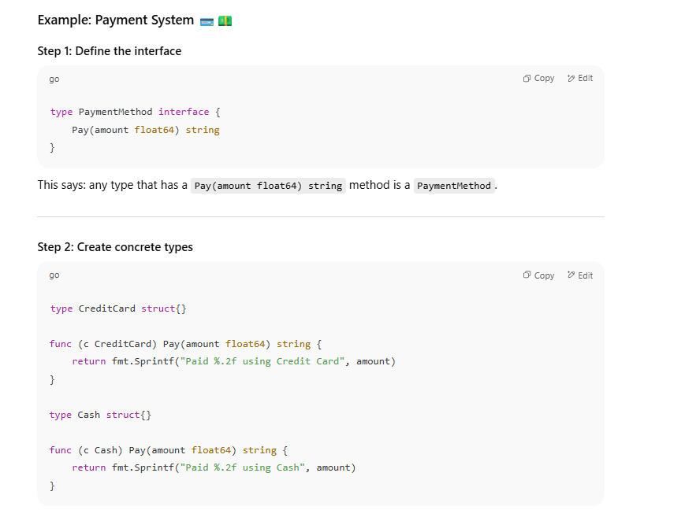


- `method = CreditCard{}` → you’re saying “right now, I’ll pay with credit card.”
    
- `method = Cash{}` → later, you switch and pay with cash.
    

So the `method` variable is of type **PaymentMethod** (interface), and you can plug in **any payment option** (CreditCard, Cash, UPI, PayPal, etc.) as long as they follow the same contract (`Pay()` method).


In Go:  
👉 A **struct implements an interface** if it has **all the methods** that the interface requires, with the **exact same signatures** (name, parameters, and return types).  
👉 You don’t need to write any `implements` keyword like in Java or C#. It’s **implicit**.

```go
package main

import "fmt"

// Step 1: Define interface
type Shape interface {
    Area() float64
    Perimeter() float64
}

// Step 2: Define struct
type Rectangle struct {
    width, height float64
}

// Step 3: Implement *all* methods from Shape
func (r Rectangle) Area() float64 {
    return r.width * r.height
}

func (r Rectangle) Perimeter() float64 {
    return 2*(r.width + r.height)
}

func main() {
    var s Shape

    s = Rectangle{width: 10, height: 5} // ✅ Rectangle has both methods
    fmt.Println("Area:", s.Area())
    fmt.Println("Perimeter:", s.Perimeter())
}

```


- If `Rectangle` had **only `Area()`** but not `Perimeter()`, it would **NOT** implement `Shape`.  
    Go compiler would give an error if you try to assign it.
    
- The method signatures must match **exactly**.  
    For example:
    
    - If `Shape` requires `Area() float64`
        
    - But your struct has `Area() int` → ❌ doesn’t count.


```go
package main

import (
    "fmt"
    "math"
)

// Step 1: Define the interface
type Shape interface {
    Area() float64
}

// Step 2: Define Rectangle struct
type Rectangle struct {
    width, height float64
}

func (r Rectangle) Area() float64 {
    return r.width * r.height
}

// Step 3: Define Circle struct
type Circle struct {
    radius float64
}

func (c Circle) Area() float64 {
    return math.Pi * c.radius * c.radius
}

// Step 4: Define Triangle struct
type Triangle struct {
    a, b, c float64 // sides
}

// use Heron's formula for area
func (t Triangle) Area() float64 {
    s := (t.a + t.b + t.c) / 2
    return math.Sqrt(s * (s - t.a) * (s - t.b) * (s - t.c))
}

// Step 5: Generic function that works with any Shape
func Draw(s Shape) {
    fmt.Println("Drawing shape, area:", s.Area())
}

func main() {
    r := Rectangle{width: 10, height: 5}
    c := Circle{radius: 7}
    t := Triangle{a: 3, b: 4, c: 5}

    Draw(r)
    Draw(c)
    Draw(t)
}

```


So yes —

- The structs still hold their methods.
    
- The **interface lets you treat them all generically**, instead of writing separate code for each.

## In Go, **the first letter decides visibility**:

- **Uppercase (Capitalized)** → **Exported** (public, visible outside the package).
    
- **Lowercase** → **Unexported** (private, visible only inside the same package).
    

That’s it. No `public`, `private`, `protected` keywords.

## 2. Example: package `mathutils`

Let’s make a simple package:

```go
// mathutils/mathutils.go
package mathutils

// Exported (public)
func Add(a, b int) int {
    return a + b
}

// Exported (public)
func Multiply(a, b int) int {
    return a * b
}

// Unexported (private)
func subtract(a, b int) int {
    return a - b
}

```


Here:

- `Add` ✅ visible outside
    
- `Multiply` ✅ visible outside
    
- `subtract` ❌ hidden (can only be used inside `mathutils`)


## 3. Using it in `main.go`

```go
package main

import (
    "fmt"
    "yourmodule/mathutils"
)

func main() {
    fmt.Println(mathutils.Add(5, 3))      // ✅ works
    fmt.Println(mathutils.Multiply(4, 2)) // ✅ works
    // fmt.Println(mathutils.subtract(5, 3)) // ❌ compile error
}

```

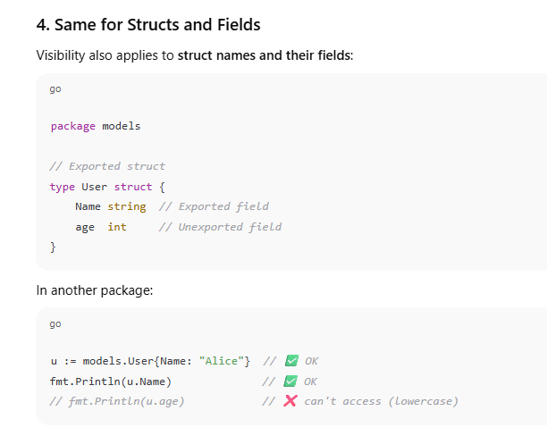


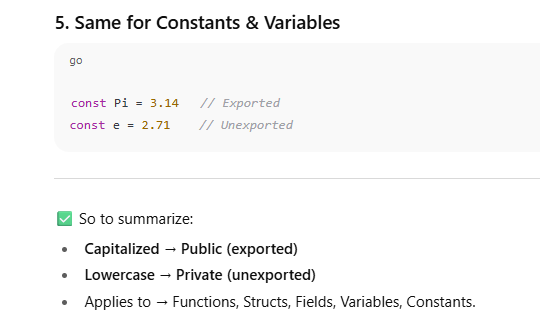


In Go, **all files inside the same package share the same visibility**.  
So if two files have the same `package xyz` at the top, they can access each other’s **lowercase (unexported)** stuff without any issue.


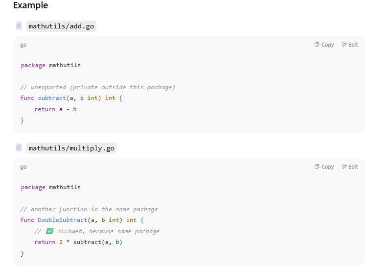


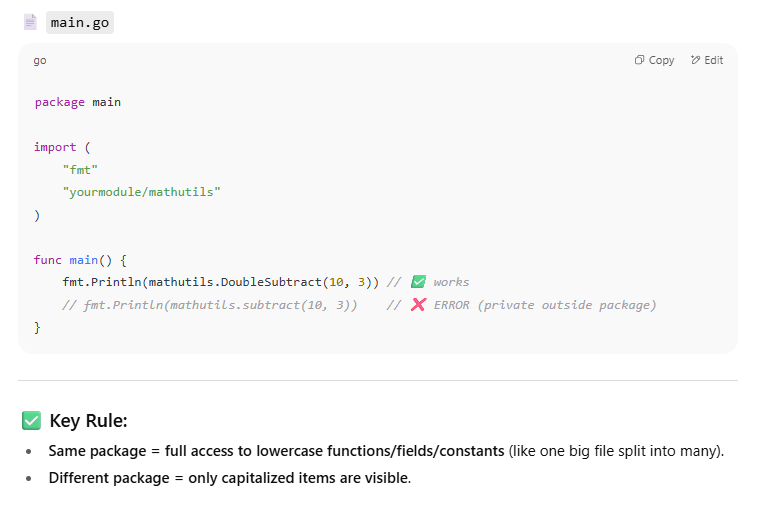

- **Capitalized name** (starts with `A–Z`) → **exported** = visible **outside the package** 
    
- **Lowercase name** (starts with `a–z`) → **unexported** = visible **only inside the same package**.

## IMPORTS

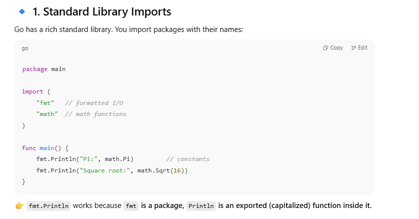


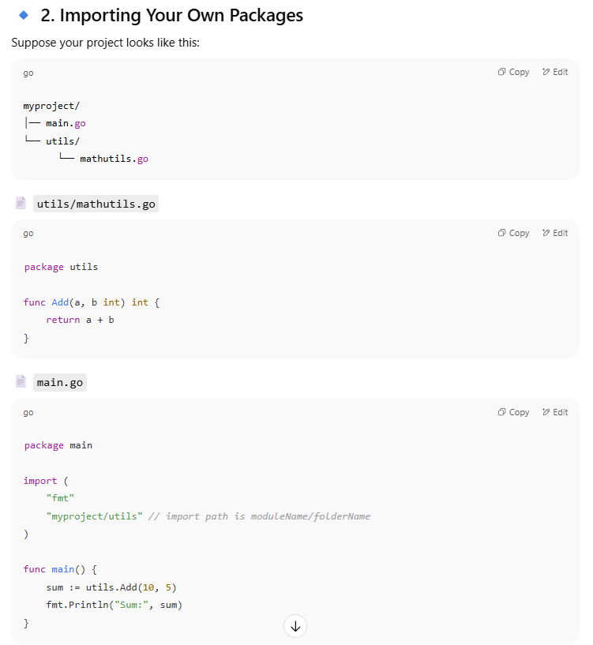


👉 You must run `go mod init myproject` in the root so Go knows the module name.  
👉 Import path is always `<module-name>/<folder-name>`.


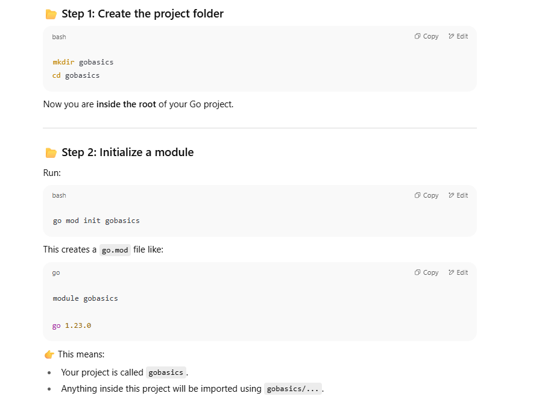


you are **not just naming your folder**. You’re actually creating a **module** in Go.

### What is a module?

- A **module** = a collection of Go packages managed together.
    
- It’s Go’s way of saying: _“this folder is now an independent project, and I can track its dependencies.”_
    
- The module name (`gobasics`) becomes the **root import path** for all packages inside.


### Why do we need `go mod init`?

1. **Dependency tracking**
    
    - It creates a `go.mod` file.
        
    - That file records:
        
        - your module name
            
        - all external libraries you use (like `github.com/gin-gonic/gin`).
            
2. **Import paths**
    
    - Without `go mod init`, Go doesn’t know what prefix to use when you import your own packages


## go mod init gobasics
you are not just writing your folder’s name.
That word (gobasics) is the module path — basically the unique address/name of your project.

### What are we trying to achieve?

We are telling Go:  
👉 “Hey, I am starting a new Go project. From now on, if someone imports my project, they will use this name.”

That’s the whole point of `go mod init`.  
It defines the **identity** of your project.


### Why do we often use the folder name?

Because it’s convenient and human-readable.  
If your folder is `gobasics`, you might just write `go mod init gobasics` so that the module path matches the folder name.  
But this is **not required**.


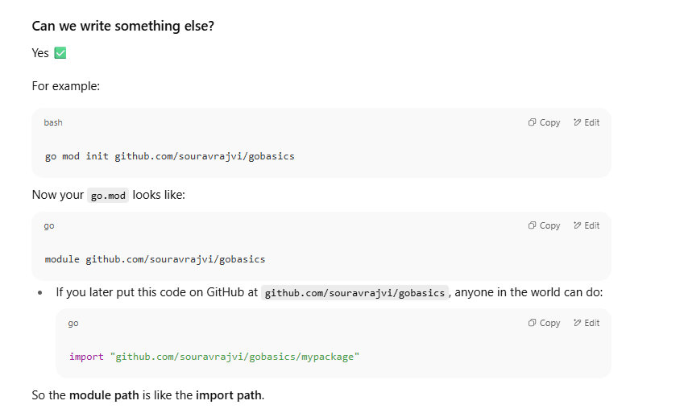


### Why is it useful?

Without `go mod init`, Go doesn’t know:

- What the project is called.
    
- How to resolve imports.
    
- What dependencies belong to this project.
    

`go mod init` sets the root of your project and creates the `go.mod` file, which Go uses to track dependencies.

---

👉 Think of it like this:

- **`go mod init` = registering your project’s “passport name”**.
    
- That name can be simple (`gobasics`) if you’re just learning,  
    or a full GitHub path (`github.com/username/project`) if you want others to import it.

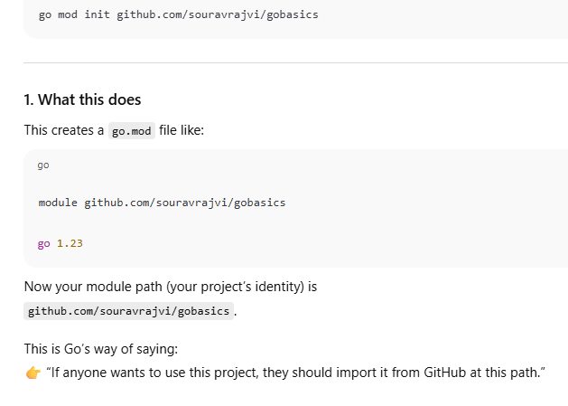


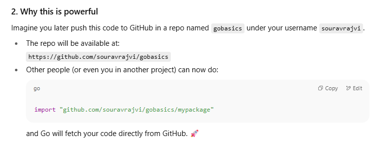


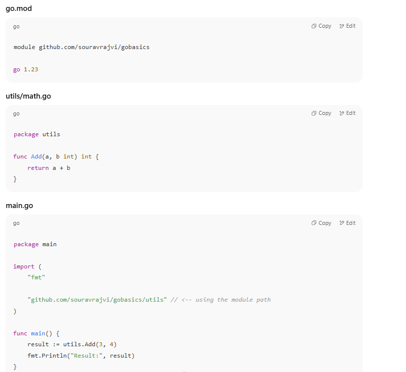


- **Local project only** → `go mod init gobasics` (short and simple).
    
- **Project you plan to share/publish** → `go mod init github.com/username/reponame`


**Go does not allow relative imports like `../`**.

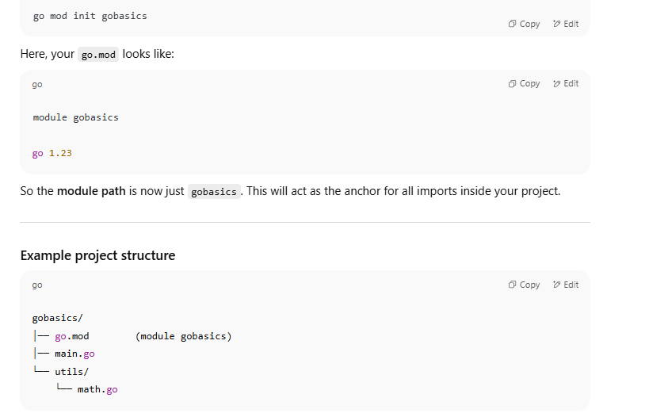


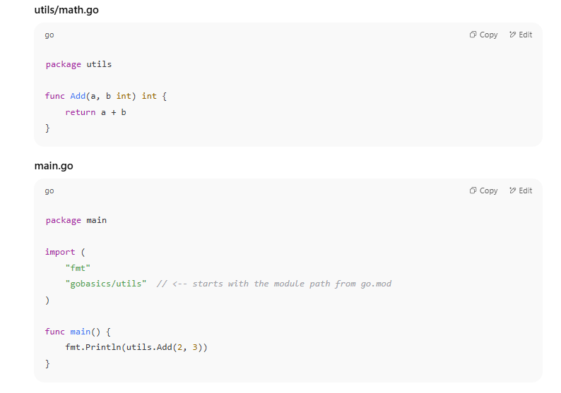


### How import works here

1. You wrote `import "gobasics/utils"`.
    
2. Go checks your `go.mod` and sees `module gobasics`.
    
3. It knows `gobasics` points to the root of your current project.
    
4. Then it looks inside the `utils` folder in your project root and finds `math.go`.
    

✅ This works even **without using relative paths** like `../utils`.


