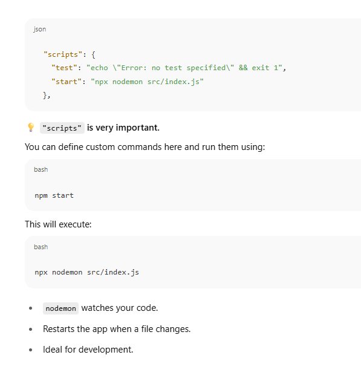
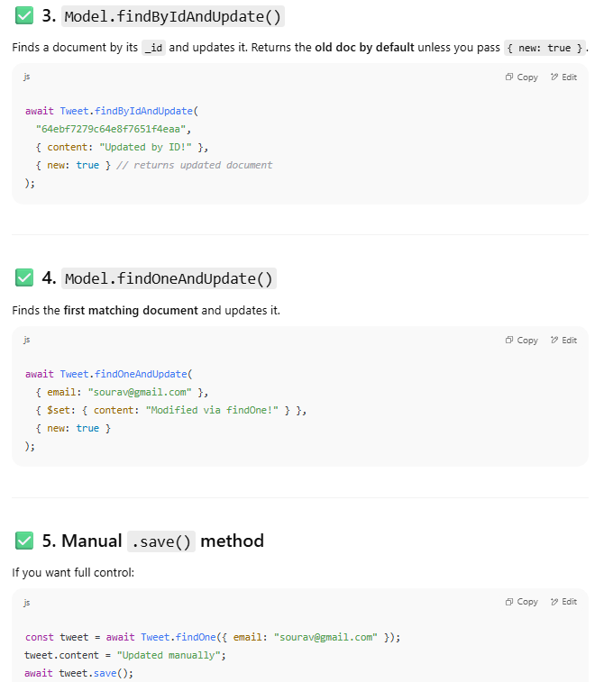
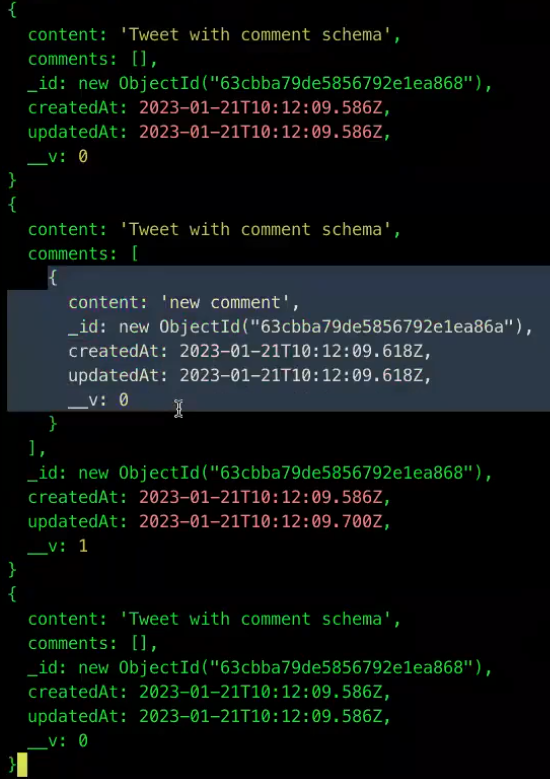
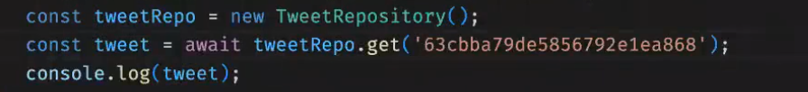
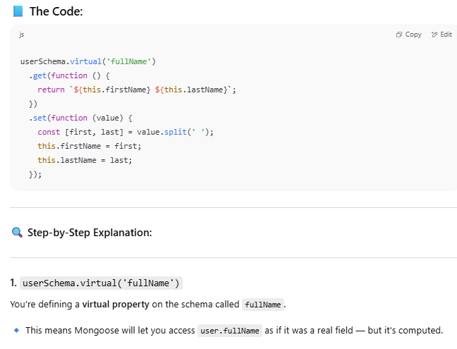

**100% right**: no database is good for everything.
### ✅ If your goal is **learning backend/dev job prep**:

Use **PostgreSQL** (relational) or **MongoDB** (NoSQL) — these are the most **recruiter-friendly** and **interview-relevant** databases.

- **PostgreSQL** (or MySQL):
    
    - Great if your data is relational (e.g., users, bookings, orders).
        
    - Strong SQL skills are **interview gold**.
        
    - Supported well with ORMs like Sequelize or Prisma.
        
- **MongoDB**:
    
    - Great for flexible schemas (chat apps, blog posts, anything unstructured).
        
    - Ideal with Node.js and Express (MERN stack).
        
    - Easy to get started with.


### ✅ If your goal is **fast prototyping** or personal use:

Use **SQLite** or **MongoDB Atlas (free tier)**.

- **SQLite**:
    
    - No server required.
        
    - Stores everything in a local file.
        
    - Great for desktop apps or CLI tools.
        
- **MongoDB Atlas**:
    
    - Easy to connect from anywhere.
        
    - Free cloud-hosted version.
        
    - Good for quick MVPs.


### If your goal is **learning advanced backend concepts (scaling, sharding, etc.)**:

Use **PostgreSQL** or **Cassandra**/**Redis** depending on what you’re exploring.

---

### ✅ If your goal is **building a production-ready app with REST APIs**:

Use **PostgreSQL** with **Prisma or Sequelize**.


### 🔧 Examples for when companies choose different DBs:

| Use case               | Common DB             |     |
| ---------------------- | --------------------- | --- |
| Financial transactions | PostgreSQL / MySQL    |     |
| Real-time chat         | Redis / MongoDB       |     |
| Analytics              | BigQuery / ClickHouse |     |
| Logging                | Elasticsearch         |     |
| Caching                | Redis                 |     |
| Large-scale writes     | Cassandra             |     |
| Product catalog        | MongoDB / DynamoDB    |     |
| Simple website         | SQLite / PostgreSQL   |     |
|                        |                       |     |
|                        |                       |     |
|                        |                       |     |
SQL-based databases (like PostgreSQL, MySQL) often **require more "import/export" work** than NoSQL databases (like MongoDB) because of their **strict structure and relational constraints**.

### 🔧 1. **Strict Schema Enforcement**

- SQL: Tables have predefined columns with specific data types, constraints, and relationships (e.g., `FOREIGN KEY`, `NOT NULL`).
    
- ❗ So during import, data must exactly match the schema, or the import will fail.
    
- NoSQL: Collections are schema-less (MongoDB) — so it’s more forgiving. Documents can have missing or extra fields.
    

---

### 🧷 2. **Relational Integrity**

- SQL uses foreign keys and relationships between tables.
    
- During import, the **order of importing matters**:
    
    - You must first import `users` before `orders` that reference `users.id`.
        
- NoSQL stores nested data, so there's usually no join — everything needed can be inside one document.
    

---

### 💾 3. **Importing Tools Are More Rigid**

- SQL imports use tools like `pg_restore`, `mysqldump`, `psql`, or `.csv` with `COPY`.
    
- They are powerful but require **structured format**, often need:
    
    - Creating tables first
        
    - Matching encoding
        
    - Matching date/time formats
        
- MongoDB lets you do `mongoimport data.json` and it just works.
    

---

### 🪄 4. **Normalization Adds Complexity**

- SQL follows normalization (split data into many tables).
    
- Imports mean you may have to:
    
    - Import multiple files
        
    - Ensure foreign key values are valid
        
    - Manage dependencies
        
- NoSQL stores everything in one doc — easier to import.
    

---

### 🚀 5. **Use Case Philosophy**

- SQL: Strong ACID guarantees, transaction-safe — better for banking, inventory, etc.
    
- NoSQL: Flexible, fast prototyping — better for logs, chat, product catalogs, etc.


### 🔍 What is RDBMS (SQL)?

**Relational DBMS** like **PostgreSQL**, **MySQL**, or **SQLite** store data in **tables** with predefined schemas. Data is organized in **rows and columns** and follows **ACID** properties (Atomicity, Consistency, Isolation, Durability)

### 🔍 What is NoSQL?

**NoSQL (Not Only SQL)** like **MongoDB**, **Cassandra**, **Redis**, etc., stores data in a **non-relational** way — typically as **documents (JSON-like)**, **key-value pairs**, **graphs**, or **column-family stores**.

```json
{
  "_id": "123",
  "name": "John",
  "email": "john@email.com",
  "orders": [
    { "id": "o1", "total": 500 },
    { "id": "o2", "total": 300 }
  ]
}

```


## 🧠 Key Differences

|Feature|RDBMS (SQL)|NoSQL|
|---|---|---|
|**Schema**|Fixed, predefined (strongly typed)|Flexible or schema-less|
|**Data model**|Tables (rows, columns)|Documents, key-value, graph, wide-columns|
|**Relationships**|Supports joins (foreign keys)|Denormalized / nested (no joins)|
|**Scalability**|Vertical (bigger server)|Horizontal (more servers)|
|**Transactions**|Strong ACID support|Limited or BASE (eventual consistency)|
|**Query Language**|SQL (Structured Query Language)|Varies (MongoDB: JSON queries)|
|**Use case**|Structured data, relational|Big data, real-time, fast reads|
|**Examples**|PostgreSQL, MySQL, SQLite|MongoDB, Cassandra, Redis, DynamoDB|


## 🛠️ When to Use What?

### ✅ Use **RDBMS (SQL)** when:

- Your data has strong **relationships** (e.g., users, orders, products).
    
- You need **complex queries and joins**.
    
- You want **data consistency and reliability**.
    
- You’re building things like:
    
    - E-commerce backend
        
    - Banking systems
        
    - Flight & hotel booking platforms


### Use **NoSQL** when:

- Your data is **unstructured or semi-structured** (e.g., blog posts, JSON).
    
- Schema can change over time (fast prototyping).
    
- You need **high scalability** (distributed systems).
    
- You’re building:
    
    - Real-time analytics (Cassandra)
        
    - Chat apps / social media (MongoDB)
        
    - Caching (Redis)
        
    - IoT / event logging systems


|Goal|Choose|
|---|---|
|Need structured, consistent data with relations|✅ SQL (PostgreSQL/MySQL)|
|Need speed, flexibility, or horizontal scaling|✅ NoSQL (MongoDB, etc.)|
**PostgreSQL can store JSON data**, so it might seem like it can do what MongoDB or other NoSQL DBs do.  
But the real difference **isn’t just about data format**, it's about the **underlying architecture**, **philosophy**, and **performance trade-offs**.


## 🧠 The Key Differences (Beyond Just JSON Support)

| Aspect                 | PostgreSQL (with JSON)                                                  | NoSQL (e.g., MongoDB)                                                    |
| ---------------------- | ----------------------------------------------------------------------- | ------------------------------------------------------------------------ |
| **Core engine**        | Built for relational operations first, JSON is a feature                | Built for document storage from the ground up                            |
| **Query optimization** | SQL optimizer is focused on relational data (joins, indexes on columns) | Query engine is optimized for nested JSON structures                     |
| **Scaling model**      | Vertical scaling (scale up a single server)                             | Horizontal scaling (shard easily across servers)                         |
| **Data retrieval**     | Ideal for normalized tabular data                                       | Ideal for fetching entire documents fast                                 |
| **Indexing JSON**      | Supported but more limited compared to relational columns               | Deep indexing and querying of nested JSON is native and fast             |
| **Schema enforcement** | Enforces schemas by default (unless you store JSON)                     | Schema-less by design                                                    |
| **Transactions**       | Fully ACID                                                              | Some NoSQL DBs offer partial ACID (Mongo has multi-doc transactions now) |
| **Write performance**  | Slower for lots of document-style inserts                               | Fast bulk writes, especially for logs/events                             |
| **Tooling/ORMs**       | ORMs like Sequelize, Prisma, TypeORM are relational-first               | ODMs like Mongoose are JSON-document-first                               |

## 📦 PostgreSQL JSON is powerful, but not **native-first**

It’s like this:

🛠️ **Postgres with JSON**

> A powerful SQL database that **also** supports unstructured data if needed.

🧱 **MongoDB or CouchDB**

> A document store designed to **only** work with unstructured, nested data from the start.


## 🧠 What is an **ODM**?

### 👉 ODM stands for:

**Object-Document Mapper**

It’s a **library or tool** that helps you interact with a **NoSQL document database** (like MongoDB) using **objects in your programming language** — just like how an **ORM (Object-Relational Mapper)** works for SQL databases.


## 🗃️ Why ODM?

MongoDB stores data as **documents** (in **BSON**, a JSON-like format).  
But in your code, you work with **objects**.

An **ODM maps these objects to documents**, so you can:

- Define schemas
    
- Validate data
    
- Run queries with familiar syntax
    
- Avoid manual `insert`, `find`, `update` calls


## ✅ Benefits of Using an ODM:

- Schema validation
    
- Built-in query helpers
    
- Middleware (e.g., `pre-save`, `post-delete`)
    
- Easier migrations and relationships (subdocs, refs)
    
- Cleaner, structured codebase

We use **Mongoose with MongoDB** because Mongoose provides a **structured, schema-based layer** on top of MongoDB — which by default is **schema-less**. That gives you **control, safety, and productivity** when building apps.


## 🛠️ Summary: Why Use Mongoose?

| Feature              | MongoDB  | MongoDB + Mongoose              |
| -------------------- | -------- | ------------------------------- |
| Schema enforcement   | ❌ No     | ✅ Yes                           |
| Validation           | ❌ Manual | ✅ Built-in                      |
| Relationships (refs) | ❌ Manual | ✅ Built-in (`populate`)         |
| Middleware/hooks     | ❌ No     | ✅ Yes                           |
| Model abstraction    | ❌ No     | ✅ Yes (`new User()`, `.save()`) |
| Dev experience       | ⚠️ Raw   | ✅ Developer-friendly            |
## 🔚 TL;DR

> **MongoDB = Freedom**  
> **Mongoose = Structure + Safety + Power**


## 🔁 **Basic DB Operations**

|Action|MySQL|MongoDB (mongosh)|
|---|---|---|
|Connect to shell|`mysql -u root -p`|`mongosh`|
|Show databases|`SHOW DATABASES;`|`show dbs`|
|Use a database|`USE dbname;`|`use dbname`|
|Show current DB|`SELECT DATABASE();`|`db`|
|Show collections/tables|`SHOW TABLES;`|`show collections` or `db.getCollectionNames()`|
|Drop database|`DROP DATABASE dbname;`|`db.dropDatabase()`|

---

## 📄 **Collections vs Tables**

|Action|MySQL|MongoDB|
|---|---|---|
|Create table|`CREATE TABLE users (...);`|Implicit on first insert|
|Drop table|`DROP TABLE users;`|`db.users.drop()`|
|Rename table|`RENAME TABLE users TO people;`|`db.users.renameCollection("people")`|

---

## 📥 **Insert Operations**

|Action|MySQL|MongoDB|
|---|---|---|
|Insert one row|`INSERT INTO users (name) VALUES ('Raj');`|`db.users.insertOne({ name: "Raj" })`|
|Insert many rows|Use multiple insert statements|`db.users.insertMany([{...}, {...}])`|

---

## 📤 **Read Operations**

users-> collection hai yahan!! Which is analogous to tables in 

|Action|MySQL|MongoDB|
|---|---|---|
|Select all|`SELECT * FROM users;`|`db.users.find()`|
|Select with condition|`SELECT * FROM users WHERE age > 18;`|`db.users.find({ age: { $gt: 18 } })`|
|Pretty print results|N/A|`db.users.find().pretty()`|
|Count rows|`SELECT COUNT(*) FROM users;`|`db.users.countDocuments()`|
|Limit results|`SELECT * FROM users LIMIT 5;`|`db.users.find().limit(5)`|
|Sort|`ORDER BY age DESC`|`db.users.find().sort({ age: -1 })`|

---

## ✏️ **Update Operations**

|Action|MySQL|MongoDB|
|---|---|---|
|Update one row|`UPDATE users SET name='Sourav' WHERE id=1;`|`db.users.updateOne({ _id: 1 }, { $set: { name: 'Sourav' } })`|
|Update many|`UPDATE users SET active=0;`|`db.users.updateMany({}, { $set: { active: false } })`|

---

## ❌ **Delete Operations**

|Action|MySQL|MongoDB|
|---|---|---|
|Delete one|`DELETE FROM users WHERE id=1;`|`db.users.deleteOne({ _id: 1 })`|
|Delete many|`DELETE FROM users WHERE active=0;`|`db.users.deleteMany({ active: false })`|

---

## 🔍 **Query Operators Cheat**

|SQL Equivalent|MongoDB Operator|
|---|---|
|`=`|`{ field: value }`|
|`!=`|`{ field: { $ne: value }}`|
|`>`|`{ field: { $gt: value }}`|
|`<`|`{ field: { $lt: value }}`|
|`>=`|`{ field: { $gte: value }}`|
|`<=`|`{ field: { $lte: value }}`|
|`IN (...)`|`{ field: { $in: [...] }}`|
|`NOT IN (...)`|`{ field: { $nin: [...] }}`|

---

## 🔄 **Other MongoDB Shell Tips**

|Task|MongoDB (mongosh) Example|
|---|---|
|Check version|`db.version()`|
|Create index|`db.users.createIndex({ name: 1 })`|
|Explain query plan|`db.users.find({ age: 22 }).explain()`|
|Show indexes|`db.users.getIndexes()`|
|Aggregation (like GROUP BY)|`db.users.aggregate([...])`|

Even Big companies use odm's or orm's!!

### 🔍 What is this file?

This is your **`package.json`** — the heart of any Node.js project.  
Think of it as your app’s **identity card + setup guide** for Node.js and npm.




```javascript
const express = require('express');
const app = express();
const connect = require('./config/database')
app.listen(3000, async ()=>{
    console.log('Server Started');
    await connect();
    console.log("Mongo db connected")
}) 
```

#### **1.`const express = require('express');`**

- This imports the **Express framework**, which you're using to create a web server.
    
- `express` is a function that returns an app object to handle HTTP requests.
    

#### **2. `const app = express();`**

- Creates an **Express application instance**.
    
- This `app` is what you'll use to define routes like `app.get()`, `app.post()`, etc.
    

#### **3. `const connect = require('./config/database')`**

- Imports your custom `connect` function from the file `./config/database.js`.
    
- This function is expected to handle the connection to your **MongoDB database** (likely using Mongoose or MongoDB Native Driver).


In NOSQL we don't need to comply to a particular type of schema!!!
**Schema flexibility.**  
You **don’t need to define or enforce a fixed schema** before inserting data. Each document in a collection can have a **different structure**.


MongoDB stores both in the same **collection** (similar to a table) — no problem.

### ✅ Benefits of No Schema

|Advantage|Description|
|---|---|
|⚡ **Faster iteration**|You can quickly build and test features without waiting for DB schema updates|
|🔄 **Easy schema evolution**|You can change document structure over time (add/remove fields) without migration scripts|
|🔁 **Handles varied data**|Great for storing diverse, evolving, or user-generated data (e.g., IoT, logs, CMS content)|

### ❗But there's a catch: Lack of schema = potential mess

Without structure:

- You may accidentally insert bad/incomplete data
    
- You have to manually handle validation
    
- Querying becomes harder as your data gets messy


### 🔧 That’s why people use **Mongoose** or **manual validation**

To add:

- **Structure**
    
- **Validation**
    
- **Consistency**
    

You don’t have to — but it helps in **medium-to-large projects** where messy data causes big problem

```javascript
const tweetSchema = new mongoose.Schema({
    content : {
        type : String,
        required: true
    },
    email : {
        type : String
        // in sql  email column will be there but wahan par null hoga!
    }
})
```

## 🔍 What happens here:

### 🔹 In **MongoDB with Mongoose**:

- If you don't provide `email`, the document will simply **not include** the `email` field at all.
    
- It’s **optional by default** unless `required: true` is explicitly set.


### 🔹 In **SQL (like PostgreSQL)**:

- If `email` column exists but is **not marked NOT NULL**, then the row **will always have that column**, but its value will be `NULL`.


## 🔍 Difference in Philosophy:

| Aspect                 | MongoDB                             | SQL                                    |
| ---------------------- | ----------------------------------- | -------------------------------------- |
| Field not provided     | Field is **omitted** entirely       | Field is present as **NULL**           |
| Optional field default | Doesn't exist in the document       | Exists, but may be NULL                |
| Required validation    | Handled by Mongoose or manual logic | Enforced via `NOT NULL` or constraints |
```javascript
const Tweet = mongoose.model('Tweet',tweetSchema);
module.exports = Tweet
```

## 🔍 `mongoose.model(name, schema)`

| Argument   | Type              | Description                                                                                                        |
| ---------- | ----------------- | ------------------------------------------------------------------------------------------------------------------ |
| **name**   | `String`          | The **singular name** of the collection — Mongoose will pluralize it to form the actual collection name in MongoDB |
| **schema** | `mongoose.Schema` | The **schema definition** that specifies the structure and rules for the documents in that collection              |


## 🧠 What does `new Tweet(...)` return?

It returns a **Mongoose Document instance** — a JavaScript object with:

- your data (`content`, `email`, etc.)
    
- built-in methods like `.save()`, `.validate()`, `.toObject()`, `.remove()`, etc.
    
- Mongoose-specific internal tracking (like modified fields, validation state)


## 🧠 Think of it like this:

| Purpose                       | Code                       | Works on    |
| ----------------------------- | -------------------------- | ----------- |
| Create new in-memory document | `new Tweet({...})`         | One tweet   |
| Fetch from DB                 | `Tweet.find({...})`        | Many tweets |
| Fetch by ID                   | `Tweet.findById(id)`       | One tweet   |
| Create and insert in one step | `Tweet.create({...})`      | One tweet   |
| Delete from DB                | `Tweet.deleteOne({ ... })` | From DB     |
| Update multiple               | `Tweet.updateMany(...)`    | In DB       |
## 🧬 **Mongoose Document Lifecycle**

**From Creation → Save → Fetch → Update → Delete**


CODE 
```javascript
const express = require('express');
const app = express();
const connect = require('./config/database');
const Tweet  = require('./models/tweet')
app.listen(3000, async ()=>{
    console.log('Server Started');
    await connect();
    console.log("Mongo db connected");
    const newTweet = new Tweet({
        content : "My name is sourav rajvi",
        email : 'Sourav@gmail.com'
    });
    newTweet.save();
    console.log("New tweet created");
}) 
```

CONSOLE
```javascript
twitter> show collections;
tweets
twitter> db.tweets.find()
[
  {
    _id: ObjectId('688ca4e02eedad26f37804ce'),
    content: 'My name is sourav rajvi',
    email: 'Sourav@gmail.com',
    __v: 0
  }
]
```


### 🧠 Both `newTweet` objects are **instances of the Mongoose model**, i.e., of `Tweet`.

So yes — **`newTweet` is the same type of object** in both cases:  
➡️ It’s a full-fledged **Mongoose document instance**, with access to all document instance methods like `.save()`, `.remove()`, `.toObject()`, etc.

----

### What's happening here?

`mongoose.Schema(...)` takes **two arguments**:

1. **First argument** – The schema structure (fields like `content`, `email`, etc.)
    
2. **Second argument** – Optional **schema-level configurations**, such as plugins, virtuals, timestamps, etc.


## ✅ Common Mongoose Schema Options

|Option|Description|
|---|---|
|`timestamps: true`|Automatically adds `createdAt` and `updatedAt` fields.|
|`versionKey: false`|Disables the `__v` versioning field.|
|`collection: 'my_collection'`|Manually sets the MongoDB collection name.|
|`strict: false`|Allows saving fields not defined in the schema.|
|`toJSON`, `toObject`|Customize how documents are serialized (e.g., hide sensitive fields).|
|`id: false`|Prevents Mongoose from creating a virtual `id` getter.|
|`minimize: false`|Prevents Mongoose from removing empty objects (`{}`) in the document.|
|`validateBeforeSave: false`|Skips validation before saving.|
|`capped: { size: 1024 }`|Makes the collection a capped collection (like a fixed-size log).|
|`autoIndex: false`|Disables automatic index building (useful in production).|


To **update a document** in Mongoose (MongoDB), you have multiple methods depending on what exactly you want to do:





### 🔧 Operators You Can Use

- `$set`: Set a field value
    
- `$inc`: Increment a number
    
- `$unset`: Remove a field
    
- `$push`: Add to an array
    
- `$pull`: Remove from an array


Another Approach!
### ✅ Flow:

1. **Find the document** (usually by `_id`)
    
2. **Modify its properties**
    
3. **Call `.save()` to persist changes**

```javascript
const tweet = await Tweet.findById("64e8b0c1e4b9a22d90ae2137");
tweet.content = "Updated using direct document update";
tweet.email = "updatedemail@gmail.com";
await tweet.save();


```


### 🔁 Compared with direct update (like `updateOne` or `findByIdAndUpdate`):

|Direct Update (`updateOne`)|Document-Based (`findById + save`)|
|---|---|
|🔄 Atomic, one-shot update|🛠 Manual, but more control|
|🚫 Skips hooks/middleware by default|✅ Triggers hooks|
|💨 Slightly faster|🧠 More flexible|

### 📝 Use Case Tip:

- ✅ Use `updateOne`, `findByIdAndUpdate`, etc., when you want fast updates and don’t care about hooks or methods.
    
- ✅ Use `find + modify + save` when:
    
    - You need to run validation
        
    - You need full document logic
        
    - You’re inside a method with instance logic


There could be times when properties never gets initialized!!
CreatedAt nahi aya na!!!


### `__v` in Mongoose – What It Represents:

The `__v` field in Mongoose documents stands for **"version key"**.

### 📌 Purpose:

It is used for **internal versioning** by Mongoose.  
Primarily, it supports a feature called **Optimistic Concurrency Control (OCC)**.


### 🔧 What is Optimistic Concurrency?

Imagine two users try to update the same document at the same time. Mongoose uses the `__v` field to detect this and prevent accidental overwrites.

---

### 🧠 How It Works:

- Every time you **save** a document, `__v` is **incremented**.
    
- When saving, Mongoose checks if the version (`__v`) in your copy **matches** the one in the database.
    
    - If yes → it proceeds and increments.
        
    - If no → it throws a **VersionError** (indicating someone else modified it in the meantime).


## 🛠 How to Handle Version Conflicts?

You can:

- **Re-fetch the document**, re-apply your changes, and try saving again.
    
- Or **disable** this check (not recommended unless you're sure).


> **No**, updating the schema or creating a new document does **not** affect the `__v` values of existing documents.

---

## 🔍 Here's Why:

### 1. **What `__v` Actually Tracks**

- `__v` is only incremented when **a specific document is modified and saved**.
    
- It belongs to the **document**, not the **model**.


In MongoDb When You do call findById and update it , though it does update the document but it returns the old document!!!


This will give the new document!!!

```javascript
{
  content: "hello",
  email: "test@example.com",
  comments: [
    { content: "nice tweet" },
    { content: "agree!" }
  ]
}

```

This is **one document** in a collection — the comments are embedded **directly** inside the tweet. It’s like nesting one object inside another!!

### ✅ Why is this flexible?

1. **No Need for Joins**:  
    Everything is stored **together**. You fetch the tweet, and you get the comments too — in **one query**.
    
2. **Schema-less or Dynamic Schema**:  
    MongoDB lets you add/remove fields on the fly without migrations (unless you want stricter schemas using Mongoose).
    
3. **Perfect for “1-to-Few” Relationships**:  
    If tweets usually have <100 comments, it’s faster to embed them directly. SQL would require joins, indexes, and foreign keys.
    
4. **Atomic Updates Possible**:  
    You can update the tweet and a specific comment inside it in **one operation**, without cross-table transactions.


## 🎯 When to Use What?

| Scenario                   | MongoDB (Embed)          | SQL (Relational) |
| -------------------------- | ------------------------ | ---------------- |
| 1 tweet, few comments      | ✅ Best                   | 😐 Ok            |
| 1 tweet, 1000s of comments | ❌ Bad (size limit, perf) | ✅ Best           |
| Strong relationships       | ❌ No constraints         | ✅ Foreign keys   |
| Flexible, changing data    | ✅ Schema-less            | ❌ Rigid schema   |
| Simple read-heavy app      | ✅ Fast                   | 😐 Needs joins   |


## MongoDB is flexible because it's document-based (JSON-like). When you're dealing with related data, you have two main design choices:

1. **Embed** related data inside a document.
    
2. **Reference** it from another collection.


## 🔍 1. EMBEDDING (Denormalization)

### 🧾 Real-life Analogy:

Think of a **blog post** with comments. If you're reading a blog, you'd usually want to see all the comments directly — so it makes sense to embed them inside the post document.

### ✅ When to Use:

- One-to-few relationship.
    
- Subdocuments are tightly coupled to the parent.
    
- Data is read together most of the time.
    
- You don't need subdocuments independently.


```javascript
const postSchema = new mongoose.Schema({
    title: String,
    content: String,
    comments: [
        {
            user: String,
            message: String,
            createdAt: {
                type: Date,
                default: Date.now
            }
        }
    ]
});

```


So a document would look like:

```javascript
{
  "title": "MongoDB Embedding",
  "content": "Learn MongoDB...",
  "comments": [
    { "user": "Alice", "message": "Great post!" },
    { "user": "Bob", "message": "Very helpful!" }
  ]
}

```


### Pros:

- Fast reads (everything in one doc).
    
- Easy to model nested relationships.
    
- Fewer queries and joins.
    

### ❌ Cons:

- Document size grows (max 16MB).
    
- Difficult to update individual subdocs if there are many.
    
- Data duplication if embedded multiple times elsewhere.


## 🔗 2. REFERENCING (Normalization)

### 🧾 Real-life Analogy:

Think of an **e-commerce site**: a user may place many orders. It doesn’t make sense to embed all orders inside the user doc — that can get huge. Instead, keep user in one collection and orders in another with a reference.

### ✅ When to Use:

- One-to-many or many-to-many relationships.
    
- Subdocuments grow unbounded.
    
- Subdocuments are frequently accessed independently.
    
- You want flexibility to change subdocument structures.


```javascript
// User Schema
const userSchema = new mongoose.Schema({
    name: String,
    email: String
});

// Order Schema
const orderSchema = new mongoose.Schema({
    userId: {
        type: mongoose.Schema.Types.ObjectId,
        ref: 'User'
    },
    product: String,
    amount: Number
});

```


You store `userId` in orders, which is a reference to the `_id` in the Users collection.


## 📊 Quick Comparison:

|Feature|Embedding|Referencing|
|---|---|---|
|Relationship|One-to-few|One-to-many / many-to-many|
|Performance|Fast reads|Slower (needs joins or populate)|
|Updates|Can be inefficient for large arrays|Easier to update|
|Document size|Can grow large|Each doc is independent|
|Data consistency|Hard to ensure (duplication)|Easier to maintain|
|Flexibility|Less flexible|Highly flexible|

## Rule of Thumb

> ❝ Embed when you need it all together, reference when you need flexibility. ❞


## 🧠 Real-Life Analogy

Imagine:

- Each `Order` is like a bill in a restaurant.
    
- Each bill has a `waiterId` (ObjectId).
    
- You want to print the **waiter’s name**, not just the ID.
    

`.populate('waiterId')` lets you **fetch the waiter's details** from the `Waiters` collection and embed it inside each bill automatically.

---

## ✅ Summary

| Term         | Meaning                                                         |
| ------------ | --------------------------------------------------------------- |
| `populate()` | Mongoose function to auto-fetch related documents (like a JOIN) |
| `ref`        | Tells Mongoose which collection to look in when populating      |
| `ObjectId`   | A reference to another document’s `_id`                         |
| `exec()`     | Executes the query and handles results via callback or promise  |

## 📊 Side-by-Side Comparison

| Feature                | Relational DB (SQL)                  | MongoDB (Mongoose)                     |
| ---------------------- | ------------------------------------ | -------------------------------------- |
| Data structure         | Tables with rows and columns         | Collections with JSON-like documents   |
| Linking data           | Foreign Key + JOIN                   | Reference + `.populate()`              |
| Query for linked data  | `JOIN` statement                     | `.populate()` function                 |
| Enforced relationships | Strictly enforced by schema (PK–FK)  | Not strictly enforced unless validated |
| Schema flexibility     | Rigid — every row must follow schema | Flexible — documents can differ        |
|                        |                                      |                                        |

---

## 🧠 Summary Analogy

| Concept                   | SQL                         | MongoDB (Mongoose)            |
| ------------------------- | --------------------------- | ----------------------------- |
| Foreign key               | `user_id` in `Orders` table | `userId` in `orders` document |
| JOIN                      | `JOIN` in SQL query         | `.populate()` in Mongoose     |
| Output: full user details | Merged row result           | Embedded sub-document         |


```json
{
  food: 'Paneer Roll',
  userId: {
    _id: '1',
    name: 'Sourav',
    email: 'sourav@email.com'
  }
}

```

## ✅ Use Case: **Logging Service**

Imagine a service where you store logs like this:

```json
{
  "timestamp": "2025-08-01T10:10:10Z",
  "level": "error",
  "message": "Payment service failed",
  "service": "payment-service",
  "userId": "1234"
}

```


Now ask yourself:

> **Do I need to JOIN this with other tables very often?**  
> **Is the schema going to stay fixed?**

Most of the time, for logs:

- Each log is **self-contained**
    
- You **don’t need relations**
    
- You may **add new fields** later (IP, region, latency, etc.)
    
- You **write a lot** and **read rarely**
    
- You want **high scalability**
    

---

### 🆚 SQL vs NoSQL for Logs

|Feature|SQL (Relational)|NoSQL (e.g., MongoDB)|
|---|---|---|
|Schema|Rigid (columns need definition)|Flexible (add fields anytime)|
|Joins|Built-in (via foreign keys)|Avoided (denormalized or referenced manually)|
|Write Speed|Moderate (ACID overhead)|High (optimized for fast writes)|
|Scalability|Vertical (harder to scale)|Horizontal (easy to scale out)|
|Ideal for logs?|❌ Overkill for unstructured, growing data|✅ Perfect for flexible, independent entries|

---

## ✅ Why NoSQL is Perfect for Logs

- You **don’t care** if one log connects to another.
    
- You **don’t query logs via JOINs**, usually filter by date, service, level.
    
- Logs often have **different fields** depending on the source.
    
- **Schema-less** = you can add new info later without migrating DB.
    

---

## 🔥 Real-Life Example: MongoDB in Logging

MongoDB (or similar NoSQL DBs like Elasticsearch) are used for:

- Logs from **microservices**
    
- Events from **user activity tracking**
    
- System or **security audit logs**
    
- Application **performance metrics**
    

---

### 🛠️ Tools That Use NoSQL for Logs:

- **ELK Stack** (Elasticsearch, Logstash, Kibana)
    
- **MongoDB** + custom dashboards
    
- **Fluentd** + NoSQL backend
    

---

## ✅ Summary

You can think of it this way:

> **If the data is isolated, grows fast, and doesn’t need joins — NoSQL wins.**

Logging is a perfect example of that. SQL is still great when **relationships matter**, like in user-orders-payments.


## 🛒 E-Commerce System: SQL vs NoSQL Architecture

---

### ✅ 1. Core Business Data (Use SQL)

|Feature|Example Tables in SQL|
|---|---|
|**Users**|id, name, email, address|
|**Products**|id, title, price, stock|
|**Orders**|id, user_id (FK), product_id (FK), qty|
|**Payments**|id, order_id (FK), status, amount|

Why SQL?

- **Strong relationships** (user → order → product)
    
- **Transactions are important** (money & stock update must happen together)
    
- **Data integrity needed** (email unique, stock ≥ 0, etc.)
    
- You do **JOINs a lot** for reporting, admin panels
    

✅ _So we use **PostgreSQL**, **MySQL**, etc._

---

### 📦 2. Logs, Events, and Analytics (Use NoSQL)

|Feature|Stored in NoSQL (MongoDB, Elasticsearch)|
|---|---|
|**Logs**|service: 'payment', msg: 'failed', time|
|**User Click Events**|userId: 123, page: 'product', ts: time|
|**Product Views**|productId, location, time|
|**Notifications Sent**|userId, channel, content, time|

Why NoSQL?

- **No relationships needed**
    
- Writes are **massive scale**
    
- Schema is **flexible** (different services send different logs)
    
- **Fast search** across millions of logs (Elasticsearch)
    

✅ _So we use **MongoDB**, **Elasticsearch**, **Cassandra**, etc._


## ✅ Final Rule of Thumb

| Use Case                      | Recommended DB     |
| ----------------------------- | ------------------ |
| Financial transactions        | **SQL** (ACID)     |
| Relationships: users ↔ orders | **SQL**            |
| Logs, events, tracking        | **NoSQL**          |
| Schema changes often          | **NoSQL**          |
| Read-heavy analytics          | **NoSQL** (search) |
| Multi-table joins needed      | **SQL**            |
INSQL we don't have to depend on the structure of the data is we can decide the structure later on as well!!







Just only gave me the tweet but didn't give me the comments attached to the tweet as well what if i nee em then what???
### 🔍 What it’s doing:

1. **`Tweet.findById(id)`**:  
    This fetches a **Tweet document** from the `tweets` collection by its `_id`.
    
2. **`.populate({ path: 'comments' })`**:  
    This tells Mongoose to **automatically replace the `comments` field**, which likely contains **ObjectIds referencing Comment documents**, with the **actual full comment documents**.
    
3. **`return tweet;`**:  
    After population, you return the full Tweet with all its Comments embedded (but only for this response, not saved in DB like this).


There is no official cli available for moongoose so we'd have to do something by ourselves anyway!!!


### ⚠️ But be careful:

- You **lose all Mongoose instance methods** (`.save()`, `.isModified()`, etc.).
    
- You can't use **virtuals** unless you manually apply them.
    
- You get just a plain JSON object.
    

---

### ✅ Use `.lean()` when:

- You just want to send the data to the client (like in APIs)
    
- You're not planning to modify and save the object afterward
    
- You care about query speed (especially when querying a lot of docs)
    

---

### ❌ Don’t use `.lean()` when:

- You plan to modify and save the returned doc
    
- You need virtuals, getters, setters, or Mongoose custom methods


### 🔢 What Is Pagination?

Pagination is the process of dividing a large set of data (e.g., tweets, users, products) into **smaller chunks** (pages), so we don't send thousands of records at once. It's useful for:

- 🧠 Improving **user experience**.
    
- ⚡ Making queries **faster and more efficient**.
    
- 📉 Reducing **memory and bandwidth** usage.

### 📘 Real-Life Analogy

Think of a book with 1000 pages.

- You don’t read all pages at once.
    
- You go to a page number (`offset`) and read 10 pages at a time (`limit`).
```javascript
async getAll(offset, limit) {
  try {
    const tweet = await Tweet.find()
      .skip(offset)
      .limit(limit);

    return tweet;
  } catch (error) {
    console.log(error);
  }
}


```

This function is fetching a **subset** of tweets from a MongoDB collection.

#### Let's decode each part:

| Code Part       | Meaning                                                                                                              |
| --------------- | -------------------------------------------------------------------------------------------------------------------- |
| `Tweet.find()`  | Fetch **all documents** (tweets) from the `Tweet` collection.                                                        |
| `.skip(offset)` | Skip the **first `offset` number of tweets**. For example, `offset = 10` will skip first 10 tweets.                  |
| `.limit(limit)` | Fetch **only `limit` number of tweets** after skipping. For example, `limit = 5` will fetch 5 tweets after skipping. |
|                 |                                                                                                                      |
|                 |                                                                                                                      |
|                 |                                                                                                                      |


''In **Mongoose**, **virtuals** are properties **not stored in MongoDB**, but **computed dynamically** from other document fields. Think of them like _getters_ (and optionally setters) in object-oriented programming.


## 🔸 1. What Are Virtuals?

### 🧠 Basic Definition:

> A **virtual** in Mongoose is a **property** that **doesn’t get stored** in the MongoDB database but is **calculated or generated dynamically** when you use the document in your code.

It’s like a _"fake field"_ — it behaves like a real field, but it’s not saved in the database.


### 🛒 Real-World Analogy:

Imagine you're building an e-commerce site:

- You store:  
    `price = 100`, `tax = 18`
    
- You want to display `totalPrice = 118`
    

You don't want to **store** `totalPrice` because you can **always calculate it**.

So instead of saving `totalPrice`, you define a **virtual** field for it.


like when we're saving the first and the last name why do we need to save the full name anyway since it can just calculated on the fly or like we store DOB then we don't even have to save the age as well!!


## 📌 What are _virtuals_ in Mongoose?

Virtuals are properties **not stored in MongoDB**, but **computed on the fly** when you retrieve documents.

They behave like real properties — you can **get** or even **set** them — but they don’t persist in the database.





In Mongoose, **middleware** (also called _pre_ and _post hooks_) is a way to run **functions automatically before or after certain operations** (like saving, removing, validating, or querying a document). Think of it like event listeners — they let you plug in logic at different stages of the document lifecycle.


### 1. **Document Middleware**

Used on document instance methods like `.save()`, `.remove()`, `.validate()`.


## ⚠️ Important Notes

1. `pre()` middleware must call `next()` to continue the process.
    
2. Middleware can be async/await.
    
3. `this` in document middleware refers to the actual document (e.g., `User`), but in **query middleware**, `this` refers to the query itself (`Query` object).
    

---

## ✅ Summary

| Middleware Type | Runs On           | `this` refers to          |
| --------------- | ----------------- | ------------------------- |
| Document        | save, validate... | The document (e.g., user) |
| Query           | find, update...   | The query object          |


✅ **Yes** — calling `next()` in a `pre` middleware passes control to the **next middleware** in the stack for the **same operation** (like `save`, `find`, etc)


## ❗ What if you **don't** call `next()`?

If you don’t call `next()`, or don’t resolve the middleware if it’s `async`, Mongoose **stops there** and:

- The actual save will **never happen**
    
- It's useful if you want to block saving based on a condition (like validation failure)


## 🧠 What is Indexing in Databases?

### **Indexing = Optimization for Search**

An **index** is a **data structure** that allows the database to **find data faster** — **without scanning the entire table**.

Think of it like an **index in a book**:  
If you want to find "Mongoose Virtuals", you don’t flip every page — you go to the **index**, find the page number, and go directly there.


