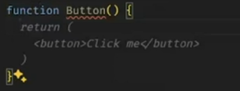

The **DRY principle** stands for **"Don't Repeat Yourself."**

### 🧠 Definition:

> The DRY principle is a software development concept aimed at reducing repetition of code or logic. It encourages **reusability**, **modularity**, and **maintainability**.

So When we want to implement DRY principle, We're going to make reusable UI elements!!So we can use functions!
Encapsulate the logic in a function!! If a error comes just change in the main function and everything will be done!!

Components are based on the DRY principle!
Functions are also based on the DRY principle!!

REACT MEIN BHI COMPONENTS FUNCTIONS KA USE KARKE BN SAKTE HAIN!!
RESUSABLE UI ELEMENTS BNANE HAI MUJHE!

JSX CODE= JAVASCRIPT + HTML

Is function k andar hum sara logic likh sakte hain! UI prespective se and functionality prespective se likh sakte hain!

Toh isee hum batenge ki ye button dikhega kaisa! and karega kya

IS FUNCTION SE HUMEIN UI KA LOGIC KA RETURN KRNA PADEGA!!
### ✅ What You Said Is Correct:

> **"Is function ke andar hum sara logic likh sakte hain — UI perspective se and functionality perspective se."**

Yes — **React function components** like this:

- **Decide what the UI should look like** (HTML-like syntax = JSX).
    
- **Contain functionality** using:
    
    - **Hooks** (`useState`, `useEffect`, etc.)
        
    - **Event handlers** (`onClick`, etc.)
        
    - **Logic** (if-else, loops, etc.)

### 🖼️ UI Perspective:

This function **returns JSX**, so it defines:

- **What elements appear**
    
- **What text or structure they have**
    
- **How they’re nested**

### Final Line (Very Important):

> **"IS FUNCTION SE HUMEIN UI KA LOGIC KA RETURN KARNA PADEGA!!"**

✅ True — if you don't `return` anything, **React won't render** anything to the screen.

