### 🔧 PART 1: **HTTP Basics (from your second image)**

#### ✅ Persistent vs Non-Persistent HTTP

- **Non-persistent HTTP**:
    
    - A new TCP connection for each request/response.
        
    - Example: Browser loads HTML → closes connection → new connection for images.
        
- **Persistent HTTP**:
    
    - One TCP connection is reused for multiple requests/responses.
        
    - Reduces overhead, improves speed.
        

📌 But both are _request-response based_, so the **client always initiates**, meaning:

- No way for the server to “push” data (like “typing…” status) on its own.


### PART 2: **Limitations of HTTP in Chat Apps**

1. **Polling**:
    
    - Client keeps asking: “Any update?” (e.g., every 5 sec).
        
    - Waste of resources.
        
2. **Long Polling**:
    
    - Client asks → server holds connection open until new message appears → replies → client reconnects.
        
    - Better, but still high overhead.
        
3. **Keep-Alive Header**:
    
    - Used with persistent HTTP to avoid reconnecting.
        
    - But still doesn't solve _server push_ problem.


### ⚡ PART 3: **WebSockets – The Game Changer**

WebSockets solve all this.

#### How it works:

- Starts as an HTTP request (`Upgrade: websocket`)
    
- Server upgrades the protocol → opens a **full-duplex** TCP connection.
    
- Now, **both client and server can send messages anytime** — perfect for chats.
    

#### Why it's used in WhatsApp-like apps:

- Real-time updates (e.g. “typing…”)
    
- No repeated handshakes
    
- Low latency, low bandwidth
    

#### Key benefits:

- No HTTP overhead for every message.
    
- Connection stays alive (no need to keep re-requesting).
    
- Bi-directional: Server can say "Milind is typing…" without the client asking.


### 📱 PART 4: **How “Typing…” Works**

Let’s decode your **first image**:

#### Left (Me):

- You type → client sends a small event via WebSocket like:  
    `{ type: "typing", to: "Milind" }`
    

#### Right (Milind):

- Server receives → pushes to Milind’s client:  
    `{ from: "Sourav", type: "typing" }`
    

#### Result:

- Milind sees: **“Sourav is typing…”**
    

✅ All of this happens instantly thanks to the WebSocket connection already open on both sides.


### 🧱 PART 5: Technology Stack Behind the Scenes

| Layer    | Tech                                       |
| -------- | ------------------------------------------ |
| Frontend | React / Flutter / Native iOS/Android       |
| Backend  | Node.js / Java / Go                        |
| Protocol | WebSocket                                  |
| Broker   | Redis / Kafka (for pub-sub in group chats) |
| Storage  | PostgreSQL / MongoDB                       |
| Hosting  | AWS / Azure / GCP                          |
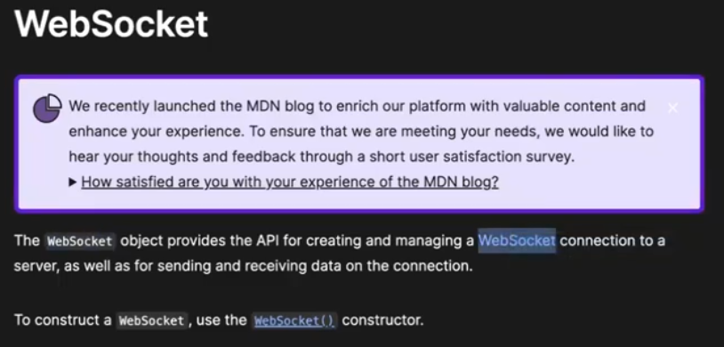

### 1. **HTTP vs WebSockets — Architecture Difference**

|Aspect|HTTP|WebSocket|
|---|---|---|
|Protocol|Request-Response|Full Duplex|
|Underlying|TCP|TCP|
|Connection|Repeated (stateless)|Persistent|
|Use Case|APIs, websites|Real-time chats, live feeds|
|Direction|Client → Server only|Bi-directional (Client ↔ Server)|
|Suitable For|Blogs, forms, static content|WhatsApp, Gaming, Collaboration apps|


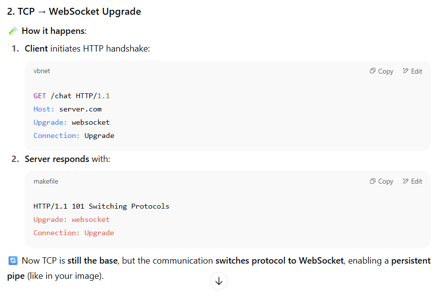

### 3. **WebSocket Pipeline 

🔁 It's like a **tunnel** (pipe) between **Client ↔ Server**:

- Green arrows show **2-way real-time communication**.
    
- Only created **once** → stays **open and alive**.
    
- Perfect for **event-driven architecture**.
    

### 🧠 Keywords to Remember:

- **"Socket pipeline"**: full-duplex connection.
    
- **"Event-driven"**: when something happens (e.g. typing), an event is triggered → sent instantly.
    
- **Built on TCP**: ensures delivery, ordering, and reliability.


### 4. **Why HTTP Can't Do This**

- **HTTP = Stateless**
    
    - No memory of previous requests.
        
    - Server can’t talk unless asked.
        
- **WebSockets = Stateful + Persistent**
    
    - Connection stays alive.
        
    - Server can push data anytime (like "Milind is typing")


### 5. **Libraries Used**

|Language|Library|
|---|---|
|Node.js|`socket.io`, `ws`|
|Python|`websockets`, `FastAPI + WebSocket`|
|Java|`Spring WebSocket`, `Jetty`|
|Browser|Native WebSocket API (`new WebSocket(url)`)|

> ✅ Popular choice: `socket.io` — adds fallback, reconnection, and event support over WebSocket.


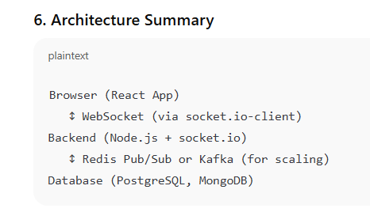

## 🔌 What is **Socket.IO**?

**Socket.IO** is a popular **JavaScript library** that helps you build **real-time, event-based communication** between a **client** (e.g. browser) and a **server** (e.g. Node.js backend).

> Think of it like:  
> ✅ WebSocket = Raw pipe  
> ✅ **Socket.IO = Power tools built over that pipe**


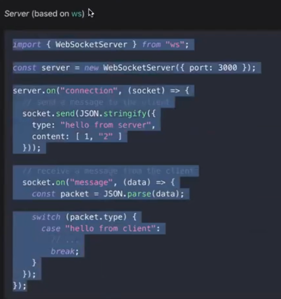

### 🛠️ Key Features of Socket.IO:

| Feature                  | Description                                                                     |
| ------------------------ | ------------------------------------------------------------------------------- |
| ✅ Built on WebSockets    | Uses WebSockets under the hood (when available)                                 |
| 🔁 Auto fallback         | Falls back to long-polling if WebSockets are blocked (e.g. corporate firewalls) |
| ⚡ Real-time              | Instantly push/receive messages                                                 |
| 🔐 Supports auth         | JWT tokens or session-based                                                     |
| 🌍 Supports rooms        | For chat groups, user-specific streams                                          |
| 🚨 Handles reconnections | Auto-reconnect if connection drops                                              |
| 📡 Event-based           | You can define custom events like `"message"`, `"typing"`, `"join-room"` etc.   |
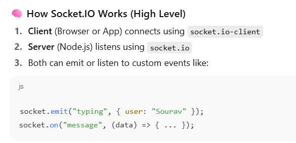

### 👨‍💻 Packages Used

| Side   | Package            | Use                               |
| ------ | ------------------ | --------------------------------- |
| Client | `socket.io-client` | Connect from browser or mobile    |
| Server | `socket.io`        | Run a WebSocket server in Node.js |
### 🤝 Relationship to WebSocket

| WebSocket                 | Socket.IO                           |
| ------------------------- | ----------------------------------- |
| Low-level API             | High-level wrapper                  |
| Requires manual reconnect | Auto reconnect                      |
| Harder to scale           | Easier (built-in rooms, namespaces) |
| No fallback if blocked    | Falls back to HTTP long-polling     |
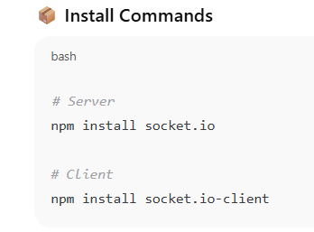


### ✅ Summary

> **Socket.IO** = "Reliable Real-time Engine over WebSockets + HTTP Fallback"

It simplifies:

- 🔄 Bi-directional comm
    
- 💬 Real-time chats
    
- 🧠 Event-driven messages
    
- 🛡️ Auth & reconnections

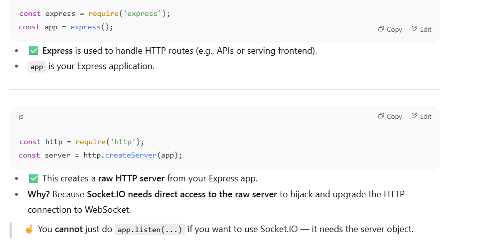

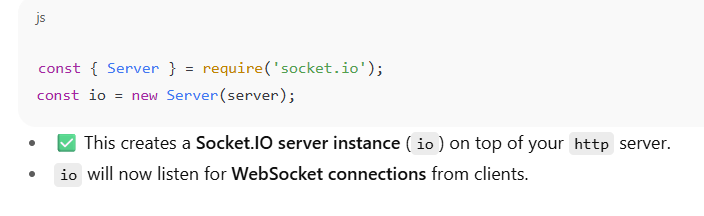

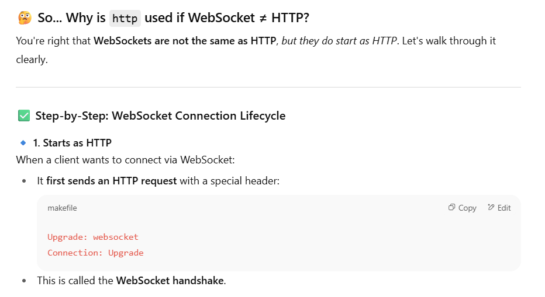

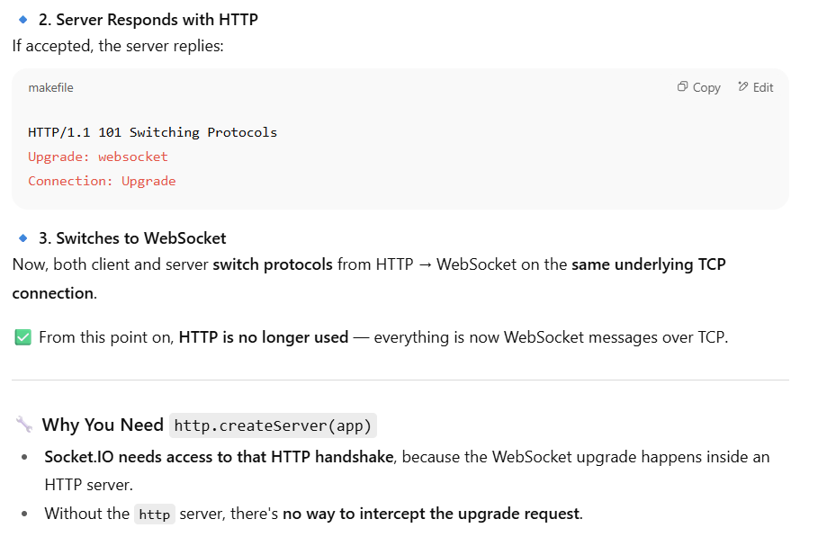
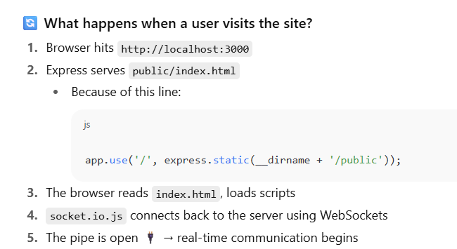

```javascript
const express = require("express");
const path = require("path");
const app = express();
const http = require('http');
const server = http.createServer(app);
const { Server } = require('socket.io');
const io = new Server(server);


app.use('/',express.static(__dirname+'/public'));
server.listen(3000, () => {
  console.log("Server is running on port 3000");
});

```


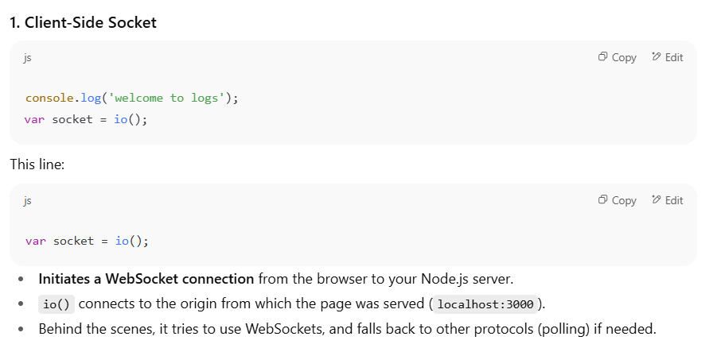

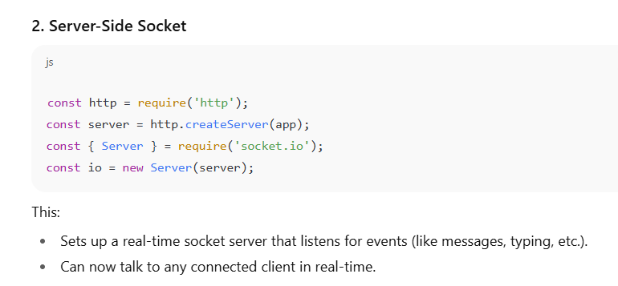


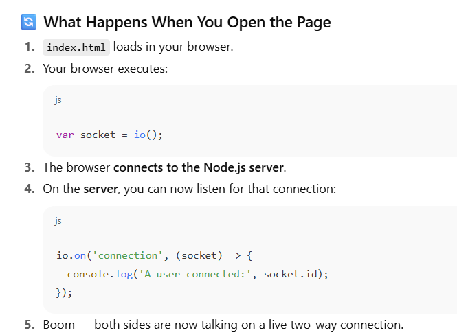

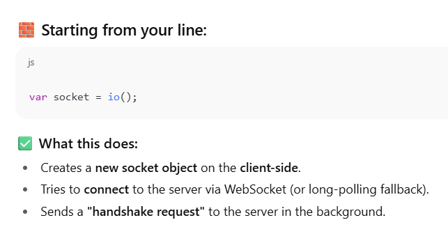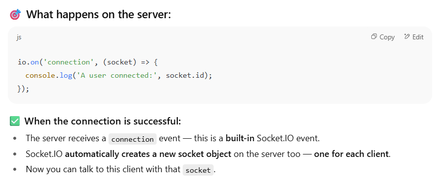

## 🔁 After the connection:

The `socket` object on **both sides** can:

- **Emit events** (`socket.emit('chat message', 'hello')`)
    
- **Listen for events** (`socket.on('chat message', callback)`)

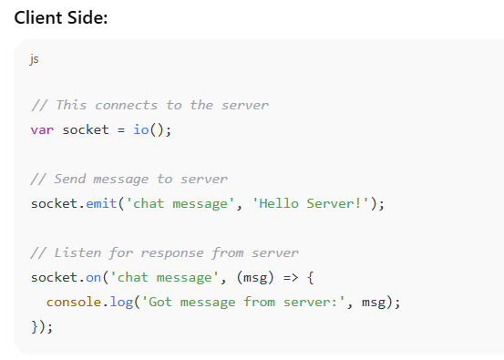

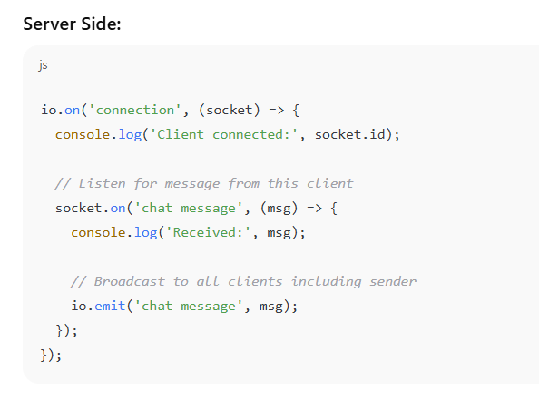

## 🧠 Key Points to Remember:

- `var socket = io();` creates a **persistent, real-time connection** between browser ↔ server.
    
- The `connection` event on the server is like a "new user has entered the chatroom".
    
- After the handshake, both client and server can **continuously talk** by sending/receiving custom events (`chat message`, `typing`, etc.).


| 🔸 Side    | Action                                    | Code                                                      |
| ---------- | ----------------------------------------- | --------------------------------------------------------- |
| **Client** | Actively creates a connection             | `var socket = io();`                                      |
| **Server** | Passively waits & receives the connection | `io.on('connection', socket => {})` — socket auto-created |
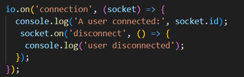

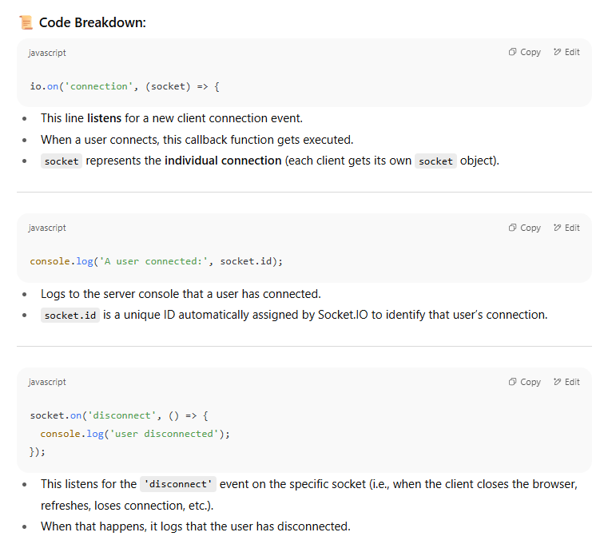

-

### 🔁 Full Flow:

1. A client connects → `'connection'` event fires.
    
2. A `socket` is created for that client.
    
3. Server logs the connection with `socket.id`.
    
4. If the client disconnects → `'disconnect'` event fires → server logs it.

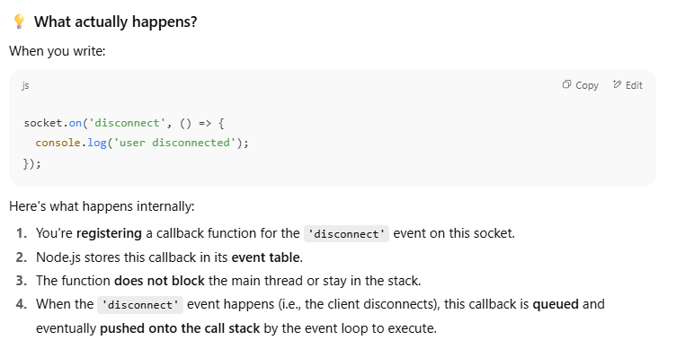

In sockets mostly everything is event driven!!

Well how can i send manual events from both the sides??


### 👉 Yes — **any logic that is related to a specific connected user (socket)** should go inside that `connection` block.

---

### 🧠 Why?

Because:

- `io.on('connection', ...)` runs **every time a new client connects**.
    
- Inside this block, you get access to that particular user's **`socket` object**.
    
- You can now listen to **messages from this user**, and **send messages to this user**.
    

Each `socket` is **unique to that user connection**, so anything like:

- `socket.emit(...)`
    
- `socket.on(...)`
    
- `setInterval(...)` specific to this socket
    

...should be inside this block.

If you keep refreshing the page, the browser **creates new connections** without always closing old ones properly, so you might get multiple `setInterval` calls sending `from_server` over and over.

To fix this in real apps:

- Use `clearInterval` on disconnect.
    
- Keep track of intervals with `let interval = setInterval(...);`
    
- Then `clearInterval(interval)` inside `disconnect` callback.
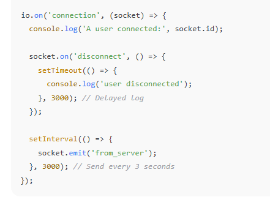

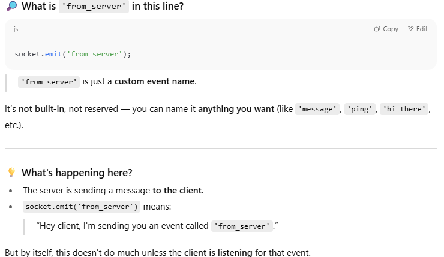

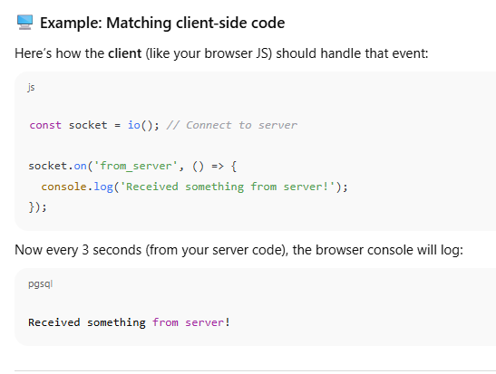

SERVER SIDE
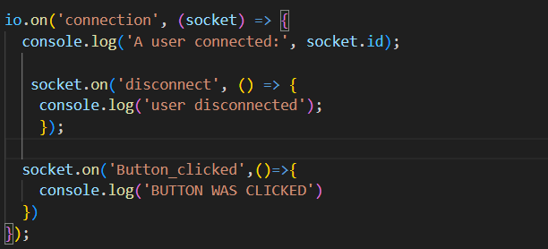

client side

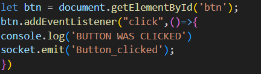

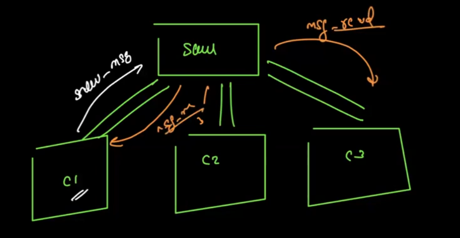

### Diagram Meaning:

- **C1, C2, C3** = Different clients (like 3 users on different browsers/devices).
    
- **Serv** = Your central **server** handling real-time messaging.
    
- Arrows show:
    
    - **C1 sends a message to the server** (`send-msg`)
        
    - **Server receives it**
        
    - **Server broadcasts it to all clients** (`msg-rec`)


CLIENT SIDE 
```javascript
document.addEventListener('DOMContentLoaded',()=>{
  var socket = io();


  let input  = document.getElementById('chat_box');
  let msgList  = document.getElementById('msg_list');
  let send  = document.getElementById('send');
   
  send.addEventListener('click',()=>{
    let msg = input.value
    socket.emit('msg_send',{
        message : msg
    }) 
  });

  socket.on('msg_rec',(data)=>{
    let msg = document.createElement("li");
    msg.textContent = data.message;
    console.log(data.message)
    msgList.appendChild(msg);
  })

})

```


SERVER SIDE 
```javascript
const express = require("express");
const path = require("path");
const app = express();
const http = require('http');
const server = http.createServer(app);
const { Server } = require('socket.io');
const io = new Server(server);


app.use('/',express.static(__dirname+'/public'));

io.on('connection', (socket) => {
  console.log('A user connected:', socket.id);

   socket.on('disconnect', () => {
    console.log('user disconnected');
    });

  socket.on('msg_send',(data)=>{
    console.log(data.message);
    io.emit("msg_rec",data)
  })
});

server.listen(3000, () => {
  console.log("Server is running on port 3000");
});

```


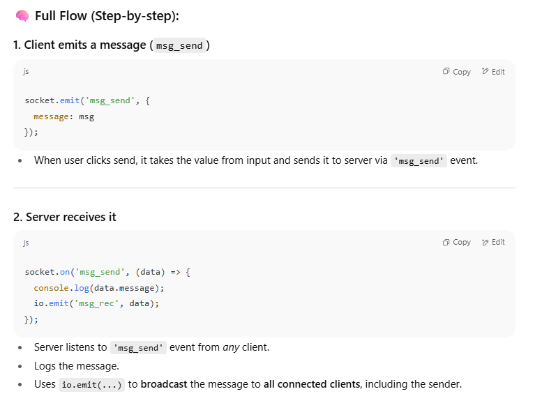


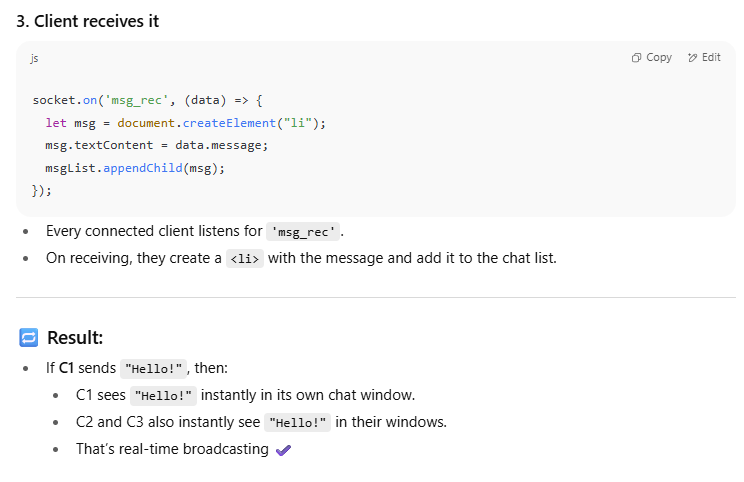


## 🔁 Result:

- If **C1** sends `"Hello!"`, then:
    
    - C1 sees `"Hello!"` instantly in its own chat window.
        
    - C2 and C3 also instantly see `"Hello!"` in their windows.
        
    - That’s real-time broadcasting ✔️


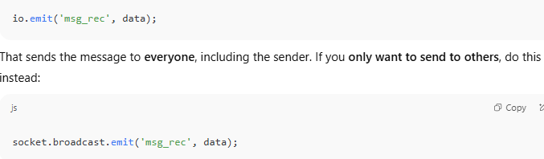

🔥 `io.emit('msg_rec', data)`

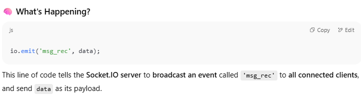

## 🔄 Emission Types in Socket.IO

Before we go deeper, it's important to know **what `io.emit` actually does** in contrast to other ways of emitting.

| Code                         | Who receives the message?                       |
| ---------------------------- | ----------------------------------------------- |
| `io.emit(...)`               | 🔄 **All** connected clients (including sender) |
| `socket.emit(...)`           | 📤 Only the **current socket (sender)**         |
| `socket.broadcast.emit(...)` | 📣 All clients **except the sender**            |
| `io.to(room).emit(...)`      | 🏠 All clients in a specific room               |