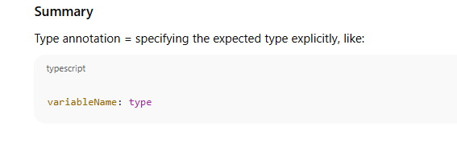
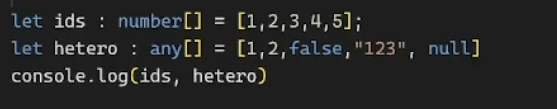
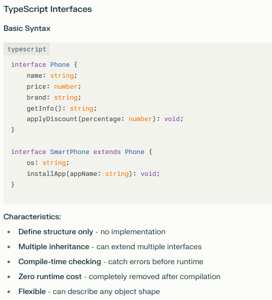
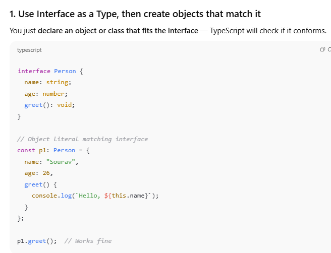
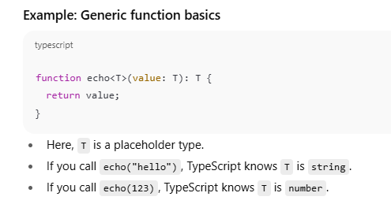

# What is TypeScript?

- **TypeScript** is a **superset of JavaScript** — it adds **static types** to JavaScript.
    
- It helps catch errors **before running** the code by checking types.
    
- It compiles down to plain JavaScript that runs everywhere

# Why use TypeScript?

- Detect errors early (compile-time vs runtime).
    
- Code is easier to read and maintain.
    
- Better tooling support (autocomplete, refactoring).
    
- Helps large teams work on big projects.
---

**Type annotation** in TypeScript is a way to explicitly specify the type of a variable, function parameter, or function return value. It helps the TypeScript compiler understand what kind of data a variable is supposed to hold, enabling better type checking and catching errors early.

---

### What is Type Annotation?

- It is adding a **type** after a variable name or function parameter using a colon `:` followed by the type name.
    
- It tells the compiler what type the variable or parameter is expected to be.

```javascript
let age: number = 25;      // 'age' is explicitly annotated as a number
let name: string = "Sourav"; // 'name' is a string

function greet(name: string): void {   // 'name' parameter is string, function returns nothing (void)
  console.log("Hello, " + name);
}

greet("Rajvi"); // OK
// greet(123); // Error: Argument of type 'number' is not assignable to parameter of type 'string'

```

### Why use Type Annotations?

- **Error prevention**: Detect mistakes early during development.
    
- **Code clarity**: Make code more readable and self-documenting.
    
- **Better tooling**: Editors can provide better autocomplete and refactoring support 





## When does TypeScript infer types?

- When you initialize a variable at the time of declaration.
    
- When you return a value from a function.
    
- When you assign values to object properties or array elements.


### Summary:

|Concept|Explanation|Example|
|---|---|---|
|**Type Annotation**|Explicitly writing the type|`let age: number = 30;`|
|**Type Inference**|TypeScript guesses the type based on initial value|`let age = 30;` (inferred number)|


## What is `any` type?

- The `any` type means **“anything goes”** — the variable can hold a value of **any type**.
    
- It disables all type checking for that variable.
    
- It’s like opting out of TypeScript’s type system for that variable.


Yahan error aega na bhai!!

Js has hetrogenous arrays!!




## What is a Typed Tuple?

- A **tuple** is a fixed-length array where each element has a **specific type**.
    
- Unlike normal arrays (which can have any number of elements of the same type or union types), tuples enforce:
    
    - The **number of elements** is fixed.
        
    - The **type of each element at a specific position** is fixed


## Tuple vs Array

|Feature|Array|Tuple|
|---|---|---|
|Length|Variable|Fixed|
|Types of elements|All same type or union types|Each position has a specific type|
|Example declaration|`number[]` or `(number|string)[]`|

```javascript
let p1 = {
    name: "Iphone",
    price: 100000,
    brand: "apple"
};

let c1 = {
    name: "control",
    price: 100000,
    brand: "hyundai"
};

p1 = c1;

```

This is bad right!!!
- **JavaScript's dynamic typing** allows `p1 = c1` because both objects have similar structures


## Why do we need Interfaces?

### 1. **Define a contract for objects**

Interfaces allow you to describe the **shape of an object** — what properties and methods it should have — without implementing it. This helps ensure consistency and predictability.

Example: If you want many parts of your program to work with a "User" object, an interface defines what a "User" must look like.

### 2. **Code readability and maintenance**

Interfaces make your code **self-documenting**. Other developers (or you in the future) can easily understand what structure an object should follow.

### 3. **Type safety**

Interfaces help the TypeScript compiler check that objects **conform** to a specific shape, catching mistakes early before runtime.

### 4. **Reusability and flexibility**

You can reuse interfaces across different parts of your codebase. They also let you create complex types by **extending** other interfaces or **combining** multiple interfaces.

### 5. **Supports structural typing**

Interfaces work well with TypeScript's **structural typing** — if an object matches the interface shape, it is valid, even if it wasn't explicitly declared as that interface.


## Summary:

|Feature|Description|Example|
|---|---|---|
|Define object shape|Specify required properties and types|`interface Person { ... }`|
|Optional properties|Properties that may or may not be present|`isStudent?: boolean`|
|Readonly properties|Cannot be reassigned after initialization|`readonly id: number`|
|Functions as interfaces|Define function signatures|`(a: number, b: number) => number`|
|Interface extension|Inherit properties from other interfaces|`interface Employee extends Person`|

**TypeScript Interfaces** are compile-time contracts that define the structure of objects. They exist only during development and disappear after compilation.

## Key Differences

|Aspect|JavaScript Classes|TypeScript Interfaces|
|---|---|---|
|**Runtime Existence**|Exist at runtime|Compile-time only|
|**Purpose**|Create object instances|Define object structure|
|**Inheritance**|Single inheritance|Multiple inheritance|
|**Implementation**|Contains actual code|Pure type definition|
|**Memory Usage**|Creates prototype chain|Zero runtime overhead|


CLASS 





## When to Use Each

## Use **Classes** When:

- You need to **create multiple instances** of objects
    
- You want **shared behavior** across instances
    
- You need **runtime type checking** (`instanceof`)
    
- You're working in **pure JavaScript**
    
- You need **inheritance** with actual implementation
    

## Use **Interfaces** When:

- You want to **define contracts** for objects
    
- You need **multiple inheritance**
    
- You want **compile-time type safety** without runtime overhead
    
- You're describing **data structures** or **API contracts**
    
- You want **flexibility** in implementation

You **cannot create an instance of an interface directly** because interfaces are just type definitions, not actual code.


### So, what do you do if you want to:

- **Define the shape of an object** with an interface, _and_
    
- **Create objects that conform to that interface?**




# Functions in TypeScript

TypeScript adds **static typing** to JavaScript functions, making your code safer and easier to understand.


## TypeScript is converted to JavaScript?

This is called **transpilation** (or compilation):

- The **TypeScript compiler (`tsc`)** takes `.ts` files as input.
    
- It **checks types and syntax** for errors.
    
- If there are no blocking errors, it **removes all TypeScript-specific syntax** (like type annotations) and outputs clean **JavaScript** code.
    
- This JS code can then run anywhere JS runs: browsers, Node.js, etc.


## . Why do we do this? (Benefits of TypeScript)

- **Early error detection:** TypeScript catches many mistakes **before running** your code, reducing runtime bugs.
    
- **Better tooling:** Editors provide autocomplete, refactoring, and inline documentation based on types.
    
- **Improved code readability:** Types serve as documentation.
    
- **Scalability:** Larger codebases benefit from stricter typing and structure.
    
- **Modern JS features:** TS supports features that may not yet be supported in all environments and compiles them down.


## When and how do we do this?

### When?

- When building projects that need **strong typing**, better maintainability, or teamwork.
    
- When you want to use modern JS features safely.
    
- When you want to catch bugs early.
    

### How?

- Write code in `.ts` files using TypeScript syntax.
    
- Use the **TypeScript compiler (`tsc`)** or build tools like **Webpack, Babel**, or frameworks that integrate TS.
    
- Run `tsc` to compile TS → JS, generating `.js` files.
    
- Deploy or run the generated JS files.

## . What do we do after compilation?

- The output JS files are the ones actually executed.
    
- You **never run TS directly** in production.
    
- You can configure the compiler to control JS version output (`ES5`, `ES6`, etc.).
    
- You can use tools like **ts-node** for running TS directly during development, but it compiles behind the scenes.


The **`?`** in TypeScript is the **optional operator**. It makes parameters, properties, or variables **optional** - meaning they don't have to be provided and can be `undefined`.

## Key Rules and Behavior

## 1. **Optional Parameters Must Come Last**


- **`?`** makes parameters/properties **optional**
    
- Optional values become **`undefined`** if not provided[](https://www.typescripttutorial.net/typescript-tutorial/typescript-optional-parameters/)
    
- Always handle the `undefined` case in your code
    
- Optional parameters must come **after required ones**[](https://www.geeksforgeeks.org/typescript/typescript-optional-parameters/)
    
- Use **default parameters** (`= value`) when you want fallback values instead of `undefined`
    

The `?` operator is essential for creating flexible, user-friendly APIs that don't force users to provide every possible parameter!


## Date Object in TypeScript

- TypeScript uses the **built-in JavaScript `Date` object** for date and time.
    
- Since TypeScript is a superset of JavaScript, you use `Date` exactly the same way, but with type annotations.

let today: Date = new Date();


## Important Tips

- Always type Date variables as `Date` to get full type checking and IntelliSense.
    
- Be careful with timezones when parsing or formatting dates.
    
- Remember JavaScript dates are mutable objects.


## What is `any` type?

- The `any` type disables all type checking.
    
- Variables typed as `any` can hold **any value** — string, number, object, function, etc.
    
- Using `any` is like opting out of TypeScript’s safety for that variable.


## Why use `any`?

- When you don’t know the type upfront (e.g., data from external APIs).
    
- For quick prototyping.
    
- To gradually migrate JavaScript to TypeScript.

## Why avoid `any` when possible?

- You lose type safety and autocomplete.
    
- Makes your code prone to runtime errors.
    
- Defeats the purpose of using TypeScript.


## Summary:

| Type         | Behavior                                 | When to use                      |
| ------------ | ---------------------------------------- | -------------------------------- |
| `any`        | No type checking, any operations allowed | Prototyping, unknown data shapes |
| `unknown`    | Must check type before using             | Safer alternative to `any`       |
| Proper types | Full type safety and autocomplete        | Preferred for production code    |
## What is `void` type?

- `void` represents the **absence of a value**.
    
- It is mainly used to indicate that a function **does not return anything**.


## `void` vs `undefined`

- `void` is a type to indicate **no return value**.
    
- The value returned by a `void` function can be `undefined` or nothing.
    
- Variables can rarely be typed as `void`, but it’s uncommon.
    


`let unusable: void = undefined;  // Allowed // unusable = 5;  // Error`


## What is an `enum`?

- `enum` (short for _enumeration_) is a special TypeScript type that allows you to define a set of **named constants** that are not going to change
    
- It helps make your code more readable and meaningful by using names instead of raw numbers or strings.


Also having raw string lying in my code will make it error prone!!!


IN PRODUCCTION LEVEL CODEBASE ENUMS ARE USED VERY MUCH


## What is Type Inference?

- **Type inference** means TypeScript **automatically figures out the type** of a variable based on the value you assign.
    
- You don’t always need to explicitly specify types — TS can “guess” them


|Concept|Explanation|
|---|---|
|Type Inference|TS guesses variable type from assigned value|
|Benefits|Less code, type safety, better tooling support|
|Limits|Can be too general sometimes, explicit types help|


# 1. What are Type Aliases?

- **Type aliases** let you create a new name for any type — object types, primitives, unions, tuples, etc.
    
- They’re created using the `type` keyword


# Key Differences Between Type Aliases and Interfaces

|Feature|Type Alias|Interface|
|---|---|---|
|Can describe|Objects, primitives, unions, tuples, etc.|Only objects and classes|
|Declaration merging|**No**|**Yes** (you can declare same interface multiple times and they merge)|
|Extending/Inheriting|Uses intersections (`&`)|Uses `extends` keyword|
|Syntax flexibility|More flexible (unions, tuples, etc.)|Limited to object shapes|
|Readability for objects|Good|Very good and widely used for objects|
|Can be implemented by classes|No direct `implements` keyword for types|Yes, classes can implement interfaces|


### Can interfaces describe arrays?

Yes! Arrays in JavaScript are objects with numeric keys and a `length` property, so index signatures in interfaces let you describe arrays or array-like objects.


- **Type aliases** like `type stringArray = string[];` give a name to a type, here an array of strings.
    
- **Interfaces with index signatures** describe the shape of objects or arrays that can be accessed via numeric keys.
    
- Both are useful for typing arrays but serve slightly different purposes.


## Differences Between Tuple and Interface Here

|Aspect|Tuple (`type pair = [number, number]`)|Interface (`pairInterface`)|
|---|---|---|
|Structure|Fixed-length array with positional elements|Object with named properties|
|Access|Access via index: `pair[0]`, `pair[1]`|Access via names: `pairInterface.first`|
|Semantic meaning|Usually ordered list or coordinate-like data|Named properties provide clearer meaning|
|Mutability|Mutable array (can push/pop if not readonly)|Mutable object properties|
|Use cases|When order matters, like coordinates, RGB|When keys need descriptive names|

---

## When to use what?

- Use **tuples** when:
    
    - The position of each element is important.
        
    - You want to represent a fixed sequence of values.
        
    - Example: `[latitude, longitude]`, `[R, G, B]`
        
- Use **interfaces (objects)** when:
    
    - You want more readable code with named properties.
        
    - You want to represent entities with attributes.
        
    - Example: `{first: 10, second: 20}`, `{x: 5, y: 10}`


Both **type aliases** and **interfaces** in TypeScript can be used to describe **function types**


|Feature|Type Alias|Interface|
|---|---|---|
|Syntax|`type Fn = (args) => returnType;`|`interface Fn { (args): returnType }`|
|Can represent|Functions, primitives, unions, tuples, etc.|Only callable signatures (functions)|
|Extendability|Uses intersections for extension|Can extend other interfaces|
|Usage flexibility|More flexible (can also represent complex types)|More specialized for object shapes and functions|


|Concept|`type`|`interface`|
|---|---|---|
|Can represent union types|✅ Yes|❌ No|
|Can represent object types|✅ Yes|✅ Yes|
|Can represent primitives|✅ Yes|❌ No|
|Can extend others|✅ Intersection (&), extend interfaces|✅ extend interfaces|

## 1. Interfaces support OOP concepts in TypeScript

- Interfaces define **contracts** that classes can **implement**.
    
- This means a class agrees to have certain properties and methods specified by the interface.
    
- Interfaces support **inheritance** via `extends`.
    
- This is fundamental to applying OOP principles like **abstraction** and **polymorphism** in TS.

## 2. Interface Merging (Declaration Merging)

- If you declare **two interfaces with the same name**, TypeScript **automatically merges** their members into a single interface.
    
- This feature allows splitting interface definitions across files or augmenting existing interfaces (like from libraries).


Now here we can't do c1 = c2 here!!


```javascript
let schoolName: "DPS" | "DAV" = "DPS";
let another: string = "KV";

another = schoolName;   // Allowed because union of literals is subtype of string

console.log(another);

type Complex = {
    real: number,
    imag: number,
    add: (C: Complex) => Complex
}

interface IComplex {
    real: number,
    imag: number,
    add: (C: IComplex, i: number) => IComplex
}

let c1: Complex = {
    real: 10,
    imag: 10,
    add: (C: Complex) => { return C }
};

```


## 1. Assignment between `schoolName` and `another`

- `schoolName` can only be `"DPS"` or `"DAV"`.
    
- `another` can be **any** string.
    
- Assigning from **narrower to wider** (`schoolName` → `another`) is **allowed**.
    
- Opposite (`another` → `schoolName`) is **not allowed** because it may hold invalid strings.
    

---

## 2. Type compatibility between `Complex` and `IComplex`

### When can you assign one object type to another?

- TypeScript uses **structural typing** (duck typing).
    
- You can assign one type to another **if it has all required properties/methods with compatible types**.
    
- The target type’s properties **must exist and be compatible** in the source.


### Comparing `Complex` and `IComplex` types

|Property|`Complex`|`IComplex`|Compatible?|
|---|---|---|---|
|`real`|`number`|`number`|Yes|
|`imag`|`number`|`number`|Yes|
|`add`|`(C: Complex) => Complex`|`(C: IComplex, i: number) => IComplex`|No — different parameter counts and types|

- **Function types must be compatible:**
    
    - `Complex.add` takes **1 parameter** of type `Complex` and returns `Complex`.
        
    - `IComplex.add` takes **2 parameters** (`IComplex`, `number`) and returns `IComplex`.
        
- These are **not compatible** because the parameter list and return types differ.


## CLASS


This will work fine!!

```javascript
class Product {
    name: string;
    price: number = 10;
    
    constructor(name: string, price?: number) {
        this.name = name;
        this.price = price;
    }
    
    display(): void {
        console.log("Product name is", this.name, " and price is ", this.price);
    }
}

const p1 = new Product("Iphone", 1000000)
```


Here, `price` is declared as an **optional parameter** (`price?: number`), so its type is effectively `number | undefined`. But your class property `price` is declared as `number` (non-optional), so assigning `undefined` to it causes a **type error**.


Objects jahan bnni hoti on the go use classes

| Aspect                        | Class                         | Type Alias                             | Interface                                      |
| ----------------------------- | ----------------------------- | -------------------------------------- | ---------------------------------------------- |
| Represents                    | Concrete object with behavior | Compile-time type alias                | Compile-time object shape                      |
| Exists at runtime             | Yes                           | No                                     | No                                             |
| Can define methods            | Yes                           | No                                     | No (only signatures)                           |
| Can extend/inherit            | Yes                           | No (but can do intersection `&`)       | Yes                                            |
| Can merge declarations        | No                            | No                                     | Yes                                            |
| Can represent unions/tuples   | No                            | Yes                                    | No                                             |
| Can be implemented by classes | N/A                           | No                                     | Yes                                            |
| Use when                      | You want OOP with instances   | You want reusable/complex type aliases | You want flexible object contracts and merging |


```typescript
class Product {
    public name: string;
    private price: number | undefined;
    readonly category: string;
    readonly tags: string[];
    
    constructor(name: string, category: string, price?: number) {
        this.name = name;
        this.category = category;
        this.price = price;
        this.tags = ["electronics", "mobile"];
    }
    
    display(): void {
        this.tags[0] = "something";
        console.log("Product name is", this.name, " and price is ", this.price);
    }
    
    setPrice(p: number): void {
        if(p <= 0) return;
        this.price = p;
    }
}

const p1 = new Product("Iphone", "electronics", 1000000);
p1.setPrice(-20);
const arr = [10, 20];
arr[0] = 0;

```


## 1. What does `readonly` mean in a class?

- A property marked as `readonly` **can only be assigned once** — either:
    
    - When declared (initialized), or
        
    - Inside the constructor of the class.
        
- After that, **you cannot change its value** anywhere else.


## 2. How is `readonly` similar to `const`?

|Feature|`readonly` (class property)|`const` (variable)|
|---|---|---|
|Assignment allowed only once|Yes — at declaration or in constructor|Yes — only at declaration|
|Prevents reassignment|Yes|Yes|
|Scope|Applies to **properties of class instances**|Applies to **variables**|
|Mutation of referenced objects|Allowed (if property is an object or array)|Allowed (if variable holds object/array)|
|Example|`readonly tags: string[];`|`const tags = ["a", "b"];`|


## 4. Why use `readonly` instead of just `const`?

- **`const`** is for variables — cannot be reassigned.
    
- **`readonly`** is for **class properties** — instance variables you want to protect from reassignment after construction.
    
- You **can’t use `const` on class properties**.


**Code duplication** when you write separate functions for similar logic but different types.

Here, `linearSearch` and `linearSearchForString` do the same thing, but with `number` and `string` arrays, and different tuple return types.

### The solution? Use **Generics** in TypeScript!

Generics let you write **one reusable function** that works with any type **while preserving type safety**


A generic function is like a machine that:

- **Takes a type as input** (either explicitly or inferred),
    
- **Processes a value of that type**, and
    
- **Returns a value of the same type**.


You wrote two functions that do the same thing — search in an array — but one is for numbers, the other for strings.

This means:

- You repeat the **same logic** twice.
    
- It’s harder to maintain if you want to change the logic later.
    

---

## What do we want?

- **One function** that can search **any kind of array** (numbers, strings, objects, etc.).
    
- And **keep the type info** (so if you search a string array, you get a string back; if it’s a number array, you get a number).
    

---

## How do we do that?

By using **Generics** — think of generics like placeholders for types.





## Why is this better?

- You write the search logic **once**.
    
- It works for **any array type**.
    
- TypeScript still knows the **correct types** for you.
    
- You **avoid duplication** and keep your code clean.


Think of generics as the **skeleton** of a function or type — the fixed structure and logic — while the **skin** is the specific type that can change depending on what you use.

So the **shape and behavior stay the same**, but the exact details (the “skin”) adapt to the type you provide.

---

This is why generics are super powerful — you write the logic once, and it works seamlessly with any data type.


- Generics help **avoid duplication** by abstracting over types.
    
- They preserve **type safety** unlike using `any`.
    
- You can handle "not found" cases by returning a union type or `null`.


## Generic Stack class

```typescript
class Stack<T> {
  private items: T[] = [];

  // Add item to the top of the stack
  push(item: T): void {
    this.items.push(item);
  }

  // Remove and return the top item from the stack
  pop(): T | undefined {
    return this.items.pop();
  }

  // Return the top item without removing it
  peek(): T | undefined {
    return this.items[this.items.length - 1];
  }

  // Check if the stack is empty
  isEmpty(): boolean {
    return this.items.length === 0;
  }

  // Return the number of items in the stack
  size(): number {
    return this.items.length;
  }
}

```


LINKED LIST 

```typescript
// Node class for linked list
class ListNode<T> {
  value: T;
  next: ListNode<T> | null = null;

  constructor(value: T) {
    this.value = value;
  }
}

// Generic LinkedList class
class LinkedList<T> {
  private head: ListNode<T> | null = null;

  // Add a new node at the end
  append(value: T): void {
    const newNode = new ListNode(value);

    if (!this.head) {
      this.head = newNode;
      return;
    }

    let current = this.head;
    while (current.next) {
      current = current.next;
    }

    current.next = newNode;
  }

  // Add a new node at the beginning
  prepend(value: T): void {
    const newNode = new ListNode(value);
    newNode.next = this.head;
    this.head = newNode;
  }

  // Print all values in the list
  printList(): void {
    let current = this.head;
    let result = '';
    while (current) {
      result += `${current.value} -> `;
      current = current.next;
    }
    result += 'null';
    console.log(result);
  }

  // Find the first node with the given value
  find(value: T): ListNode<T> | null {
    let current = this.head;
    while (current) {
      if (current.value === value) {
        return current;
      }
      current = current.next;
    }
    return null;
  }

  // Remove the first node with the given value
  remove(value: T): void {
    if (!this.head) return;

    if (this.head.value === value) {
      this.head = this.head.next;
      return;
    }

    let current = this.head;
    while (current.next && current.next.value !== value) {
      current = current.next;
    }

    if (current.next && current.next.value === value) {
      current.next = current.next.next;
    }
  }
}

```


## What is a Generic Interface?

A **generic interface** allows you to define an interface with a **type parameter** (like `<T>`) so that the interface can work with different types while still keeping strong type safety.

---

## Why use generic interfaces?

- To create flexible, reusable interfaces.
    
- To define contracts where some part of the structure depends on a type that you provide later.


Generic interfaces **make your life much easier** because they let you **write flexible, reusable code without repeating yourself**, while still keeping **type safety**.


