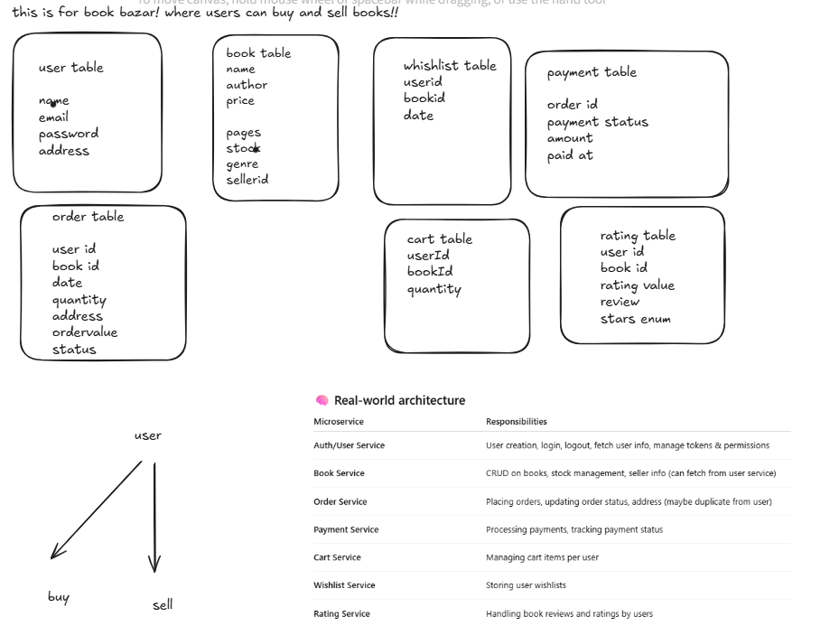
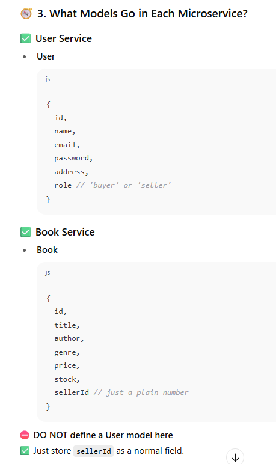
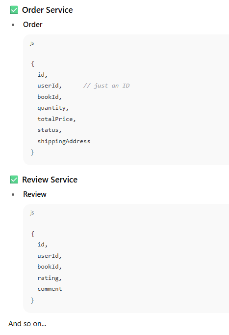
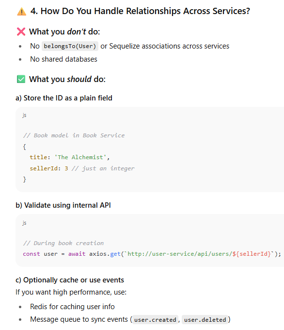
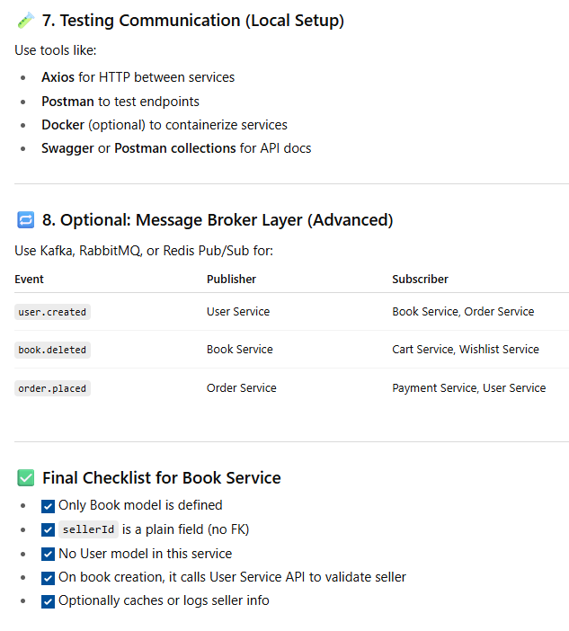

## 📚 Goal

Build a **Book Bazaar backend** using **Microservice Architecture**, where each service is independent, owns its own database, and communicates with others via **API or events**.

## 🧱 1. What is a Microservice?

Each **microservice** is:

- Independent
    
- Focused on a single domain (e.g., books, users, orders)
    
- Has its own codebase + database
    
- Communicates with others through **HTTP APIs** or **message queues**

## 🧩 2. What are the Services in Book Bazaar?

|Microservice|Responsibilities|
|---|---|
|**User Service**|Sign up, login, manage user profile|
|**Book Service**|CRUD on books, seller-related listings|
|**Order Service**|Order creation, status tracking|
|**Cart Service**|Manage user cart|
|**Wishlist Service**|Track user's saved items|
|**Rating/Review Service**|User reviews for books|
|**Payment Service**|Payments, transactions|

## ✅ **Stick with a Review model inside Book Service** if:

- Reviews are only for **books**.
    
- You don’t plan to have reviews for **other entities** (like authors, sellers, products, etc.).
    
- The review logic is **closely tied to books** (like fetching book details along with reviews, computing average rating, etc.).
    
- You’re early in development and want to keep things simple.
    

> This is the **most practical and common approach** for a book app like yours.

---

## 🧠 Create a separate Review Service if:

- You want a **fully decoupled microservices architecture**.
    
- Reviews might be used for **multiple domains**, not just books (e.g., reviews for sellers, authors, courses, etc.).
    
- You need **independent scaling** or deployments for the review logic.
    
- You’re optimizing for future scalability and distributed teams.
    

But this comes with **added complexity**:

- You’ll need cross-service communication (e.g., REST API or message queues).
    
- You lose easy access to Book info inside the Review Service.

