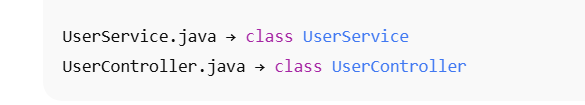
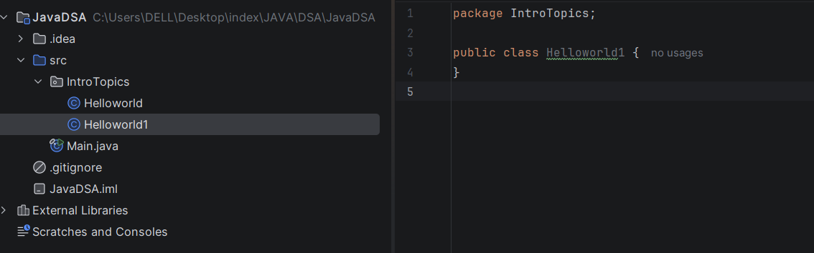
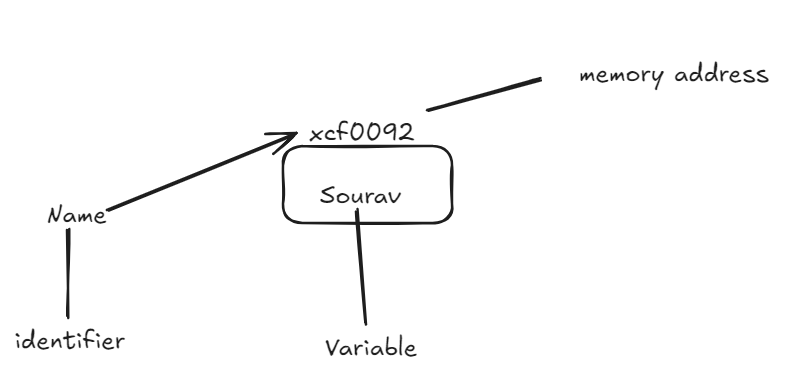

> **One `.java` file = one class**


The class name **must match** the file name.





Class Helloworld1 and file name is same as well which is Helloworld1
### Java does **not** use relative paths (`../`)
Here Package is equivalent to folders 


# **1\. What is a package? (Simple definition)**

A **package** in Java is just a **folder** that groups related classes together.

Like this:

```
com
 └── myapp
      ├── utils
      └── models
```

Packages help with:

- Organizing code
- Avoiding name conflicts
- Access control (public, default)
- Reusability

---

# **2\. Package declaration (ALWAYS at top)**

If your file is inside a folder called `x`, your Java file **must start with**:

```
package x;
```

Example structure:

```
src/
 └── x/
      ├── A.java
      └── B.java
```

Then inside each file:

```
package x;

public class A {
    // class code
}
```

⚠️ Important:

- Must be the **first line** (after comments)
- Every class file inside the package **must** declare the same package name.

---

# **3\. How Java finds your class (folder = package)**

If a file is inside:

```
src/com/company/project/MyClass.java
```

Then the code **must start with**:

```
package com.company.project;
```

Java uses folder structure to find classes, so **folder and package name must match**.

---

# **4\. Using classes from another package → use `import`**

If package `x` wants to use a class L from package `z`, you write:

```
import z.L;
```

Example:

```
package x;

import z.L;

public class A {
    L obj = new L();
}
```

---

# **5\. Without import (fully qualified name)**

If you don’t write `import`, you can still access the class like this:

```
package x;

public class A {
    z.L obj = new z.L();
}
```

People rarely do this because it looks messy.

---

# **6\. Importing many classes from one package**

### Import one class:

```
import z.L;
```

### Import all classes in a package:

```
import z.*;
```

⚠️ Very important:

- `import z.*;` imports **classes**, NOT subpackages.
- Subpackages are separate:
	- `z.utils` is not included.

---

# **7\. What doesn’t need import**

Java automatically imports:

```
java.lang.*
```

So classes like:

- `String`
- `System`
- `Math`
- `Integer`

don’t need an import.

Example:

```
String s = "hello";
System.out.println(s);
```

---

# **8\. Default package (no package line)**

If you write a class **without** a `package` statement:

```
public class Test {
}
```

Then it belongs to the **default package**.

But:

- Default package classes **cannot be imported** into classes that have a package.
- Good Java projects **never** use the default package.

---

# **9\. Why packages exist (real reason)**

Packages solve real-world problems:

### ✔ Organizing code

Like folders on your computer.

### ✔ Avoiding name conflicts

You can have:

```
x.User
y.User
```

Both are allowed because they’re in different packages.

### ✔ Access control

`protected` and default access depends on being in the same package.

### ✔ Build tools (Maven/Gradle) rely on them

Projects map directory structure to packages.

---

# **10\. Quick mental model (very easy)**

Think of Java like a house:

🏠 **Package = Room**  
📄 **Class = Item in the room**  
📦 **Import = Bringing an item from another room**

If you want to use something from another room, you must **import** it.

---

# **11\. Final Summary (Short & Crisp)**

### ✔ Put `package x;` at the top of every file inside folder `x`

### ✔ Use `import z.L;` to use class `L` from package `z`

### ✔ Or use fully qualified names: `z.L obj = new z.L();`

### ✔ `import z.*;` imports all classes but NOT subpackages

### ✔ `java.lang` is auto-imported

### ✔ Avoid default package


Whatever logic you want to run when the program executes goes **inside the `main` method's curly braces `{}`**.

Like this:

```java
public class Helloworld1 {
    public static void main(String[] args) {
        System.out.println("Hello, Sourav!");
    }
}
```

Anything you want the program to *do* goes **between these brackets**:

```java
{
    // your code runs here
}
```

But **Java requires `public` + `static` + `void`** for the entry point.

It must be:

```java
public static void main(String[] args){

}
```

Otherwise your Java program **won’t run** because the JVM won't recognize it as the main entry method

# **Why every Java application has to be inside a class**

Because **Java is a purely object-oriented language**, and its entire design is based on:

> **Everything lives inside a class.**

Java was built with the philosophy:

- No standalone functions
    
- No top-level code (unlike Python or JavaScript)
    
- Every piece of code must belong to a **class**

Here are the **three real reasons** (clear and simple):

---
## BECAUSE
## **1\. Object-Oriented Philosophy**

Java was designed with strong OOP principles.

In OOP:

- Data = inside classes
- Functions = methods inside classes

So Java forces you to put code inside a class.

**Example:**

```
public class Hello {
    public static void main(String[] args) {
        System.out.println("Hi");
    }
}
```

---

## **2\. JVM needs a *class* as an entry point**

The Java Virtual Machine (JVM) does not run raw code.  
It loads **classes** and looks for a method named:

```
public static void main(String[] args)
```

This main method is the **entry door**.  
So without a class → JVM has nothing to load.

---

## **3\. Java compiles .java → .class**

Java never compiles into a single script.  
Every file becomes a **.class** file.

Example:

`Hello.java` → `Hello.class`

So the compilation system expects code to belong to a class.

---

# 🧠 Simple Analogy

Think of Java like a house:

- **Class = Room**
- **main() = Door**
- JVM = Person entering the room

Without a room (class), there is **no door** for JVM to enter.

---

# ✔️ Stated simply (best one-liner)

> **Java forces every piece of code to live inside a class because the JVM loads classes, not raw code.**

---

# 🧩 But then why is `main()` static?

Because when the program starts:

- No objects exist yet
- Java cannot call a method that belongs to an object
- So it calls a method that belongs to the class itself → **`static`**

---

# ⚡ Key takeaway

| Concept | Reason |
| --- | --- |
| Code must be inside a class | Java is object-oriented |
| JVM needs a class | JVM loads classes, not raw code |
| main() must be static | Runs before objects are created |
# ✅ **2. Then who looks for the main method?**
👉 **The JVM (Java Virtual Machine)**  
—not the compiler—

When you run:

```
java Test
```

JVM expects **this exact signature**:

```
public static void main(String[] args)
```

Because this is the **entry point of the program**.

---

# 🧠 Why *must* it look exactly like this?

Because JVM has to call `main()` **without creating any objects**, so it must be:

- `public` → JVM can access it
- `static` → JVM can call it without objects
- `void` → JVM doesn’t expect a return value
- `String[] args` → arguments from command line

If anything is changed, JVM **won’t recognize it**.

Example:

```
static void main(String[] args)   // ❌ missing public
```

JVM will say:

```
Main method not found
```

---

# ✅ **3\. Why does main() run automatically? Why no one calls it?**

Because your program is a **guest**, and JVM is the **host**.

### → The JVM is the one who calls `main()` automatically.

You never call it.

This is how many languages work:

| Language | Entry Point | Who calls it |
| --- | --- | --- |
| Java | `public static void main` | JVM |
| C | `int main()` | OS loader |
| JavaScript (Node) | top-level code | Node runtime |
| Python | top-level code | Python interpreter |
| Swift | `@main` | Swift runtime |
| Kotlin | `fun main()` | JVM (same as Java) |

So Java is not unique —  
almost all languages have **an automatic starting function**.

But Java’s main() looks strict because Java is strict.

---

# 🧩 Simpler analogy

Think of JVM as a theatre manager.

- You (developer) write the script.
- The manager (JVM) chooses where the play begins.
- It always starts reading from **main stage** → `main()`.

So:

> **Nobody in your code calls main() because the JVM calls it for you.**

---

# 🏁 Final Summary (Super Simple)

- Compiler (javac) does **not** care about main().
- JVM (java) **requires** a `public static void main(String[] args)` as the entry point.
- The JVM automatically calls main(), so you don’t need to.
- Every language has an entry point; Java just makes it explicit.


## INPUT AND OUTPUT
# ⭐ PART 1: OUTPUT (Printing)

Java prints using:


### ✅ 1. `System.out.println()`

Prints and moves to the next line.

```
System.out.println("Hello Sourav");
```

Output:

```
Hello Sourav
```

---

### ✅ 2. `System.out.print()`

Prints but **does NOT** move to the next line.

```
System.out.print("Hello ");
System.out.print("Sourav");
```

Output:

```
Hello Sourav
```

---

### ✅ 3. `System.out.printf()`

Formatted printing (like C).

```
System.out.printf("Age: %d", 25);
```

Output:

```
Age: 25
```


A variable is a named memory location used to store data.  
To identify and access the storage area, each variable must be given a unique name, called a Java identifier.
## Java Identifier (important exam + interview point)

A **Java identifier**:

- Is the **name of a variable, method, class, etc.**
- Used by the compiler to **refer to the memory location**

### Rules (quick recall):

- Can contain letters, digits, `_`, `$`
- Cannot start with a digit
- Cannot be a keyword
- Case-sensitive

Example:

```
int totalMarks;
int _count;
int $price;
```

---

## One subtle but important correction


> “variable = memory location”

In **Java**, it’s better to think:

- **Primitive variables** → directly hold the value
- **Reference variables** → hold a reference (address) to an object

Example:

```
int x = 10;        // x holds value 10
String s = "Hi";  // s holds reference to an object
```

So a more precise mental model is:

> A variable is a **named storage that refers to a value or an object**.

---

## Final exam-ready one-liner

> **A variable is a named memory location used to store data, and the name used to identify this location is called an identifier in Java.**

Creating a variable 

Datatype Identifier = value ;
A variable is **a box in memory (RAM)** where data is stored.


So basically variable is the memory location , identifier (name) is used to reference the variable/memory location and the value is put inside the variable in terms of 0's and 1's 
### In Java:

- **primitive variables** _hold the value directly_
    
- **reference variables** _hold the memory address of an object_


### **Java is a statically typed language**
> **In Java, the data type of every variable is checked at compile time, and must be declared before the variable is used.**

Any typical statically typed language like Java goes through **these major phases**:

```
Source Code
   ↓
Compiler (multiple internal phases)
   ↓
Intermediate Representation (Bytecode)
   ↓
Runtime / Virtual Machine
   ↓
Machine Code → CPU
```

Now let’s break **each phase** clearly.

---

# 🟦 1. Source Code Phase

This is what **you write**.

```
int x = 10;
```

At this stage:

- It’s just **text**
- No meaning yet
- No execution

---

# 🟧 2. Compiler Phase (MOST IMPORTANT)

The compiler itself has **sub-phases**.

## 🔹 2.1 Lexical Analysis (Tokenizer)

**What it does:**

- Converts raw text into **tokens**

Example:

```
int x = 10;
```

Tokens:

- `int` → keyword
- `x` → identifier
- `=` → operator
- `10` → integer literal

❌ Errors here:

- Invalid characters
- Misspelled keywords

---

## 🔹 2.2 Syntax Analysis (Parser)

**What it does:**

- Checks if tokens form a valid **grammar structure**
- Builds a **parse tree / AST**

Example:

```
int = x 10;   ❌
```

❌ Errors here:

- Missing semicolons
- Wrong order of tokens
- Broken grammar

---

## 🔹 2.3 Semantic Analysis (Type Checking)

**What it does:**

- Assigns **meaning**
- Checks **types**, **scopes**, **rules**

Example:

```
int x = "sourav"; ❌
```

❌ Errors here:

- Type mismatch
- Using variables before declaration
- Accessing private members

👉 **This is where “static typing” happens**

---

## 🔹 2.4 Intermediate Code Generation

If everything is valid:

- Compiler converts AST → **intermediate representation**
- In Java → **bytecode**

Example (conceptual):

```
iconst_10
istore_1
```

---

## 🔹 2.5 Optimization (Optional but common)

Compiler may:

- Remove dead code
- Inline functions
- Simplify expressions
```
int x = 2 + 3;   →   int x = 5;
```

---

## 🔹 2.6 Target Code Generation

Final output of compiler:

- `.class` file (Java bytecode)
- `.o` / `.exe` (C/C++ machine code)

Now execution starts.

## 🔹 4.1 Class Loading

- JVM loads required `.class` files into memory

---

## 🔹 4.2 Bytecode Verification

- Ensures:
	- No illegal memory access
	- Type safety
	- Stack correctness

(Security layer)

---

## 🔹 4.3 Interpretation + JIT Compilation

- JVM starts interpreting bytecode
- Hot code paths are **JIT compiled** to native machine code

This gives:

- Fast startup
- Near-native performance

---

## 🔹 4.4 Execution

CPU executes the final machine instructions.

---

# 🟥 5. Runtime Errors (Still Possible!)

Even in static languages:

```
int x = 10 / 0;   ❌
```
- Compiler allows it
- Runtime crashes

Because:

- Some errors depend on **runtime values**

---

# 🔵 One-Line Mental Model

> **Compiler checks correctness,  
> Runtime handles reality.**

---

# 🧩 Summary Table

| Phase | Purpose | Error Example |
| --- | --- | --- |
| Lexical | Characters → tokens | Illegal symbol |
| Syntax | Grammar check | Missing `;` |
| Semantic | Meaning & types | `int = "abc"` |
| IR generation | Portable format | — |
| Optimization | Performance | — |
| Runtime loading | Load classes | ClassNotFound |
| Verification | Security | Unsafe bytecode |
| Execution | Actual run | Divide by zero |

---

# 🧠 Why this mental model matters (for backend interviews)

When someone says:

- “Java is statically typed” → **Semantic phase**
- “Java is compiled” → **Compiler phase**
- “Java runs on JVM” → **Runtime phase**
- “Java is slow” → **JIT misunderstanding**

You now know **exactly** where each thing lives.


**`.java` → compiled by `javac` into `.class` (bytecode)**  
**JVM executes bytecode and converts it into machine code at runtime**


## 🔍 What actually happens (accurate version)

### 1️⃣ `.java` → `.class`

- Done by **Java Compiler (`javac`)**
- Output: **bytecode**
- Happens **before runtime**
- Platform-independent
```
Human-readable Java
        ↓
      javac
        ↓
   Bytecode (.class)
```

---

### 2️⃣ `.class` → Machine Code (inside JVM)

This is **not a single step**.

The JVM has **two ways** to run bytecode:

#### 🔹 a) Interpreter

- Reads bytecode **line by line**
- Executes immediately
- Slower, but fast startup

#### 🔹 b) JIT Compiler (Just-In-Time)

- Detects frequently used code (“hot paths”)
- Compiles **that part** into native machine code
- Caches it
- Much faster

So JVM does **both**, not just one.

```
Bytecode
   ↓
Interpreter  (initial execution)
   ↓
JIT Compiler (hot code → native)
   ↓
Machine Code → CPU
```

---

## 🧠 One-sentence mental model (interview-safe)

> Java source code is compiled into bytecode, and the JVM **interprets and JIT-compiles** that bytecode into machine code at runtime.

---

## 🚫 Common wrong oversimplification (avoid this)

❌ “Java is interpreted”  
❌ “Java is fully compiled like C++”  
❌ “JVM directly converts everything into machine code”

Java is **hybrid**.


### What Happens when in a code if variable is declared but never initialized!!
# ✅ Case 1: **Local variables** (inside a method)
Example:

```
public static void main(String[] args) {
    int x;
    System.out.println(x);  // ❌
}
```

### ❌ **This WILL NOT run.**

The compiler immediately throws an error:

```
variable x might not have been initialized
```

### Why?

Because **local variables do NOT get default values**.

The compiler wants to ensure:

- Every local variable must have a defined value before use.
- Java does **definite assignment analysis** at compile time.

🔹 So **local variables must be initialized before you use them**.  
If not → **compile-time error → bytecode not generated → program does not run**


# ✅ **The phase that rejects uninitialized local variables is:

👉 _Semantic Analysis (also called Type + Definite Assignment Checking)_  
inside the compiler.**

Not lexical.  
Not syntax.  
Not bytecode generation.  
Not JVM runtime.

It fails **strictly during semantic analysis**.

---

# 🟦 Why Semantic Analysis?

Because this phase checks **meaning**, **types**, and **definite assignment rules**.

During semantic analysis, Java performs:

### ✔ Type checking

### ✔ Scope checking

### ✔ Definite assignment checking

(This is the rule that says: _a local variable must be assigned before use_)

When the compiler sees:

`int x; System.out.println(x);   // ❌`

It checks:

- “Is `x` definitely assigned a value before use?”
    
- Answer: **No**
    
- Compiler throws an error before bytecode is generated.
    

---

# 🧠 **Exact compiler error source**

This comes from Java’s rule called:

### **Definite Assignment Analysis (DAA)**

Defined in the **Java Language Specification (JLS), Section 16**.

It belongs to the semantic phase because:

- It uses the AST
    
- It involves control-flow analysis
    
- It checks a rule that is _semantic_, not syntax
    

---

# 🟥 Summary (one-liner)

> **The compiler rejects uninitialized local variables during the Semantic Analysis phase — specifically during "definite assignment checking".**


Example:

```
class Test {
    int x; // instance variable
    static int y; // class variable

    public static void main(String[] args) {
        Test t = new Test();
        System.out.println(t.x); // ✔ OK
        System.out.println(y);   // ✔ OK
    }
}
```

### ✔ This program runs.

### Why?

Because **fields DO get default values**:

| Type | Default value |
| --- | --- |
| int | 0 |
| float | 0.0f |
| boolean | false |
| String / objects | null |

So even if you don’t initialize them, JVM assigns defaults **when the object is created**.

---

# 🧠 So what really happens behind the scenes?

## 🟦 **Local variable (inside method)**

### Step-by-step:

1. Compiler sees `int x;`
2. No error yet — declaration is allowed.
3. When compiler sees `System.out.println(x);`
4. Compiler checks if `x` has been **definitely assigned** a value
5. It sees **no assignment before use**
6. Compilation fails → ❌ no `.class` file → ❌ JVM never runs.

---

## 🟧 **Instance field (class-level variable)**

### Step-by-step:

1. Compiler sees `int x;` in class → OK
2. No need for initialization
3. Compiler generates bytecode normally
4. JVM loads the class
5. JVM initializes fields:
	- `int x = 0`
	- `boolean flag = false`
	- etc.
6. Program runs correctly.

---

# 🟩 Simple Summary Table

| Variable Type | Needs Initialization? | Default? | Compile Error? |
| --- | --- | --- | --- |
| **Local variable** | Yes | ❌ No default | ❌ If used before assignment |
| **Instance variable** | No | ✔ Yes | ✔ Always compiles |
| **Static variable** | No | ✔ Yes | ✔ Always compiles |

---

# 🔥 Quick mental model (remember this)

> **Local variables live on the stack → No default → Must be assigned before use.  
> Fields live on the heap → JVM gives default values → They can be used without explicit initialization**

### Java does **not** allow:

```
int x = 10;
x = "sourav";   // ❌ Not allowed
```

Because of **three fundamental reasons**:

# 🟦 1. **Static Typing Requires Predictability**

Java is **statically typed**, which means:

- The type of every variable is known at **compile time**.
- The compiler needs to know *in advance* what operations are legal.

Example:

If `x` is `int`, then the compiler *must* know things like:

- `x + 5` is allowed
- `x.substring()` is NOT allowed
- `x / 2` is integer division
- `x` lives in the stack frame of a predictable size

If Java allowed:

```
x = 10;
x = "sourav";
```

Then the compiler wouldn’t be able to decide:

- Should `+` mean integer addition or string concatenation?
- How much memory should the variable occupy?
- What machine instructions should be generated?

Static typing requires consistency.

---

# 🟧 2. **Memory Layout Would Break**

When you write:

```
int x = 10;
```

Java knows:

- `int` = 4 bytes
- Stored in stack
- Operations are integer operations

If you later changed type:

```
x = "sourav";  // a reference (pointer), not 4 bytes!
```

Then memory representation becomes inconsistent:

- `String` → object on heap
- Reference → 4 or 8 bytes
- Needs pointer semantics

This mismatch makes the compiler unable to generate safe bytecode.

---

# 🟩 3. **JVM Bytecode Depends on Fixed Types**

The JVM has strict bytecode instructions:

- `iload` → load an int
- `fload` → load a float
- `aload` → load a reference (String, objects)

If Java allowed changing variable types, the JVM wouldn’t know which instruction to use.

This would break:

- bytecode verifier
- JIT optimization
- runtime stack consistency

---

# 🟥 A Clear Example: What breaks if type could change

Imagine:

```
int x = 10;
x = "hello";
System.out.println(x + 5);
```

The compiler would have no answer for:

- Should it compile `x + 5` as integer addition?
- Or string concatenation?
- Or throw runtime error?
- Where should x be stored (stack or heap reference)?

Static typing ALWAYS chooses:

> One variable → One type → Forever


# ✅ **Java Variable Naming — Actual Rules (Compiled-Time Rules)**

These are **strict rules** (compiler will throw errors if violated):

### ✔ 1. **Must start with :**

- Letter (`a–z`, `A–Z`)
- Underscore (`_`)
- Dollar sign (`$`)
```
int value;   // ✔
int _age;    // ✔
int $count;  // ✔
int 1num;    // ❌ cannot start with digit
```

---

### ✔ 2. **After the first character, you can use:**

- Letters
- Digits (0–9)
- `_` or `$`
```
int num1;     // ✔
int _val99;   // ✔
int total_sum; // ✔
```

---

### ✔ 3. **No spaces allowed**

```
int my value;  // ❌
```

---

### ✔ 4. **No special characters except `_` and `$`**

```
int @name;    // ❌
int value#;   // ❌
```

---

### ✔ 5. **Cannot use Java keywords**

```
int class;   // ❌
int public;  // ❌
int if;      // ❌
```

---

### ✔ 6. **Variable names are case sensitive**

```
int age = 10;
int Age = 20;
```

Both are different variables.

---

### ✔ 7. **Name cannot be a number (only digits)**

```
int 123;  // ❌
```

---

# 🟦 Java Style Guidelines (Not strict rules, but recommended)

These don’t cause errors, but make your code clean:

### ✔ Use **camelCase**

```
int studentAge;
int totalAmount;
```

### ✔ Use meaningful names

```
int s;            // ❌ bad
int studentCount; // ✔ good
```

### ✔ Constants use ALL\_CAPS

```
final int MAX_LIMIT = 100;
```

### ✔ Avoid starting with `_` or `$` unless necessary

(Allowed, but not recommended)

---

# 🟩 Summary Table

| Rule | Allowed? |
| --- | --- |
| Start with letter | ✔ |
| Start with digit | ❌ |
| Use `_` or `$` at start | ✔ |
| Use digits after start | ✔ |
| Use keywords | ❌ |
| Use spaces / symbols | ❌ |
| Case sensitivity |  |

# Data types define:

> **What kind of data a variable can store**  
> (numbers, text, true/false, decimals, etc.)

Java data types are divided into **2 categories**:

1. **Primitive Data Types** (8 types) the one's already provided by the language 
2. **Non-primitive (Reference) Types** (String, Arrays, Classes, Objects) the one's we make 

Let’s cover primitives first because they are the core.

---

# 🔥 **1\. Primitive Data Types (8 total)**

Java has exactly **8** primitive types.

## 1\. **int** → whole numbers

```
int age = 25;
```

Range: approx ±2 billion  
Size: 4 bytes

Most commonly used number type.

---

## 2\. **long** → big whole numbers

```
long population = 1400000000L;
```

Must end with **L**.  
Size: 8 bytes

---

## 3\. **short** → small whole numbers

```
short temp = 120;
```

Size: 2 bytes  
Not used often.

---

## 4\. **byte** → very small numbers

```
byte b = 10;
```

Size: 1 byte  
Used in memory-sensitive applications.

---

# 🔥 **Floating-point numbers**

## 5\. **float** → decimal numbers (end with f)

```
float pi = 3.14f;
```

Size: 4 bytes

---

## 6\. **double** → bigger decimal numbers

```
double price = 99.99;
```

Size: 8 bytes

Most common type for decimals.

---

# 🔥 **Other primitives**

## 7\. **char** → single character

```
char letter = 'A';
char digit = '9';
char symbol = '$';
```

Must use **single quotes** `' '`.

---

## 8\. **boolean** → true/false

```
boolean isJavaFun = true;
```

Only `true` or `false`.
default value is false

---

# ⭐ Summary Table (Primitives)

| Type | Size | Example | Meaning |
| --- | --- | --- | --- |
| byte | 1 B | byte a = 10 | small integer |
| short | 2 B | short s = 100 | medium integer |
| int | 4 B | int x = 500 | general integer |
| long | 8 B | long l = 1000L | big integer |
| float | 4 B | float f = 5.6f | decimal |
| double | 8 B | double d = 9.99 | bigger decimal |
| char | 2 B | char c = 'A' | character |
| boolean | 1 B | boolean b = true | true/false |

---

# ⭐ **2\. Non-primitive Data Types**

These are NOT built into the language:

- **String**
- **Arrays**
- **Classes**
- **Objects**
- **Interfaces**

### String example:

```
String name = "Sourav";
```

### Array example:

```
int[] arr = {1, 2, 3};
```

### Class example:

```
class Student {}
```

Non-primitives:

- Start with a capital letter (mostly)
- Are objects (stored in heap)
- Can have methods

---

# ⭐ Variables: basic syntax

```
[type] [variableName] = [value];
```

Example:

```
int age = 26;
double height = 5.11;
char grade = 'A';
boolean active = true;
```

---

# ⭐ How Java chooses default types (important)

If you write:

```
5.5
```

Java assumes **double**.

If you write:

```
1000
```

Java assumes **int**.

So:

```
float x = 5.5;   // ❌ error
float x = 5.5f;  // ✔️ correct
```

---

# ⭐ What should YOU actually use in real projects?

Use these by default:

| Purpose | Type |
| --- | --- |
| integer | **int** |
| decimal | **double** |
| character | **char** |
| true/false | **boolean** |
| text | **String** |

Others (byte, short, float, long) are used in special cases only


```
Data Types
├── Primitive
│   ├── boolean
│   ├── char
│   └── Numeric
│       ├── Integral
│       │   ├── byte
│       │   ├── short
│       │   ├── int
│       │   └── long
│       └── Floating Point
│           ├── float
│           └── double
└── Non-Primitive
    ├── String
    ├── Array
    ├── Class
    └── Interface
```


# 1️⃣ Primitive data types — size, range, default value

### 🔹 Integer types

|Type|Size|Range|Default value|
|---|---|---|---|
|`byte`|1 byte (8 bits)|−128 to 127|`0`|
|`short`|2 bytes (16 bits)|−32,768 to 32,767|`0`|
|`int`|4 bytes (32 bits)|−2³¹ to 2³¹−1|`0`|
|`long`|8 bytes (64 bits)|−2⁶³ to 2⁶³−1|`0L`|

📌 **Default value only applies to class fields**, not local variables.

---

### 🔹 Floating-point types

|Type|Size|Range (approx)|Default value|
|---|---|---|---|
|`float`|4 bytes|±3.4 × 10³⁸|`0.0f`|
|`double`|8 bytes|±1.7 × 10³⁰⁸|`0.0d`|

📌 Floating points are **approximate**, not exact.

---

### 🔹 Other primitives

| Type      | Size          | Range          | Default value |
| --------- | ------------- | -------------- | ------------- |
| `char`    | 2 bytes       | `0` to `65535` | `'\u0000'`    |
| `boolean` | JVM-dependent | `true / false` | `false`       |

# 2️⃣ Why do we add **L** at the end of `long`?

### ❗ Important rule (must remember)

By default, **integer literals are `int`** in Java.

So this:

`long x = 10000000000; // ❌ ERROR`

Because:

- Java thinks `10000000000` is an `int`
    
- But it exceeds `int` range
    

### ✅ Correct way:

`long x = 10000000000L;`

### 🔹 Is `L` mandatory?

|Case|L needed?|
|---|---|
|Value fits in int range|❌ No|
|Value exceeds int range|✅ Yes|

📌 **Convention**:  
Use uppercase `L` (not lowercase `l`) — lowercase looks like `1`.

---

# 3️⃣ Why do we add **f** for `float`?

### ❗ Important rule

By default, **decimal literals are `double`**.

So this is invalid:

`float f = 3.14; // ❌ ERROR`

### ✅ Correct:

`float f = 3.14f;`

### 🔹 Is `f` mandatory?

| Case                  | f needed? |
| --------------------- | --------- |
| Assigning to `float`  | ✅ Yes     |
| Assigning to `double` | ❌ No      |

# 4️⃣ `char`, Unicode, ASCII — VERY IMPORTANT CONCEPT

### 🔹 What is `char` in Java?

- `char` is **2 bytes**
    
- Stores **Unicode characters**
    
- Range: `0` → `65535` (`\u0000` → `\uFFFF`)
    

Example:

`char c = 'A'; char u = '\u0041'; // also 'A'`

---

## 🔥 Does Unicode overlap ASCII?

### ✅ YES — completely

- ASCII range: `0` → `127`
    
- Unicode includes **ASCII entirely**
    

|Character|ASCII|Unicode|
|---|---|---|
|'A'|65|U+0041|
|'a'|97|U+0061|
|'0'|48|U+0030|

So:

`char c1 = 'A'; char c2 = 65;  System.out.println(c1 == c2); // true`

---

## 🔹 Unicode beyond ASCII

Unicode supports:

- Hindi: `अ`
    
- Emojis 😄
    
- Chinese, Arabic, etc.
    

Example:

`char hindi = 'अ'; System.out.println(hindi);`

⚠️ Note:  
Some emojis need **2 `char`s** (surrogate pairs).  
That’s an advanced topic — just know it exists.
# 5️⃣ Max values (important constants)
Java provides constants so you don’t need to remember numbers:

```
Integer.MAX_VALUE
Integer.MIN_VALUE

Long.MAX_VALUE
Long.MIN_VALUE

Character.MAX_VALUE
Character.MIN_VALUE
```

Example:

```
System.out.println(Integer.MAX_VALUE); // 2147483647
```

---

# 6️⃣ Default values — BIG gotcha

Default values apply **only to fields**, not local variables.

```
class Test {
    int x;        // default = 0
    boolean b;    // default = false
}
```

But:

```
void test() {
    int x;
    System.out.println(x); // ❌ compile-time error
}
```

Java forces you to initialize local variables.

---

# 7️⃣ What you should ACTUALLY remember (exam + real life)

### ✅ Mandatory facts

- `int` default integer type
- `double` default decimal type
- `L` for large long literals
- `f` for float literals
- `char` is Unicode (0–65535)
- ASCII ⊂ Unicode

### 🧠 Conventions

- Use `int`, `double`, `String` by default
- Use uppercase `L`
- Avoid `float` unless memory matters


