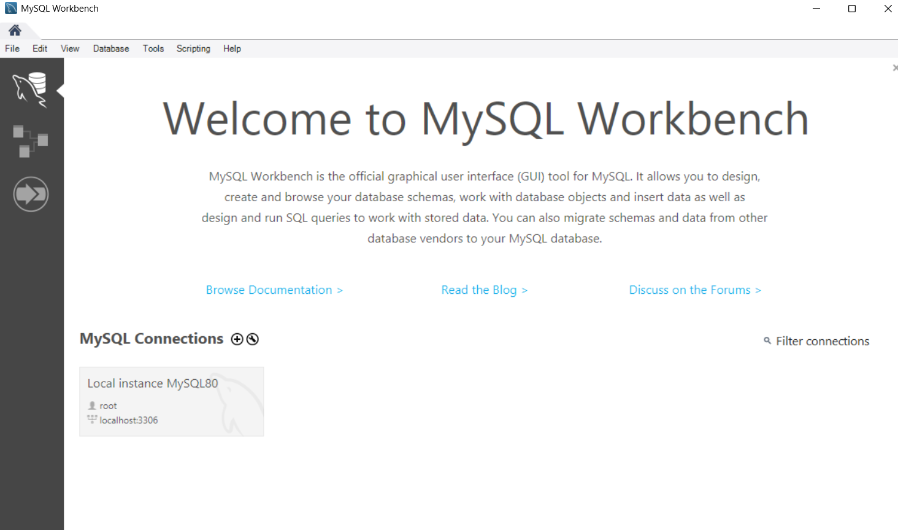
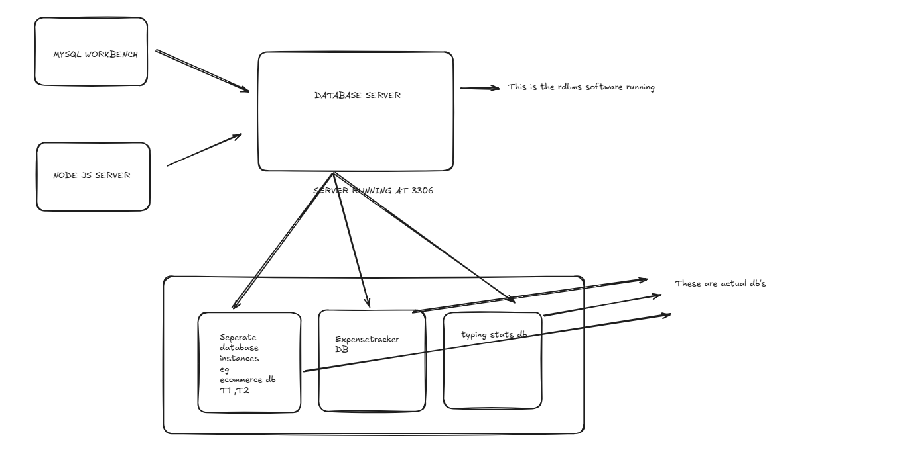

## 1\. First: What is *data*?

Data is just **raw facts**.

Examples:

- `Sourav`
- `26`
- `Backend Developer`
- `₹45,000`

On their own, these don’t mean much.

---

## 2\. What is a **Database**?

A **database** is an **organized collection of related data**, stored **permanently**, so that it can be **easily accessed, updated, and managed**.

Think of it as:

> A **well-structured digital cupboard** for data.

### Example (simple):

Instead of keeping this in a notebook or Excel:

| id | name | age | role |
| --- | --- | --- | --- |
| 1 | Sourav | 26 | Backend Developer |

This table lives inside a **database**.

📌 Important:

- A database is **not software**
- It’s the **actual stored data**

---

## 3\. Then what is **DBMS**?

**DBMS = Database Management System**

A **DBMS is software** that:

- Creates databases or tables inside  databases 
- Stores data
- Lets you read/update/delete data
- Protects data
- Handles multiple users safely

> Database = data  
> DBMS = brain + rules + engine that controls that data

---

## 4\. Real-life analogy (best way to remember)

### 📚 Library analogy

| Thing | Real Life | Database World |
| --- | --- | --- |
| Books | Information | Data |
| Shelves | Organized storage | Database |
| Librarian | Controls access | DBMS |
| Rules (silence, issue limit) | Policies | Constraints |
| Index system | Catalog | Indexes |

Without a librarian (DBMS), the library (database) becomes chaos.

---

## 5\. Why can’t we store data as files only?

Before DBMS, people used **files** (`.txt`, `.csv`).

### Problems with file-based storage:

- ❌ Duplicate data
- ❌ No security
- ❌ Hard to search
- ❌ No relationships
- ❌ Data corruption if two people edit

DBMS solves all of this.

---

## 6\. What exactly does a DBMS do internally?

A DBMS handles:

### 1️⃣ Data storage

- Stores data on disk (HDD/SSD)
- Uses optimized formats (not plain text)

### 2️⃣ Query processing

When you write:

```
SELECT * FROM users WHERE age > 25;
```

DBMS:

- Parses query
- Finds best execution plan
- Fetches data efficiently

### 3️⃣ Concurrency control

If **100 users** update data at once:

- No data corruption
- Uses locks / transactions

### 4️⃣ Transactions (ACID)

Ensures:

- **A**tomicity – all or nothing
- **C**onsistency – rules respected
- **I**solation – users don’t interfere
- **D**urability – data survives crashes

### 5️⃣ Security

- Who can read?
- Who can write?
- Who can delete?

---

## 7\. Database vs DBMS (clear distinction)

| Aspect | Database | DBMS |
| --- | --- | --- |
| What it is | Data | Software |
| Can it run? | ❌ No | ✅ Yes |
| Example | User records | MySQL, PostgreSQL |
| Responsibility | Stores info | Manages info |

---

## 8\. Types of DBMS (big picture)

### 1️⃣ Relational DBMS (RDBMS)

- Data in **tables**
- Uses **SQL**
- Strong consistency

Examples:

- MySQL
- PostgreSQL
- Oracle

Used when:

- Banking
- Payments
- User data
- Analytics

---

### 2️⃣ NoSQL DBMS

- Flexible structure
- High scale
- Distributed

Types:

- Document (MongoDB)
- Key-Value (Redis)
- Column (Cassandra)

Used when:

- Massive traffic
- Flexible schema
- Caching

---

## 9\. Where does DBMS sit in your system?

In a real backend:

```
Frontend
   ↓
Backend (Node / Java / Python)
   ↓
DBMS (Postgres / MySQL)
   ↓
Database (actual data on disk)
```

Your backend **never directly touches raw files**  
It always talks to the **DBMS**

---

## 10\. One-line mental model (important)

> **Database = data**
> 
> **DBMS = system that makes data usable, safe, fast, and reliable**


---
# **SQL**
# ✅ 1. SQL is a **Language**

SQL stands for:

> **Structured Query Language**

It is a **programming language** used to:

- query data
- insert / update / delete
- create tables
- set permissions
- control transactions

Example SQL statements:

```
SELECT * FROM users;
CREATE TABLE orders (...);
INSERT INTO products VALUES (...);
```

So yes — SQL **is a language**.

---

# ✅ 2. SQL is also a **Standard**

There is an official international SQL standard maintained by:

- **ANSI** (American National Standards Institute)
- **ISO** (International Organization for Standardization)

This standard defines:

- keywords
- syntax rules
- behavior
- data types
- how DBMS should implement SQL

The latest versions include SQL:2016, SQL:2019 (depending on DBMS support).

---

# ✅ 3. Then why does SQL feel different in each database?

Even though SQL is standardized, **every DBMS adds its own flavor**.

### Common variants:

- **MySQL SQL**
- **PostgreSQL SQL**
- **Oracle PL/SQL**
- **SQL Server T-SQL**

Core SQL is same everywhere:

```
SELECT
FROM
WHERE
ORDER BY
JOIN
INSERT
UPDATE
DELETE
```

But each DBMS adds:

- extra functions
- extra data types
- custom syntax
- special features

Example:  
MySQL uses `LIMIT`, SQL Server uses `TOP`, Oracle uses `ROWNUM`.

So they all speak **SQL**, but with accents.

---

# 🔥 Simple mental model

### SQL (the language)

→ What you write.

### SQL (the standard)

→ The official rulebook describing how SQL “should” work.

### SQL in each DBMS

→ “Dialects” of SQL with small differences.

---

# 🎯 Final Answer

> **SQL is a programming language defined by an ANSI/ISO standard, but every database uses its own SQL dialect.**


---


## 1️⃣ RDBMS and SQL

### ✔ Query language

Yes — **all RDBMS derive their query language from the SQL standard** (ANSI/ISO).

They implement:

- Core SQL (SELECT, JOIN, WHERE, GROUP BY)
- Plus **vendor-specific extensions**

So:

- SQL is the **common base**
- Each DBMS adds its own dialect that's why query languages of each rdbms is 90% same

---

### ✔ Data model

Yes — **RDBMS store data in tables**:

- Rows (tuples)
- Columns (attributes)
- Fixed schema
- Strong relationships (foreign keys)

This is called the **relational data model** (from E. F. Codd).

---

### ✔ ACID

Yes — **traditional RDBMS are ACID-compliant by design**:

- Strong consistency
- Transactions are central
- Correctness > scale

This is the *default philosophy* of RDBMS.

So far, your understanding is solid.

---

## 2️⃣ Now the key shift: Why NoSQL even exists then

NoSQL did **not** arise because SQL was bad.

It arose because **the relational model + ACID breaks down at massive scale**.

Problems RDBMS hit:

- Horizontal scaling is hard
- Distributed joins are expensive
- Schema rigidity slows iteration
- Global transactions don’t scale well

Big companies (Google, Amazon, Facebook) hit these limits first.

So NoSQL is **not an evolution of SQL** —  
it is a **rejection of the relational assumptions**.

---

## 3️⃣ Is there a “SQL-like standard” for NoSQL?

**No. And this is fundamental.**

### ❌ There is **NO single standard** like SQL for NoSQL DBMS

Why?  
Because **NoSQL is not one model**.

It’s an umbrella term for **multiple, incompatible data models**.

So a single standard would make no sense.

---

## 4️⃣ What actually defines a NoSQL database?

NoSQL databases are defined by **what they relax or abandon**:

- No fixed schema (often)
- No mandatory tables
- No global joins
- Often relax ACID → BASE
- Designed for **distribution first**

---

## 5️⃣ Types of NoSQL databases (this is the real structure)

NoSQL databases are grouped by **data model**, not by language.

---

### ① Key–Value Stores

**Data model:**

```
key → value
```

Example:

```
"user:123" → "{name: Sourav, age: 26}"
```

Characteristics:

- Fastest lookups possible
- No querying inside value
- No relationships

Query “language”:

- Simple GET / SET commands
- Not derived from SQL
- Derived from **hash-table semantics**

Example DBs:

- Redis
- Amazon DynamoDB

These are closer to **data structures**, not databases in the SQL sense.

---

### ② Document Databases

**Data model:**

- JSON / BSON documents
- Nested, hierarchical

Example:

```
{
  "name": "Sourav",
  "skills": ["Node.js", "Databases"],
  "experience": { "years": 2 }
}
```

Key points:

- Schema is flexible
- No joins (or very limited)
- Data locality is prioritized

Query language:

- **Custom query APIs**
- Inspired by:
	- JSON path expressions
	- Map-style filtering
- **NOT derived from SQL**

Example DB:

- MongoDB

MongoDB *later* added SQL-like features (aggregations), but that’s **borrowing syntax**, not heritage.

---

### ③ Column-Family Stores

**Data model:**

- Inspired by Google Bigtable
- Data stored by columns, not rows

Looks like:

```
RowKey → ColumnFamily → Column → Value
```

Designed for:

- Massive datasets
- Distributed storage
- Time-series & analytics

Query language:

- Usually **API-based**
- Some SQL-like layers exist
- Fundamentally not relational

Example DBs:

- Apache Cassandra
- HBase

These are closer to **storage engines** than classic DBs.

---

### ④ Graph Databases

**Data model:**

- Nodes
- Edges
- Properties

Built for:

- Relationships first
- Traversals (friends of friends, recommendations)

Query language:

- **Graph-specific languages**
- Inspired by graph theory
- Not SQL

Example:

- Neo4j
- Language: Cypher

---

## 6️⃣ Where do NoSQL query languages come from?

This is the most important insight:

> **NoSQL query languages are derived from the data model itself, not from a universal standard.**

| Model | Language inspired by |
| --- | --- |
| Key-Value | Hash maps |
| Document | JSON traversal |
| Column-family | Distributed storage access |
| Graph | Graph theory |

SQL came from **relational algebra**.  
NoSQL languages come from **practical system design needs**.

---

## 7️⃣ ACID vs BASE (this is subtle but critical)

### RDBMS philosophy

> Correctness first

- Strong ACID
- Global transactions
- Immediate consistency

---

### NoSQL philosophy

> Availability + scale first

Many NoSQL systems follow **BASE**:

- **B**asically Available
- **S**oft state
- **E**ventual consistency

This does **not** mean:

- “No consistency”
- “Unreliable”

It means:

- Consistency is **configurable**
- Some trade-offs are accepted

Important nuance:

> Modern NoSQL databases can be **partially or fully ACID**, but **not by default across the cluster**.

---

## 8️⃣ Why SQL-like queries keep reappearing in NoSQL

Because humans like declarative queries.

So many NoSQL systems **re-introduce SQL-like layers**:

- MongoDB aggregation pipeline
- Cassandra CQL
- Google Spanner (SQL + distribution)

But this is **syntax convenience**, not architectural heritage.

---

## 9️⃣ The correct mental model (this matters)

### RDBMS world

```
Relational theory
→ SQL standard
→ Tables
→ ACID
→ Strong consistency
```

---

### NoSQL world

```
Distributed systems theory
→ Different data models
→ Custom APIs / query languages
→ BASE / tunable consistency
→ Horizontal scale
```

They solve **different classes of problems**.

---

## 10️⃣ One-sentence truth (bookmark this)

> **SQL databases are unified by theory and standards; NoSQL databases are unified only by what they intentionally give up.**


# WORKBENCH AND OTHER **CLIENTS**



Yes — **you’re connecting to the MySQL Server**.

### Real architecture:

```
MySQL Server (mysqld)
   ↑
Clients: Workbench / Terminal / Node.js / Python / JDBC etc.
```

**MySQL Workbench is only a CLIENT.**  
It never stores data, it only “talks” to the server.

---

# ✅ 2. Is the MySQL Server always running?

### ✔ YES — if installed normally on Windows/Linux/Mac

MySQL Server runs as a **background service**.

On Windows:

- It runs as a **Windows Service**  
	Name: `MySQL80` or mysqld

On Linux:

- It runs as a system daemon  
	`systemctl status mysql`

On Mac:

- It runs via a launch daemon.

### So Workbench doesn’t “start” MySQL Server

Workbench only **connects** to the server that is already running.

---

# ✅ 3. When does MySQL Server actually start?

It starts:

- Automatically on OS boot (if configured)
- Or manually via:
	- Windows Services
	- `mysql.server start`
	- `systemctl start mysql`

Once running, it keeps waiting for clients to connect.

---

# ✅ 4. Where is MySQL Server listening?

By default:

| Thing | Default Value |
| --- | --- |
| Host | `localhost` or `127.0.0.1` |
| Port | **3306** |
| Protocol | TCP/IP |

So anything connecting to MySQL uses:

```
Host: 127.0.0.1
Port: 3306
User: root (or another user)
Password: (your mysql password)
```

---

# ✅ 5. MySQL Workbench and Node.js are the SAME KIND of clients

This is where your intuition is 100% correct.

### MySQL Server is like:

> A restaurant kitchen where food is cooked.

### MySQL Workbench, terminal, Node.js app, Java app:

> Different waiters taking orders to the kitchen.

All of them:

- Send SQL queries to the server
- Receive results
- Use the same connection protocol (MySQL Protocol)

So yes, **Workbench = client**  
**Node.js backend = client**  
**Terminal CLI = client**

They all connect in the same way. Just different UIs.

---

# ✅ 6. The MySQL connection flow explained clearly

### (1) Workbench:

When you click a connection:

```
Workbench → MySQL Server (port 3306)
```

### (2) Terminal:

When you run:

```
mysql -u root -p
```

This also connects to:

```
Terminal CLI → MySQL Server (port 3306)
```

### (3) Node.js:

```
const mysql = require('mysql2');

mysql.createConnection({
  host: 'localhost',
  user: 'root',
  password: 'yourpass',
  database: 'mydb'
});
```

This connects using:

```
Node.js → MySQL Server (port 3306)
```

Everything is the same.

---

# ✅ 7. So what is the MySQL Server exactly?

It is a **background process** that:

- Stores actual database files on disk
- Manages tables, indexes, users
- Parses SQL queries
- Executes queries
- Maintains ACID transactions
- Manages connections & threads

On Windows, its name in Task Manager is:

```
mysqld.exe
```

---

# ✅ 8. Then what is MySQL Workbench?

Just a **GUI app**:

- Lets you write SQL
- Shows schema visually
- Helps design ER diagrams
- Manages users
- Connects to MySQL Server

But **it does NOT store, process, or run the database**.

---

# 🔥 Summary in one crisp diagram

```
(Clients)
+------------------------+
| MySQL Workbench        |
| Node.js application    |
| PHP server             |
| Python script          |
| Terminal mysql client  |
+------------------------+
            ↓  SQL queries
     +---------------------+
     |   MySQL Server      |
     |   (mysqld engine)   |
     +---------------------+
            ↓
     Actual data files on disk
```

---

# 🔥 Mental Model (The simplest understanding)

> MySQL SERVER = actual database engine  
> MySQL WORKBENCH = just a tool to talk to that engine  
> Node.js / CLI / Java / Python = same kind of clients  
> Port 3306 = the door between client and server

The server is almost always running in the background.


Username/password works like **logging into Instagram**.

- Every time you log in = new session
    
- But your password stays the same
    
- You don’t get a new password each time
    

MySQL users work the same.


# MySQL user accounts are stored inside the database

MySQL stores users in a table called:

`mysql.user`

This table contains:

- username
    
- hashed password
    
- permissions
    
- allowed hosts
    

These don’t change **per connection**.

They only change if YOU run:

`ALTER USER 'root'@'localhost' IDENTIFIED BY 'newpassword';`

Or if Workbench changes it.


# Each connection only **uses** the password

A connection is temporary:

- lasts only while Workbench or CLI is connected
    
- dies when you exit
    
- server deletes that session
    

But user accounts are **permanent**, until modified.

So:

- New connection → NEW SESSION ID
    
- Old password → SAME USER ACCOUNT


The password is not tied to a connection.  
It is tied to the user account (`root`).  
Connections come and go, but the user and password stay the same until YOU change them


# ✅ **1. MySQL Server = Always Running (a daemon/service)**

- `mysqld` runs continuously in the background.
    
- It listens on:
    
    - **Port 3306**
        
    - **Host 127.0.0.1 / localhost**
        
- It waits for incoming clients (like `mysql`, apps, Node.js, PHP, etc.)
    

Think of `mysqld` as a shop that is always open.


# ❌ **2. A client connection is NOT permanent**

When you run:

`mysql -u root -p`

this happens:

### **a) MySQL client starts**

The CLI tool starts running on your machine.

### **b) It loads defaults**

Reads host/port/user/etc from config.

### **c) It OPENS A NEW TCP connection**

Even though the server is always running,  
**your connection is created _now_**.

It’s like walking into the shop — every time you enter, you get a new token.

### **d) Authentication happens**

Server validates username + password.

### **e) Server assigns a new connection ID**

Example:

`Your MySQL connection id is 8`

This ID:

- Is created **fresh**
    
- Is **unique for that moment**
    
- **Dies the moment you exit** the client
    
- Is **not reused** for your next login


# ✅ **What actually happens when you run `mysql -u root -p`**

### **1. The MySQL CLI program (`mysql.exe` or `mysql`) starts.**

This is just a client application — like a browser for the database.

### **2. The CLI reads defaults (host, port, user).**

Defaults usually are:

- host → `localhost`
    
- port → `3306`
    
- user → `root`
    

### **3. The CLI opens a _new_ TCP connection to the MySQL server.**

This is the important part:

- Even if MySQL server is always running in background
    
- Even if you connected 2 seconds ago
    
- Even if you exited and re-opened immediately
    

👉 **A brand-new TCP connection is created.**

### **4. Server authenticates you.**

Checks your username/password.

### **5. Server assigns a fresh connection ID.**

Example:

`Your MySQL connection id is 12`

- This ID is **new**
    
- It’s **unique** just for THIS session
    
- You get a new one every time you connect
    

When you type `exit`, the connection closes permanently.

---

# 🔑 **So yes — `mysql -u root -p` always makes a new connection using the CLI.**

Even though:

- MySQL **server** is always running
    
- Connections are **not reused**
    
- Each session gets a **new connection ID**



### ✔ MySQL Workbench (client)

### ✔ Node.js server (client)

### ✔ Both connect to:

**MySQL Server (the RDBMS engine)** running on port **3306**

Inside that RDBMS engine, you have:

- `ecommerce_db`
    
- `expense_tracker_db`
    
- `typing_stats_db`
    
- etc.
    

Those are actual **databases** inside the server.

Perfect.


## To do anything with this RDBMS software we need to use their corresponding SQL implementations?


### ✔ Yes, with one correction:

You don’t necessarily have to use **SQL directly**,  
but you always use **something that gets converted into SQL** before MySQL Server executes it which in turn gives the usage of orm's 


# 3. MySQL Server ONLY understands **SQL**

The core rules:

- MySQL Internally = **SQL engine**
    
- It can only execute **SQL queries**
    
- Everything else (GUI clicks, API calls, ORMs) becomes SQL before execution
    

So yes:

> **The only language the MySQL RDBMS understands is SQL.  
> Every operation eventually becomes SQL.**


# ✔ How different clients interact with MySQL Server

## ① MySQL Workbench

You write:

`SELECT * FROM users;`

Workbench sends **SQL** to the server.

## ② Terminal

Same:

`SELECT * FROM users;`

## ③ Node.js

You write:

`db.query("SELECT * FROM users");`

→ MySQL Node.js driver converts this into raw SQL  
→ Sends it to port 3306  
→ MySQL Server executes it

## ④ ORM (Prisma, Sequelize, TypeORM)

You write:

`prisma.user.findMany();`

The ORM automatically runs:

`SELECT * FROM users;`

So:  
**Even if you don’t write SQL yourself,  
SQL is ALWAYS used internally.**

---

# 🔥 4. RDBMS = SQL

This is the core truth:

> **If it’s an RDBMS (MySQL, PostgreSQL, Oracle, SQL Server),  
> then SQL is the ONLY query language the server understands.**

Even if you click buttons in Workbench,  
behind the scenes it is generating SQL.

---

# 🧱 5. MySQL Server (the RDBMS software) does NOT understand:

- Node.js objects
    
- JSON objects
    
- JavaScript syntax
    
- Python syntax
    
- ORM functions
    
- GUI clicks
    

All of these must be converted into SQL before execution.


# SQL is one language, but each RDBMS speaks its own dialect of SQL

# ✅ 1. SQL is a **standard**
There is an ANSI/ISO SQL standard.

Every RDBMS *tries* to follow this standard for:

- `SELECT`
- `INSERT`
- `UPDATE`
- `DELETE`
- `JOIN`
- `GROUP BY`
- `ORDER BY`
- `CREATE TABLE`
- Basic constraints

So the *core SQL* is the same across all RDBMSs.

---

# ❗ 2. But each RDBMS has its **own implementation + extensions**

Because the SQL standard is HUGE and optional parts exist,  
every database vendor:

- implements only parts they care about
- adds extra features that the standard doesn't cover

This creates **SQL dialects**.

---

# 🧱 3. Examples of SQL dialect differences

### ⭐ MySQL vs PostgreSQL vs SQL Server vs Oracle

### Example 1 — LIMIT keyword

| RDBMS | Pagination syntax |
| --- | --- |
| MySQL | `LIMIT 10` |
| PostgreSQL | `LIMIT 10` |
| SQL Server | `TOP 10` |
| Oracle | `ROWNUM <= 10` (old) |

---

### Example 2 — String concatenation

| RDBMS | Syntax |
| --- | --- |
| MySQL | `CONCAT(a,b)` |
| PostgreSQL | \`a |
| Oracle | \`a |
| SQL Server | `a + b` |

---

### Example 3 — Auto-increment columns

| RDBMS | Syntax |
| --- | --- |
| MySQL | `AUTO_INCREMENT` |
| PostgreSQL | `SERIAL` or `GENERATED` |
| SQL Server | `IDENTITY` |
| Oracle | Uses SEQUENCES |

---

### Example 4 — NOW() vs CURRENT\_TIMESTAMP

| RDBMS | Function |
| --- | --- |
| MySQL | `NOW()` |
| PostgreSQL | `NOW()` |
| SQL Server | `GETDATE()` |
| Oracle | `SYSDATE` |

---

# ✅ 4. Why these differences exist

Three reasons:

### 1️⃣ SQL Standard has optional parts

Vendors implement different subsets.

### 2️⃣ Vendors add their own powerful features

Each RDBMS has unique offerings:

- PostgreSQL → JSONB, window functions, CTEs, rich indexes
- MySQL → Lightweight, fast, replication-friendly
- SQL Server → CLR integration, proprietary functions
- Oracle → Advanced enterprise features

They expose these through **custom SQL syntax**.

### 3️⃣ Performance optimizations

Vendors introduce extensions to optimize performance for:

- indexing
- transactions
- partitioning
- execution plans

---

# 🔥 5. The deeper truth

> **SQL is one language, but each RDBMS speaks its own dialect of SQL.  
> Think of it like English spoken in India, UK, US — same language, different accents, some different words.**

The core is the same.  
The details differ.

---

# 🧩 6. But all SQL dialects share the **same foundation**

- relational algebra
- tables
- tuples
- schema
- joins
- constraints
- transactions

This is what makes them all **RDBMS**.

---

# 🏁 Final Answer

> **Yes, depending on which RDBMS you use, the SQL syntax will differ slightly — but all of them follow the same core SQL principles defined by ANSI/ISO. They just add their own extensions and features.**


Adding ; semi colon after every command is very necessary okay!!

--COMMENT AESE ADD KRTE HAIN


---
# THE DB'S LIVE INSIDE THE SERVER ONLY
# ✅ 1. “To work with a DB we need to select a DB first”

Yes — correct.

In MySQL, after connecting to the server, you usually run:

```
USE expenses_db;
```

Why?  
Because one MySQL server can host **many databases**:

```
ecommerce_db
typing_stats_db
expense_tracker_db
school_db
```

The RDBMS engine needs to know **which** database you want to run your queries on.

---

# ✅ 2. “Inside that server or through that server?”

Here’s the clean truth:

### ✔ **Databases are stored INSIDE the MySQL Server’s storage system.**

But…

### ✔ You can only ACCESS them *through* the MySQL Server process.

Let’s break it down perfectly.

---

# 🧠 3. What does “inside the server” really mean?

When you install MySQL Server, it creates a **data directory** on disk:

Example paths:

- Windows:
	```
	C:\ProgramData\MySQL\MySQL Server 8.0\Data\
	```
- Linux:
	```
	/var/lib/mysql/
	```

Inside this folder:

```
/var/lib/mysql
   ├── ecommerce_db
   │     ├── products.ibd
   │     ├── users.ibd
   │     └── orders.ibd
   ├── typing_stats_db
   ├── expenses_db
   └── mysql  (system tables)
```

These are the **actual database files**.

So yes — they physically live **inside the server’s data directory**.

But…

### ⚠️ You CANNOT touch these files directly.

Only **mysqld (the MySQL Server process)** is allowed to read/write them.

---

# 🔌 4. Why must every client go *through* the MySQL Server?

Because the MySQL server is the **database engine**.

It handles:

- Parsing SQL
- Query optimization
- Caching
- Locks
- Transactions
- Indexes
- Security
- File handling
- Concurrency

If you directly opened the `.ibd` files from Node.js or Workbench, you’d corrupt everything instantly.

So the rule:

> **Data is stored inside MySQL Server’s data files,  
> and you interact with that data only through the MySQL Server running at port 3306.**

---

# 🧱 5. Does storing multiple DBs inside make the server “heavy”?

No — and here’s why.

### ✔ The server doesn’t load full databases into RAM.

It uses:

- Buffer pool
- Caching
- On-demand loading
- LRU eviction
- File streaming

Only the necessary pages (records, indexes) are pulled into memory.

### ✔ Databases are stored as files on disk

Disk usage ≠ CPU usage  
Disk usage ≠ memory usage

### ✔ MySQL is designed to handle MANY databases

Even 100+ databases is normal for a single MySQL instance.

### ✔ The server becomes heavy only if:

- Queries are huge
- Data is massive (GB/TB)
- Many clients connect
- Complex JOINs run continuously

But just **having multiple DBs** is cheap.

---

# 📌 6. Perfect mental model (store this)

### 📦 MySQL Server

→ The *engine*  
→ Runs continuously  
→ Listens on port 3306  
→ Handles all SQL

### 🗄 Databases

→ Stored inside the MySQL Server’s data directory  
→ Just folders + files  
→ Not loaded into memory unless needed

### 💻 Clients (Workbench, Node.js, Terminal)

→ Connect to the MySQL Server  
→ Send SQL  
→ Receive results

### ❗ Clients NEVER access database files directly.

---

# 🎯 7. So your final thought rephrased correctly:

> **To work with a DB, we must first connect to the MySQL Server,  
> then tell the server which database we want to use,  
> and the server internally reads/writes the actual database files.**

Absolutely correct.


# ✅ 1. SQL is a _language_

BUT…

# ⚠️ SQL **does NOT define datatypes.**

The **ANSI/ISO SQL standard** defines only very broad **families** of types like:

- CHARACTER
    
- NUMERIC
    
- DATETIME
    
- BOOLEAN
    

But **each RDBMS decides the exact types, names, sizes, and ranges**.

That’s why:

> **Datatypes differ from one RDBMS to another.**


# 🧱 2. Each RDBMS has its own datatype system

Here’s the clean breakdown:

### ✔ MySQL

- `INT`, `BIGINT`, `FLOAT`, `DOUBLE`
    
- `VARCHAR`, `TEXT`
    
- `DATETIME`, `TIMESTAMP`
    
- `JSON` (added in MySQL 5.7+)
    

### ✔ PostgreSQL

- `SMALLINT`, `INTEGER`, `BIGINT`
    
- `VARCHAR`, `TEXT`
    
- `TIMESTAMP`, `TIMESTAMPTZ`
    
- `JSON`
    
- **JSONB** (binary JSON — much more powerful)
    
- Arrays (`TEXT[]`)
    
- Custom ENUM types
    
- UUID native support
    

### ✔ Oracle

- `NUMBER`
    
- `DATE`
    
- `CLOB`, `BLOB`
    

### ✔ SQL Server

- `INT`, `BIGINT`
    
- `NVARCHAR`
    
- `DATETIME2`
    
- `UNIQUEIDENTIFIER`
    

So yes — **the exact names and behavior differ**, even though the concept is shared.


# 🔥 3. Even the size of the same datatype can differ

Example: `INT` range

### MySQL INT:

`-2,147,483,648 to 2,147,483,647  (4 bytes)`

### PostgreSQL INTEGER:

`-2,147,483,648 to 2,147,483,647  (same)`

### SQLite "INT":

- Dynamic — SQLite doesn’t enforce fixed-size integers.
    

### SQL Server INT:

- Same range as MySQL/Postgres.
    

So sometimes they match, sometimes not.


# 4. Your statement: “pgsql supports json but mysql doesn’t”

This used to be true in the past.

But now the reality is:

### ✔ PostgreSQL

Has **best-in-class JSON & JSONB**  
Super powerful indexing  
Supports deep queries inside JSON

### ✔ MySQL

Supports **JSON datatype** (added recently)  
Good, but less powerful than PostgreSQL

### ✔ SQLite

Stores JSON as **TEXT**

### ✔ SQL Server

Has JSON functions, but no real JSON datatype

So JSON support varies a lot between databases.


# 🔍 5. Why datatypes differ across RDBMS

Because:

- The SQL standard does NOT force exact types
    
- Each RDBMS team designs datatypes for its own architecture
    
- Some add custom types (Postgres is famous for this)
    
- Some limit types for performance reasons


---

# 🧠 6. Your mental model rewritten correctly

> **SQL is one language, but each RDBMS has its own datatype ecosystem.**  
> **Column definitions use the datatypes implemented by the RDBMS you're using.**  
> **Datatype names, ranges, and advanced types vary across MySQL, PostgreSQL, Oracle, SQL Server, etc.**


# 🎯 Final Summary

### ✔ SQL (the language) = same core rules

### ✔ Datatypes = RDBMS-specific

### ✔ Ranges, names, behavior = different in each database

### ✔ PostgreSQL > MySQL in JSON features

### ✔ Datatype differences are normal and expected


# Side-by-side comparison — MySQL vs PostgreSQL datatypes

This table gives you the **best real-world overview**.

---

## 🟦 1. Numeric Types

|Concept|MySQL|PostgreSQL|Notes|
|---|---|---|---|
|Tiny Integer|`TINYINT`|❌ (use `SMALLINT`)|MySQL-only|
|Small Integer|`SMALLINT`|`SMALLINT`|Same 2 bytes|
|Integer|`INT`|`INTEGER` / `INT`|Same|
|Big Integer|`BIGINT`|`BIGINT`|Same|
|Floating Point|`FLOAT`, `DOUBLE`|`REAL`, `DOUBLE PRECISION`|Same purpose, diff names|
|Fixed Decimal|`DECIMAL(p,s)`|`NUMERIC(p,s)`|PostgreSQL NUMERIC is more accurate|
|Boolean|`TINYINT(1)` (fake boolean)|`BOOLEAN` (true type)|PostgreSQL has real boolean|

---

## 🟦 2. Character / String Types

|Concept|MySQL|PostgreSQL|Notes|
|---|---|---|---|
|Fixed-length|`CHAR(n)`|`CHAR(n)`|Same|
|Variable-length|`VARCHAR(n)`|`VARCHAR(n)`|Same|
|Unlimited text|`TEXT`|`TEXT`|PostgreSQL TEXT is more flexible|
|Very large text|`LONGTEXT`|Use `TEXT` / `BYTEA`|PostgreSQL stores large text automatically|

---

## 🟦 3. Binary Types

|Concept|MySQL|PostgreSQL|Notes|
|---|---|---|---|
|Binary Data|`BLOB`|`BYTEA`|Postgres uses BYTEA, no BLOB/TEXT distinction|
|Long Binary|`LONGBLOB`|`BYTEA`|Postgres handles larger sizes natively|

---

## 🟦 4. Date & Time

|Concept|MySQL|PostgreSQL|Notes|
|---|---|---|---|
|Date|`DATE`|`DATE`|Same|
|Time|`TIME`|`TIME`|Same|
|Timestamp|`TIMESTAMP`|`TIMESTAMP`|Same meaning|
|Timestamp with timezone|❌|`TIMESTAMPTZ`|PostgreSQL has proper timezone support|
|Year|`YEAR`|❌|MySQL-only|

---

## 🟦 5. JSON & Special Types

|Concept|MySQL|PostgreSQL|Notes|
|---|---|---|---|
|JSON|`JSON`|`JSON`, `JSONB`|PostgreSQL JSONB is the most advanced in SQL world|
|Arrays|❌|`TEXT[]`, `INT[]`, etc.|PostgreSQL supports true arrays|
|UUID|Not native (use VARCHAR)|`UUID`|PostgreSQL native & fast|
|ENUM|`ENUM`|`ENUM`|Both have it, PostgreSQL’s is more flexible|
|Geospatial|`GIS` types (via extensions)|`PostGIS` (industry standard)|PostgreSQL dominates geo data|

---

# 🟩 SUMMARY OF THE DIFFERENCES

### **PostgreSQL = more powerful and flexible**

- better JSON (JSONB)
    
- arrays
    
- more date/time types
    
- more operators
    
- extensible datatypes
    
- native UUID
    

### **MySQL = simpler**

- fewer types
    
- fewer advanced features
    
- simpler JSON
    

So Postgres is generally preferred in modern backend systems unless you need MySQL’s ecosystem or replication speed.


# Rule 2 — Choose **INTEGER** for counters, IDs, references

For:

- `id`
    
- `order_id`
    
- `customer_id`
    

Use:

- `INT` (up to ~2 billion)
    
- `BIGINT` (if expecting huge scale)
    

Avoid `VARCHAR` IDs unless using UUID.

---

# Rule 3 — Choose **VARCHAR** for human-readable strings

- Names
    
- Emails
    
- Addresses
    

But set reasonable limits:

- `VARCHAR(255)` for email
    
- `VARCHAR(50)` for username
    

---

# Rule 4 — Use **TEXT** only for unbounded content

- Descriptions
    
- Comments
    
- Logs
    

But avoid TEXT in WHERE or JOIN conditions — slow.

---

# Rule 5 — Use **BOOLEAN** (Postgres) or `TINYINT`(1) (MySQL)

For flags like:

- is_active
    
- is_admin
    
- is_verified
    

---

# Rule 6 — Use correct Date/Time types

- Events → `TIMESTAMP` / `TIMESTAMPTZ`
    
- Birthdays → `DATE`
    
- Durations → `INT` (seconds) or `INTERVAL` (pg only)
    

---

# Rule 7 — Use JSON only when schema is flexible

Good for:

- dynamic settings
    
- user preferences
    
- logs
    
- metadata
    

BUT avoid:

- storing relational data inside JSON
    
- querying JSON too often (performance drop unless Postgres JSONB+indexes)
    

---

# Rule 8 — Use ENUM for limited, stable categories

Examples:

- `status` → `('pending','approved','rejected')`
    
- `role` → `('ADMIN','USER')`
    

Avoid ENUM when values change frequently.

---

# Rule 9 — Use UUID when:

- You need globally unique IDs
    
- You want to prevent guessable IDs
    
- Distributed systems
    

Prefer PostgreSQL UUID (fast native support).

---

# Rule 10 — Index types correctly

- Every **foreign key** = index
    
- Columns used in **WHERE** = index
    
- Avoid indexing boolean or low-cardinality fields (wasteful)
    

---

# 🎯 Practical “Best Datatype” Cheat Sheet

|Concept|Best Datatype (MySQL)|Best Datatype (PostgreSQL)|
|---|---|---|
|Primary ID|BIGINT AUTO_INCREMENT|BIGSERIAL / UUID|
|Email|VARCHAR(255)|VARCHAR(255)|
|Username|VARCHAR(50)|VARCHAR(50)|
|Price|DECIMAL(10,2)|NUMERIC(10,2)|
|Timestamps|TIMESTAMP|TIMESTAMPTZ|
|JSON Data|JSON|JSONB|
|Flags|TINYINT(1)|BOOLEAN|


# PRIMARY **KEY**

## 1️⃣ Why does a **Primary Key** exist at all?

Imagine a `users` table for something like Facebook.

```
name     email
-------------------------
Sourav   sourav@gmail.com
Amit     amit@gmail.com
Sourav   sourav@yahoo.com
```

### ❌ Problems without a primary key

- Two users can have the **same name**
- Emails can change over time sourav@gamil.com - > sourav0@gmail.com
- No guaranteed way to uniquely identify *one exact row*
- Updates & deletes become dangerous:
	```
	DELETE FROM users WHERE name = 'Sourav';
	```
	→ Which Sourav?

💡 **Databases need a guaranteed, unchanging identity for every row.**

That identity is the **Primary Key**.

---

## 2️⃣ What exactly is a Primary Key?

A **Primary Key (PK)** is a column (or columns) that:

1. **Uniquely identifies each row**
2. **Cannot be NULL**
3. **Cannot have duplicates**
4. **Is stable (should never change)**

Example:

```
CREATE TABLE users (
  id INT PRIMARY KEY,
  name VARCHAR(50),
  email VARCHAR(255)
);
```

Now every row has a **permanent identity**.

---

## 3️⃣ Why `id INT` instead of email or username?

This is a *design decision*, not a syntax thing.

### ❌ Bad primary keys

- Email → users change emails
- Username → users rename
- Phone → country codes, recycling

### ✅ Good primary keys

- Meaningless numeric ID
- UUID (sometimes)

Why?

> **A primary key should identify the row, not describe it.**

---

## 4️⃣ Why `AUTO_INCREMENT`?

```
id INT PRIMARY KEY AUTO_INCREMENT
```

This tells the database:

> “You generate the next unique ID automatically.”

So inserts become:

```
INSERT INTO users (name, email)
VALUES ('Sourav', 'sourav@gmail.com');
```

Internally:

- First row → `id = 1`
- Next row → `id = 2`
- Next → `id = 3`

### Why this is powerful

- No race conditions
## - No manual ID tracking- otherwise yad kon rakhega id's ko bhai
- Guaranteed uniqueness
- Very fast

---

## 5️⃣ What does MySQL/PostgreSQL do internally with a Primary Key?

This is the **most important part**.

### 🔥 A Primary Key automatically creates an **INDEX**

An index is a **data structure (usually B-Tree)**.

So this:

```
PRIMARY KEY (id)
```

Means:

```
Create a B-Tree index on id
```

Now the database can find rows like this:

```
SELECT * FROM users WHERE id = 74291;
```

📈 **Time complexity**

- Without index → O(n) (scan every row)
- With PK index → O(log n)

This is **orders of magnitude faster**.


## Why it is **O(log n)**

A **PRIMARY KEY index in MySQL (InnoDB)** is implemented as a **B+Tree**.

That gives you `O(log n)` lookup time because:

- The tree has **height = log₍fanout₎(n)**
    
- You move **one level down per comparison**
    
- Height stays very small even for millions of rows
    

So yes, it’s logarithmic — **but not because of binary search**.


When you run:

`SELECT * FROM users WHERE id = 74291;`

### 1️⃣ MySQL goes to the **root node** of the B-Tree

(1 disk read)

### 2️⃣ It compares `74291` against many keys in that node

(usually hundreds)

### 3️⃣ Chooses the correct child pointer

Moves **down one level**

### 4️⃣ Repeat until reaching the **leaf node**

### 5️⃣ Leaf node contains:

- The actual row (clustered index)
    
- Or a pointer to it

## Why B-Trees are fast on disk

Key idea: **high fan-out**

Example:

- One node can store ~200 keys
    
- Tree height with 1 million rows ≈ **3–4 levels**
    

So lookup cost ≈ **3–4 disk reads**

That’s why it’s effectively:

`O(log n)`

But more accurately:

`O(log_f n)  where f = fanout (large)`

# because of **B-Tree traversal with logarithmic height**

---

## 6️⃣ Primary Key + Storage (CRITICAL)

In most engines (like InnoDB in MySQL):

> **The table itself is stored ordered by the Primary Key**

This is called a **clustered index**.

That means:

- Rows are physically organized by `id`
- Sequential IDs = fast disk access
- Inserts at the “end” = efficient

This is one reason auto-increment integers are so fast.

---

## 7️⃣ How Primary Keys enable RELATIONSHIPS (Foreign Keys)

Example:

```
users
-----
id (PK)
name

posts
-----
id (PK)
user_id (FK)
content
```

`posts.user_id` references `users.id`.

Why this matters:

- You can safely join:
	```
	SELECT * 
	FROM posts p
	JOIN users u ON p.user_id = u.id;
	```
- Database enforces data integrity
- No orphan records

Without primary keys, **relational databases literally break**.

---

## 8️⃣ Why NOT use composite natural keys?

Example:

```
PRIMARY KEY (email, phone)
```

Problems:

- Bigger index
- Slower joins
- Values can change
- More storage
- More complexity

That’s why **surrogate keys** (`id INT`) are preferred.

---

## 9️⃣ Why Facebook-scale systems LOVE integer primary keys

At massive scale:

- Smaller keys = smaller indexes
- Smaller indexes = better cache usage
- Faster joins
- Faster replication
- Faster sharding

An `INT` is **4 bytes**  
A `UUID` is **16 bytes**

Multiply that by billions of rows → massive difference.

---

## 🔟 Why Primary Key is mandatory (in practice)

Even if the DB allows tables without PK:

- ORMs break
- Replication becomes unreliable
- Updates become unsafe
- Performance tanks
- You lose row identity

That’s why real systems **always** have a primary key.

---

## ✅ Final mental model (lock this in)

> **Primary Key = permanent identity of a row**
> 
> • Ensures uniqueness  
> • Enables fast lookups (index)  
> • Enables joins  
> • Enables consistency  
> • Enables scaling  
> • Enables correctness

`AUTO_INCREMENT` just makes creating that identity automatic and safe.

---

## One-line takeaway

> **A primary key is not just an ID — it is the backbone of how a relational database stores, finds, connects, and protects data.**


The concept is that a primary key is a unique identifier for each record in a table, ensuring that each row is distinct. A foreign key, on the other hand, is a column in another table that references that primary key. This ensures that any value you put in the foreign key column must exist as a primary key in the referenced table. Without this constraint, you could insert random or invalid values. Thus, the foreign key ensures that data remains consistent and that relationships between tables stay intact and reliable.