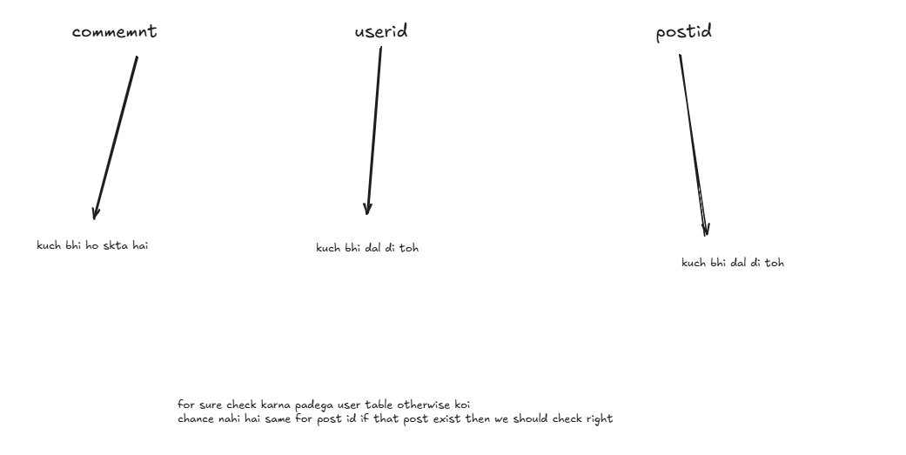
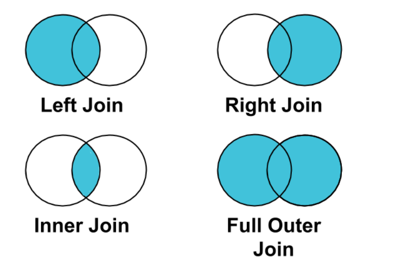
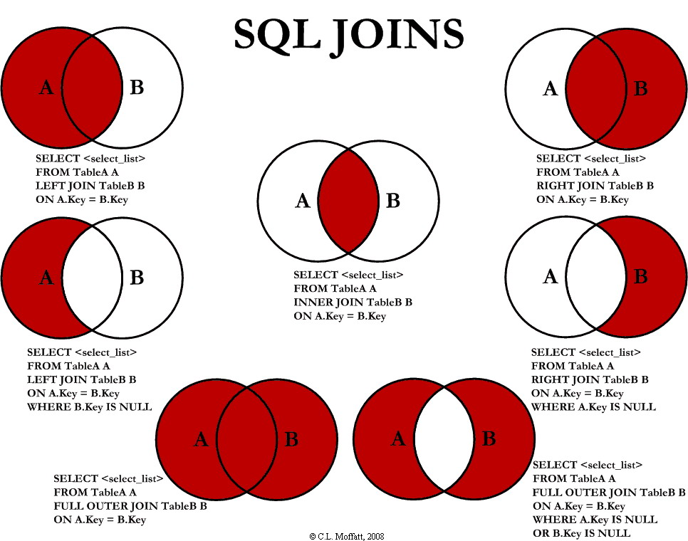

**Pagination = returning data in small chunks instead of the full dataset.**

Example:

- Page 1 → first 20 products
- Page 2 → next 20 products
- Page 3 → next 20
- and so on.

In SQL (MySQL style):

```
SELECT * FROM products
ORDER BY id
LIMIT 20 OFFSET 0;   -- page 1
```
```
SELECT * FROM products
ORDER BY id
LIMIT 20 OFFSET 20;  -- page 2
```
```
SELECT * FROM products
ORDER BY id
LIMIT 20 OFFSET 40;  -- page 3
```


## Why OFFSET should be a variable

When you hard-code:

- `OFFSET 0` → page 1
    
- `OFFSET 20` → page 2
    
- `OFFSET 40` → page 3
    

…it only works for these fixed examples.

But in real applications, you don’t know which page the user will request.  
So you **calculate OFFSET dynamically** using:

`OFFSET = (page_number - 1) * page_size`

Where:

- `page_number` = the page the user wants (1, 2, 3, …)
    
- `page_size` = how many items per page (usually 10, 20, etc.)

## ✅ How it should look in real code (example)

### SQL (conceptually)

```
SELECT * FROM products
ORDER BY id
LIMIT :page_size
OFFSET :offset_value;
```

### Page 1 (page\_number = 1)

```
offset = (1 - 1) * 20 = 0
```

### Page 3 (page\_number = 3)

```
offset = (3 - 1) * 20 = 40
```

---

## ✅ Example in Node.js (if using React + Node backend)

```
const page = req.query.page || 1;   // user gives ?page=3
const limit = 20;
const offset = (page - 1) * limit;

const rows = await db.query(
  "SELECT * FROM products ORDER BY id LIMIT ? OFFSET ?",
  [limit, offset]
);
```

---

## ⭐ Summary

✔ Yes, OFFSET should be a variable  
✔ OFFSET = (page – 1) × limit  
✔ Only LIMIT stays constant, OFFSET changes depending on page  
✔ Never hard-code pagination values in real apps

---

# ✅ 2. Why do we even need pagination?

### Because sending large datasets is a disaster in *every layer*:

- Database
- Backend (Node.js, Java, Python)
- Network
- Browser
- User experience

Let’s go layer by layer.

---

# ❌ 3. Why NOT send 1 million rows to the frontend?

## 3.1 Browser memory issues

A modern browser:

- Cannot render 1M DOM rows
- Will freeze, lag, crash
- User cannot scroll properly

## 3.2 UI performance collapses

Even virtualized lists struggle at 100k+ items.

---

# ❌ 4. Why it’s bad for the **network layer**

Sending 1,000,000 rows:

Assume:

- Each row ~300 bytes JSON
- 1M rows → ~300 MB JSON

Now imagine this in a real system:

- Mobile 4G connection
- Weak WiFi
- International latency

Your app becomes unusable.

---

# ❌ 5. Why it’s bad for the **backend (Node/Python server)**

Your backend must:

- Fetch all 1M rows from DB
- Keep them in RAM
- Serialize JSON
- Stream them to the client

**Memory usage can explode.**  
Servers can crash or slow down.

---

# ❌ 6. Why it’s terrible for the **database**

Databases are NOT meant to return unlimited rows.

Large result sets cause:

### 🔥 6.1 Full table scans

Fetching 1M rows = DB reads huge amounts of disk/pages.

### 🔥 6.2 Buffer pool eviction

The DB throws out frequently-used pages from memory to load useless pages you're returning.

Your **entire system slows down** (even unrelated queries).

### 🔥 6.3 Massive temporary result sets

Sorting/ordering millions of rows can spill to disk.

### 🔥 6.4 Heavy CPU + I/O usage

The DB is busy doing unnecessary work → other users suffer.

---

# ❌ 7. You waste resources for something 99% users won't see

Nobody scrolls through:

- 100k products
- 500k orders
- 1M posts

Pagination is a UX & performance necessity.

---

# ✅ 8. How pagination solves all this

### 🟩 8.1 Frontend receives only the data it needs

15–50 rows → super fast and smooth.

### 🟩 8.2 Backend does minimal work

Only processes a tiny chunk.

### 🟩 8.3 Database fetches only required rows

Does NOT waste I/O, CPU.

### 🟩 8.4 Much smaller network payload

Instead of 300MB → only 15KB.

---

# 🧠 9. SQL Pagination — Variants

### 9.1 Basic: OFFSET + LIMIT

```
SELECT * FROM products
ORDER BY id
LIMIT 20 OFFSET 100;
```

**Pros:** easy  
**Cons:** slow for large OFFSET

---

### 9.2 Keyset Pagination (Fastest for large data)

Instead of OFFSET, use last seen ID:

```
SELECT * FROM products
WHERE id > 5000
ORDER BY id
LIMIT 20;
```

**Super fast** — uses index directly  
Used by Facebook, Instagram: “infinite scroll”.

---

# 🏬 10. How Amazon/Flipkart do this in real life

Understanding Amazon-scale pagination teaches real backend architecture.

## 🔥 Amazon NEVER does simple OFFSET queries at scale.

Because OFFSET 2,000,000 means:

- Database must scan 2 million rows
- Throw them away
- Return the next 20  
	This is horribly inefficient.

So what does Amazon do?

---

### ✔ 10.1 Uses **keyset pagination**

For stable data (IDs):

```
WHERE product_id > last_seen_id
```

---

### ✔ 10.2 Uses **pre-aggregated search indexes**

Amazon uses:

- Elasticsearch
- or internal versions of it (A9 search engine)

When you search "iPhone":

- Elasticsearch returns sorted product IDs
- Then MySQL/Postgres fetches only the relevant rows

This is super fast.

---

### ✔ 10.3 Uses **caching layers** (Redis, Memcached)

The "page 1" of popular categories is fully cached.

---

### ✔ 10.4 Uses **bounded data windows**

Amazon rarely lets you go beyond page 7 or 8.

Why?  
Because they know:

> Users will not scroll endlessly.

So beyond a limit:

- they show “refine search”
- not “page 2000”

---

### ✔ 10.5 Uses **infinite scroll with continuation tokens**

Instead of page numbers:

API returns:

```
{
  "items": [...],
  "next_cursor": "eyJrZXkiOjE2Mz...==" 
}
```

Cursor-based pagination avoids:

- duplicates
- missing rows
- reorder problems

---

# 🔥 11. Correct mental model to store

> Pagination exists because databases, networks, servers, and browsers CANNOT handle dumping millions of rows at once.
> 
> Pagination delivers only what the user actually needs, efficiently and safely.

---

# 🏁 Final Summary

### ❌ NOT paginating causes:

- huge DB load
- huge backend memory load
- massive network payload
- UI freezing
- horrible performance

### ✔ Pagination:

- protects the database
- protects the backend
- saves network cost
- keeps the UI fast
- scales to Amazon/Facebook level
- prevents timeouts

### ✔ Big companies like Amazon use:

- Keyset pagination
- Search indexes
- Caching
- Cursor-based APIs


---

## A column with **UNIQUE + NOT NULL** _behaves similar_ to a primary key,  
## BUT **it is NOT the same as a primary key**.

| Feature | UNIQUE + NOT NULL | PRIMARY KEY |
| --- | --- | --- |
| Must be unique | ✅ Yes | ✅ Yes |
| Cannot be NULL | ✅ Yes | ✅ Yes |
| Table can have how many? | Many UNIQUE columns allowed | Only **one** primary key |
| Used as main row identifier | ❌ Not always | ✅ Yes |
| Automatically creates index | Yes | Yes (often clustered) |
| Used by foreign keys | ❌ Not allowed | ✅ Required |
| Logical meaning | “This column must not duplicate” | “This column **identifies** the row” |

So they **overlap**, but **not identical**.

---

# 🧠 2. UNIQUE + NOT NULL = a constraint

This means:

> The column must contain unique and not-null values.

It prevents duplicates, that's all.

### Example:

```
email VARCHAR(255) UNIQUE NOT NULL
```

This means:

- No two users can share the same email
- Email cannot be empty

But this email may **change** if the user changes it.  
Not stable for joins or relationships.

---

# 🔥 3. PRIMARY KEY = the identity of the row

Primary key does much more than “unique + not null”.

A primary key:

1. **uniquely identifies a row forever**
2. is used internally by the database as the **row’s identity**
3. is used in relationships (FOREIGN KEYS reference it)
4. is used for clustering in many storage engines (like InnoDB)
5. is considered part of the database’s logical schema

If you change the primary key, it can break:

- foreign key relationships
- indexes
- joins
- queries

So you normally **never change a primary key**.

---

# 🏛 4. There can only be ONE primary key

A table may have:

- 1 primary key
- Many UNIQUE constraints

Example:

```
id INT PRIMARY KEY,
email VARCHAR(255) UNIQUE,
username VARCHAR(50) UNIQUE,
phone VARCHAR(20) UNIQUE NOT NULL
```

Only `id` is the identity of the row.

The others are unique for business logic reasons.

---

# 🔗 5. Foreign keys must reference a primary key

This is a HUGE difference.

Example:

```
FOREIGN KEY (user_id) REFERENCES users(id)
```

FKs **must** reference:

- a primary key, or
- a column with a unique index (MySQL allows this technically, but PK is the intended target)

But applications rely on **one canonical identity**, which should always be the PK.

---

# ⚠️ 6. UNIQUE + NOT NULL is not the same internally

Even in the storage engine:

### PRIMARY KEY

- creates a **clustered index** (in InnoDB)
- determines physical row order
- is used by secondary indexes

### UNIQUE INDEX

- is a separate B-tree
- does *not* define table order

This makes a HUGE performance difference in large tables.

---

# 🧩 7. Why you should NOT use a UNIQUE column as your primary key

Example: using `email` as PK:

### Problems:

- Users change email → PK breaks
- All foreign keys break
- Index rebuild required
- Harder migrations
- Slower joins (string comparisons > integer comparisons)
- Bigger index (255 bytes vs 4 bytes)
- Slower inserts & searches

This is why companies like:

- Facebook
- Instagram
- Amazon
- Netflix

ALL use surrogate primary keys (`id INT`, `BIGINT`, or `UUID`).

---

# 🟩 8. Correct mental model

> **UNIQUE + NOT NULL ensures correctness of data.  
> Primary Key ensures identity of data.**

They serve **different purposes**.

---

# 🟦 Final Answer (one-line)

**NO — UNIQUE + NOT NULL is similar but NOT the same as a PRIMARY KEY.  
Primary key is the single true identifier of a row and has deeper structural, relational, and performance importance.**


Comment table mein insertion time par comment text can be anything but user_id and post_id can't just be anything right!! They should exist 

## foreign keys

# ✅ 1. The problem WITHOUT foreign keys
Your diagram is correct:

```
COMMENT TABLE
-------------------------------------
comment    → kuch bhi ho sakta hai
user_id    → kuch bhi dal diya toh
post_id    → kuch bhi dal diya toh
```

Meaning:

### ❌ You can insert:

- a comment with a user\_id that does NOT exist
- a comment with a post\_id that does NOT exist

Example:

```
INSERT INTO comments (comment, user_id, post_id)
VALUES ('Nice!', 9999, 123123);
```

But user `9999` does not exist.  
Post `123123` does not exist.

### Result:

Your database becomes **dirty / inconsistent / corrupted**.

This is called:

> ❌ **Orphan records**  
> (child rows that point to parents that do not exist)

Real-world example:

- Comment belongs to a user that doesn’t exist
- Order belongs to a customer that doesn’t exist
- Product review where product is deleted

---

# ✅ 2. What is a FOREIGN KEY?

Foreign Key = A rule that says:

> “This column must match an existing primary key in another table.”

Example:

`comments.user_id` must exist in `users.id`

`comments.post_id` must exist in `posts.id`

If you try to insert invalid data → **DB rejects it immediately**.

This is called:

> 🔒 **Referential Integrity**  
> (Database ensures references are valid)

---

# ⭐ 3. How foreign keys fix your problem

### With foreign key:

```
FOREIGN KEY (user_id) REFERENCES users(id)
```

Now if you try this:

```
INSERT INTO comments (comment, user_id, post_id)
VALUES ('Nice!', 9999, 123123);
```

The database will respond:

❌ **ERROR: Cannot add or update child row**  
(The parent record does not exist)

This prevents “kuch bhi dal diya”.

The DB *guarantees* your comment always belongs to a real user and a real post.

---

# 📌 4. How to create tables with foreign keys

### Step 1: Create the parent tables (with primary keys)

```
CREATE TABLE users (
    id INT PRIMARY KEY AUTO_INCREMENT,
    name VARCHAR(100)
);

CREATE TABLE posts (
    id INT PRIMARY KEY AUTO_INCREMENT,
    title VARCHAR(255)
);
```

### Step 2: Create child table referencing parents

```
CREATE TABLE comments (
    id INT PRIMARY KEY AUTO_INCREMENT,
    comment TEXT NOT NULL,
    user_id INT,
    post_id INT,
    FOREIGN KEY (user_id) REFERENCES users(id),
    FOREIGN KEY (post_id) REFERENCES posts(id)
);
```

Now your database is safe.

---

# 🔥 5. Try inserting invalid data (see what happens)

```
INSERT INTO comments (comment, user_id, post_id)
VALUES ('Awesome!', 9999, 8888);
```

Result:

```
ERROR 1452: Cannot add or update a child row:
a foreign key constraint fails
```

The database literally BLOCKS wrong data.

---

# 🧠 6. What foreign keys do internally

### Internally, MySQL/PostgreSQL will:

1. Check whether the value exists in the parent table
2. If not → reject the insertion
3. On delete/update of parent, enforce the rule you choose happens as well
	- `CASCADE`
	- `RESTRICT`
	- `SET NULL`
	- `NO ACTION`

---

# 🔧 7. Options for foreign keys (VERY IMPORTANT)

### ① ON DELETE CASCADE

If user gets deleted → all their comments get deleted.

```
FOREIGN KEY (user_id)
REFERENCES users(id)
ON DELETE CASCADE
```

Facebook/Instagram use this carefully.

---

### ② ON DELETE RESTRICT

Cannot delete user if they have comments.

Default behavior → safest for real apps.

---

### ③ ON DELETE SET NULL

If user deleted → comment stays but user\_id becomes NULL.

---

# 🧱 8. Real-life analogy

Think of:

## 🔹 users = parents

## 🔹 comments = children

Foreign key rules enforce:

- A child cannot exist without a parent
- If parent is deleted:
	- either delete child (CASCADE)
	- or block deletion (RESTRICT)
	- or orphan the child (SET NULL)

This is how real social networks maintain consistency.

---

# 🎯 9. Why foreign keys are IMPORTANT in real systems

Without FK:

- orphan comments
- orphan orders
- orphan reviews
- hard-to-debug bugs
- inconsistent data
- corrupted analytics
- broken joins
- broken queries

With FK:

- guaranteed valid relationships
- database itself enforces correctness
- backend does not need to manually check everything
- easier to maintain
- easier to scale
- safer migrations


# 🔥 10. Ultimate takeaway

> **Foreign Keys protect your data from becoming garbage.  
> They ensure that references are always valid and prevent invalid rows from ever entering your database.**


- `comment` → anything allowed
- `user_id` → must exist in users
- `post_id` → must exist in posts

Foreign Keys make this 100% safe.

---
# **JOINS**
## 1️⃣ Why JOINs exist (the real reason)

You **intentionally split data into multiple tables** (NORMALIZATION): 

- `users` → user info
- `posts` → post info
- `comments` → comment text + references

Why?

- avoid duplication
- maintain consistency
- scale better
- enforce relationships (FKs)

But once data is split, **no single table has the full story**.

👉 **JOIN is how we re-assemble related data at query time.**

---

## 2️⃣ The problem WITHOUT JOINs

### Tables (normalized)

```
users
-----
id | name
1  | Sourav
2  | Amit

posts
-----
id | title
10 | Hello World
11 | SQL Basics

comments
--------
id | comment      | user_id | post_id
1  | Nice post    | 1       | 10
2  | Helpful      | 2       | 11
```

Now ask:

> “Show me comments with user name and post title”

❌ You **cannot** answer this from `comments` alone.

That’s why JOIN exists.

---

## 3️⃣ What a JOIN actually does (core idea)

> **JOIN combines rows from multiple tables based on a related column (usually PK–FK).**

Conceptually:

- Take a row from `comments`
- Find matching row in `users`
- Find matching row in `posts`
- Merge them into **one result row**

⚠️ Important:

- **JOIN does NOT change tables**
- It only creates a **temporary result set**

---

## 4️⃣ Your exact query — broken down line by line

```
SELECT *
FROM comments
JOIN users ON comments.user_id = users.id
JOIN posts ON comments.post_id = posts.id;
```

Let’s decode this **step by step**.

---

### Step 1: Start with comments (base table)

```
FROM comments
```

This means:

> “Take every row from comments”

---

### Step 2: JOIN users

```
JOIN users ON comments.user_id = users.id
```

Meaning:

> For each comment, find the **user whose `id` matches `comments.user_id`**

If no match → row is discarded (INNER JOIN behavior).

---

### Step 3: JOIN posts

```
JOIN posts ON comments.post_id = posts.id
```

Meaning:

> For the same comment, find the **post whose `id` matches `comments.post_id`**

---

### Final result (conceptual)

```
comment     | user_name | post_title
-------------------------------------
Nice post   | Sourav    | Hello World
Helpful    | Amit      | SQL Basics
```

🎯 **This is the real goal of joins:  
reconstruct meaningful data from normalized tables.**

---

## 5️⃣ Why `comments.user_id = users.id` works

Because earlier you did the correct thing:

- `users.id` → PRIMARY KEY
- `comments.user_id` → FOREIGN KEY

This guarantees:

- fast lookup (indexed)
- correctness
- no invalid references

Joins are **cheap and safe** when PK–FK relationships exist.

---

## 6️⃣ Types of JOINs (this is crucial)




### 6.1 INNER JOIN (default JOIN)

```
SELECT *
FROM comments
JOIN users ON comments.user_id = users.id;
```

✔ Only rows where match exists  
❌ Rows without match are dropped

Used **90% of the time**.

---

### 6.2 LEFT JOIN

```
SELECT *
FROM comments
LEFT JOIN users ON comments.user_id = users.id;
```

✔ All comments returned  
✔ Users joined if present  
❌ Missing users → NULL

Used when:

- you want *everything from left table*
- even if relation is missing

---

### 6.3 RIGHT JOIN (rare)

Same as LEFT JOIN but reversed.  
Most devs avoid it for readability.

---

### 6.4 FULL OUTER JOIN (PostgreSQL)

Returns:

- all matches
- plus unmatched rows from both sides

Used rarely in business apps.

---

## 7️⃣ JOIN vs WHERE (very common confusion)

❌ Wrong / old style:

```
SELECT *
FROM comments, users
WHERE comments.user_id = users.id;
```

✔ Works but:

- harder to read
- dangerous with complex queries

✅ Correct modern style:

```
SELECT *
FROM comments
JOIN users ON comments.user_id = users.id;
```

---

## 8️⃣ What JOINs do internally (important)

### Internally the DB:

1. Uses index on `users.id`
2. Uses index on `posts.id`
3. For each comment:
	- finds matching user
	- finds matching post
4. Produces combined rows

This is why:

- PK and FK **must be indexed**
- joins without indexes are slow

---

## 9️⃣ Why JOINs are better than storing everything in one table

❌ One giant table:

- repeated user names
- repeated post titles
- update anomalies
- huge storage
- inconsistent data

✅ Normalized tables + JOIN:

- single source of truth
- smaller tables
- fast updates
- clean design
- scalable

Facebook, Instagram, Amazon — all rely heavily on JOINs.

---

## 🔟 Real mental model (lock this in)

> **Tables store facts separately.  
> JOINs combine facts when you ask a question.**

Tables = storage  
JOINs = storytelling

---

## 11️⃣ Common beginner mistakes

❌ Forgetting ON condition  
❌ Joining on non-indexed columns  
❌ Using SELECT \* in production  
❌ Using LEFT JOIN when INNER JOIN is needed  
❌ Over-joining unnecessary tables

---

## 12️⃣ Clean production-style query

```
SELECT
  c.comment,
  u.name AS user_name,
  p.title AS post_title
FROM comments c
JOIN users u ON c.user_id = u.id
JOIN posts p ON c.post_id = p.id;
```

Readable. Fast. Correct.

---

## 🏁 Final takeaway

- JOINs exist because data is normalized
- JOINs reconstruct meaningful data
- PK–FK relationships make joins safe and fast
- INNER JOIN = only matching rows
- LEFT JOIN = keep left table rows
- JOINs do NOT modify data
- JOINs are fundamental to relational databases


> **Not every JOIN (or JOIN feature) is available or written the same way in every RDBMS.**
# 
Let’s explain this **cleanly, accurately, and in the right order**.

---

## 1️⃣ The common ground (what _is_ universal)

All mainstream RDBMS support **core joins** defined by the SQL standard:

### ✅ Universally supported

- `INNER JOIN`
    
- `LEFT JOIN`
    
- `RIGHT JOIN` (rare but supported)
    
- `CROSS JOIN`
    
- Equi-joins (`a.id = b.id`)
    

These work in:

- MySQL
    
- PostgreSQL
    
- Oracle
    
- SQL Server
    

So your basic query:

`SELECT * FROM comments c JOIN users u ON c.user_id = u.id;`

works everywhere.

---

## 2️⃣ Where JOINs start to differ across RDBMS

Differences come from **extensions**, **missing features**, and **syntax choices**.

### Reason 1: SQL standard has OPTIONAL parts

RDBMS vendors choose what to implement.

### Reason 2: Storage engine & optimizer differences

Some joins are expensive or impractical in some engines.

### Reason 3: Vendor-specific extensions

Advanced joins go beyond the standard.

---

## 3️⃣ FULL OUTER JOIN (classic difference)

### PostgreSQL / Oracle / SQL Server

`SELECT * FROM a FULL OUTER JOIN b ON a.id = b.id;`

### MySQL ❌ (no native FULL OUTER JOIN)

Workaround in MySQL:

`SELECT * FROM a LEFT JOIN b ON a.id = b.id UNION SELECT * FROM a RIGHT JOIN b ON a.id = b.id;`

This is a **real limitation**, not just syntax.

---

## 4️⃣ NATURAL JOIN (exists but discouraged)

Supported in most DBs:

`SELECT * FROM users NATURAL JOIN posts;`

Why it’s avoided:

- Implicit column matching
    
- Breaks if schema changes
    
- Hard to debug
    

Some teams **ban** NATURAL JOIN entirely.

---

## 5️⃣ LATERAL JOIN (major difference)

### PostgreSQL ✅

`SELECT * FROM users u JOIN LATERAL (   SELECT * FROM posts p WHERE p.user_id = u.id LIMIT 1 ) p ON true;`

### SQL Server (CROSS APPLY)

`SELECT * FROM users u CROSS APPLY (   SELECT TOP 1 * FROM posts p WHERE p.user_id = u.id ) p;`

### MySQL ❌ (no true LATERAL join)

This is a **huge feature difference**.

---

## 6️⃣ USING vs ON syntax differences

### Supported everywhere (recommended):

`JOIN users ON comments.user_id = users.id;`

### USING syntax:

`JOIN users USING (user_id);`

Works only if column names match exactly.  
Supported in MySQL & PostgreSQL, **not fully in SQL Server**.

---

## 7️⃣ JOINs on subqueries (capabilities differ)

PostgreSQL allows very powerful subquery joins:

`JOIN (   SELECT user_id, COUNT(*)    FROM posts    GROUP BY user_id ) p ON p.user_id = u.id;`

MySQL older versions struggled with performance here (improved in 8+).

---

## 8️⃣ Join optimization differs (same query ≠ same performance)

Even if syntax works:

- Execution plan differs
    
- Join order differs
    
- Index usage differs
    

This means:

> Same JOIN query can be fast in PostgreSQL and slow in MySQL (or vice versa).

---

## 9️⃣ Join limitations in some engines

|Feature|MySQL|PostgreSQL|
|---|---|---|
|FULL OUTER JOIN|❌|✅|
|LATERAL JOIN|❌|✅|
|HASH JOIN|Limited|✅|
|MERGE JOIN|❌|✅|
|CROSS APPLY|❌|❌ (uses LATERAL)|

---

## 🔟 Why ORMs exist (practical reason)

Because writing portable JOIN-heavy SQL is hard.

ORMs:

- abstract JOIN differences
    
- generate dialect-specific SQL
    
- avoid unsupported joins
    

But **knowing raw JOIN behavior is still critical**.

---

## 11️⃣ Correct mental model (store this)

> **JOIN is a concept from relational algebra.  
> Each RDBMS implements that concept differently, with different syntax, limits, and optimizations.**

So:

- Concept same
    
- Syntax similar
    
- Capabilities different
    

---

## 🏁 Final takeaway

- Core JOINs work everywhere
    
- Advanced JOINs differ by RDBMS
    
- MySQL is more limited
    
- PostgreSQL is most expressive
    
- Query writing must respect dialect
    
- Performance characteristics vary even for same JOIN

# > **Not every JOIN (or JOIN feature) is available or written the same way in every RDBMS.**

---

# ✅ 1. INNER JOIN

**Most common join. Returns only matching rows from both tables.**

### 📌 Definition


> Only rows where the key exists on BOTH SIDES.

### Diagram

```
Table A           Table B
     ● ● ● ● ●  ∩  ● ● ● ● ●      → Only the intersection
```

### Example

```
SELECT *
FROM comments c
INNER JOIN users u
ON c.user_id = u.id;
```

### Output meaning

Only comments where the **user exists** are returned.

---

# ✅ 2. LEFT JOIN

**Return all rows from LEFT table + matching rows from RIGHT table.**

### 📌 Definition

> Everything from the left side, and if no match on right, fill with NULL.

### Diagram

```
LEFT TABLE ALL    |    MATCHES FROM RIGHT
● ● ● ● ● ● ●     |     ● ● ●
         ↓         Missing → NULL
```

### Example

```
SELECT *
FROM comments c
LEFT JOIN users u
ON c.user_id = u.id;
```

### Output meaning

- All comments
- user info only where user exists
- otherwise `user` = NULL

Useful when:

- you want to keep everything from the left
- even if foreign key is missing

---

# ✅ 3. RIGHT JOIN

**Return all rows from RIGHT table + matching rows from LEFT table.**

### 📌 Definition

> Opposite of LEFT JOIN.

### Diagram

```
MATCHES FROM LEFT  | RIGHT TABLE ALL
    ● ● ●          | ● ● ● ● ● ● ●
                    Missing → NULL
```

### Example

```
SELECT *
FROM comments c
RIGHT JOIN users u
ON c.user_id = u.id;
```

### Output meaning

- All users
- comments only if they exist
- user with no comments still appears (NULL for comment)

> Most developers **avoid RIGHT JOIN** because LEFT JOIN is easier to read.

---

# ✅ 4. FULL OUTER JOIN

➡️ **MySQL DOES NOT SUPPORT this**  
➡️ PostgreSQL, Oracle, SQL Server support it.

### 📌 Definition

> All rows from both tables.  
> Where matches exist → join  
> Where no match → NULLs

### Diagram

```
A ● ● ● ● ● ●
        ∪     ∪
     B ● ● ● ● ● ●

Everything from A + Everything from B
```

### Example (PostgreSQL)

```
SELECT *
FROM comments c
FULL OUTER JOIN posts p
ON c.post_id = p.id;
```

### Meaning

- comments with matching posts
- posts with matching comments
- comments without posts
- posts without comments

### MySQL equivalent (workaround):

```
SELECT * FROM comments c
LEFT JOIN posts p ON c.post_id = p.id
UNION
SELECT * FROM comments c
RIGHT JOIN posts p ON c.post_id = p.id;
```

---

# ✅ 5. CROSS JOIN

**Cartesian product (every row of A combined with every row of B).**

### 📌 Definition

> No condition. Just all combinations.

### Diagram

```
Table A has 3 rows:   A1 A2 A3
Table B has 2 rows:   B1 B2

CROSS JOIN result:
A1-B1
A1-B2
A2-B1
A2-B2
A3-B1
A3-B2
```

### Example

```
SELECT *
FROM users
CROSS JOIN roles;
```

### Meaning

Useful for:

- generating combinations
- testing
- building calendars

Not used for relational queries.

---

# 🧠 🎯 6. Full visual cheat-sheet (ASCII chart)

```
1. INNER JOIN (A ∩ B)
---------------------
A: ● ● ● ●
B:   ● ● ● ●
Result: overlap only

2. LEFT JOIN (A ⟕ B)
---------------------
A: ● ● ● ● ● ●
B:     ● ●
Result:
A rows + matched B rows, B missing → NULL

3. RIGHT JOIN (A ⟖ B)
----------------------
A:     ● ●
B: ● ● ● ● ● ●
Result:
B rows + matched A rows, A missing → NULL

4. FULL OUTER JOIN (A ∪ B)
--------------------------
A: ● ● ● ●
B:       ● ● ●
Result:
All of A + All of B (matches + non-matches)

5. CROSS JOIN (Cartesian Product)
---------------------------------
A: A1 A2 A3
B: B1 B2
Result:
A1B1, A1B2, A2B1, A2B2, A3B1, A3B2
```

---

# 💡 7. When to use each JOIN — practical real-world rules

| Scenario | Use JOIN |
| --- | --- |
| Only matching rows | INNER JOIN |
| Keep everything from left table | LEFT JOIN |
| Keep everything from right table | RIGHT JOIN |
| Return all rows from both tables | FULL OUTER JOIN |
| Generate combinations | CROSS JOIN |

---

# 🧩 8. Your example (explained properly)

```
SELECT *
FROM comments c
JOIN users u ON c.user_id = u.id
JOIN posts p ON c.post_id = p.id;
```

### What this query does:

- Start with every comment
- Find the user who wrote it
- Find the post on which it was written
- Combine all info into one row

This reconstructs a **complete picture**:

```
comment | user_name | post_title
--------------------------------
Nice!   | Sourav    | Hello World
Great   | Amit      | SQL Basics
```

Exactly what JOINs were invented for.

---

# 🏁 Final answer in one line

> **Joins allow relational data split across normalized tables to be recombined into meaningful results. Each join type controls *how* tables match and what happens when rows on one side don’t have matches.**




