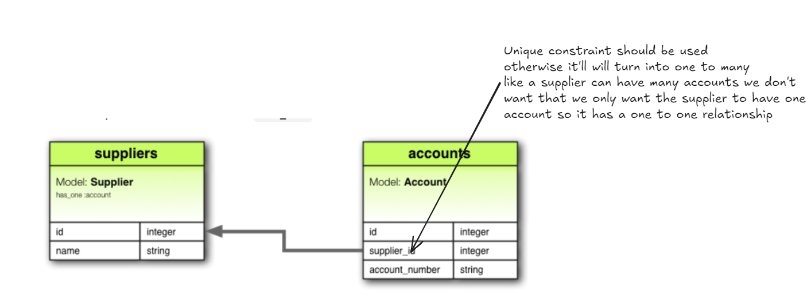

# WHAR ARE RELATIONSHIPS


Because in a relational database, **data is split into multiple tables**, and relationships connect them.

Just like:

- user ↔ posts
- post ↔ comments
- product ↔ order
- teacher ↔ student

Relationships define **how many rows in one table relate to rows in another**.

---

# 🔥 There are **4 fundamental types** of relationships:

1. **One-to-One (1:1)**
2. **One-to-Many (1:N)** → most common
3. **Many-to-One (N:1)** → same as one-to-many but reversed
4. **Many-to-Many (M:N)**

Everything in relational modeling comes from these.

Let’s go step-by-step.

---

# ✅ 2. ONE-TO-ONE Relationship (1:1)

## 📌 Meaning

One row in table A is related to **exactly one** row in table B.
Every record of one table is only related one record of the other table!
### Diagram

```
User ---- Address
1    ---- 1
```

### Real examples:

- User ↔ User Profile
- Country ↔ Capital
- Person ↔ Passport


### Why use this?

To split rarely-used or large data into another table.

### SQL Example

**users**

```
CREATE TABLE users (
  id INT PRIMARY KEY,
  name VARCHAR(100)
);
```

**user\_profiles**

```
CREATE TABLE user_profiles (
  id INT PRIMARY KEY,
  user_id INT UNIQUE,
  bio TEXT,
  FOREIGN KEY (user_id) REFERENCES users(id)
);
```

`UNIQUE` ensures 1:1.

---

# ✅ 3. ONE-TO-MANY Relationship (1:N)

(**MOST IMPORTANT AND MOST COMMON**)

## 📌 Meaning

One row in table A can have **many** related rows in table B.

### Diagram

```
User ---- Comment
1    ---- c1
1    ---- c2
```

### Real examples:

- User → Posts
- User → Comments
- Category → Products
- Order → Order Items
- Author -> Books 

### SQL Example

**users**

```
CREATE TABLE users (
  id INT PRIMARY KEY,
  name VARCHAR(100)
);
```

**posts**

```
CREATE TABLE posts (
  id INT PRIMARY KEY,
  user_id INT,
  title VARCHAR(200),
  FOREIGN KEY (user_id) REFERENCES users(id)
);
```

This means:

- one user → many posts
- each post → exactly one user

This is the relationship your DRAWING showed.
Foreign key data consistency ensure karti hai but foreign key wale column mein values repeat ho sakti hai

---

# ✅ 4. MANY-TO-ONE (N:1)

This is just the **reverse view** of 1:N.

- Many posts belong to one user
- Many comments belong to one post

You don’t model this separately; it’s the same foreign key.

---

# ✅ 5. MANY-TO-MANY Relationship (M:N)

## 📌 Meaning

Multiple rows in A relate to multiple rows in B.


A physician can treat many patients and a patient can be treated by many physicians!!
To implement this we need a third table which is called join table or through table 
In the third table we have FK from both or more than two tables 

### Diagram

```
Student ---- Course
 S1   ----  C1
 S1   ----  C2
 S2   ----  C1
 S3   ----  C2
```

### Real examples:

- Students ↔ Courses
- Movies ↔ Actors
- Users ↔ Groups
- Products ↔ Categories
- Posts ↔ Tags

### SQL Implementation (VERY IMPORTANT)

A many-to-many relation cannot be made with just two tables.

You MUST create a **junction / bridge table**.

### Example

**students**

```
CREATE TABLE students (
  id INT PRIMARY KEY,
  name VARCHAR(100)
);
```

**courses**

```
CREATE TABLE courses (
  id INT PRIMARY KEY,
  name VARCHAR(100)
);
```

**student\_courses**

```
CREATE TABLE student_courses (
  student_id INT,
  course_id INT,
  PRIMARY KEY (student_id, course_id),
  FOREIGN KEY (student_id) REFERENCES students(id),
  FOREIGN KEY (course_id) REFERENCES courses(id)
);
```

This bridge table resolves M:N into two 1:N relationships.

---

# 🧠 Why do we need relationships at all?

Because without relationships:

- You cannot model real-world connections
- You cannot prevent invalid data
- You cannot JOIN correctly
- You end up duplicating data everywhere
- You can’t keep consistency

Relationships + foreign keys → ensure **referential integrity**.

---

# 📌 How relationships affect queries

## Example using your scenario:

### Tables:

- `users`
- `posts`
- `comments`

### Relationships:

- A user has many posts → (1:N)
- A post has many comments → (1:N)
- A user has many comments → (1:N)

### JOIN query:

```
SELECT
  c.comment,
  u.name AS user_name,
  p.title AS post_title
FROM comments c
JOIN users u ON c.user_id = u.id
JOIN posts p ON c.post_id = p.id;
```

This works **because** the relationships ensure that:

- `comments.user_id` → always valid
- `comments.post_id` → always valid

---

# 🧱 RELATIONSHIPS AND FOREIGN KEYS (the connection)

**Foreign Keys create relationships.  
Joins use relationships.**

- FK = rule
- Relationship = concept
- Join = how we query it

Example:

`comments.user_id` FK → creates relationship → JOIN uses it.

---

# 🏁 Final Summary (store this mentally)

## ✔ ONE-TO-ONE

For splitting a single entity into two tables.

## ✔ ONE-TO-MANY

Most common. One parent → many children.

## ✔ MANY-TO-ONE

Reverse view of 1:N.

## ✔ MANY-TO-MANY

Requires a bridge table.

## ✔ Relationships enable:

- data integrity
- normalization
- meaningful joins
- performance & clarity
- scalable schema design

---


## 📌 1. Why do relationships even exist?

Because in a relational database:

- **Data is broken into tables** (normalization)
- To prevent duplication
- To keep things consistent
- To avoid storing the same value in 100 places

But the world is full of **many-to-many relationships**, like:

- Problem ↔ Tags
- Student ↔ Courses
- Movie ↔ Actor

Example for LeetCode:

```
A problem can have MANY tags  
A tag can belong to MANY problems
```

This is **M:N**.

---

## ❌ 2. Why can’t we store a tags array inside the problems table?

Let’s say we try this:

### problems table

```
problem_id | name       | tags
1          | Two Sum    | ["Array","Hashmap"]
2          | Palindrome | ["String"]
3          | LRU Cache  | ["LinkedList","LRU","Cache"]
```

### Why this is wrong:

### ❌ a) Tags become duplicated

"String" appears in 100 problems.  
If you rename it → you must edit 100 rows.  
This is **denormalized**, meaning lots of redundancy.

### ❌ b) Updating becomes painful

If tag “Array” → “Arrays”:

- must update hundreds of rows
- prone to bugs
- slow
- inconsistent

### ❌ c) Search/indexing becomes terrible

Query:

```
SELECT * FROM problems WHERE tags LIKE '%Array%';
```

Terrible indexing, slow, incorrect matching.

### ❌ d) Ordering / sorting becomes impossible

You cannot sort arrays.

### ❌ e) FK and relationships cannot be enforced

You cannot set foreign keys on JSON array.

### ❌ f) Tag meaning changes → disaster

If someone edits a tag name → you must rebuild the world.

---

## 📌 3. The correct normalized design: Use a **bridge table**

### Tables required:

1. **tags**
```
tag_id | tag_name
1      | Array
2      | Hashmap
3      | String
```
2. **problems**
```
problem_id | name | details
1          | Two Sum | ...
2          | Palindrome | ...
```
3. **problem\_tags** (bridge table)
```
problem_id | tag_id
1          | 1
1          | 2
2          | 3
```

---

## 🎯 4. Why a bridge table fixes everything

### ✔ a) No duplication

“Array” exists only once in the `tags` table.

### ✔ b) Changing tag name becomes ONE update

```
UPDATE tags SET tag_name = 'Arrays' WHERE tag_id = 1;
```

### ✔ c) Searching becomes fast

Because now you can index `tag_id` and `problem_id`.

### ✔ d) Proper relationships

FK ensures:

- no invalid problem\_id
- no invalid tag\_id

### ✔ e) Most scalable way

All real platforms (LeetCode, HackerRank) use this.

---

# 🚀 PART 2: PROPER RELATION TYPES

## 1\. Users → Submissions

One user can have **many submissions**  
One problem can have **many submissions**

➡️ This is **many-to-many** but with extra fields (time, status, runtime)

You solve this with a **submissions** table:

```
submissions:
id | user_id | problem_id | code | verdict | runtime | created_at
```

This is NOT a pure M:N →  
It’s a **transaction table** → Each row represents one attempt.

No third table needed because **the submission itself is the bridge**.

---

## 2\. Problems → Tags

M:N → requires a **problem\_tags** table (explained above)

---

## 3\. Problems → Testcases

Each problem has MANY testcases  
Each testcase belongs to ONE problem

➡️ 1:N relationship.

Example:

```
testcases:
id | problem_id | input | expected_output
```

BUT...  
Here's the real-world twist 👇

---

# 🚀 PART 3: Why we DO NOT store testcases inside the database

This is the part most beginners misunderstand.

### ❌ Testcases can be HUGE

A single testcase might contain:

- arrays of size 10⁶
- large strings
- nested JSON
- binary data

Databases hate:

- very large rows
- very large columns
- huge TEXT storage
- lots of storage engine operations

### ❌ DBs are not good for large static files

Storing large blobs in DB:

- slows down queries
- consumes buffer pool
- causes table bloat
- creates locking issues
- makes backups huge
- reduces throughput

### ❌ Testcases rarely change

You upload them once and forget.

So storing in DB is unnecessary.

---

# 🚀 PART 4: Where to store testcases (real platform answer)

### ✔ Store them in **Object Storage** like:

- AWS S3
- GCP Cloud Storage
- Supabase Storage
- DigitalOcean Spaces

### Why?

- Cheap storage
- High availability
- No load on database
- Large objects stored efficiently
- CDN delivery possible

### Your DB will just store the *paths*:

```
testcases:
id | problem_id | input_file_url | output_file_url
```

Very clean, scalable, modern.

---

# 🚀 PART 5: How problem details (description) are stored

You asked:

> “Do we store details in markdown string? Why not HTML?”

### ✔ YES — Markdown is the industry standard.

LeetCode stores problem statements in **Markdown**, not HTML.

### Why Markdown?

#### ✔ Lightweight

HTML is heavy and verbose.

#### ✔ Safe

Prevent XSS automatically.  
Markdown → sanitized → HTML on frontend.

#### ✔ Easy to edit

Writers prefer Markdown.

#### ✔ Portable

Markdown renders correctly in web, mobile, native apps.

#### ✔ Works well with WYSIWYG editors

Storing HTML:

- big
- unsafe
- mixed formatting
- harder to version control

So storing Markdown is the best option.

---

# 🚀 PART 6: FULL SCHEMA — LEETCODE-LIKE SYSTEM

(With relationships explained)

### 1\. USERS

```
users (
  id BIGINT PK,
  email VARCHAR UNIQUE NOT NULL,
  password_hash TEXT,
  subscription VARCHAR(20)  -- free/premium/plus
)
```

### 2\. PROBLEMS

```
problems (
  id BIGINT PK,
  title VARCHAR(255),
  details TEXT,         -- Markdown
  difficulty ENUM('easy','medium','hard')
)
```

### 3\. TAGS

```
tags (
  id BIGINT PK,
  name VARCHAR(100) UNIQUE NOT NULL
)
```

### 4\. PROBLEM\_TAGS (bridge)

```
problem_tags (
  problem_id BIGINT FK,
  tag_id BIGINT FK,
  PRIMARY KEY (problem_id, tag_id)
)
```

### 5\. TESTCASES

(store URLs, not raw data)

```
testcases (
  id BIGINT PK,
  problem_id BIGINT FK,
  input_url TEXT,
  output_url TEXT
)
```

Files stored in:

- AWS S3
- Cloudflare R2
- Supabase Storage
- etc.

### 6\. SUBMISSIONS

```
submissions (
  id BIGINT PK,
  user_id BIGINT FK,
  problem_id BIGINT FK,
  code TEXT,
  language VARCHAR(50),
  verdict ENUM('AC','WA','TLE','MLE','RE'),
  runtime INT,
  created_at TIMESTAMP
)
```

---

# 🚀 PART 7: Why changing a tag name becomes EASY now

Because you do:

```
UPDATE tags SET name = 'Two Pointers' WHERE id = 7;
```

ONLY **ONE ROW** updates.

Then all linked problems reflect the new name automatically because:

- The tag\_id stays same
- All problem-tag relationships remain intact
- You didn’t store tag name in 400 rows of problems table

This is **normalization**.

---

# 🚀 PART 8: Why a MANY-TO-MANY table is ALWAYS required

Because relational databases cannot store:

- arrays of IDs
- sets of references
- lists of strings

And even if you store them as JSON, you **lose**:

- uniqueness
- consistency
- indexing
- join ability
- normalization
- referential integrity

**The third table is the ONLY correct way**.

---

# 🎯 FINAL SUMMARY (store this mentally forever)

### ✔ Many-to-many ALWAYS requires a third (bridge) table

### ✔ Tags should NOT be stored as arrays

### ✔ Changing tag names becomes easy because tag data lives in ONE place

### ✔ Problem details = Markdown

### ✔ Submissions = transaction table (user\_id + problem\_id)

### ✔ Testcases should NOT be inside DB — use S3

### ✔ DB only stores URLs to static files

### ✔ Relationships exist to prevent data duplication and guarantee correctness


A relational database organizes data in **tables** because:

- Problems need to be stored in a predictable structure.
- Users need to be uniquely identifiable.
- Queries must be fast, consistent, and maintain data integrity.
- Relationships between things (users–submissions, problems–tags) must be enforceable with rules.

Relational DBs are based on **mathematical relations** → tables where each row is an entity and each column is an attribute.

---

# ✅ **2\. What is a “Relation” / Primary Key / Foreign Key**

### **Primary Key (PK)**

- A unique identifier for each row.
- Example:
	- `users.id`
	- `problems.problem_id`
	- `tags.tag_id`

### **Foreign Key (FK)**

- A field that points to another table’s PK.
- Enforces referential integrity.

Example:  
`problem_tags.problem_id` → references `problems.problem_id`.

---

# ✅ **3\. Why Many-to-Many Needs a Third Table**

### **A problem can have multiple tags**

e.g., Two Sum → Arrays, Hashmap, Easy

### **A tag can belong to many problems**

e.g., “Sorting” → 100 different problems

This is **many-to-many**.

Relational DBs **cannot directly model many-to-many relationships inside a single table** because:

- A column can store **only one value or an array**, but:
	- Arrays break normalization
	- Arrays make querying harder
	- Arrays require updating many rows for a single conceptual change

### 🧠 **Solution: A join/bridge/through table**

```
problem_tags
-------------
problem_id (FK)
tag_id (FK)
```

This table creates two **one-to-many** relationships:

- problem → problem\_tags
- tag → problem\_tags

Together: **many-to-many**.

---

# 4\. ❓ Why NOT Store Tags as an Array Inside Problems?

Let’s say you stored tags inside the `problems` table:

```
problem {
  id: 17,
  name: "Two Sum",
  tags: ["array", "hashmap", "easy"]
}
```

### ❌ Problems with this design:

#### (1) **Updating tag name becomes impossible**

Suppose `"hashmap"` should be renamed `"hash-map"`.

Now:

- You must scan ALL problems
- Parse the array
- Replace old tag
- Save them back

→ **100 updates for one conceptual change**.

With a tags table:

- update `tags.name` once
- done

#### (2) **No strong relationships**

You cannot validate that each tag actually exists.

#### (3) **Hard to filter**

Query like:

```
find all problems with tag = 'array'
```

becomes slow and messy.

#### (4) **Hard to sort tags**

Sorting “alphabetically” or reordering tags for ALL problems becomes painful.

#### (5) **Breaks normalization**

Storing arrays violates **1NF**: Each field must be atomic.

---

# 5\. Tags Table — Why It Solves the Problem

### tags table

```
tags
------
tag_id (PK)
name
```

### problem\_tags table

```
problem_tags
--------------
id (auto-increment)
problem_id (FK)
tag_id (FK)
```

This gives:

### ✔ Single source of truth for tag name

Change once → applies everywhere

### ✔ Fast queries

Index on tag\_id → retrieve problems instantly

### ✔ Easy filtering / sorting

A relational engine can optimize this.

### ✔ No duplicated data

Only integers are stored in `problem_tags`.

---

# 6\. How to Store **Problem Details**

Your question: **“details will be markdown stored in string — why not HTML?”**

### 🧠 Markdown inside DB is the BEST option

Reasons:

- Markdown is **lightweight** and human-readable.
- Markdown → converted to HTML at render time.
- Storing HTML brings **XSS risks**, verbosity, and versioning headaches.
- Markdown is easy to edit, compare, diff, and store.

Typical field:

```
problems
---------
problem_id
name
description_md (TEXT)   ← store markdown
```

### Why **not HTML**?

- Too verbose → bigger DB size
- Too easy to introduce malformed HTML
- Requires sanitization
- Editing HTML manually is cumbersome
- Markdown editors are clean and more developer friendly

---

# 7\. Submissions Table (Many-to-Many: Users ↔ Problems)

Your reasoning is right.

A submission belongs to:

- one user
- one problem

But a user can submit many times, and a problem can receive many submissions → **many-to-many**.

### Instead of a join table, we create a **submissions table** with two FKs:

```
submissions
------------
submission_id (PK)
user_id (FK → users.id)
problem_id (FK → problems.problem_id)
language
code
status (Accepted, WA, TLE...)
runtime
memory
created_at
```

Many-to-many is handled implicitly here because *submissions itself* is the join.

---

# 8\. Testcase Table — Should It Exist?

### Important question:

Should testcases be in the DB or stored in files (S3, etc.)?

###  ❗ In real coding platforms: testcases are NOT stored in DB

Because:

- Test files can be **huge** (hundreds of MB to many GB).
- Sometimes inputs include big data (arrays of size 10⁷ etc).
- Storing huge blobs in DB → massive memory bloat & slow reads.

### So *best practice*:

- DB stores **metadata only**
- Actual testcases stored in **S3 or any blob storage**

### Example:

#### testcases table

```
testcases
-----------
testcase_id
problem_id (FK)
input_url       ← S3 link
output_url      ← S3 link
is_public
```

### Why not JSON inside DB?

- JSON inside DB limits size (slow, large, not scalable)
- Harder to update incremental testcases
- Cannot stream huge files efficiently

---

# 9\. Why Static File Storage (AWS S3 etc.)

### "Static" = not frequently changed

Examples:

- problem statements as markdown
- images / diagrams
- input and output files for testcases
- editorial PDFs
- sample solutions

Why stored outside DB?

### ✔ Cheaper

DB storage is expensive; S3 is optimized for large storage.

### ✔ Faster access

Large files can be streamed instead of fully loaded.

### ✔ Independent scaling

Storage scales without overloading your DB server.

### ✔ CDN integration

You can serve files from CloudFront or similar.

---

# 10\. Your Complete DB Design (LeetCode-style)

Here’s the overall structure:

## users

- id (PK)
- email
- password\_hash
- subscription\_type
- created\_at

## problems

- problem\_id (PK)
- name
- description\_md
- difficulty
- created\_at

## tags

- tag\_id
- name

## problem\_tags (join table)

- id
- problem\_id (FK)
- tag\_id (FK)

## submissions

- submission\_id
- user\_id
- problem\_id
- code
- language
- status
- runtime
- memory
- created\_at

## testcases

- testcase\_id
- problem\_id
- input\_url
- output\_url
- is\_public

---

# 11\. When Do You Use What?

### Many-to-Many → separate join table

- tags ↔ problems
- users ↔ skills
- posts ↔ categories

### One-to-Many → direct FK

- user → submissions
- problem → testcases
- problem → hints

### One-to-One

Rare; use only if:

- data is optional
- privacy concerns
- huge metadata

---

# 12\. Exactly Why Changing Tag Name is Easy Now

Because:

- You modify only the `tags` table.
- All problem-tag relationships store just the **tag ID**.
- Changing `tags.name` means all problems instantly “see” the new name.

This is normalization.  
**You update once → Reflects everywhere.**


## **Different databases exist because different problems exist.**

There is **no one-size-fits-all database**.

You pick a DB based on:

- the structure of your data
- the scale
- consistency needs
- team expertise
- speed requirements
- cost
- ACID / transactional guarantees
- querying patterns

This is the *real* reason why modern systems use **multiple** databases.

---

# 🚀 PART 2 — Start with the FIRST FILTER: Is your data structured?

## 1\. **Structured data → RDBMS (SQL databases)**

Examples:

- tables
- rows & columns
- fixed schema
- transactions
- strong consistency

Use when:

- payments
- orders
- bookings
- accounting
- user data
- analytics

Examples of DBs:

- MySQL
- PostgreSQL
- SQL Server
- Oracle

---

## 2\. **Semi-structured or schemaless → Document DBs**

Use when:

- JSON-like data
- flexible schema
- fast iteration
- huge scale
- optional relationships

Examples:

- MongoDB
- Firestore
- CouchDB

---

## 3\. **Graph-structured data → Graph DBs**

Use for:

- social networks
- recommendation graphs
- fraud detection
- hierarchy modeling

Examples:

- Neo4j
- Amazon Neptune

---

## 4\. **Key-value data → KV Stores**

Use for:

- caching
- session storage
- high-speed lookups
- rate limiting

Examples:

- Redis
- DynamoDB (KV mode)

---

## 5\. **Geolocation data → Geospatial DBs**

Use when:

- You need queries like *“find all stores within 5 km”*
- GIS filtering & indexing
- Maps, GPS tracking, delivery systems

Examples:

- PostGIS (PostgreSQL extension)
- MongoDB geo indexes
- Elasticsearch geo features

---

# 🚀 PART 3 — What is “Transactional Data” REALLY?

You understood correctly.

Transactional data is data that **must follow ACID**:

### ACID means:

- **A**tomic: All operations succeed or none do
- **C**onsistent: DB rules always maintained
- **I**solated: transactions don’t interfere
- **D**urable: survives crashes

### Examples of transactional actions:

- Money transfer
- Booking a ticket
- Deducting inventory
- Order placement
- User registration

Meaning:

> Either the entire operation succeeds OR the DB rolls back.

### NOT transactional:

- Liking a post
- Viewing pages
- Logging events
- Incrementing counters
- Tracking analytics

Because these don’t require “all or nothing.”

---

# 🚀 PART 4 — So SQL databases are used when…

### ✔ Data is structured

### ✔ Business rules matter

### ✔ Consistency matters

### ✔ Transactions matter

### ✔ Relationships matter

### ✔ Strong integrity required

This is exactly why:

- Banking → SQL
- Payments → SQL
- Bookings → SQL
- Inventory → SQL

---

# 🚀 PART 5 — What are BLOBs? Where do they belong?

**BLOB = Binary Large Object**

Examples:

- PDF
- images
- videos
- audio
- large files
- huge testcases

### Where they DON’T belong:

❌ Inside SQL databases (MySQL/Postgres)

Why?

- super slow
- DB gets bloated
- backups become heavy
- row sizes explode
- not optimized for file storage

### Where they DO belong:

✔ AWS S3  
✔ Cloudflare R2  
✔ Supabase Storage  
✔ GCP Cloud Storage  
✔ Azure Blob Storage

These are object storage systems.

### DB stores ONLY:

- URL
- metadata
- hash
- file size
- owner
- timestamps

---

# 🚀 PART 6 — Your example: Storing Testcases

You said:

> “testcases can be huge… sometimes 10^9 numbers…”

Correct.

Do NOT store this in DB.

Proper architecture:

```
Upload testcase.json → AWS S3
Save URL in database → testcases table
```

### Why?

- DB stays clean
- Fast queries
- Files can scale to GB/TB
- Cheaper than DB storage
- CDN caching
- High availability

---

# 🚀 PART 7 — You can use MULTIPLE databases in one project

And this is **NORMAL**.

Example for LeetCode-like platform:

### ✔ MySQL/PostgreSQL

Store core operational data:

- users
- problems
- submissions
- tags
- relationships

### ✔ MongoDB / Document Store (optional)

Store:

- activity logs
- analytics events
- user preferences
- drafts
- problem internal metadata

### ✔ Redis (Key-Value store)

Store:

- rate limits
- leaderboards
- caching
- sessions
- temporary code execution results

### ✔ S3 / Object Storage

Store:

- testcases
- problem statements images
- user profile images
- large attachments

This is exactly how large companies operate.

---

# 🚀 PART 8 — Putting everything together (STEPS)

## Step 1 — Check what your data looks like

- Structured → RDBMS
- Document → NoSQL
- Graph → Graph DB
- Key-value → Redis
- Large files → S3

## Step 2 — Check ACID needs

- Payment → SQL
- Booking → SQL
- Inventory → SQL
- Likes / events → NoSQL or Redis

## Step 3 — Check query patterns

Do you need JOINs?

- Yes → SQL
- No → NoSQL may be better

## Step 4 — Check scalability

- Rapid growth → NoSQL
- Complex logic → SQL

## Step 5 — Check team skills

If team knows SQL → MySQL/Postgres  
If team knows JavaScript only → MongoDB

## Step 6 — Build MVP FAST

Pick the simplest DB that gets your MVP shipped.

---

# 🚀 PART 9 — Why PostgreSQL is often the BEST default choice

If you don’t know which DB to pick, choose **PostgreSQL** because:

- strongest SQL features
- JSONB support
- great indexing
- geospatial support (PostGIS)
- stable
- widely supported by ORMs
- perfect for transactions
- open-source
- highly scalable

This is why:

- GitLab
- Reddit
- Instagram (initial phase)  
	all used PostgreSQL.

---

# 🏁 FINAL SUMMARY (read this twice)

### ✔ Use SQL (MySQL/Postgres) when:

- data is structured
- relationships matter
- transactions matter
- consistency matters

### ✔ Use NoSQL (MongoDB) when:

- flexible schema
- fast iteration
- huge scaling
- document-heavy data

### ✔ Use Key-Value (Redis) when:

- caching
- sessions
- real-time counters

### ✔ Use Graph DB when:

- friend network
- recommendations
- deeply connected data

### ✔ Use Blob Storage (S3) when:

- storing BIG files
- testcases
- images
- videos

### ✔ A modern project uses MULTIPLE databases.